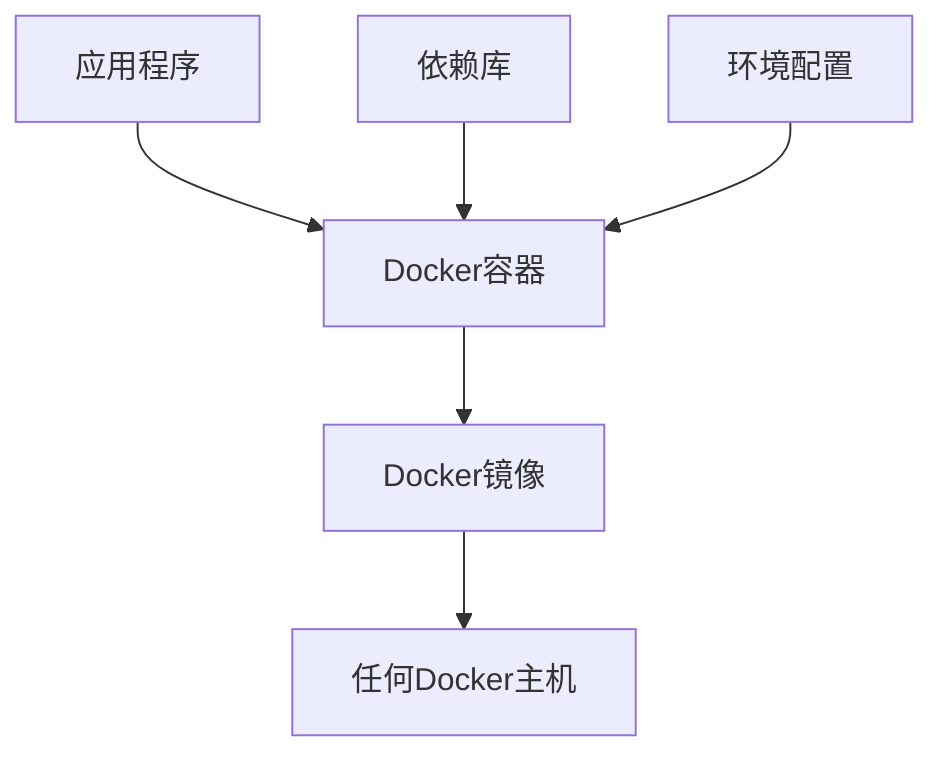
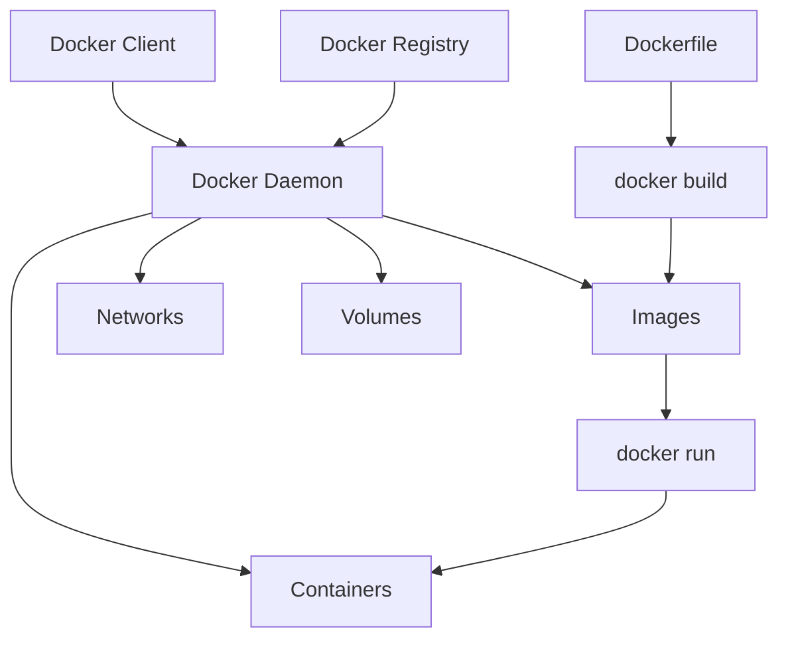

# Docker简介与安装

## 🎯 学习目标

- 了解Docker的核心概念和优势
- 掌握在不同操作系统上安装Docker
- 学会验证Docker安装和配置
- 理解Docker的基本架构

## 📚 什么是Docker

### Docker概述

Docker是一个开源的容器化平台，让开发者能够将应用程序及其依赖打包到轻量级、可移植的容器中。



### 核心概念

```javascript
// Docker核心概念
const dockerConcepts = {
  container: {
    description: '轻量级、独立的可执行包',
    includes: ['应用程序', '依赖库', '配置文件', '环境变量'],
    benefits: ['隔离性', '可移植性', '一致性', '效率']
  },
  
  image: {
    description: '容器的只读模板',
    characteristics: ['分层结构', '可复用', '版本化'],
    examples: ['ubuntu:20.04', 'node:16-alpine', 'nginx:latest']
  },
  
  dockerfile: {
    description: '构建镜像的脚本文件',
    contains: ['基础镜像', '构建指令', '配置命令'],
    purpose: '自动化镜像构建过程'
  },
  
  registry: {
    description: '镜像仓库服务',
    types: ['Docker Hub', '私有仓库', '云服务仓库'],
    functions: ['存储', '分发', '版本管理']
  }
};

console.log('Docker核心概念:', dockerConcepts);
```

### Docker vs 虚拟机

| 特性 | Docker容器 | 虚拟机 |
|------|------------|--------|
| **资源开销** | 轻量级，共享宿主机内核 | 重量级，需要完整操作系统 |
| **启动时间** | 秒级启动 | 分钟级启动 |
| **资源利用率** | 高，近乎原生性能 | 低，有虚拟化开销 |
| **隔离性** | 进程级隔离 | 完全隔离 |
| **可移植性** | 优秀，一次构建到处运行 | 受硬件和虚拟化平台限制 |

## 🛠️ Docker安装

### 系统要求

**Windows:**

- Windows 10/11 64位专业版、企业版或教育版
- 开启Hyper-V功能
- BIOS中开启虚拟化

**macOS:**

- macOS 10.15或更高版本
- 2010年以后的Mac硬件

**Linux:**

- 64位系统
- 内核版本3.10以上

### 1. Windows安装

#### 安装Docker Desktop

```powershell
# 方法1：下载安装包
# 访问 https://desktop.docker.com/win/main/amd64/Docker%20Desktop%20Installer.exe

# 方法2：使用winget
winget install Docker.DockerDesktop

# 方法3：使用Chocolatey
choco install docker-desktop
```

#### 验证安装

```powershell
# 检查Docker版本
docker --version
docker-compose --version

# 运行测试容器
docker run hello-world
```

#### WSL2配置（推荐）

```bash
# 启用WSL2
dism.exe /online /enable-feature /featurename:Microsoft-Windows-Subsystem-Linux /all /norestart
dism.exe /online /enable-feature /featurename:VirtualMachinePlatform /all /norestart

# 安装WSL2内核更新
# 下载并安装 WSL2 Linux kernel update package

# 设置WSL2为默认版本
wsl --set-default-version 2

# 安装Ubuntu
wsl --install -d Ubuntu
```

### 2. macOS安装

#### 安装Docker Desktop

```bash
# 方法1：下载安装包
# 访问 https://desktop.docker.com/mac/main/amd64/Docker.dmg (Intel)
# 访问 https://desktop.docker.com/mac/main/arm64/Docker.dmg (Apple Silicon)

# 方法2：使用Homebrew
brew install --cask docker

# 启动Docker Desktop
open /Applications/Docker.app
```

#### 验证安装

```bash
# 检查Docker版本
docker --version
docker-compose --version

# 运行测试容器
docker run hello-world

# 检查Docker信息
docker info
```

### 3. Linux安装

#### Ubuntu/Debian安装

```bash
# 更新包索引
sudo apt-get update

# 安装必要的包
sudo apt-get install \
    ca-certificates \
    curl \
    gnupg \
    lsb-release

# 添加Docker官方GPG密钥
sudo mkdir -m 0755 -p /etc/apt/keyrings
curl -fsSL https://download.docker.com/linux/ubuntu/gpg | sudo gpg --dearmor -o /etc/apt/keyrings/docker.gpg

# 设置仓库
echo \
  "deb [arch=$(dpkg --print-architecture) signed-by=/etc/apt/keyrings/docker.gpg] https://download.docker.com/linux/ubuntu \
  $(lsb_release -cs) stable" | sudo tee /etc/apt/sources.list.d/docker.list > /dev/null

# 安装Docker Engine
sudo apt-get update
sudo apt-get install docker-ce docker-ce-cli containerd.io docker-buildx-plugin docker-compose-plugin

# 启动Docker服务
sudo systemctl start docker
sudo systemctl enable docker

# 将用户添加到docker组
sudo usermod -aG docker $USER
```

#### CentOS/RHEL安装

```bash
# 卸载旧版本
sudo yum remove docker \
                docker-client \
                docker-client-latest \
                docker-common \
                docker-latest \
                docker-latest-logrotate \
                docker-logrotate \
                docker-engine

# 安装yum-utils
sudo yum install -y yum-utils

# 设置仓库
sudo yum-config-manager \
    --add-repo \
    https://download.docker.com/linux/centos/docker-ce.repo

# 安装Docker Engine
sudo yum install docker-ce docker-ce-cli containerd.io docker-buildx-plugin docker-compose-plugin

# 启动Docker服务
sudo systemctl start docker
sudo systemctl enable docker

# 将用户添加到docker组
sudo usermod -aG docker $USER
```

## 🔧 Docker配置

### 基础配置

```bash
# 查看Docker配置
docker info

# 查看Docker版本详情
docker version

# 查看系统资源使用情况
docker system df

# 查看Docker事件
docker events
```

### 国内镜像加速配置

#### 配置镜像加速器

```json
// Linux: /etc/docker/daemon.json
// Windows/macOS: Docker Desktop -> Settings -> Docker Engine
{
  "registry-mirrors": [
    "https://docker.mirrors.ustc.edu.cn",
    "https://hub-mirror.c.163.com",
    "https://mirror.baidubce.com"
  ],
  "exec-opts": ["native.cgroupdriver=systemd"],
  "log-driver": "json-file",
  "log-opts": {
    "max-size": "100m"
  },
  "storage-driver": "overlay2"
}
```

#### 重启Docker服务

```bash
# Linux
sudo systemctl daemon-reload
sudo systemctl restart docker

# Windows/macOS
# 重启Docker Desktop应用
```

### 资源限制配置

```json
// daemon.json 添加资源限制
{
  "default-ulimits": {
    "nofile": {
      "Name": "nofile",
      "Hard": 64000,
      "Soft": 64000
    }
  },
  "max-concurrent-downloads": 10,
  "max-concurrent-uploads": 5
}
```

## 🧪 验证安装

### 运行测试容器

```bash
# Hello World容器
docker run hello-world

# 交互式Ubuntu容器
docker run -it ubuntu bash

# 运行Nginx服务器
docker run -d -p 8080:80 nginx
# 访问 http://localhost:8080

# 查看运行中的容器
docker ps

# 查看所有容器
docker ps -a

# 停止容器
docker stop <container_id>

# 删除容器
docker rm <container_id>
```

### Docker环境检查脚本

```bash
#!/bin/bash

echo "🔍 Docker环境检查"
echo "=================="

# 检查Docker版本
echo "📦 Docker版本:"
docker --version

echo ""
echo "🐳 Docker Compose版本:"
docker-compose --version

echo ""
echo "💾 Docker信息:"
docker info | grep -E "(Server Version|Storage Driver|Cgroup Driver|Logging Driver)"

echo ""
echo "🌐 测试网络连接:"
if docker run --rm alpine ping -c 1 google.com > /dev/null 2>&1; then
    echo "✅ 网络连接正常"
else
    echo "❌ 网络连接异常"
fi

echo ""
echo "📊 系统资源:"
docker system df

echo ""
echo "🎯 运行测试容器:"
if docker run --rm hello-world > /dev/null 2>&1; then
    echo "✅ Docker运行正常"
else
    echo "❌ Docker运行异常"
fi

echo ""
echo "🎉 Docker环境检查完成！"
```

## 🚀 Docker架构

### Docker组件架构



### 核心组件说明

```javascript
// Docker架构组件
const dockerArchitecture = {
  client: {
    description: 'Docker命令行接口',
    commands: ['docker build', 'docker run', 'docker push'],
    communication: 'REST API与daemon通信'
  },
  
  daemon: {
    description: 'Docker后台进程',
    responsibilities: [
      '管理镜像',
      '运行容器',
      '处理API请求',
      '与registry通信'
    ]
  },
  
  registry: {
    description: '镜像仓库',
    types: {
      'Docker Hub': '官方公共仓库',
      'Private Registry': '私有仓库',
      'Cloud Registry': '云服务仓库'
    }
  },
  
  objects: {
    images: '只读模板，用于创建容器',
    containers: '镜像的运行实例',
    networks: '容器间通信网络',
    volumes: '持久化数据存储'
  }
};

console.log('Docker架构:', dockerArchitecture);
```

## 🔧 常见问题解决

### 权限问题

```bash
# Linux用户权限问题
sudo usermod -aG docker $USER
# 注销并重新登录

# 或者临时使用sudo
sudo docker run hello-world
```

### 网络问题

```bash
# 检查防火墙设置
sudo ufw status

# 重启Docker网络
docker network prune

# 重启Docker服务
sudo systemctl restart docker
```

### 存储空间问题

```bash
# 清理未使用的资源
docker system prune -a

# 查看存储使用情况
docker system df

# 清理指定类型资源
docker image prune
docker container prune
docker volume prune
docker network prune
```

## 📝 下一步

恭喜！您已经成功安装和配置了Docker。接下来请学习：

1. **[Docker基本概念](./02-docker-basics.md)** - 深入理解镜像、容器等核心概念
2. **[Docker镜像操作](./03-docker-images.md)** - 学习镜像的查找、下载和管理
3. **[Docker容器操作](./04-docker-containers.md)** - 掌握容器的创建、运行和管理

## 🎯 本章要点

- ✅ Docker是轻量级的容器化平台
- ✅ 支持跨平台安装（Windows、macOS、Linux）
- ✅ 需要正确配置镜像加速器提升下载速度
- ✅ 通过运行测试容器验证安装成功
- ✅ 了解Docker的客户端-服务器架构

继续您的Docker学习之旅！🐳
