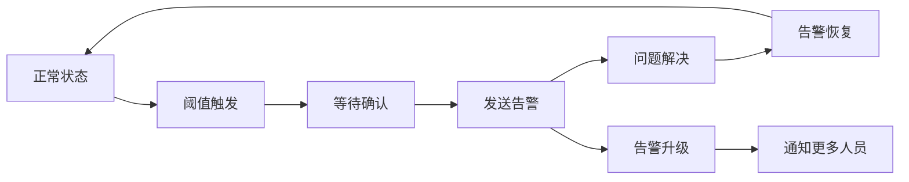

# 告警配置

## 📋 概述

告警系统是监控体系的重要组成部分，能够在系统出现问题时及时通知相关人员。有效的告警配置可以帮助团队快速响应问题，减少系统停机时间。

## 🎯 学习目标

- 理解告警系统的核心概念
- 掌握告警规则的设计原则
- 学会配置多种告警渠道
- 了解告警疲劳的预防和处理

## 📚 告警系统概念

### 告警级别

```javascript
const AlertLevels = {
  INFO: 'info',        // 信息性通知
  WARNING: 'warning',  // 警告，需要关注
  CRITICAL: 'critical', // 严重，需要立即处理
  FATAL: 'fatal'       // 致命，系统不可用
};
```

### 告警状态

```javascript
const AlertStates = {
  PENDING: 'pending',     // 等待中
  FIRING: 'firing',       // 触发中
  RESOLVED: 'resolved',   // 已解决
  SUPPRESSED: 'suppressed' // 已抑制
};
```

### 告警生命周期



## 🛠 告警规则设计

### Node.js应用告警规则

```javascript
// alert-rules.js
class AlertRuleManager {
  constructor() {
    this.rules = [];
    this.alertHistory = new Map();
    this.suppressions = new Map();
  }

  // 定义告警规则
  defineRules() {
    return [
      {
        name: 'high_error_rate',
        description: '错误率过高',
        severity: 'critical',
        condition: {
          metric: 'http_error_rate',
          operator: '>',
          threshold: 5, // 5%
          duration: '5m'
        },
        labels: {
          team: 'backend',
          service: 'api'
        },
        annotations: {
          summary: 'API错误率过高',
          description: '在过去5分钟内，API错误率超过5%',
          runbook: 'https://wiki.company.com/runbooks/high-error-rate'
        }
      },
      {
        name: 'high_response_time',
        description: '响应时间过长',
        severity: 'warning',
        condition: {
          metric: 'http_response_time_p95',
          operator: '>',
          threshold: 1000, // 1秒
          duration: '10m'
        },
        labels: {
          team: 'backend',
          service: 'api'
        },
        annotations: {
          summary: 'API响应时间过长',
          description: '95分位响应时间超过1秒，持续10分钟',
          runbook: 'https://wiki.company.com/runbooks/high-response-time'
        }
      },
      {
        name: 'high_memory_usage',
        description: '内存使用率过高',
        severity: 'warning',
        condition: {
          metric: 'memory_usage_percent',
          operator: '>',
          threshold: 85,
          duration: '15m'
        },
        labels: {
          team: 'infrastructure',
          service: 'api'
        },
        annotations: {
          summary: '内存使用率过高',
          description: '内存使用率超过85%，持续15分钟',
          runbook: 'https://wiki.company.com/runbooks/high-memory-usage'
        }
      },
      {
        name: 'database_connection_exhaustion',
        description: '数据库连接池耗尽',
        severity: 'critical',
        condition: {
          metric: 'db_connection_pool_usage_percent',
          operator: '>',
          threshold: 90,
          duration: '2m'
        },
        labels: {
          team: 'database',
          service: 'postgres'
        },
        annotations: {
          summary: '数据库连接池即将耗尽',
          description: '连接池使用率超过90%，可能影响新请求',
          runbook: 'https://wiki.company.com/runbooks/db-connection-pool'
        }
      },
      {
        name: 'queue_backlog',
        description: '队列积压严重',
        severity: 'warning',
        condition: {
          metric: 'queue_size',
          operator: '>',
          threshold: 1000,
          duration: '5m'
        },
        labels: {
          team: 'backend',
          service: 'worker'
        },
        annotations: {
          summary: '队列积压严重',
          description: '队列中待处理任务超过1000个',
          runbook: 'https://wiki.company.com/runbooks/queue-backlog'
        }
      }
    ];
  }

  // 评估告警条件
  async evaluateAlert(rule, currentValue) {
    const now = Date.now();
    const ruleKey = rule.name;
    
    // 检查条件是否满足
    const conditionMet = this.evaluateCondition(rule.condition, currentValue);
    
    if (conditionMet) {
      if (!this.alertHistory.has(ruleKey)) {
        // 首次触发，记录开始时间
        this.alertHistory.set(ruleKey, {
          startTime: now,
          state: 'pending'
        });
      } else {
        const alert = this.alertHistory.get(ruleKey);
        const duration = now - alert.startTime;
        const requiredDuration = this.parseDuration(rule.condition.duration);
        
        if (duration >= requiredDuration && alert.state === 'pending') {
          // 持续时间达到阈值，触发告警
          alert.state = 'firing';
          await this.fireAlert(rule, currentValue);
        }
      }
    } else {
      // 条件不满足，检查是否需要恢复告警
      if (this.alertHistory.has(ruleKey)) {
        const alert = this.alertHistory.get(ruleKey);
        if (alert.state === 'firing') {
          alert.state = 'resolved';
          await this.resolveAlert(rule, currentValue);
        }
        this.alertHistory.delete(ruleKey);
      }
    }
  }

  evaluateCondition(condition, value) {
    switch (condition.operator) {
      case '>':
        return value > condition.threshold;
      case '<':
        return value < condition.threshold;
      case '>=':
        return value >= condition.threshold;
      case '<=':
        return value <= condition.threshold;
      case '==':
        return value === condition.threshold;
      case '!=':
        return value !== condition.threshold;
      default:
        return false;
    }
  }

  parseDuration(duration) {
    const match = duration.match(/^(\d+)([smh])$/);
    if (!match) return 0;
    
    const value = parseInt(match[1]);
    const unit = match[2];
    
    switch (unit) {
      case 's': return value * 1000;
      case 'm': return value * 60 * 1000;
      case 'h': return value * 60 * 60 * 1000;
      default: return 0;
    }
  }

  async fireAlert(rule, value) {
    console.log(`🚨 ALERT FIRING: ${rule.name}`);
    
    const alert = {
      name: rule.name,
      severity: rule.severity,
      state: 'firing',
      value: value,
      timestamp: new Date().toISOString(),
      labels: rule.labels,
      annotations: rule.annotations
    };

    // 发送告警通知
    await this.sendNotification(alert);
  }

  async resolveAlert(rule, value) {
    console.log(`✅ ALERT RESOLVED: ${rule.name}`);
    
    const alert = {
      name: rule.name,
      severity: rule.severity,
      state: 'resolved',
      value: value,
      timestamp: new Date().toISOString(),
      labels: rule.labels,
      annotations: {
        ...rule.annotations,
        summary: `${rule.annotations.summary} - 已恢复`
      }
    };

    await this.sendNotification(alert);
  }

  async sendNotification(alert) {
    // 实现通知发送逻辑
    // 这里会调用各种通知渠道
  }
}

module.exports = AlertRuleManager;
```

## 📢 通知渠道配置

### Slack通知

```javascript
// slack-notifier.js
const { WebClient } = require('@slack/web-api');

class SlackNotifier {
  constructor(token, defaultChannel) {
    this.client = new WebClient(token);
    this.defaultChannel = defaultChannel;
  }

  async sendAlert(alert) {
    const color = this.getColorForSeverity(alert.severity);
    const emoji = this.getEmojiForSeverity(alert.severity);
    
    const blocks = [
      {
        type: 'header',
        text: {
          type: 'plain_text',
          text: `${emoji} ${alert.annotations.summary}`
        }
      },
      {
        type: 'section',
        fields: [
          {
            type: 'mrkdwn',
            text: `*Severity:* ${alert.severity.toUpperCase()}`
          },
          {
            type: 'mrkdwn',
            text: `*Status:* ${alert.state.toUpperCase()}`
          },
          {
            type: 'mrkdwn',
            text: `*Service:* ${alert.labels.service || 'Unknown'}`
          },
          {
            type: 'mrkdwn',
            text: `*Team:* ${alert.labels.team || 'Unknown'}`
          }
        ]
      },
      {
        type: 'section',
        text: {
          type: 'mrkdwn',
          text: alert.annotations.description
        }
      }
    ];

    if (alert.annotations.runbook) {
      blocks.push({
        type: 'actions',
        elements: [
          {
            type: 'button',
            text: {
              type: 'plain_text',
              text: 'View Runbook'
            },
            url: alert.annotations.runbook,
            style: 'primary'
          }
        ]
      });
    }

    try {
      await this.client.chat.postMessage({
        channel: this.defaultChannel,
        blocks: blocks,
        text: alert.annotations.summary // fallback text
      });
    } catch (error) {
      console.error('Failed to send Slack notification:', error);
    }
  }

  getColorForSeverity(severity) {
    const colors = {
      info: '#36a64f',
      warning: '#ff9500',
      critical: '#ff0000',
      fatal: '#8b0000'
    };
    return colors[severity] || '#cccccc';
  }

  getEmojiForSeverity(severity) {
    const emojis = {
      info: '💡',
      warning: '⚠️',
      critical: '🚨',
      fatal: '💀'
    };
    return emojis[severity] || '❓';
  }
}

module.exports = SlackNotifier;
```

### 邮件通知

```javascript
// email-notifier.js
const nodemailer = require('nodemailer');

class EmailNotifier {
  constructor(config) {
    this.transporter = nodemailer.createTransporter({
      host: config.smtp.host,
      port: config.smtp.port,
      secure: config.smtp.secure,
      auth: {
        user: config.smtp.user,
        pass: config.smtp.password
      }
    });
    this.from = config.from;
    this.recipients = config.recipients;
  }

  async sendAlert(alert) {
    const subject = this.buildSubject(alert);
    const html = this.buildHtmlBody(alert);
    const text = this.buildTextBody(alert);

    const mailOptions = {
      from: this.from,
      to: this.getRecipientsForAlert(alert),
      subject: subject,
      text: text,
      html: html
    };

    try {
      await this.transporter.sendMail(mailOptions);
    } catch (error) {
      console.error('Failed to send email notification:', error);
    }
  }

  buildSubject(alert) {
    const prefix = alert.state === 'firing' ? '🚨' : '✅';
    const action = alert.state === 'firing' ? 'ALERT' : 'RESOLVED';
    return `${prefix} ${action}: ${alert.annotations.summary}`;
  }

  buildHtmlBody(alert) {
    const statusColor = alert.state === 'firing' ? '#ff0000' : '#00ff00';
    
    return `
      <html>
        <body style="font-family: Arial, sans-serif; max-width: 600px; margin: 0 auto;">
          <div style="background-color: #f5f5f5; padding: 20px; border-radius: 5px;">
            <h2 style="color: ${statusColor}; margin-top: 0;">
              ${alert.annotations.summary}
            </h2>
            
            <table style="width: 100%; border-collapse: collapse; margin: 20px 0;">
              <tr>
                <td style="padding: 8px; border: 1px solid #ddd; font-weight: bold;">Severity:</td>
                <td style="padding: 8px; border: 1px solid #ddd;">${alert.severity.toUpperCase()}</td>
              </tr>
              <tr>
                <td style="padding: 8px; border: 1px solid #ddd; font-weight: bold;">Status:</td>
                <td style="padding: 8px; border: 1px solid #ddd; color: ${statusColor};">
                  ${alert.state.toUpperCase()}
                </td>
              </tr>
              <tr>
                <td style="padding: 8px; border: 1px solid #ddd; font-weight: bold;">Service:</td>
                <td style="padding: 8px; border: 1px solid #ddd;">${alert.labels.service || 'Unknown'}</td>
              </tr>
              <tr>
                <td style="padding: 8px; border: 1px solid #ddd; font-weight: bold;">Team:</td>
                <td style="padding: 8px; border: 1px solid #ddd;">${alert.labels.team || 'Unknown'}</td>
              </tr>
              <tr>
                <td style="padding: 8px; border: 1px solid #ddd; font-weight: bold;">Time:</td>
                <td style="padding: 8px; border: 1px solid #ddd;">${alert.timestamp}</td>
              </tr>
            </table>
            
            <div style="margin: 20px 0;">
              <h3>Description:</h3>
              <p>${alert.annotations.description}</p>
            </div>
            
            ${alert.annotations.runbook ? `
              <div style="margin: 20px 0;">
                <a href="${alert.annotations.runbook}" 
                   style="background-color: #007cba; color: white; padding: 10px 20px; 
                          text-decoration: none; border-radius: 5px; display: inline-block;">
                  View Runbook
                </a>
              </div>
            ` : ''}
          </div>
        </body>
      </html>
    `;
  }

  buildTextBody(alert) {
    return `
ALERT: ${alert.annotations.summary}

Severity: ${alert.severity.toUpperCase()}
Status: ${alert.state.toUpperCase()}
Service: ${alert.labels.service || 'Unknown'}
Team: ${alert.labels.team || 'Unknown'}
Time: ${alert.timestamp}

Description:
${alert.annotations.description}

${alert.annotations.runbook ? `Runbook: ${alert.annotations.runbook}` : ''}
    `.trim();
  }

  getRecipientsForAlert(alert) {
    // 根据告警标签决定收件人
    if (alert.labels.team && this.recipients[alert.labels.team]) {
      return this.recipients[alert.labels.team];
    }
    return this.recipients.default || [];
  }
}

module.exports = EmailNotifier;
```

### 钉钉通知

```javascript
// dingtalk-notifier.js
const crypto = require('crypto');
const axios = require('axios');

class DingTalkNotifier {
  constructor(webhook, secret) {
    this.webhook = webhook;
    this.secret = secret;
  }

  async sendAlert(alert) {
    const timestamp = Date.now();
    const sign = this.generateSign(timestamp);
    
    const url = `${this.webhook}&timestamp=${timestamp}&sign=${sign}`;
    
    const payload = {
      msgtype: 'markdown',
      markdown: {
        title: alert.annotations.summary,
        text: this.buildMarkdownContent(alert)
      },
      at: {
        atMobiles: this.getAtMobiles(alert),
        isAtAll: alert.severity === 'critical' || alert.severity === 'fatal'
      }
    };

    try {
      await axios.post(url, payload);
    } catch (error) {
      console.error('Failed to send DingTalk notification:', error);
    }
  }

  generateSign(timestamp) {
    const stringToSign = `${timestamp}\n${this.secret}`;
    return encodeURIComponent(
      crypto.createHmac('sha256', this.secret)
        .update(stringToSign)
        .digest('base64')
    );
  }

  buildMarkdownContent(alert) {
    const statusEmoji = alert.state === 'firing' ? '🚨' : '✅';
    const severityColor = this.getSeverityColor(alert.severity);
    
    return `
# ${statusEmoji} ${alert.annotations.summary}

---

**告警详情：**

- **严重程度：** <font color="${severityColor}">${alert.severity.toUpperCase()}</font>
- **状态：** ${alert.state.toUpperCase()}
- **服务：** ${alert.labels.service || 'Unknown'}
- **团队：** ${alert.labels.team || 'Unknown'}
- **时间：** ${alert.timestamp}

**描述：**
${alert.annotations.description}

${alert.annotations.runbook ? `[查看处理手册](${alert.annotations.runbook})` : ''}
    `;
  }

  getSeverityColor(severity) {
    const colors = {
      info: '#108ee9',
      warning: '#ff9500',
      critical: '#ff0000',
      fatal: '#8b0000'
    };
    return colors[severity] || '#cccccc';
  }

  getAtMobiles(alert) {
    // 根据告警级别和团队决定@的手机号
    const teamMobiles = {
      backend: ['13800138001', '13800138002'],
      frontend: ['13800138003', '13800138004'],
      infrastructure: ['13800138005', '13800138006']
    };

    if (alert.severity === 'critical' || alert.severity === 'fatal') {
      // 严重告警@所有相关人员
      return teamMobiles[alert.labels.team] || [];
    }
    
    return [];
  }
}

module.exports = DingTalkNotifier;
```

## 🔧 告警管理器

### 统一告警管理

```javascript
// alert-manager.js
const SlackNotifier = require('./slack-notifier');
const EmailNotifier = require('./email-notifier');
const DingTalkNotifier = require('./dingtalk-notifier');

class AlertManager {
  constructor(config) {
    this.config = config;
    this.notifiers = this.initializeNotifiers();
    this.suppressions = new Map();
    this.escalations = new Map();
  }

  initializeNotifiers() {
    const notifiers = {};

    if (this.config.slack?.enabled) {
      notifiers.slack = new SlackNotifier(
        this.config.slack.token,
        this.config.slack.channel
      );
    }

    if (this.config.email?.enabled) {
      notifiers.email = new EmailNotifier(this.config.email);
    }

    if (this.config.dingtalk?.enabled) {
      notifiers.dingtalk = new DingTalkNotifier(
        this.config.dingtalk.webhook,
        this.config.dingtalk.secret
      );
    }

    return notifiers;
  }

  async sendAlert(alert) {
    // 检查告警抑制
    if (this.isAlertSuppressed(alert)) {
      console.log(`Alert ${alert.name} is suppressed`);
      return;
    }

    // 检查告警升级
    const escalationLevel = this.getEscalationLevel(alert);
    
    // 根据告警级别和升级级别决定通知渠道
    const channels = this.getNotificationChannels(alert, escalationLevel);
    
    // 并行发送通知
    const notifications = channels.map(channel => 
      this.notifiers[channel]?.sendAlert(alert)
    ).filter(Boolean);

    try {
      await Promise.all(notifications);
      console.log(`Alert ${alert.name} sent to channels: ${channels.join(', ')}`);
    } catch (error) {
      console.error('Failed to send some notifications:', error);
    }

    // 记录告警历史
    this.recordAlertHistory(alert);
  }

  isAlertSuppressed(alert) {
    const suppressionKey = `${alert.name}_${alert.labels.service}`;
    const suppression = this.suppressions.get(suppressionKey);
    
    if (!suppression) return false;
    
    const now = Date.now();
    if (now > suppression.expiresAt) {
      this.suppressions.delete(suppressionKey);
      return false;
    }
    
    return true;
  }

  getEscalationLevel(alert) {
    const escalationKey = `${alert.name}_${alert.labels.service}`;
    const escalation = this.escalations.get(escalationKey);
    
    if (!escalation) {
      // 首次告警
      this.escalations.set(escalationKey, {
        level: 0,
        lastEscalation: Date.now(),
        alertCount: 1
      });
      return 0;
    }

    const timeSinceLastEscalation = Date.now() - escalation.lastEscalation;
    const escalationInterval = this.config.escalation?.interval || 30 * 60 * 1000; // 30分钟

    if (timeSinceLastEscalation > escalationInterval) {
      escalation.level++;
      escalation.lastEscalation = Date.now();
    }
    
    escalation.alertCount++;
    return escalation.level;
  }

  getNotificationChannels(alert, escalationLevel) {
    const channels = [];
    
    // 基础通知渠道
    if (alert.severity === 'info') {
      channels.push('slack');
    } else if (alert.severity === 'warning') {
      channels.push('slack', 'dingtalk');
    } else if (alert.severity === 'critical' || alert.severity === 'fatal') {
      channels.push('slack', 'email', 'dingtalk');
    }

    // 升级通知
    if (escalationLevel > 0) {
      channels.push('email'); // 确保邮件通知
      
      if (escalationLevel > 1) {
        // 二级升级：通知更多人
        channels.push('dingtalk');
      }
    }

    return [...new Set(channels)]; // 去重
  }

  suppressAlert(alertName, service, duration = 60 * 60 * 1000) { // 默认1小时
    const suppressionKey = `${alertName}_${service}`;
    this.suppressions.set(suppressionKey, {
      expiresAt: Date.now() + duration
    });
  }

  recordAlertHistory(alert) {
    // 记录到数据库或日志系统
    console.log('Alert history:', {
      name: alert.name,
      severity: alert.severity,
      state: alert.state,
      timestamp: alert.timestamp,
      labels: alert.labels
    });
  }

  // 获取告警统计
  getAlertStats() {
    return {
      suppressions: this.suppressions.size,
      escalations: this.escalations.size,
      activeAlerts: Array.from(this.escalations.entries()).map(([key, value]) => ({
        alert: key,
        level: value.level,
        count: value.alertCount
      }))
    };
  }
}

module.exports = AlertManager;
```

## 🚨 告警最佳实践

### 告警疲劳预防

```javascript
// alert-fatigue-prevention.js
class AlertFatiguePrevention {
  constructor() {
    this.alertCounts = new Map();
    this.alertGroups = new Map();
  }

  // 告警聚合
  aggregateAlerts(alerts) {
    const groups = new Map();
    
    alerts.forEach(alert => {
      const groupKey = this.getGroupKey(alert);
      
      if (!groups.has(groupKey)) {
        groups.set(groupKey, {
          alerts: [],
          summary: this.generateGroupSummary(alert),
          severity: alert.severity
        });
      }
      
      const group = groups.get(groupKey);
      group.alerts.push(alert);
      
      // 使用最高严重级别
      if (this.getSeverityLevel(alert.severity) > this.getSeverityLevel(group.severity)) {
        group.severity = alert.severity;
      }
    });
    
    return Array.from(groups.values());
  }

  getGroupKey(alert) {
    // 根据服务和告警类型分组
    return `${alert.labels.service}_${alert.name.split('_')[0]}`;
  }

  generateGroupSummary(alert) {
    return `${alert.labels.service} service issues`;
  }

  getSeverityLevel(severity) {
    const levels = { info: 1, warning: 2, critical: 3, fatal: 4 };
    return levels[severity] || 0;
  }

  // 告警频率限制
  shouldThrottleAlert(alert) {
    const key = `${alert.name}_${alert.labels.service}`;
    const now = Date.now();
    const throttleWindow = 15 * 60 * 1000; // 15分钟
    const maxAlertsPerWindow = 3;

    if (!this.alertCounts.has(key)) {
      this.alertCounts.set(key, []);
    }

    const counts = this.alertCounts.get(key);
    
    // 清理过期记录
    const validCounts = counts.filter(timestamp => now - timestamp < throttleWindow);
    this.alertCounts.set(key, validCounts);

    if (validCounts.length >= maxAlertsPerWindow) {
      return true; // 需要限制
    }

    // 记录此次告警
    validCounts.push(now);
    return false;
  }

  // 智能告警路由
  routeAlert(alert) {
    const routes = [];

    // 基于时间的路由
    const hour = new Date().getHours();
    const isBusinessHours = hour >= 9 && hour <= 18;

    if (isBusinessHours) {
      routes.push('slack', 'email');
    } else {
      // 非工作时间只发送高优先级告警
      if (alert.severity === 'critical' || alert.severity === 'fatal') {
        routes.push('dingtalk', 'email');
      }
    }

    // 基于团队的路由
    if (alert.labels.team === 'oncall') {
      routes.push('phone'); // 电话通知
    }

    return routes;
  }
}

module.exports = AlertFatiguePrevention;
```

### 告警质量评估

```javascript
// alert-quality-metrics.js
class AlertQualityMetrics {
  constructor() {
    this.metrics = {
      totalAlerts: 0,
      falsePositives: 0,
      resolvedAlerts: 0,
      averageResolutionTime: 0,
      alertsBySeverity: new Map(),
      alertsByService: new Map()
    };
  }

  recordAlert(alert) {
    this.metrics.totalAlerts++;
    
    // 按严重程度统计
    const severityCount = this.metrics.alertsBySeverity.get(alert.severity) || 0;
    this.metrics.alertsBySeverity.set(alert.severity, severityCount + 1);
    
    // 按服务统计
    const serviceCount = this.metrics.alertsByService.get(alert.labels.service) || 0;
    this.metrics.alertsByService.set(alert.labels.service, serviceCount + 1);
  }

  recordResolution(alert, resolutionTime, wasFalsePositive = false) {
    this.metrics.resolvedAlerts++;
    
    if (wasFalsePositive) {
      this.metrics.falsePositives++;
    }
    
    // 更新平均解决时间
    const totalResolutionTime = this.metrics.averageResolutionTime * (this.metrics.resolvedAlerts - 1);
    this.metrics.averageResolutionTime = (totalResolutionTime + resolutionTime) / this.metrics.resolvedAlerts;
  }

  calculateQualityScore() {
    if (this.metrics.totalAlerts === 0) return 100;
    
    const falsePositiveRate = this.metrics.falsePositives / this.metrics.totalAlerts;
    const resolutionRate = this.metrics.resolvedAlerts / this.metrics.totalAlerts;
    
    // 质量评分 = (1 - 误报率) * 解决率 * 100
    return (1 - falsePositiveRate) * resolutionRate * 100;
  }

  generateReport() {
    return {
      summary: {
        totalAlerts: this.metrics.totalAlerts,
        resolvedAlerts: this.metrics.resolvedAlerts,
        falsePositives: this.metrics.falsePositives,
        averageResolutionTime: this.metrics.averageResolutionTime,
        qualityScore: this.calculateQualityScore()
      },
      breakdown: {
        bySeverity: Object.fromEntries(this.metrics.alertsBySeverity),
        byService: Object.fromEntries(this.metrics.alertsByService)
      }
    };
  }
}

module.exports = AlertQualityMetrics;
```

## 📝 总结

有效的告警配置应该包括：

- **合理的告警规则**：基于业务影响的阈值设置
- **多样的通知渠道**：确保告警能够及时送达
- **智能的告警管理**：防止告警疲劳和噪音
- **完善的升级机制**：确保重要问题得到及时处理
- **持续的优化改进**：基于质量指标优化告警规则

良好的告警系统是高可用服务的重要保障，需要持续调优和改进。

## 🔗 相关资源

- [Alertmanager文档](https://prometheus.io/docs/alerting/latest/alertmanager/)
- [告警最佳实践](https://prometheus.io/docs/practices/alerting/)
- [PagerDuty告警指南](https://www.pagerduty.com/resources/learn/what-is-alerting/)
- [Google SRE告警哲学](https://sre.google/sre-book/monitoring-distributed-systems/)
