# Ansible自动化

## 📋 概述

Ansible是一个开源的自动化平台，用于配置管理、应用部署和任务执行。它使用简单的YAML语法，无需在目标主机上安装代理，通过SSH连接进行管理。

## 🎯 学习目标

- 掌握Ansible的核心概念和架构
- 学会编写Playbook和角色
- 了解变量管理和模板使用
- 掌握Node.js应用的自动化部署

## 📚 Ansible核心概念

### 架构组件

```mermaid
graph TB
    A[控制节点] --> B[清单文件]
    A --> C[Playbook]
    A --> D[角色]
    A --> E[模块]
    
    B --> F[目标主机1]
    B --> G[目标主机2]
    B --> H[目标主机3]
    
    C --> I[任务]
    C --> J[处理器]
    C --> K[变量]
```



### 清单文件（Inventory）

```ini
# inventory/hosts.ini
[webservers]
web1 ansible_host=10.0.1.10 ansible_user=ubuntu
web2 ansible_host=10.0.1.11 ansible_user=ubuntu
web3 ansible_host=10.0.1.12 ansible_user=ubuntu

[databases]
db1 ansible_host=10.0.2.10 ansible_user=ubuntu
db2 ansible_host=10.0.2.11 ansible_user=ubuntu

[loadbalancers]
lb1 ansible_host=10.0.1.20 ansible_user=ubuntu

[nodejs_app:children]
webservers
databases
loadbalancers

[nodejs_app:vars]
ansible_ssh_private_key_file=~/.ssh/nodejs-app-key.pem
environment=production
app_version=1.0.0
```

### 动态清单（YAML格式）

```yaml
# inventory/hosts.yml
all:
  children:
    webservers:
      hosts:
        web1:
          ansible_host: 10.0.1.10
          ansible_user: ubuntu
          server_role: primary
        web2:
          ansible_host: 10.0.1.11
          ansible_user: ubuntu
          server_role: secondary
        web3:
          ansible_host: 10.0.1.12
          ansible_user: ubuntu
          server_role: secondary
      vars:
        http_port: 3000
        max_clients: 200
    
    databases:
      hosts:
        db1:
          ansible_host: 10.0.2.10
          ansible_user: ubuntu
          db_role: master
        db2:
          ansible_host: 10.0.2.11
          ansible_user: ubuntu
          db_role: slave
      vars:
        db_port: 5432
        max_connections: 100
    
    loadbalancers:
      hosts:
        lb1:
          ansible_host: 10.0.1.20
          ansible_user: ubuntu
      vars:
        lb_method: round_robin
  
  vars:
    ansible_ssh_private_key_file: ~/.ssh/nodejs-app-key.pem
    environment: production
    app_version: "{{ lookup('env', 'APP_VERSION') | default('1.0.0') }}"
```

## 🛠 Node.js应用部署Playbook

### 主要部署Playbook

```yaml
# deploy-nodejs-app.yml
---
- name: Deploy Node.js Application
  hosts: webservers
  become: yes
  gather_facts: yes
  
  vars:
    app_name: nodejs-app
    app_user: nodejs
    app_dir: /opt/{{ app_name }}
    app_repo: https://github.com/yourorg/nodejs-app.git
    node_version: "18.x"
    pm2_instances: "{{ ansible_processor_vcpus }}"
    
  pre_tasks:
    - name: Update apt cache
      apt:
        update_cache: yes
        cache_valid_time: 3600
      when: ansible_os_family == "Debian"
    
    - name: Update yum cache
      yum:
        update_cache: yes
      when: ansible_os_family == "RedHat"
  
  roles:
    - common
    - nodejs
    - nginx
    - pm2
    - monitoring
  
  tasks:
    - name: Create application user
      user:
        name: "{{ app_user }}"
        system: yes
        shell: /bin/bash
        home: "{{ app_dir }}"
        create_home: yes
    
    - name: Create application directories
      file:
        path: "{{ item }}"
        state: directory
        owner: "{{ app_user }}"
        group: "{{ app_user }}"
        mode: '0755'
      loop:
        - "{{ app_dir }}"
        - "{{ app_dir }}/logs"
        - "{{ app_dir }}/tmp"
        - /etc/{{ app_name }}
    
    - name: Clone application repository
      git:
        repo: "{{ app_repo }}"
        dest: "{{ app_dir }}/current"
        version: "{{ app_version }}"
        force: yes
      become_user: "{{ app_user }}"
      notify:
        - restart nodejs app
    
    - name: Install Node.js dependencies
      npm:
        path: "{{ app_dir }}/current"
        state: present
        production: yes
      become_user: "{{ app_user }}"
    
    - name: Build application
      command: npm run build
      args:
        chdir: "{{ app_dir }}/current"
      become_user: "{{ app_user }}"
      when: build_required | default(true)
    
    - name: Generate application configuration
      template:
        src: app.env.j2
        dest: "{{ app_dir }}/.env"
        owner: "{{ app_user }}"
        group: "{{ app_user }}"
        mode: '0600'
      notify:
        - restart nodejs app
    
    - name: Generate PM2 ecosystem file
      template:
        src: ecosystem.config.js.j2
        dest: "{{ app_dir }}/ecosystem.config.js"
        owner: "{{ app_user }}"
        group: "{{ app_user }}"
        mode: '0644'
      notify:
        - restart nodejs app
    
    - name: Start application with PM2
      command: pm2 startOrRestart {{ app_dir }}/ecosystem.config.js --env production
      become_user: "{{ app_user }}"
    
    - name: Save PM2 configuration
      command: pm2 save
      become_user: "{{ app_user }}"
    
    - name: Setup PM2 startup script
      command: pm2 startup systemd -u {{ app_user }} --hp {{ app_dir }}
      register: pm2_startup_command
    
    - name: Execute PM2 startup command
      shell: "{{ pm2_startup_command.stdout }}"
      when: pm2_startup_command.stdout is defined
  
  handlers:
    - name: restart nodejs app
      command: pm2 restart {{ app_name }}
      become_user: "{{ app_user }}"
      ignore_errors: yes
    
    - name: reload nginx
      service:
        name: nginx
        state: reloaded
    
    - name: restart nginx
      service:
        name: nginx
        state: restarted

  post_tasks:
    - name: Verify application is running
      uri:
        url: "http://localhost:{{ http_port | default(3000) }}/health"
        method: GET
        status_code: 200
      retries: 5
      delay: 10
    
    - name: Clean up old application versions
      shell: |
        cd {{ app_dir }}
        ls -dt */ | tail -n +4 | xargs rm -rf
      become_user: "{{ app_user }}"
      ignore_errors: yes
```

### 角色结构

#### Common角色

```yaml
# roles/common/tasks/main.yml
---
- name: Install essential packages
  package:
    name:
      - curl
      - wget
      - unzip
      - git
      - htop
      - vim
      - build-essential
    state: present

- name: Configure timezone
  timezone:
    name: "{{ timezone | default('UTC') }}"

- name: Configure NTP
  package:
    name: ntp
    state: present
  notify: restart ntp

- name: Start and enable NTP service
  service:
    name: ntp
    state: started
    enabled: yes

- name: Configure SSH security
  lineinfile:
    path: /etc/ssh/sshd_config
    regexp: "{{ item.regexp }}"
    line: "{{ item.line }}"
    backup: yes
  loop:
    - { regexp: '^#?PasswordAuthentication', line: 'PasswordAuthentication no' }
    - { regexp: '^#?PermitRootLogin', line: 'PermitRootLogin no' }
    - { regexp: '^#?Port', line: 'Port {{ ssh_port | default(22) }}' }
  notify: restart sshd

- name: Configure firewall
  ufw:
    rule: "{{ item.rule }}"
    port: "{{ item.port }}"
    proto: "{{ item.proto | default('tcp') }}"
  loop:
    - { rule: 'allow', port: '{{ ssh_port | default(22) }}' }
    - { rule: 'allow', port: '80' }
    - { rule: 'allow', port: '443' }
    - { rule: 'allow', port: '{{ http_port | default(3000) }}' }
  when: configure_firewall | default(true)

- name: Enable firewall
  ufw:
    state: enabled
  when: configure_firewall | default(true)

# roles/common/handlers/main.yml
---
- name: restart ntp
  service:
    name: ntp
    state: restarted

- name: restart sshd
  service:
    name: sshd
    state: restarted
```

#### Node.js角色

```yaml
# roles/nodejs/tasks/main.yml
---
- name: Add NodeSource APT repository
  shell: curl -fsSL https://deb.nodesource.com/setup_{{ node_version }} | sudo -E bash -
  when: ansible_os_family == "Debian"

- name: Install Node.js
  package:
    name: nodejs
    state: present

- name: Verify Node.js installation
  command: node --version
  register: node_version_output
  changed_when: false

- name: Display Node.js version
  debug:
    msg: "Node.js version: {{ node_version_output.stdout }}"

- name: Install global npm packages
  npm:
    name: "{{ item }}"
    global: yes
    state: present
  loop:
    - pm2
    - nodemon

- name: Create Node.js log rotation configuration
  template:
    src: nodejs-logrotate.j2
    dest: /etc/logrotate.d/nodejs
    mode: '0644'

# roles/nodejs/templates/nodejs-logrotate.j2
{{ app_dir }}/logs/*.log {
    daily
    missingok
    rotate 30
    compress
    delaycompress
    notifempty
    create 644 {{ app_user }} {{ app_user }}
    postrotate
        pm2 reloadLogs
    endscript
}
```

#### Nginx角色

```yaml
# roles/nginx/tasks/main.yml
---
- name: Install Nginx
  package:
    name: nginx
    state: present

- name: Remove default Nginx configuration
  file:
    path: /etc/nginx/sites-enabled/default
    state: absent
  notify: restart nginx

- name: Generate Nginx configuration
  template:
    src: nodejs-app.conf.j2
    dest: /etc/nginx/sites-available/{{ app_name }}
    backup: yes
  notify: reload nginx

- name: Enable Nginx site
  file:
    src: /etc/nginx/sites-available/{{ app_name }}
    dest: /etc/nginx/sites-enabled/{{ app_name }}
    state: link
  notify: reload nginx

- name: Configure Nginx security headers
  template:
    src: security-headers.conf.j2
    dest: /etc/nginx/conf.d/security-headers.conf
  notify: reload nginx

- name: Test Nginx configuration
  command: nginx -t
  register: nginx_test
  changed_when: false

- name: Start and enable Nginx
  service:
    name: nginx
    state: started
    enabled: yes

# roles/nginx/templates/nodejs-app.conf.j2
upstream nodejs_backend {
    least_conn;
    
    server {{ hostvars[host]['ansible_default_ipv4']['address'] }}:{{ http_port | default(3000) }} max_fails=3 fail_timeout=30s;
    
    keepalive 32;
}

server {
    listen 80;
    server_name {{ server_name | default('_') }};
    
    # Security headers
    include /etc/nginx/conf.d/security-headers.conf;
    
    # Logging
    access_log /var/log/nginx/{{ app_name }}_access.log;
    error_log /var/log/nginx/{{ app_name }}_error.log;
    
    # Gzip compression
    gzip on;
    gzip_vary on;
    gzip_min_length 1024;
    gzip_types
        text/plain
        text/css
        text/xml
        text/javascript
        application/javascript
        application/xml+rss
        application/json;
    
    # Static files
    location /static/ {
        alias {{ app_dir }}/current/public/;
        expires 1y;
        add_header Cache-Control "public, immutable";
    }
    
    # Health check
    location /health {
        proxy_pass http://nodejs_backend;
        proxy_http_version 1.1;
        proxy_set_header Upgrade $http_upgrade;
        proxy_set_header Connection 'upgrade';
        proxy_set_header Host $host;
        proxy_set_header X-Real-IP $remote_addr;
        proxy_set_header X-Forwarded-For $proxy_add_x_forwarded_for;
        proxy_set_header X-Forwarded-Proto $scheme;
        proxy_cache_bypass $http_upgrade;
        
        access_log off;
    }
    
    # Main application
    location / {
        proxy_pass http://nodejs_backend;
        proxy_http_version 1.1;
        proxy_set_header Upgrade $http_upgrade;
        proxy_set_header Connection 'upgrade';
        proxy_set_header Host $host;
        proxy_set_header X-Real-IP $remote_addr;
        proxy_set_header X-Forwarded-For $proxy_add_x_forwarded_for;
        proxy_set_header X-Forwarded-Proto $scheme;
        proxy_cache_bypass $http_upgrade;
        
        # Timeouts
        proxy_connect_timeout 60s;
        proxy_send_timeout 60s;
        proxy_read_timeout 60s;
        
        # Buffer settings
        proxy_buffering on;
        proxy_buffer_size 128k;
        proxy_buffers 4 256k;
        proxy_busy_buffers_size 256k;
    }
    
    # Rate limiting
    location /api/ {
        limit_req zone=api burst=10 nodelay;
        proxy_pass http://nodejs_backend;
        proxy_http_version 1.1;
        proxy_set_header Upgrade $http_upgrade;
        proxy_set_header Connection 'upgrade';
        proxy_set_header Host $host;
        proxy_set_header X-Real-IP $remote_addr;
        proxy_set_header X-Forwarded-For $proxy_add_x_forwarded_for;
        proxy_set_header X-Forwarded-Proto $scheme;
        proxy_cache_bypass $http_upgrade;
    }
}

# Rate limiting configuration
http {
    limit_req_zone $binary_remote_addr zone=api:10m rate=10r/s;
}

# roles/nginx/templates/security-headers.conf.j2
# Security headers
add_header X-Frame-Options "SAMEORIGIN" always;
add_header X-Content-Type-Options "nosniff" always;
add_header X-XSS-Protection "1; mode=block" always;
add_header Referrer-Policy "strict-origin-when-cross-origin" always;
add_header Content-Security-Policy "default-src 'self'; script-src 'self' 'unsafe-inline' 'unsafe-eval'; style-src 'self' 'unsafe-inline'; img-src 'self' data: https:; font-src 'self' data: https:; connect-src 'self' https:; media-src 'self'; object-src 'none'; child-src 'self'; frame-ancestors 'self'; form-action 'self'; base-uri 'self';" always;

# Hide Nginx version
server_tokens off;
```

### 模板文件

#### 应用配置模板

```jinja2
# templates/app.env.j2
NODE_ENV={{ environment }}
PORT={{ http_port | default(3000) }}

# Database configuration
DATABASE_URL=postgresql://{{ db_username }}:{{ db_password }}@{{ db_host }}:{{ db_port | default(5432) }}/{{ db_name }}

# Redis configuration
REDIS_URL=redis://{{ redis_host }}:{{ redis_port | default(6379) }}

# JWT configuration
JWT_SECRET={{ jwt_secret }}
JWT_EXPIRES_IN={{ jwt_expires_in | default('24h') }}

# Logging configuration
LOG_LEVEL={{ log_level | default('info') }}
LOG_FILE={{ app_dir }}/logs/app.log

# Application configuration
APP_VERSION={{ app_version }}
MAX_REQUEST_SIZE={{ max_request_size | default('10mb') }}
CORS_ORIGIN={{ cors_origin | default('*') }}

# Monitoring
ENABLE_METRICS={{ enable_metrics | default(true) }}
METRICS_PORT={{ metrics_port | default(9090) }}

# External services

SMTP_HOST={{ smtp_host }}
SMTP_PORT={{ smtp_port | default(587) }}
SMTP_USER={{ smtp_user }}
SMTP_PASS={{ smtp_pass }}



AWS_REGION={{ aws_region }}
AWS_ACCESS_KEY_ID={{ aws_access_key_id }}
AWS_SECRET_ACCESS_KEY={{ aws_secret_access_key }}

```

#### PM2配置模板

```javascript
// templates/ecosystem.config.js.j2
module.exports = {
  apps: [{
    name: '{{ app_name }}',
    script: './server.js',
    cwd: '{{ app_dir }}/current',
    instances: {{ pm2_instances }},
    exec_mode: 'cluster',
    
    // Environment variables
    env: {
      NODE_ENV: 'production',
      PORT: {{ http_port | default(3000) }}
    },
    
    // Logging
    log_file: '{{ app_dir }}/logs/combined.log',
    out_file: '{{ app_dir }}/logs/out.log',
    error_file: '{{ app_dir }}/logs/error.log',
    log_date_format: 'YYYY-MM-DD HH:mm:ss Z',
    
    // Process management
    min_uptime: '10s',
    max_restarts: 10,
    autorestart: true,
    
    // Memory management
    max_memory_restart: '{{ max_memory_restart | default("1G") }}',
    
    // Monitoring
    pmx: true,
    
    // Watch and ignore
    watch: false,
    ignore_watch: ['node_modules', 'logs'],
    
    // Advanced features
    source_map_support: true,
    instance_var: 'INSTANCE_ID',
    
    // Graceful shutdown
    kill_timeout: 5000,
    listen_timeout: 3000,
    
    // Health check
    health_check_http: {
      path: '/health',
      port: {{ http_port | default(3000) }},
      timeout: 5000,
      interval: 30000
    }
  }]
};
```

## 🔧 高级Playbook示例

### 数据库部署Playbook

```yaml
# deploy-database.yml
---
- name: Deploy PostgreSQL Database
  hosts: databases
  become: yes
  
  vars:
    postgres_version: "13"
    postgres_data_dir: /var/lib/postgresql/{{ postgres_version }}/main
    postgres_config_dir: /etc/postgresql/{{ postgres_version }}/main
    
  roles:
    - postgresql
    - postgresql-backup
  
  tasks:
    - name: Create application database
      postgresql_db:
        name: "{{ db_name }}"
        owner: "{{ db_username }}"
        encoding: UTF8
        lc_collate: en_US.UTF-8
        lc_ctype: en_US.UTF-8
        template: template0
      become_user: postgres
    
    - name: Create application user
      postgresql_user:
        name: "{{ db_username }}"
        password: "{{ db_password }}"
        db: "{{ db_name }}"
        priv: ALL
        expires: infinity
      become_user: postgres
    
    - name: Configure PostgreSQL
      template:
        src: postgresql.conf.j2
        dest: "{{ postgres_config_dir }}/postgresql.conf"
        backup: yes
      notify: restart postgresql
    
    - name: Configure PostgreSQL authentication
      template:
        src: pg_hba.conf.j2
        dest: "{{ postgres_config_dir }}/pg_hba.conf"
        backup: yes
      notify: restart postgresql
    
    - name: Create database backup script
      template:
        src: backup-db.sh.j2
        dest: /usr/local/bin/backup-db.sh
        mode: '0755'
    
    - name: Schedule database backups
      cron:
        name: "Database backup"
        minute: "0"
        hour: "2"
        job: "/usr/local/bin/backup-db.sh"
        user: postgres
  
  handlers:
    - name: restart postgresql
      service:
        name: postgresql
        state: restarted
```

### 监控部署Playbook

```yaml
# deploy-monitoring.yml
---
- name: Deploy Monitoring Stack
  hosts: webservers
  become: yes
  
  vars:
    prometheus_version: "2.40.0"
    grafana_version: "9.3.0"
    node_exporter_version: "1.5.0"
  
  tasks:
    - name: Create monitoring user
      user:
        name: monitoring
        system: yes
        shell: /bin/false
        home: /opt/monitoring
        create_home: yes
    
    - name: Install Node Exporter
      unarchive:
        src: "https://github.com/prometheus/node_exporter/releases/download/v{{ node_exporter_version }}/node_exporter-{{ node_exporter_version }}.linux-amd64.tar.gz"
        dest: /opt/monitoring
        remote_src: yes
        owner: monitoring
        group: monitoring
      notify: restart node_exporter
    
    - name: Create Node Exporter systemd service
      template:
        src: node_exporter.service.j2
        dest: /etc/systemd/system/node_exporter.service
      notify:
        - daemon reload
        - restart node_exporter
    
    - name: Start and enable Node Exporter
      service:
        name: node_exporter
        state: started
        enabled: yes
    
    - name: Install Prometheus (on monitoring server)
      unarchive:
        src: "https://github.com/prometheus/prometheus/releases/download/v{{ prometheus_version }}/prometheus-{{ prometheus_version }}.linux-amd64.tar.gz"
        dest: /opt/monitoring
        remote_src: yes
        owner: monitoring
        group: monitoring
      when: inventory_hostname in groups['monitoring']
      notify: restart prometheus
    
    - name: Configure Prometheus
      template:
        src: prometheus.yml.j2
        dest: /opt/monitoring/prometheus.yml
        owner: monitoring
        group: monitoring
      when: inventory_hostname in groups['monitoring']
      notify: restart prometheus
  
  handlers:
    - name: daemon reload
      systemd:
        daemon_reload: yes
    
    - name: restart node_exporter
      service:
        name: node_exporter
        state: restarted
    
    - name: restart prometheus
      service:
        name: prometheus
        state: restarted
```

### 零停机部署Playbook

```yaml
# zero-downtime-deploy.yml
---
- name: Zero Downtime Deployment
  hosts: webservers
  become: yes
  serial: 1  # 一次只部署一台服务器
  
  vars:
    health_check_url: "http://localhost:{{ http_port | default(3000) }}/health"
    deployment_timeout: 300
    
  pre_tasks:
    - name: Check current application status
      uri:
        url: "{{ health_check_url }}"
        method: GET
        status_code: 200
      register: pre_deploy_health
      ignore_errors: yes
    
    - name: Remove server from load balancer
      uri:
        url: "http://{{ load_balancer_host }}/api/servers/{{ inventory_hostname }}/disable"
        method: POST
        headers:
          Authorization: "Bearer {{ lb_api_token }}"
      delegate_to: localhost
      when: load_balancer_host is defined
    
    - name: Wait for connections to drain
      wait_for:
        timeout: 30
      when: pre_deploy_health is succeeded
  
  tasks:
    - name: Create backup of current version
      command: cp -r {{ app_dir }}/current {{ app_dir }}/backup-{{ ansible_date_time.epoch }}
      become_user: "{{ app_user }}"
      when: pre_deploy_health is succeeded
    
    - name: Deploy new version
      git:
        repo: "{{ app_repo }}"
        dest: "{{ app_dir }}/releases/{{ app_version }}"
        version: "{{ app_version }}"
        force: yes
      become_user: "{{ app_user }}"
    
    - name: Install dependencies
      npm:
        path: "{{ app_dir }}/releases/{{ app_version }}"
        state: present
        production: yes
      become_user: "{{ app_user }}"
    
    - name: Build application
      command: npm run build
      args:
        chdir: "{{ app_dir }}/releases/{{ app_version }}"
      become_user: "{{ app_user }}"
    
    - name: Update symlink to new version
      file:
        src: "{{ app_dir }}/releases/{{ app_version }}"
        dest: "{{ app_dir }}/current"
        state: link
        force: yes
      become_user: "{{ app_user }}"
    
    - name: Restart application
      command: pm2 restart {{ app_name }}
      become_user: "{{ app_user }}"
    
    - name: Wait for application to start
      uri:
        url: "{{ health_check_url }}"
        method: GET
        status_code: 200
      register: health_check
      until: health_check is succeeded
      retries: "{{ deployment_timeout // 10 }}"
      delay: 10
  
  post_tasks:
    - name: Add server back to load balancer
      uri:
        url: "http://{{ load_balancer_host }}/api/servers/{{ inventory_hostname }}/enable"
        method: POST
        headers:
          Authorization: "Bearer {{ lb_api_token }}"
      delegate_to: localhost
      when: load_balancer_host is defined and health_check is succeeded
    
    - name: Clean up old releases
      shell: |
        cd {{ app_dir }}/releases
        ls -dt */ | tail -n +4 | xargs rm -rf
      become_user: "{{ app_user }}"
      ignore_errors: yes
    
    - name: Rollback on failure
      block:
        - name: Restore backup
          file:
            src: "{{ app_dir }}/backup-{{ ansible_date_time.epoch }}"
            dest: "{{ app_dir }}/current"
            state: link
            force: yes
          become_user: "{{ app_user }}"
        
        - name: Restart application
          command: pm2 restart {{ app_name }}
          become_user: "{{ app_user }}"
        
        - name: Fail deployment
          fail:
            msg: "Deployment failed, rolled back to previous version"
      
      when: health_check is failed
```

## 🚀 执行和管理

### 常用命令

```bash
# 基本执行
ansible-playbook -i inventory/hosts.yml deploy-nodejs-app.yml

# 指定特定主机组
ansible-playbook -i inventory/hosts.yml deploy-nodejs-app.yml --limit webservers

# 检查模式（dry-run）
ansible-playbook -i inventory/hosts.yml deploy-nodejs-app.yml --check

# 详细输出
ansible-playbook -i inventory/hosts.yml deploy-nodejs-app.yml -vvv

# 使用标签
ansible-playbook -i inventory/hosts.yml deploy-nodejs-app.yml --tags "nodejs,nginx"

# 跳过特定标签
ansible-playbook -i inventory/hosts.yml deploy-nodejs-app.yml --skip-tags "monitoring"

# 传递额外变量
ansible-playbook -i inventory/hosts.yml deploy-nodejs-app.yml \
  --extra-vars "app_version=1.2.0 environment=staging"

# 使用密码库
ansible-playbook -i inventory/hosts.yml deploy-nodejs-app.yml \
  --ask-vault-pass

# 并行执行
ansible-playbook -i inventory/hosts.yml deploy-nodejs-app.yml \
  --forks 10
```

### Ansible Vault密钥管理

```bash
# 创建加密文件
ansible-vault create group_vars/production/vault.yml

# 编辑加密文件
ansible-vault edit group_vars/production/vault.yml

# 加密现有文件
ansible-vault encrypt group_vars/production/secrets.yml

# 解密文件
ansible-vault decrypt group_vars/production/secrets.yml

# 查看加密文件
ansible-vault view group_vars/production/vault.yml
```

### 变量文件示例

```yaml
# group_vars/production/vault.yml (加密)
$ANSIBLE_VAULT;1.1;AES256
66386439653...

# group_vars/production/vars.yml (明文)
db_username: app_user
db_name: nodejs_app
db_host: 10.0.2.10

# 引用加密变量
db_password: "{{ vault_db_password }}"
jwt_secret: "{{ vault_jwt_secret }}"
```

## 📝 总结

Ansible为Node.js应用提供了强大的自动化部署能力：

- **无代理架构**：简单易用，无需在目标主机安装额外软件
- **声明式配置**：YAML语法简单直观
- **幂等性操作**：重复执行安全可靠
- **丰富的模块**：支持各种系统管理任务
- **灵活的变量系统**：支持复杂的配置管理

通过合理的角色设计和Playbook组织，可以实现高效、可靠的自动化运维。

## 🔗 相关资源

- [Ansible官方文档](https://docs.ansible.com/)
- [Ansible Galaxy](https://galaxy.ansible.com/)
- [Ansible最佳实践](https://docs.ansible.com/ansible/latest/user_guide/playbooks_best_practices.html)
- [Node.js部署指南](https://docs.ansible.com/ansible/latest/collections/community/general/npm_module.html)
