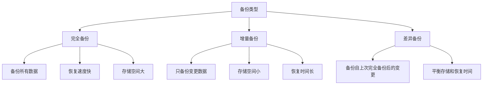

# 备份策略

## 📋 概述

备份策略是保护数据和确保业务连续性的关键措施。有效的备份策略应该包括数据备份、系统备份、配置备份和灾难恢复计划，确保在各种故障场景下都能快速恢复服务。

## 🎯 学习目标

- 理解备份策略的核心概念和重要性
- 掌握不同类型数据的备份方法
- 学会设计和实施备份计划
- 了解灾难恢复和业务连续性规划

## 📚 备份基础概念

### 备份类型



### RTO和RPO概念

```javascript
// 恢复时间目标 (RTO) - Recovery Time Objective
const RTO = {
  tier1: '15分钟',    // 关键业务系统
  tier2: '4小时',     // 重要业务系统
  tier3: '24小时'     // 一般业务系统
};

// 恢复点目标 (RPO) - Recovery Point Objective
const RPO = {
  tier1: '5分钟',     // 可接受的最大数据丢失时间
  tier2: '1小时',
  tier3: '24小时'
};
```

## 🛠 数据库备份策略

### PostgreSQL备份

```bash
#!/bin/bash
# postgres-backup.sh

set -e

# 配置变量
DB_HOST=${DB_HOST:-localhost}
DB_PORT=${DB_PORT:-5432}
DB_NAME=${DB_NAME:-nodejs_app}
DB_USER=${DB_USER:-postgres}
BACKUP_DIR=${BACKUP_DIR:-/backups/postgres}
RETENTION_DAYS=${RETENTION_DAYS:-30}
S3_BUCKET=${S3_BUCKET:-""}

# 创建备份目录
mkdir -p "$BACKUP_DIR"

# 生成备份文件名
TIMESTAMP=$(date +"%Y%m%d_%H%M%S")
BACKUP_FILE="$BACKUP_DIR/${DB_NAME}_${TIMESTAMP}.sql"
BACKUP_FILE_COMPRESSED="${BACKUP_FILE}.gz"

echo "🔄 开始数据库备份: $DB_NAME"

# 执行备份
pg_dump \
  --host="$DB_HOST" \
  --port="$DB_PORT" \
  --username="$DB_USER" \
  --dbname="$DB_NAME" \
  --verbose \
  --clean \
  --if-exists \
  --create \
  --format=plain \
  --file="$BACKUP_FILE"

# 压缩备份文件
echo "📦 压缩备份文件..."
gzip "$BACKUP_FILE"

# 验证备份文件
if [ ! -f "$BACKUP_FILE_COMPRESSED" ]; then
    echo "❌ 备份失败: 文件不存在"
    exit 1
fi

BACKUP_SIZE=$(du -h "$BACKUP_FILE_COMPRESSED" | cut -f1)
echo "✅ 备份完成: $BACKUP_FILE_COMPRESSED ($BACKUP_SIZE)"

# 上传到S3（如果配置了）
if [ -n "$S3_BUCKET" ]; then
    echo "☁️ 上传备份到S3..."
    aws s3 cp "$BACKUP_FILE_COMPRESSED" "s3://$S3_BUCKET/postgres/$(basename $BACKUP_FILE_COMPRESSED)"
    echo "✅ S3上传完成"
fi

# 清理旧备份
echo "🧹 清理旧备份文件..."
find "$BACKUP_DIR" -name "${DB_NAME}_*.sql.gz" -mtime +$RETENTION_DAYS -delete
echo "✅ 清理完成"

# 备份验证
echo "🔍 验证备份文件完整性..."
if gunzip -t "$BACKUP_FILE_COMPRESSED"; then
    echo "✅ 备份文件完整性验证通过"
else
    echo "❌ 备份文件损坏"
    exit 1
fi

echo "🎉 备份流程完成"
```

### MongoDB备份

```bash
#!/bin/bash
# mongodb-backup.sh

set -e

# 配置变量
MONGO_HOST=${MONGO_HOST:-localhost}
MONGO_PORT=${MONGO_PORT:-27017}
MONGO_DB=${MONGO_DB:-nodejs_app}
MONGO_USER=${MONGO_USER:-""}
MONGO_PASS=${MONGO_PASS:-""}
BACKUP_DIR=${BACKUP_DIR:-/backups/mongodb}
RETENTION_DAYS=${RETENTION_DAYS:-30}

# 创建备份目录
mkdir -p "$BACKUP_DIR"

# 生成备份文件名
TIMESTAMP=$(date +"%Y%m%d_%H%M%S")
BACKUP_PATH="$BACKUP_DIR/${MONGO_DB}_${TIMESTAMP}"

echo "🔄 开始MongoDB备份: $MONGO_DB"

# 构建mongodump命令
MONGODUMP_CMD="mongodump --host $MONGO_HOST:$MONGO_PORT --db $MONGO_DB --out $BACKUP_PATH"

if [ -n "$MONGO_USER" ] && [ -n "$MONGO_PASS" ]; then
    MONGODUMP_CMD="$MONGODUMP_CMD --username $MONGO_USER --password $MONGO_PASS"
fi

# 执行备份
eval $MONGODUMP_CMD

# 压缩备份
echo "📦 压缩备份文件..."
tar -czf "${BACKUP_PATH}.tar.gz" -C "$BACKUP_DIR" "$(basename $BACKUP_PATH)"
rm -rf "$BACKUP_PATH"

BACKUP_SIZE=$(du -h "${BACKUP_PATH}.tar.gz" | cut -f1)
echo "✅ 备份完成: ${BACKUP_PATH}.tar.gz ($BACKUP_SIZE)"

# 清理旧备份
find "$BACKUP_DIR" -name "${MONGO_DB}_*.tar.gz" -mtime +$RETENTION_DAYS -delete

echo "🎉 MongoDB备份完成"
```

### Redis备份

```bash
#!/bin/bash
# redis-backup.sh

set -e

# 配置变量
REDIS_HOST=${REDIS_HOST:-localhost}
REDIS_PORT=${REDIS_PORT:-6379}
REDIS_PASSWORD=${REDIS_PASSWORD:-""}
BACKUP_DIR=${BACKUP_DIR:-/backups/redis}
RETENTION_DAYS=${RETENTION_DAYS:-7}

# 创建备份目录
mkdir -p "$BACKUP_DIR"

# 生成备份文件名
TIMESTAMP=$(date +"%Y%m%d_%H%M%S")
BACKUP_FILE="$BACKUP_DIR/redis_${TIMESTAMP}.rdb"

echo "🔄 开始Redis备份"

# 构建redis-cli命令
REDIS_CLI_CMD="redis-cli -h $REDIS_HOST -p $REDIS_PORT"

if [ -n "$REDIS_PASSWORD" ]; then
    REDIS_CLI_CMD="$REDIS_CLI_CMD -a $REDIS_PASSWORD"
fi

# 执行BGSAVE命令
echo "📦 执行后台保存..."
$REDIS_CLI_CMD BGSAVE

# 等待备份完成
while [ "$($REDIS_CLI_CMD LASTSAVE)" = "$($REDIS_CLI_CMD LASTSAVE)" ]; do
    sleep 1
done

# 复制RDB文件
REDIS_DATA_DIR=$($REDIS_CLI_CMD CONFIG GET dir | tail -1)
REDIS_RDB_FILE=$($REDIS_CLI_CMD CONFIG GET dbfilename | tail -1)

cp "$REDIS_DATA_DIR/$REDIS_RDB_FILE" "$BACKUP_FILE"

# 压缩备份文件
gzip "$BACKUP_FILE"

BACKUP_SIZE=$(du -h "${BACKUP_FILE}.gz" | cut -f1)
echo "✅ Redis备份完成: ${BACKUP_FILE}.gz ($BACKUP_SIZE)"

# 清理旧备份
find "$BACKUP_DIR" -name "redis_*.rdb.gz" -mtime +$RETENTION_DAYS -delete

echo "🎉 Redis备份流程完成"
```

## 📁 文件系统备份

### 应用代码和配置备份

```bash
#!/bin/bash
# application-backup.sh

set -e

# 配置变量
APP_DIR=${APP_DIR:-/opt/nodejs-app}
CONFIG_DIR=${CONFIG_DIR:-/etc/nodejs-app}
BACKUP_DIR=${BACKUP_DIR:-/backups/application}
RETENTION_DAYS=${RETENTION_DAYS:-30}
S3_BUCKET=${S3_BUCKET:-""}

# 创建备份目录
mkdir -p "$BACKUP_DIR"

# 生成备份文件名
TIMESTAMP=$(date +"%Y%m%d_%H%M%S")
BACKUP_FILE="$BACKUP_DIR/app_backup_${TIMESTAMP}.tar.gz"

echo "🔄 开始应用备份"

# 创建备份
tar -czf "$BACKUP_FILE" \
    --exclude="$APP_DIR/node_modules" \
    --exclude="$APP_DIR/logs" \
    --exclude="$APP_DIR/tmp" \
    --exclude="$APP_DIR/.git" \
    "$APP_DIR" \
    "$CONFIG_DIR"

BACKUP_SIZE=$(du -h "$BACKUP_FILE" | cut -f1)
echo "✅ 应用备份完成: $BACKUP_FILE ($BACKUP_SIZE)"

# 上传到S3
if [ -n "$S3_BUCKET" ]; then
    aws s3 cp "$BACKUP_FILE" "s3://$S3_BUCKET/application/$(basename $BACKUP_FILE)"
    echo "☁️ 已上传到S3"
fi

# 清理旧备份
find "$BACKUP_DIR" -name "app_backup_*.tar.gz" -mtime +$RETENTION_DAYS -delete

echo "🎉 应用备份流程完成"
```

### 用户上传文件备份

```bash
#!/bin/bash
# uploads-backup.sh

set -e

# 配置变量
UPLOADS_DIR=${UPLOADS_DIR:-/var/www/uploads}
BACKUP_DIR=${BACKUP_DIR:-/backups/uploads}
S3_BUCKET=${S3_BUCKET:-""}
RETENTION_DAYS=${RETENTION_DAYS:-90}

# 创建备份目录
mkdir -p "$BACKUP_DIR"

echo "🔄 开始用户上传文件备份"

# 使用rsync进行增量备份
TIMESTAMP=$(date +"%Y%m%d_%H%M%S")
BACKUP_PATH="$BACKUP_DIR/uploads_$TIMESTAMP"

rsync -av \
    --delete \
    --exclude="*.tmp" \
    --exclude="*.temp" \
    "$UPLOADS_DIR/" \
    "$BACKUP_PATH/"

# 压缩备份
tar -czf "${BACKUP_PATH}.tar.gz" -C "$BACKUP_DIR" "$(basename $BACKUP_PATH)"
rm -rf "$BACKUP_PATH"

BACKUP_SIZE=$(du -h "${BACKUP_PATH}.tar.gz" | cut -f1)
echo "✅ 用户文件备份完成: ${BACKUP_PATH}.tar.gz ($BACKUP_SIZE)"

# 同步到S3（如果配置了）
if [ -n "$S3_BUCKET" ]; then
    aws s3 sync "$UPLOADS_DIR/" "s3://$S3_BUCKET/uploads/" \
        --delete \
        --exclude "*.tmp" \
        --exclude "*.temp"
    echo "☁️ 已同步到S3"
fi

# 清理旧备份
find "$BACKUP_DIR" -name "uploads_*.tar.gz" -mtime +$RETENTION_DAYS -delete

echo "🎉 用户文件备份完成"
```

## 🔄 自动化备份系统

### 备份调度器

```javascript
// backup-scheduler.js
const cron = require('node-cron');
const { exec } = require('child_process');
const fs = require('fs').promises;
const path = require('path');
const logger = require('./logger');

class BackupScheduler {
  constructor(config) {
    this.config = config;
    this.backupJobs = new Map();
  }

  // 启动备份调度
  start() {
    logger.info('Starting backup scheduler');
    
    // 数据库备份 - 每天凌晨2点
    this.scheduleJob('database-backup', '0 2 * * *', () => {
      this.runDatabaseBackup();
    });
    
    // 应用备份 - 每天凌晨3点
    this.scheduleJob('application-backup', '0 3 * * *', () => {
      this.runApplicationBackup();
    });
    
    // 用户文件备份 - 每6小时
    this.scheduleJob('uploads-backup', '0 */6 * * *', () => {
      this.runUploadsBackup();
    });
    
    // 日志备份 - 每天凌晨4点
    this.scheduleJob('logs-backup', '0 4 * * *', () => {
      this.runLogsBackup();
    });
    
    // 备份验证 - 每天上午9点
    this.scheduleJob('backup-verification', '0 9 * * *', () => {
      this.verifyBackups();
    });
  }

  scheduleJob(name, schedule, task) {
    const job = cron.schedule(schedule, async () => {
      try {
        logger.info(`Starting scheduled backup: ${name}`);
        await task();
        logger.info(`Completed scheduled backup: ${name}`);
      } catch (error) {
        logger.error(`Backup failed: ${name}`, { error: error.message });
        await this.sendAlertNotification(name, error);
      }
    }, {
      scheduled: false,
      timezone: this.config.timezone || 'UTC'
    });
    
    this.backupJobs.set(name, job);
    job.start();
    
    logger.info(`Scheduled backup job: ${name} (${schedule})`);
  }

  async runDatabaseBackup() {
    const script = path.join(__dirname, 'scripts/postgres-backup.sh');
    return this.executeScript(script, {
      DB_HOST: this.config.database.host,
      DB_NAME: this.config.database.name,
      DB_USER: this.config.database.user,
      BACKUP_DIR: this.config.backupDir,
      S3_BUCKET: this.config.s3Bucket
    });
  }

  async runApplicationBackup() {
    const script = path.join(__dirname, 'scripts/application-backup.sh');
    return this.executeScript(script, {
      APP_DIR: this.config.appDir,
      CONFIG_DIR: this.config.configDir,
      BACKUP_DIR: this.config.backupDir,
      S3_BUCKET: this.config.s3Bucket
    });
  }

  async runUploadsBackup() {
    const script = path.join(__dirname, 'scripts/uploads-backup.sh');
    return this.executeScript(script, {
      UPLOADS_DIR: this.config.uploadsDir,
      BACKUP_DIR: this.config.backupDir,
      S3_BUCKET: this.config.s3Bucket
    });
  }

  async runLogsBackup() {
    const logsDir = this.config.logsDir;
    const backupDir = path.join(this.config.backupDir, 'logs');
    const timestamp = new Date().toISOString().slice(0, 10);
    
    await fs.mkdir(backupDir, { recursive: true });
    
    const command = `tar -czf ${backupDir}/logs_${timestamp}.tar.gz -C ${logsDir} .`;
    return this.executeCommand(command);
  }

  async verifyBackups() {
    const backupTypes = ['postgres', 'application', 'uploads', 'logs'];
    const today = new Date().toISOString().slice(0, 10).replace(/-/g, '');
    
    for (const type of backupTypes) {
      try {
        const backupDir = path.join(this.config.backupDir, type);
        const files = await fs.readdir(backupDir);
        
        const todayBackups = files.filter(file => file.includes(today));
        
        if (todayBackups.length === 0) {
          throw new Error(`No backup found for ${type} today`);
        }
        
        // 验证备份文件完整性
        for (const file of todayBackups.slice(0, 1)) { // 只验证最新的
          const filePath = path.join(backupDir, file);
          await this.verifyBackupFile(filePath);
        }
        
        logger.info(`Backup verification passed: ${type}`);
      } catch (error) {
        logger.error(`Backup verification failed: ${type}`, { error: error.message });
        await this.sendAlertNotification(`backup-verification-${type}`, error);
      }
    }
  }

  async verifyBackupFile(filePath) {
    const stats = await fs.stat(filePath);
    
    if (stats.size === 0) {
      throw new Error('Backup file is empty');
    }
    
    // 对于压缩文件，验证压缩完整性
    if (filePath.endsWith('.gz')) {
      const command = `gunzip -t "${filePath}"`;
      await this.executeCommand(command);
    } else if (filePath.endsWith('.tar.gz')) {
      const command = `tar -tzf "${filePath}" > /dev/null`;
      await this.executeCommand(command);
    }
  }

  async executeScript(scriptPath, env = {}) {
    const envVars = { ...process.env, ...env };
    return this.executeCommand(`bash "${scriptPath}"`, envVars);
  }

  async executeCommand(command, env = process.env) {
    return new Promise((resolve, reject) => {
      exec(command, { env }, (error, stdout, stderr) => {
        if (error) {
          logger.error(`Command failed: ${command}`, { 
            error: error.message,
            stderr 
          });
          reject(error);
        } else {
          logger.info(`Command completed: ${command}`, { stdout });
          resolve(stdout);
        }
      });
    });
  }

  async sendAlertNotification(jobName, error) {
    // 发送告警通知（Slack, Email等）
    const alertMessage = {
      title: `Backup Job Failed: ${jobName}`,
      message: error.message,
      timestamp: new Date().toISOString(),
      severity: 'critical'
    };
    
    // 这里可以集成各种通知渠道
    logger.error('Backup alert', alertMessage);
  }

  stop() {
    logger.info('Stopping backup scheduler');
    
    for (const [name, job] of this.backupJobs) {
      job.stop();
      logger.info(`Stopped backup job: ${name}`);
    }
    
    this.backupJobs.clear();
  }

  // 手动触发备份
  async triggerBackup(jobName) {
    const jobMap = {
      'database': () => this.runDatabaseBackup(),
      'application': () => this.runApplicationBackup(),
      'uploads': () => this.runUploadsBackup(),
      'logs': () => this.runLogsBackup()
    };
    
    const job = jobMap[jobName];
    if (!job) {
      throw new Error(`Unknown backup job: ${jobName}`);
    }
    
    logger.info(`Manually triggering backup: ${jobName}`);
    await job();
    logger.info(`Manual backup completed: ${jobName}`);
  }
}

module.exports = BackupScheduler;
```

### 备份配置

```javascript
// backup-config.js
const config = {
  // 基础配置
  timezone: 'Asia/Shanghai',
  backupDir: '/backups',
  
  // 数据库配置
  database: {
    host: process.env.DB_HOST || 'localhost',
    port: process.env.DB_PORT || 5432,
    name: process.env.DB_NAME || 'nodejs_app',
    user: process.env.DB_USER || 'postgres'
  },
  
  // 应用配置
  appDir: '/opt/nodejs-app',
  configDir: '/etc/nodejs-app',
  uploadsDir: '/var/www/uploads',
  logsDir: '/var/log/nodejs-app',
  
  // 云存储配置
  s3Bucket: process.env.S3_BACKUP_BUCKET,
  
  // 保留策略
  retention: {
    daily: 30,    // 保留30天的每日备份
    weekly: 12,   // 保留12周的每周备份
    monthly: 12   // 保留12个月的每月备份
  },
  
  // 备份验证
  verification: {
    enabled: true,
    maxAge: 24 * 60 * 60 * 1000, // 24小时内的备份才验证
    sampleSize: 1 // 每种类型验证最新的1个备份
  },
  
  // 通知配置
  notifications: {
    slack: {
      enabled: process.env.SLACK_WEBHOOK_URL ? true : false,
      webhookUrl: process.env.SLACK_WEBHOOK_URL,
      channel: '#alerts'
    },
    email: {
      enabled: process.env.SMTP_HOST ? true : false,
      recipients: ['admin@company.com', 'devops@company.com']
    }
  }
};

module.exports = config;
```

## 🔄 灾难恢复计划

### 数据库恢复

```bash
#!/bin/bash
# postgres-restore.sh

set -e

# 配置变量
BACKUP_FILE=${1:-""}
DB_HOST=${DB_HOST:-localhost}
DB_PORT=${DB_PORT:-5432}
DB_NAME=${DB_NAME:-nodejs_app}
DB_USER=${DB_USER:-postgres}

if [ -z "$BACKUP_FILE" ]; then
    echo "Usage: $0 <backup_file>"
    exit 1
fi

echo "🔄 开始数据库恢复"
echo "备份文件: $BACKUP_FILE"
echo "目标数据库: $DB_NAME @ $DB_HOST:$DB_PORT"

# 确认操作
read -p "⚠️  这将覆盖现有数据库。确认继续？(yes/no): " confirm
if [ "$confirm" != "yes" ]; then
    echo "操作已取消"
    exit 0
fi

# 解压备份文件（如果需要）
if [[ "$BACKUP_FILE" == *.gz ]]; then
    echo "📦 解压备份文件..."
    TEMP_FILE="/tmp/$(basename $BACKUP_FILE .gz)"
    gunzip -c "$BACKUP_FILE" > "$TEMP_FILE"
    BACKUP_FILE="$TEMP_FILE"
fi

# 停止应用服务
echo "⏸️  停止应用服务..."
systemctl stop nodejs-app || true

# 创建恢复前备份
echo "💾 创建恢复前备份..."
TIMESTAMP=$(date +"%Y%m%d_%H%M%S")
pg_dump \
    --host="$DB_HOST" \
    --port="$DB_PORT" \
    --username="$DB_USER" \
    --dbname="$DB_NAME" \
    --file="/tmp/pre_restore_backup_${TIMESTAMP}.sql" \
    || echo "⚠️  无法创建恢复前备份，可能数据库不存在"

# 执行恢复
echo "🔄 执行数据库恢复..."
psql \
    --host="$DB_HOST" \
    --port="$DB_PORT" \
    --username="$DB_USER" \
    --dbname="postgres" \
    --file="$BACKUP_FILE"

# 验证恢复
echo "🔍 验证数据库恢复..."
TABLE_COUNT=$(psql \
    --host="$DB_HOST" \
    --port="$DB_PORT" \
    --username="$DB_USER" \
    --dbname="$DB_NAME" \
    --tuples-only \
    --command="SELECT COUNT(*) FROM information_schema.tables WHERE table_schema = 'public';" \
    | xargs)

echo "✅ 恢复完成，共 $TABLE_COUNT 个表"

# 清理临时文件
if [ -f "$TEMP_FILE" ]; then
    rm -f "$TEMP_FILE"
fi

# 重启应用服务
echo "▶️  重启应用服务..."
systemctl start nodejs-app

echo "🎉 数据库恢复完成"
```

### 完整系统恢复

```bash
#!/bin/bash
# system-restore.sh

set -e

# 配置变量
BACKUP_DATE=${1:-""}
BACKUP_DIR=${BACKUP_DIR:-/backups}
S3_BUCKET=${S3_BUCKET:-""}

if [ -z "$BACKUP_DATE" ]; then
    echo "Usage: $0 <backup_date> (format: YYYYMMDD)"
    exit 1
fi

echo "🔄 开始系统完整恢复"
echo "恢复日期: $BACKUP_DATE"

# 确认操作
read -p "⚠️  这将恢复整个系统到指定日期状态。确认继续？(yes/no): " confirm
if [ "$confirm" != "yes" ]; then
    echo "操作已取消"
    exit 0
fi

# 从S3下载备份（如果需要）
if [ -n "$S3_BUCKET" ]; then
    echo "☁️ 从S3下载备份文件..."
    
    aws s3 cp "s3://$S3_BUCKET/postgres/nodejs_app_${BACKUP_DATE}_*.sql.gz" "$BACKUP_DIR/postgres/" || true
    aws s3 cp "s3://$S3_BUCKET/application/app_backup_${BACKUP_DATE}_*.tar.gz" "$BACKUP_DIR/application/" || true
    aws s3 cp "s3://$S3_BUCKET/uploads/uploads_${BACKUP_DATE}_*.tar.gz" "$BACKUP_DIR/uploads/" || true
fi

# 停止所有服务
echo "⏸️  停止所有服务..."
systemctl stop nodejs-app
systemctl stop nginx
systemctl stop postgresql

# 恢复数据库
echo "🗄️  恢复数据库..."
DB_BACKUP=$(find "$BACKUP_DIR/postgres" -name "nodejs_app_${BACKUP_DATE}_*.sql.gz" | head -1)
if [ -n "$DB_BACKUP" ]; then
    ./postgres-restore.sh "$DB_BACKUP"
else
    echo "❌ 未找到数据库备份文件"
    exit 1
fi

# 恢复应用代码
echo "📁 恢复应用代码..."
APP_BACKUP=$(find "$BACKUP_DIR/application" -name "app_backup_${BACKUP_DATE}_*.tar.gz" | head -1)
if [ -n "$APP_BACKUP" ]; then
    # 备份当前应用
    mv /opt/nodejs-app /opt/nodejs-app.backup.$(date +%s)
    
    # 解压备份
    tar -xzf "$APP_BACKUP" -C /
    
    # 重新安装依赖
    cd /opt/nodejs-app
    npm ci --only=production
else
    echo "❌ 未找到应用备份文件"
fi

# 恢复用户文件
echo "📎 恢复用户文件..."
UPLOADS_BACKUP=$(find "$BACKUP_DIR/uploads" -name "uploads_${BACKUP_DATE}_*.tar.gz" | head -1)
if [ -n "$UPLOADS_BACKUP" ]; then
    # 备份当前文件
    mv /var/www/uploads /var/www/uploads.backup.$(date +%s)
    
    # 解压备份
    mkdir -p /var/www/uploads
    tar -xzf "$UPLOADS_BACKUP" -C /var/www/uploads
    
    # 设置权限
    chown -R www-data:www-data /var/www/uploads
else
    echo "⚠️  未找到用户文件备份"
fi

# 启动服务
echo "▶️  启动服务..."
systemctl start postgresql
systemctl start nodejs-app
systemctl start nginx

# 验证恢复
echo "🔍 验证系统恢复..."
sleep 10

# 检查服务状态
if systemctl is-active --quiet nodejs-app; then
    echo "✅ Node.js应用运行正常"
else
    echo "❌ Node.js应用启动失败"
    systemctl status nodejs-app
fi

# 检查HTTP响应
if curl -f http://localhost/health > /dev/null 2>&1; then
    echo "✅ HTTP服务响应正常"
else
    echo "❌ HTTP服务无响应"
fi

echo "🎉 系统恢复完成"
echo "📝 请检查应用功能并验证数据完整性"
```

## 📊 备份监控和报告

### 备份状态监控

```javascript
// backup-monitor.js
const fs = require('fs').promises;
const path = require('path');
const logger = require('./logger');

class BackupMonitor {
  constructor(config) {
    this.config = config;
    this.backupDir = config.backupDir;
  }

  async generateBackupReport() {
    const report = {
      timestamp: new Date().toISOString(),
      backupTypes: {},
      summary: {
        totalBackups: 0,
        totalSize: 0,
        oldestBackup: null,
        newestBackup: null,
        healthStatus: 'healthy'
      }
    };

    const backupTypes = ['postgres', 'application', 'uploads', 'logs'];
    
    for (const type of backupTypes) {
      try {
        const typeReport = await this.analyzeBackupType(type);
        report.backupTypes[type] = typeReport;
        report.summary.totalBackups += typeReport.count;
        report.summary.totalSize += typeReport.totalSize;
      } catch (error) {
        logger.error(`Failed to analyze backup type: ${type}`, { error: error.message });
        report.backupTypes[type] = { error: error.message };
        report.summary.healthStatus = 'unhealthy';
      }
    }

    // 检查备份健康状态
    await this.checkBackupHealth(report);
    
    return report;
  }

  async analyzeBackupType(type) {
    const typeDir = path.join(this.backupDir, type);
    
    try {
      await fs.access(typeDir);
    } catch {
      return {
        count: 0,
        totalSize: 0,
        files: [],
        status: 'missing_directory'
      };
    }

    const files = await fs.readdir(typeDir);
    const backupFiles = files.filter(file => 
      file.endsWith('.gz') || file.endsWith('.tar.gz') || file.endsWith('.sql')
    );

    const fileDetails = [];
    let totalSize = 0;

    for (const file of backupFiles) {
      const filePath = path.join(typeDir, file);
      const stats = await fs.stat(filePath);
      
      fileDetails.push({
        name: file,
        size: stats.size,
        created: stats.birthtime,
        modified: stats.mtime,
        age: Date.now() - stats.mtime.getTime()
      });
      
      totalSize += stats.size;
    }

    // 按创建时间排序
    fileDetails.sort((a, b) => b.created - a.created);

    return {
      count: fileDetails.length,
      totalSize,
      files: fileDetails,
      status: this.getBackupTypeStatus(fileDetails, type)
    };
  }

  getBackupTypeStatus(files, type) {
    if (files.length === 0) {
      return 'no_backups';
    }

    const latestBackup = files[0];
    const maxAge = this.getMaxAgeForType(type);
    
    if (latestBackup.age > maxAge) {
      return 'outdated';
    }

    // 检查是否有损坏的备份文件
    const corruptedFiles = files.filter(file => file.size < 1024); // 小于1KB可能损坏
    if (corruptedFiles.length > 0) {
      return 'corrupted_files';
    }

    return 'healthy';
  }

  getMaxAgeForType(type) {
    const maxAges = {
      postgres: 24 * 60 * 60 * 1000,    // 24小时
      application: 24 * 60 * 60 * 1000,  // 24小时
      uploads: 6 * 60 * 60 * 1000,       // 6小时
      logs: 24 * 60 * 60 * 1000          // 24小时
    };
    
    return maxAges[type] || 24 * 60 * 60 * 1000;
  }

  async checkBackupHealth(report) {
    const issues = [];

    // 检查各个备份类型的健康状态
    for (const [type, data] of Object.entries(report.backupTypes)) {
      if (data.error) {
        issues.push(`${type}: ${data.error}`);
      } else if (data.status !== 'healthy') {
        issues.push(`${type}: ${data.status}`);
      }
    }

    // 检查总体备份数量
    if (report.summary.totalBackups === 0) {
      issues.push('No backups found');
      report.summary.healthStatus = 'critical';
    } else if (issues.length > 0) {
      report.summary.healthStatus = 'warning';
    }

    report.summary.issues = issues;
  }

  async cleanupOldBackups() {
    const retention = this.config.retention;
    const results = {
      cleaned: {},
      errors: {}
    };

    const backupTypes = ['postgres', 'application', 'uploads', 'logs'];
    
    for (const type of backupTypes) {
      try {
        const cleaned = await this.cleanupBackupType(type, retention.daily);
        results.cleaned[type] = cleaned;
        logger.info(`Cleaned up old backups for ${type}`, { count: cleaned });
      } catch (error) {
        results.errors[type] = error.message;
        logger.error(`Failed to cleanup backups for ${type}`, { error: error.message });
      }
    }

    return results;
  }

  async cleanupBackupType(type, retentionDays) {
    const typeDir = path.join(this.backupDir, type);
    const cutoffDate = new Date(Date.now() - retentionDays * 24 * 60 * 60 * 1000);
    
    try {
      const files = await fs.readdir(typeDir);
      let cleanedCount = 0;

      for (const file of files) {
        const filePath = path.join(typeDir, file);
        const stats = await fs.stat(filePath);
        
        if (stats.mtime < cutoffDate) {
          await fs.unlink(filePath);
          cleanedCount++;
          logger.info(`Deleted old backup: ${filePath}`);
        }
      }

      return cleanedCount;
    } catch (error) {
      if (error.code === 'ENOENT') {
        return 0; // 目录不存在，返回0
      }
      throw error;
    }
  }

  formatSize(bytes) {
    const sizes = ['Bytes', 'KB', 'MB', 'GB', 'TB'];
    if (bytes === 0) return '0 Bytes';
    const i = Math.floor(Math.log(bytes) / Math.log(1024));
    return Math.round(bytes / Math.pow(1024, i) * 100) / 100 + ' ' + sizes[i];
  }

  async generateHtmlReport(report) {
    const html = `
    <!DOCTYPE html>
    <html>
    <head>
        <title>Backup Report - ${new Date(report.timestamp).toLocaleDateString()}</title>
        <style>
            body { font-family: Arial, sans-serif; margin: 20px; }
            .header { background-color: #f4f4f4; padding: 20px; border-radius: 5px; }
            .summary { display: flex; justify-content: space-between; margin: 20px 0; }
            .metric { text-align: center; }
            .status-healthy { color: green; }
            .status-warning { color: orange; }
            .status-critical { color: red; }
            table { width: 100%; border-collapse: collapse; margin: 20px 0; }
            th, td { border: 1px solid #ddd; padding: 8px; text-align: left; }
            th { background-color: #f2f2f2; }
        </style>
    </head>
    <body>
        <div class="header">
            <h1>Backup Report</h1>
            <p>Generated: ${new Date(report.timestamp).toLocaleString()}</p>
            <p>Status: <span class="status-${report.summary.healthStatus}">${report.summary.healthStatus.toUpperCase()}</span></p>
        </div>
        
        <div class="summary">
            <div class="metric">
                <h3>${report.summary.totalBackups}</h3>
                <p>Total Backups</p>
            </div>
            <div class="metric">
                <h3>${this.formatSize(report.summary.totalSize)}</h3>
                <p>Total Size</p>
            </div>
        </div>
        
        ${Object.entries(report.backupTypes).map(([type, data]) => `
            <h2>${type.charAt(0).toUpperCase() + type.slice(1)} Backups</h2>
            <p>Status: <span class="status-${data.status || 'unknown'}">${(data.status || 'unknown').toUpperCase()}</span></p>
            <p>Count: ${data.count || 0}</p>
            <p>Total Size: ${this.formatSize(data.totalSize || 0)}</p>
            
            ${data.files && data.files.length > 0 ? `
                <table>
                    <tr>
                        <th>File</th>
                        <th>Size</th>
                        <th>Created</th>
                        <th>Age</th>
                    </tr>
                    ${data.files.slice(0, 10).map(file => `
                        <tr>
                            <td>${file.name}</td>
                            <td>${this.formatSize(file.size)}</td>
                            <td>${new Date(file.created).toLocaleString()}</td>
                            <td>${Math.round(file.age / (1000 * 60 * 60))} hours</td>
                        </tr>
                    `).join('')}
                </table>
            ` : '<p>No backup files found</p>'}
        `).join('')}
        
        ${report.summary.issues && report.summary.issues.length > 0 ? `
            <h2>Issues</h2>
            <ul>
                ${report.summary.issues.map(issue => `<li>${issue}</li>`).join('')}
            </ul>
        ` : ''}
    </body>
    </html>
    `;
    
    return html;
  }
}

module.exports = BackupMonitor;
```

## 📝 总结

有效的备份策略应该包括：

- **多层次备份**：数据库、应用、配置、用户文件
- **自动化调度**：定期执行备份任务
- **异地存储**：云存储或远程备份
- **备份验证**：确保备份文件完整性
- **快速恢复**：制定明确的恢复流程
- **监控报告**：及时发现备份问题

备份策略是业务连续性的重要保障，需要定期测试和优化。

## 🔗 相关资源

- [PostgreSQL备份文档](https://www.postgresql.org/docs/current/backup.html)
- [MongoDB备份指南](https://docs.mongodb.com/manual/core/backups/)
- [AWS备份服务](https://aws.amazon.com/backup/)
- [备份最佳实践](https://www.veeam.com/blog/321-backup-rule.html)
