# CI/CD基础

## 📋 概述

持续集成（Continuous Integration，CI）和持续部署（Continuous Deployment，CD）是现代软件开发的核心实践，能够帮助团队更快、更可靠地交付软件。

## 🎯 学习目标

- 理解CI/CD的核心概念和价值
- 掌握CI/CD流水线的设计原则
- 了解常见的CI/CD工具和平台
- 学会构建基本的CI/CD流程

## 📚 核心概念

### 持续集成（CI）

持续集成是一种开发实践，要求开发者频繁地将代码变更集成到主分支中。

**核心特点：**

- 频繁提交代码（至少每天一次）
- 自动化构建和测试
- 快速反馈机制
- 保持主分支稳定

**主要流程：**

```mermaid
graph LR
    A[代码提交] --> B[自动触发构建]
    B --> C[运行测试]
    C --> D[代码质量检查]
    D --> E[构建成功/失败通知]
```



### 持续部署（CD）

持续部署是持续集成的延伸，将通过测试的代码自动部署到生产环境。

**两种模式：**

1. **持续交付（Continuous Delivery）**
   - 自动化部署到预发布环境
   - 手动审批后部署到生产环境

2. **持续部署（Continuous Deployment）**
   - 完全自动化部署到生产环境
   - 无需人工干预

## 🛠 CI/CD流水线组件

### 1. 源代码管理

```yaml
# 示例：Git工作流
branches:
  main:
    - 生产环境代码
    - 受保护分支
  develop:
    - 开发环境代码
    - 集成分支
  feature/*:
    - 功能开发分支
    - 合并到develop
```

### 2. 构建阶段

```javascript
// package.json 构建脚本示例
{
  "scripts": {
    "build": "npm run clean && npm run compile && npm run bundle",
    "clean": "rm -rf dist/",
    "compile": "tsc",
    "bundle": "webpack --mode production",
    "test": "jest",
    "lint": "eslint src/",
    "audit": "npm audit"
  }
}
```

### 3. 测试阶段

```yaml
# 测试层级
tests:
  unit_tests:
    description: "单元测试"
    tools: ["Jest", "Mocha", "Chai"]
    
  integration_tests:
    description: "集成测试"
    tools: ["Supertest", "Cypress"]
    
  e2e_tests:
    description: "端到端测试"
    tools: ["Playwright", "Selenium"]
    
  performance_tests:
    description: "性能测试"
    tools: ["Artillery", "K6"]
```

### 4. 部署阶段

```yaml
# 部署环境配置
environments:
  development:
    url: "https://dev.example.com"
    auto_deploy: true
    
  staging:
    url: "https://staging.example.com"
    auto_deploy: true
    requires_approval: false
    
  production:
    url: "https://example.com"
    auto_deploy: false
    requires_approval: true
```

## 🏗 流水线设计原则

### 1. 快速反馈

```yaml
# 优化构建时间
optimization:
  parallel_jobs: true
  cache_dependencies: true
  incremental_builds: true
  fail_fast: true
```

### 2. 可重复性

```dockerfile
# 使用容器确保环境一致性
FROM node:18-alpine
WORKDIR /app
COPY package*.json ./
RUN npm ci --only=production
COPY . .
EXPOSE 3000
CMD ["npm", "start"]
```

### 3. 可观测性

```yaml
# 监控和日志配置
monitoring:
  build_metrics: true
  deployment_tracking: true
  error_notifications: true
  performance_monitoring: true
```

## 🔧 实践示例

### Node.js项目CI/CD配置

```yaml
# .github/workflows/ci-cd.yml
name: CI/CD Pipeline

on:
  push:
    branches: [ main, develop ]
  pull_request:
    branches: [ main ]

jobs:
  test:
    runs-on: ubuntu-latest
    
    strategy:
      matrix:
        node-version: [16.x, 18.x, 20.x]
    
    steps:
    - uses: actions/checkout@v3
    
    - name: Setup Node.js
      uses: actions/setup-node@v3
      with:
        node-version: ${{ matrix.node-version }}
        cache: 'npm'
    
    - name: Install dependencies
      run: npm ci
    
    - name: Run linting
      run: npm run lint
    
    - name: Run tests
      run: npm test
    
    - name: Run security audit
      run: npm audit --audit-level high

  build:
    needs: test
    runs-on: ubuntu-latest
    
    steps:
    - uses: actions/checkout@v3
    
    - name: Setup Node.js
      uses: actions/setup-node@v3
      with:
        node-version: '18.x'
        cache: 'npm'
    
    - name: Install dependencies
      run: npm ci
    
    - name: Build application
      run: npm run build
    
    - name: Upload build artifacts
      uses: actions/upload-artifact@v3
      with:
        name: build-files
        path: dist/

  deploy:
    needs: build
    runs-on: ubuntu-latest
    if: github.ref == 'refs/heads/main'
    
    steps:
    - name: Download build artifacts
      uses: actions/download-artifact@v3
      with:
        name: build-files
        path: dist/
    
    - name: Deploy to production
      run: |
        # 部署脚本
        echo "Deploying to production..."
```

## 📊 质量门禁

### 代码质量检查

```javascript
// jest.config.js
module.exports = {
  collectCoverage: true,
  coverageThreshold: {
    global: {
      branches: 80,
      functions: 80,
      lines: 80,
      statements: 80
    }
  },
  collectCoverageFrom: [
    'src/**/*.{js,ts}',
    '!src/**/*.test.{js,ts}',
    '!src/**/*.spec.{js,ts}'
  ]
};
```

### 安全扫描

```yaml
# 安全检查配置
security_checks:
  dependency_scan:
    tool: "npm audit"
    fail_on: "high"
    
  code_scan:
    tool: "CodeQL"
    languages: ["javascript", "typescript"]
    
  container_scan:
    tool: "Trivy"
    severity: "HIGH,CRITICAL"
```

## 🚀 最佳实践

### 1. 分支策略

```yaml
branch_protection:
  main:
    required_reviews: 2
    dismiss_stale_reviews: true
    require_code_owner_reviews: true
    required_status_checks:
      - "ci/tests"
      - "ci/build"
      - "security/scan"
```

### 2. 环境管理

```yaml
# 环境变量管理
environments:
  development:
    NODE_ENV: development
    DATABASE_URL: ${{ secrets.DEV_DATABASE_URL }}
    
  production:
    NODE_ENV: production
    DATABASE_URL: ${{ secrets.PROD_DATABASE_URL }}
    REDIS_URL: ${{ secrets.PROD_REDIS_URL }}
```

### 3. 回滚策略

```yaml
# 蓝绿部署配置
deployment_strategy:
  type: "blue_green"
  health_check:
    path: "/health"
    timeout: "30s"
    retries: 3
  rollback:
    automatic: true
    on_failure: true
```

## 📈 监控和指标

### 关键指标

```yaml
metrics:
  lead_time:
    description: "从代码提交到生产部署的时间"
    target: "< 2 hours"
    
  deployment_frequency:
    description: "部署频率"
    target: "Multiple times per day"
    
  change_failure_rate:
    description: "变更失败率"
    target: "< 15%"
    
  recovery_time:
    description: "故障恢复时间"
    target: "< 1 hour"
```

### 监控配置

```javascript
// 健康检查端点
app.get('/health', (req, res) => {
  const health = {
    status: 'OK',
    timestamp: new Date().toISOString(),
    version: process.env.APP_VERSION,
    environment: process.env.NODE_ENV,
    checks: {
      database: checkDatabase(),
      redis: checkRedis(),
      external_api: checkExternalAPI()
    }
  };
  
  const isHealthy = Object.values(health.checks)
    .every(check => check.status === 'OK');
    
  res.status(isHealthy ? 200 : 503).json(health);
});
```

## 🔍 故障排除

### 常见问题

1. **构建失败**

```bash
# 检查依赖问题
npm ls
npm audit
npm outdated

# 清理缓存
npm cache clean --force
rm -rf node_modules package-lock.json
npm install
```

2. **测试失败**

```bash
# 运行特定测试
npm test -- --testNamePattern="specific test"

# 调试模式
npm test -- --detectOpenHandles --forceExit
```

3. **部署失败**

```yaml
# 部署前检查
pre_deploy_checks:
  - name: "Check service health"
    command: "curl -f http://localhost:3000/health"
  - name: "Verify database connection"
    command: "npm run db:ping"
```

## 📝 总结

CI/CD是现代软件开发的基础设施，通过自动化构建、测试和部署流程，能够：

- 提高代码质量和可靠性
- 加快软件交付速度
- 减少人为错误
- 增强团队协作效率

掌握CI/CD的核心概念和最佳实践，是成为优秀Node.js开发者的必备技能。

## 🔗 相关资源

- [GitHub Actions文档](https://docs.github.com/en/actions)
- [Jenkins用户手册](https://www.jenkins.io/doc/)
- [GitLab CI/CD文档](https://docs.gitlab.com/ee/ci/)
- [Docker官方文档](https://docs.docker.com/)
