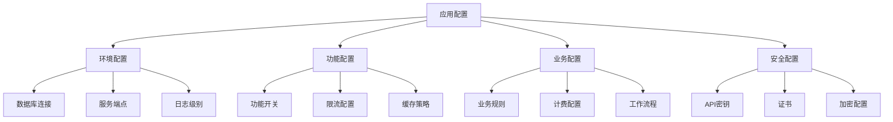

# 配置管理

## 📋 概述

配置管理是指系统化地处理应用程序和基础设施配置的过程，包括配置的存储、版本控制、分发、更新和安全管理。良好的配置管理能确保环境一致性、提高部署效率和增强安全性。

## 🎯 学习目标

- 理解配置管理的核心概念和重要性
- 掌握多环境配置管理策略
- 学会使用配置中心和密钥管理
- 了解配置变更的最佳实践

## 📚 配置管理基础

### 配置类型分类



### 配置管理原则

```javascript
const ConfigManagementPrinciples = {
  SEPARATION: '配置与代码分离',
  ENVIRONMENT_SPECIFIC: '环境特定配置',
  SECURITY: '敏感配置加密存储',
  VERSION_CONTROL: '配置版本控制',
  VALIDATION: '配置验证和校验',
  ROLLBACK: '配置回滚能力',
  AUDIT: '配置变更审计'
};
```

## 🛠 Node.js配置管理实现

### 分层配置系统

```javascript
// config/config-manager.js
const fs = require('fs');
const path = require('path');
const yaml = require('js-yaml');
const Joi = require('joi');

class ConfigManager {
  constructor() {
    this.config = {};
    this.schema = null;
    this.watchers = [];
    this.environment = process.env.NODE_ENV || 'development';
  }

  // 加载配置
  async load() {
    try {
      // 1. 加载默认配置
      await this.loadDefaultConfig();
      
      // 2. 加载环境特定配置
      await this.loadEnvironmentConfig();
      
      // 3. 加载本地配置覆盖
      await this.loadLocalConfig();
      
      // 4. 加载环境变量
      this.loadEnvironmentVariables();
      
      // 5. 加载远程配置
      await this.loadRemoteConfig();
      
      // 6. 验证配置
      this.validateConfig();
      
      console.log(`✅ 配置加载完成 (${this.environment})`);
      
    } catch (error) {
      console.error('❌ 配置加载失败:', error);
      throw error;
    }
  }

  async loadDefaultConfig() {
    const defaultConfigPath = path.join(__dirname, 'default.yaml');
    if (fs.existsSync(defaultConfigPath)) {
      const content = fs.readFileSync(defaultConfigPath, 'utf8');
      const defaultConfig = yaml.load(content);
      this.config = { ...defaultConfig };
    }
  }

  async loadEnvironmentConfig() {
    const envConfigPath = path.join(__dirname, `${this.environment}.yaml`);
    if (fs.existsSync(envConfigPath)) {
      const content = fs.readFileSync(envConfigPath, 'utf8');
      const envConfig = yaml.load(content);
      this.config = this.mergeDeep(this.config, envConfig);
    }
  }

  async loadLocalConfig() {
    const localConfigPath = path.join(__dirname, 'local.yaml');
    if (fs.existsSync(localConfigPath)) {
      const content = fs.readFileSync(localConfigPath, 'utf8');
      const localConfig = yaml.load(content);
      this.config = this.mergeDeep(this.config, localConfig);
    }
  }

  loadEnvironmentVariables() {
    // 映射环境变量到配置
    const envMapping = {
      'DATABASE_URL': 'database.url',
      'REDIS_URL': 'redis.url',
      'JWT_SECRET': 'auth.jwtSecret',
      'LOG_LEVEL': 'logging.level',
      'PORT': 'server.port'
    };

    for (const [envVar, configPath] of Object.entries(envMapping)) {
      const value = process.env[envVar];
      if (value !== undefined) {
        this.setNestedValue(this.config, configPath, value);
      }
    }
  }

  async loadRemoteConfig() {
    const remoteConfigUrl = process.env.CONFIG_SERVICE_URL;
    if (!remoteConfigUrl) return;

    try {
      const axios = require('axios');
      const response = await axios.get(`${remoteConfigUrl}/config/${this.environment}`, {
        timeout: 5000,
        headers: {
          'Authorization': `Bearer ${process.env.CONFIG_SERVICE_TOKEN}`
        }
      });

      const remoteConfig = response.data;
      this.config = this.mergeDeep(this.config, remoteConfig);
      
      console.log('✅ 远程配置加载成功');
    } catch (error) {
      console.warn('⚠️ 远程配置加载失败，使用本地配置:', error.message);
    }
  }

  validateConfig() {
    if (!this.schema) return;

    const { error } = this.schema.validate(this.config);
    if (error) {
      throw new Error(`配置验证失败: ${error.details.map(d => d.message).join(', ')}`);
    }
  }

  // 设置配置验证模式
  setSchema(schema) {
    this.schema = schema;
  }

  // 获取配置值
  get(path, defaultValue = undefined) {
    return this.getNestedValue(this.config, path, defaultValue);
  }

  // 设置配置值
  set(path, value) {
    this.setNestedValue(this.config, path, value);
    this.notifyWatchers(path, value);
  }

  // 监听配置变更
  watch(path, callback) {
    this.watchers.push({ path, callback });
  }

  // 通知监听器
  notifyWatchers(path, value) {
    this.watchers
      .filter(watcher => path.startsWith(watcher.path))
      .forEach(watcher => watcher.callback(path, value));
  }

  // 深度合并对象
  mergeDeep(target, source) {
    const result = { ...target };
    
    for (const key in source) {
      if (source[key] && typeof source[key] === 'object' && !Array.isArray(source[key])) {
        result[key] = this.mergeDeep(result[key] || {}, source[key]);
      } else {
        result[key] = source[key];
      }
    }
    
    return result;
  }

  // 获取嵌套值
  getNestedValue(obj, path, defaultValue) {
    const keys = path.split('.');
    let current = obj;
    
    for (const key of keys) {
      if (current === null || current === undefined || !(key in current)) {
        return defaultValue;
      }
      current = current[key];
    }
    
    return current;
  }

  // 设置嵌套值
  setNestedValue(obj, path, value) {
    const keys = path.split('.');
    let current = obj;
    
    for (let i = 0; i < keys.length - 1; i++) {
      const key = keys[i];
      if (!(key in current) || typeof current[key] !== 'object') {
        current[key] = {};
      }
      current = current[key];
    }
    
    current[keys[keys.length - 1]] = value;
  }

  // 热重载配置
  async reload() {
    console.log('🔄 重新加载配置...');
    await this.load();
  }

  // 导出配置（用于调试）
  export() {
    return JSON.stringify(this.config, null, 2);
  }

  // 获取所有配置
  getAll() {
    return { ...this.config };
  }
}

module.exports = ConfigManager;
```

### 配置文件结构

```yaml
# config/default.yaml
server:
  port: 3000
  host: '0.0.0.0'
  timeout: 30000

database:
  type: 'postgresql'
  host: 'localhost'
  port: 5432
  name: 'app'
  username: 'postgres'
  password: 'password'
  pool:
    min: 2
    max: 10
    idle: 10000
  ssl: false
  logging: false

redis:
  host: 'localhost'
  port: 6379
  password: ''
  db: 0
  keyPrefix: 'app:'
  retryDelayOnFailover: 100
  maxRetriesPerRequest: 3

auth:
  jwtSecret: 'default-secret'
  jwtExpiresIn: '24h'
  bcryptRounds: 12
  sessionSecret: 'session-secret'
  sessionMaxAge: 86400000

logging:
  level: 'info'
  file: './logs/app.log'
  maxFiles: 5
  maxSize: '10m'
  colorize: true
  timestamp: true

cache:
  ttl: 3600
  checkPeriod: 600
  maxKeys: 1000

rateLimit:
  windowMs: 900000  # 15分钟
  max: 100
  message: 'Too many requests'

cors:
  origin: '*'
  methods: ['GET', 'POST', 'PUT', 'DELETE']
  allowedHeaders: ['Content-Type', 'Authorization']
  credentials: true

features:
  enableRegistration: true
  enablePasswordReset: true
  enableEmailVerification: false
  enableTwoFactor: false
  maintenanceMode: false

monitoring:
  enabled: true
  metricsPort: 9090
  healthCheckPath: '/health'
  
external:
  emailService:
    provider: 'smtp'
    host: 'smtp.gmail.com'
    port: 587
    secure: false
  
  storage:
    provider: 'local'
    path: './uploads'
```

```yaml
# config/production.yaml
server:
  port: ${PORT:3000}
  timeout: 60000

database:
  host: ${DB_HOST}
  port: ${DB_PORT:5432}
  name: ${DB_NAME}
  username: ${DB_USER}
  password: ${DB_PASSWORD}
  ssl: true
  logging: false
  pool:
    min: 5
    max: 20

redis:
  host: ${REDIS_HOST}
  port: ${REDIS_PORT:6379}
  password: ${REDIS_PASSWORD}
  
auth:
  jwtSecret: ${JWT_SECRET}
  sessionSecret: ${SESSION_SECRET}

logging:
  level: 'warn'
  file: '/var/log/app/app.log'

features:
  enableRegistration: false
  maintenanceMode: false

monitoring:
  enabled: true
  
external:
  emailService:
    provider: 'ses'
    region: 'us-east-1'
  
  storage:
    provider: 's3'
    bucket: ${S3_BUCKET}
    region: 'us-east-1'
```

### 配置验证模式

```javascript
// config/config-schema.js
const Joi = require('joi');

const configSchema = Joi.object({
  server: Joi.object({
    port: Joi.number().port().required(),
    host: Joi.string().required(),
    timeout: Joi.number().positive()
  }).required(),

  database: Joi.object({
    type: Joi.string().valid('postgresql', 'mysql', 'mongodb').required(),
    host: Joi.string().required(),
    port: Joi.number().port().required(),
    name: Joi.string().required(),
    username: Joi.string().required(),
    password: Joi.string().required(),
    pool: Joi.object({
      min: Joi.number().min(0),
      max: Joi.number().min(1),
      idle: Joi.number().positive()
    }),
    ssl: Joi.boolean(),
    logging: Joi.boolean()
  }).required(),

  redis: Joi.object({
    host: Joi.string().required(),
    port: Joi.number().port().required(),
    password: Joi.string().allow(''),
    db: Joi.number().min(0).max(15),
    keyPrefix: Joi.string()
  }).required(),

  auth: Joi.object({
    jwtSecret: Joi.string().min(32).required(),
    jwtExpiresIn: Joi.string().required(),
    bcryptRounds: Joi.number().min(8).max(15),
    sessionSecret: Joi.string().min(32).required(),
    sessionMaxAge: Joi.number().positive()
  }).required(),

  logging: Joi.object({
    level: Joi.string().valid('error', 'warn', 'info', 'debug', 'silly').required(),
    file: Joi.string(),
    maxFiles: Joi.number().positive(),
    maxSize: Joi.string(),
    colorize: Joi.boolean(),
    timestamp: Joi.boolean()
  }).required(),

  features: Joi.object({
    enableRegistration: Joi.boolean(),
    enablePasswordReset: Joi.boolean(),
    enableEmailVerification: Joi.boolean(),
    enableTwoFactor: Joi.boolean(),
    maintenanceMode: Joi.boolean()
  }),

  monitoring: Joi.object({
    enabled: Joi.boolean(),
    metricsPort: Joi.number().port(),
    healthCheckPath: Joi.string()
  })
});

module.exports = configSchema;
```

## 🔐 密钥管理系统

### 密钥管理器

```javascript
// security/secret-manager.js
const crypto = require('crypto');
const fs = require('fs').promises;
const path = require('path');

class SecretManager {
  constructor(config) {
    this.config = config;
    this.secrets = new Map();
    this.encryptionKey = null;
    this.providers = new Map();
    
    this.initializeProviders();
  }

  initializeProviders() {
    // 本地文件提供者
    this.providers.set('file', new FileSecretProvider(this.config.file));
    
    // 环境变量提供者
    this.providers.set('env', new EnvSecretProvider());
    
    // AWS Secrets Manager提供者
    if (this.config.aws) {
      this.providers.set('aws', new AWSSecretProvider(this.config.aws));
    }
    
    // HashiCorp Vault提供者
    if (this.config.vault) {
      this.providers.set('vault', new VaultSecretProvider(this.config.vault));
    }
  }

  async initialize() {
    // 初始化加密密钥
    await this.initializeEncryptionKey();
    
    // 加载所有密钥
    await this.loadSecrets();
    
    console.log('🔐 密钥管理器初始化完成');
  }

  async initializeEncryptionKey() {
    const keyFile = this.config.encryptionKeyFile || './config/encryption.key';
    
    try {
      const keyData = await fs.readFile(keyFile);
      this.encryptionKey = keyData;
    } catch (error) {
      if (error.code === 'ENOENT') {
        // 生成新的加密密钥
        this.encryptionKey = crypto.randomBytes(32);
        await fs.writeFile(keyFile, this.encryptionKey);
        console.log(`🔑 生成新的加密密钥: ${keyFile}`);
      } else {
        throw error;
      }
    }
  }

  async loadSecrets() {
    const providers = this.config.providers || ['env', 'file'];
    
    for (const providerName of providers) {
      const provider = this.providers.get(providerName);
      if (provider) {
        try {
          const secrets = await provider.loadSecrets();
          for (const [key, value] of Object.entries(secrets)) {
            this.secrets.set(key, value);
          }
          console.log(`✅ 从 ${providerName} 加载密钥完成`);
        } catch (error) {
          console.error(`❌ 从 ${providerName} 加载密钥失败:`, error.message);
        }
      }
    }
  }

  // 获取密钥
  getSecret(key, defaultValue = undefined) {
    const secret = this.secrets.get(key);
    if (secret === undefined) {
      if (defaultValue !== undefined) {
        return defaultValue;
      }
      throw new Error(`密钥不存在: ${key}`);
    }
    
    // 如果是加密的密钥，解密后返回
    if (typeof secret === 'object' && secret.encrypted) {
      return this.decrypt(secret.value);
    }
    
    return secret;
  }

  // 设置密钥
  async setSecret(key, value, encrypt = true) {
    let secretValue = value;
    
    if (encrypt && typeof value === 'string') {
      secretValue = {
        encrypted: true,
        value: this.encrypt(value)
      };
    }
    
    this.secrets.set(key, secretValue);
    
    // 持久化到主要提供者
    const primaryProvider = this.providers.get(this.config.primaryProvider || 'file');
    if (primaryProvider && primaryProvider.saveSecret) {
      await primaryProvider.saveSecret(key, secretValue);
    }
  }

  // 删除密钥
  async deleteSecret(key) {
    this.secrets.delete(key);
    
    const primaryProvider = this.providers.get(this.config.primaryProvider || 'file');
    if (primaryProvider && primaryProvider.deleteSecret) {
      await primaryProvider.deleteSecret(key);
    }
  }

  // 加密
  encrypt(text) {
    const iv = crypto.randomBytes(16);
    const cipher = crypto.createCipher('aes-256-cbc', this.encryptionKey);
    cipher.setAutoPadding(true);
    
    let encrypted = cipher.update(text, 'utf8', 'hex');
    encrypted += cipher.final('hex');
    
    return {
      iv: iv.toString('hex'),
      data: encrypted
    };
  }

  // 解密
  decrypt(encryptedData) {
    const decipher = crypto.createDecipher('aes-256-cbc', this.encryptionKey);
    decipher.setAutoPadding(true);
    
    let decrypted = decipher.update(encryptedData.data, 'hex', 'utf8');
    decrypted += decipher.final('utf8');
    
    return decrypted;
  }

  // 轮换密钥
  async rotateSecret(key, newValue) {
    const oldValue = this.getSecret(key);
    await this.setSecret(key, newValue);
    
    // 记录轮换历史
    await this.logSecretRotation(key, oldValue, newValue);
  }

  async logSecretRotation(key, oldValue, newValue) {
    const logEntry = {
      timestamp: new Date().toISOString(),
      key,
      action: 'rotate',
      oldValueHash: crypto.createHash('sha256').update(oldValue).digest('hex'),
      newValueHash: crypto.createHash('sha256').update(newValue).digest('hex')
    };
    
    // 写入审计日志
    const logFile = this.config.auditLogFile || './logs/secret-audit.log';
    await fs.appendFile(logFile, JSON.stringify(logEntry) + '\n');
  }

  // 列出所有密钥名称
  listSecrets() {
    return Array.from(this.secrets.keys());
  }

  // 验证密钥完整性
  async validateSecrets() {
    const issues = [];
    
    for (const [key, value] of this.secrets) {
      try {
        if (typeof value === 'object' && value.encrypted) {
          this.decrypt(value.value);
        }
      } catch (error) {
        issues.push(`密钥 ${key} 解密失败: ${error.message}`);
      }
    }
    
    return issues;
  }
}

// 文件密钥提供者
class FileSecretProvider {
  constructor(config) {
    this.config = config;
    this.filePath = config.path || './config/secrets.json';
  }

  async loadSecrets() {
    try {
      const content = await fs.readFile(this.filePath, 'utf8');
      return JSON.parse(content);
    } catch (error) {
      if (error.code === 'ENOENT') {
        return {};
      }
      throw error;
    }
  }

  async saveSecret(key, value) {
    let secrets = {};
    try {
      secrets = await this.loadSecrets();
    } catch (error) {
      // 忽略文件不存在的错误
    }
    
    secrets[key] = value;
    
    await fs.writeFile(this.filePath, JSON.stringify(secrets, null, 2));
  }

  async deleteSecret(key) {
    const secrets = await this.loadSecrets();
    delete secrets[key];
    await fs.writeFile(this.filePath, JSON.stringify(secrets, null, 2));
  }
}

// 环境变量密钥提供者
class EnvSecretProvider {
  async loadSecrets() {
    const secrets = {};
    const prefix = 'SECRET_';
    
    for (const [key, value] of Object.entries(process.env)) {
      if (key.startsWith(prefix)) {
        const secretKey = key.substring(prefix.length).toLowerCase();
        secrets[secretKey] = value;
      }
    }
    
    return secrets;
  }
}

// AWS Secrets Manager提供者
class AWSSecretProvider {
  constructor(config) {
    this.config = config;
    this.client = null;
  }

  async loadSecrets() {
    if (!this.client) {
      const AWS = require('aws-sdk');
      this.client = new AWS.SecretsManager({
        region: this.config.region || 'us-east-1'
      });
    }

    const secrets = {};
    
    try {
      const response = await this.client.getSecretValue({
        SecretId: this.config.secretId
      }).promise();
      
      const secretData = JSON.parse(response.SecretString);
      return secretData;
      
    } catch (error) {
      console.error('AWS Secrets Manager 加载失败:', error.message);
      return {};
    }
  }
}

// HashiCorp Vault提供者
class VaultSecretProvider {
  constructor(config) {
    this.config = config;
    this.client = null;
  }

  async loadSecrets() {
    if (!this.client) {
      const vault = require('node-vault');
      this.client = vault({
        apiVersion: 'v1',
        endpoint: this.config.endpoint,
        token: this.config.token
      });
    }

    try {
      const response = await this.client.read(this.config.path);
      return response.data.data || response.data;
    } catch (error) {
      console.error('Vault 加载失败:', error.message);
      return {};
    }
  }
}

module.exports = SecretManager;
```

## 🔄 动态配置更新

### 配置热更新系统

```javascript
// config/hot-reload-manager.js
const fs = require('fs');
const path = require('path');
const EventEmitter = require('events');

class HotReloadManager extends EventEmitter {
  constructor(configManager) {
    super();
    this.configManager = configManager;
    this.watchers = new Map();
    this.updateQueue = [];
    this.isProcessing = false;
  }

  // 启动热更新监控
  start() {
    console.log('🔥 启动配置热更新监控');
    
    // 监控配置文件变化
    this.watchConfigFiles();
    
    // 监控远程配置变化
    this.watchRemoteConfig();
    
    // 处理更新队列
    this.processUpdateQueue();
  }

  watchConfigFiles() {
    const configDir = path.join(__dirname);
    const configFiles = ['default.yaml', 'development.yaml', 'production.yaml', 'local.yaml'];
    
    configFiles.forEach(filename => {
      const filePath = path.join(configDir, filename);
      
      if (fs.existsSync(filePath)) {
        const watcher = fs.watch(filePath, (eventType) => {
          if (eventType === 'change') {
            console.log(`📝 检测到配置文件变化: ${filename}`);
            this.queueUpdate('file', filename);
          }
        });
        
        this.watchers.set(filePath, watcher);
        console.log(`👁️ 监控配置文件: ${filename}`);
      }
    });
  }

  watchRemoteConfig() {
    const remoteConfigUrl = process.env.CONFIG_SERVICE_URL;
    if (!remoteConfigUrl) return;
    
    // 定期检查远程配置变化
    setInterval(async () => {
      try {
        await this.checkRemoteConfigChanges();
      } catch (error) {
        console.error('检查远程配置失败:', error.message);
      }
    }, 30000); // 30秒检查一次
  }

  async checkRemoteConfigChanges() {
    const axios = require('axios');
    const environment = process.env.NODE_ENV || 'development';
    
    try {
      const response = await axios.get(`${process.env.CONFIG_SERVICE_URL}/config/${environment}/version`, {
        timeout: 5000,
        headers: {
          'Authorization': `Bearer ${process.env.CONFIG_SERVICE_TOKEN}`
        }
      });
      
      const remoteVersion = response.data.version;
      const currentVersion = this.configManager.get('_version', '0');
      
      if (remoteVersion !== currentVersion) {
        console.log(`🔄 检测到远程配置版本变化: ${currentVersion} -> ${remoteVersion}`);
        this.queueUpdate('remote', remoteVersion);
      }
      
    } catch (error) {
      // 静默处理错误，避免日志污染
    }
  }

  queueUpdate(source, identifier) {
    this.updateQueue.push({
      source,
      identifier,
      timestamp: Date.now()
    });
  }

  async processUpdateQueue() {
    setInterval(async () => {
      if (this.isProcessing || this.updateQueue.length === 0) {
        return;
      }
      
      this.isProcessing = true;
      
      try {
        const update = this.updateQueue.shift();
        await this.processUpdate(update);
      } catch (error) {
        console.error('处理配置更新失败:', error.message);
      } finally {
        this.isProcessing = false;
      }
    }, 1000);
  }

  async processUpdate(update) {
    console.log(`🔄 处理配置更新: ${update.source}/${update.identifier}`);
    
    try {
      // 备份当前配置
      const backupConfig = this.configManager.getAll();
      
      // 重新加载配置
      await this.configManager.reload();
      
      // 验证新配置
      const validationResult = await this.validateNewConfig();
      
      if (validationResult.isValid) {
        // 通知配置变更
        this.emit('configUpdated', {
          source: update.source,
          identifier: update.identifier,
          timestamp: update.timestamp,
          changes: this.detectChanges(backupConfig, this.configManager.getAll())
        });
        
        console.log('✅ 配置热更新成功');
      } else {
        // 回滚配置
        this.configManager.config = backupConfig;
        console.error('❌ 配置验证失败，已回滚:', validationResult.errors);
        
        this.emit('configUpdateFailed', {
          source: update.source,
          identifier: update.identifier,
          errors: validationResult.errors
        });
      }
      
    } catch (error) {
      console.error('配置更新处理失败:', error.message);
      this.emit('configUpdateError', error);
    }
  }

  async validateNewConfig() {
    try {
      // 基本验证
      this.configManager.validateConfig();
      
      // 业务逻辑验证
      const businessValidation = await this.performBusinessValidation();
      
      return {
        isValid: businessValidation.isValid,
        errors: businessValidation.errors
      };
      
    } catch (error) {
      return {
        isValid: false,
        errors: [error.message]
      };
    }
  }

  async performBusinessValidation() {
    const errors = [];
    
    // 数据库连接验证
    try {
      await this.validateDatabaseConnection();
    } catch (error) {
      errors.push(`数据库连接验证失败: ${error.message}`);
    }
    
    // Redis连接验证
    try {
      await this.validateRedisConnection();
    } catch (error) {
      errors.push(`Redis连接验证失败: ${error.message}`);
    }
    
    // 外部服务验证
    try {
      await this.validateExternalServices();
    } catch (error) {
      errors.push(`外部服务验证失败: ${error.message}`);
    }
    
    return {
      isValid: errors.length === 0,
      errors
    };
  }

  async validateDatabaseConnection() {
    // 实现数据库连接验证逻辑
    const dbConfig = this.configManager.get('database');
    // ... 验证逻辑
  }

  async validateRedisConnection() {
    // 实现Redis连接验证逻辑
    const redisConfig = this.configManager.get('redis');
    // ... 验证逻辑
  }

  async validateExternalServices() {
    // 实现外部服务验证逻辑
    const externalConfig = this.configManager.get('external');
    // ... 验证逻辑
  }

  detectChanges(oldConfig, newConfig) {
    const changes = [];
    
    this.compareObjects(oldConfig, newConfig, '', changes);
    
    return changes;
  }

  compareObjects(obj1, obj2, path, changes) {
    const keys = new Set([...Object.keys(obj1), ...Object.keys(obj2)]);
    
    for (const key of keys) {
      const fullPath = path ? `${path}.${key}` : key;
      const val1 = obj1[key];
      const val2 = obj2[key];
      
      if (val1 === undefined) {
        changes.push({ type: 'added', path: fullPath, value: val2 });
      } else if (val2 === undefined) {
        changes.push({ type: 'removed', path: fullPath, value: val1 });
      } else if (typeof val1 === 'object' && typeof val2 === 'object') {
        this.compareObjects(val1, val2, fullPath, changes);
      } else if (val1 !== val2) {
        changes.push({ type: 'changed', path: fullPath, oldValue: val1, newValue: val2 });
      }
    }
  }

  stop() {
    console.log('⏹️ 停止配置热更新监控');
    
    // 停止文件监控
    for (const watcher of this.watchers.values()) {
      watcher.close();
    }
    this.watchers.clear();
    
    // 清空更新队列
    this.updateQueue = [];
  }
}

module.exports = HotReloadManager;
```

## 🌐 配置中心集成

### 配置中心客户端

```javascript
// config/config-center-client.js
const axios = require('axios');
const WebSocket = require('ws');
const EventEmitter = require('events');

class ConfigCenterClient extends EventEmitter {
  constructor(options) {
    super();
    this.options = {
      endpoint: options.endpoint,
      apiKey: options.apiKey,
      namespace: options.namespace || 'default',
      environment: options.environment || 'development',
      timeout: options.timeout || 10000,
      retryInterval: options.retryInterval || 30000,
      enableWebSocket: options.enableWebSocket !== false
    };
    
    this.config = new Map();
    this.isConnected = false;
    this.ws = null;
    this.retryTimer = null;
  }

  async connect() {
    try {
      console.log('🔌 连接配置中心...');
      
      // 获取初始配置
      await this.fetchInitialConfig();
      
      // 建立WebSocket连接（用于实时更新）
      if (this.options.enableWebSocket) {
        await this.connectWebSocket();
      }
      
      this.isConnected = true;
      console.log('✅ 配置中心连接成功');
      
      this.emit('connected');
      
    } catch (error) {
      console.error('❌ 配置中心连接失败:', error.message);
      this.scheduleRetry();
      throw error;
    }
  }

  async fetchInitialConfig() {
    const response = await axios.get(`${this.options.endpoint}/api/config`, {
      params: {
        namespace: this.options.namespace,
        environment: this.options.environment
      },
      headers: {
        'Authorization': `Bearer ${this.options.apiKey}`,
        'Content-Type': 'application/json'
      },
      timeout: this.options.timeout
    });
    
    const configData = response.data;
    
    // 存储配置
    for (const [key, value] of Object.entries(configData.config || {})) {
      this.config.set(key, value);
    }
    
    // 存储元数据
    this.configVersion = configData.version;
    this.lastUpdated = configData.updatedAt;
    
    console.log(`📥 获取配置完成: ${this.config.size} 项配置`);
  }

  async connectWebSocket() {
    const wsUrl = `${this.options.endpoint.replace('http', 'ws')}/ws/config`;
    
    this.ws = new WebSocket(wsUrl, {
      headers: {
        'Authorization': `Bearer ${this.options.apiKey}`
      }
    });
    
    this.ws.on('open', () => {
      console.log('🔗 WebSocket连接已建立');
      
      // 订阅配置变更
      this.ws.send(JSON.stringify({
        type: 'subscribe',
        namespace: this.options.namespace,
        environment: this.options.environment
      }));
    });
    
    this.ws.on('message', (data) => {
      try {
        const message = JSON.parse(data.toString());
        this.handleWebSocketMessage(message);
      } catch (error) {
        console.error('WebSocket消息解析失败:', error.message);
      }
    });
    
    this.ws.on('close', () => {
      console.log('🔌 WebSocket连接已断开');
      this.scheduleReconnect();
    });
    
    this.ws.on('error', (error) => {
      console.error('WebSocket错误:', error.message);
    });
  }

  handleWebSocketMessage(message) {
    switch (message.type) {
      case 'config_updated':
        this.handleConfigUpdate(message.data);
        break;
      case 'config_deleted':
        this.handleConfigDeletion(message.data);
        break;
      case 'ping':
        this.ws.send(JSON.stringify({ type: 'pong' }));
        break;
      default:
        console.log('未知WebSocket消息类型:', message.type);
    }
  }

  handleConfigUpdate(data) {
    console.log(`📝 配置更新: ${data.key}`);
    
    const oldValue = this.config.get(data.key);
    this.config.set(data.key, data.value);
    
    this.emit('configChanged', {
      key: data.key,
      oldValue,
      newValue: data.value,
      timestamp: data.timestamp
    });
  }

  handleConfigDeletion(data) {
    console.log(`🗑️ 配置删除: ${data.key}`);
    
    const oldValue = this.config.get(data.key);
    this.config.delete(data.key);
    
    this.emit('configDeleted', {
      key: data.key,
      oldValue,
      timestamp: data.timestamp
    });
  }

  // 获取配置值
  get(key, defaultValue = undefined) {
    return this.config.get(key) || defaultValue;
  }

  // 获取所有配置
  getAll() {
    return Object.fromEntries(this.config);
  }

  // 设置配置值（推送到配置中心）
  async set(key, value) {
    try {
      await axios.put(`${this.options.endpoint}/api/config/${key}`, {
        value,
        namespace: this.options.namespace,
        environment: this.options.environment
      }, {
        headers: {
          'Authorization': `Bearer ${this.options.apiKey}`,
          'Content-Type': 'application/json'
        },
        timeout: this.options.timeout
      });
      
      // 本地也更新
      this.config.set(key, value);
      
      console.log(`✅ 配置设置成功: ${key}`);
      
    } catch (error) {
      console.error(`❌ 配置设置失败: ${key}`, error.message);
      throw error;
    }
  }

  // 删除配置
  async delete(key) {
    try {
      await axios.delete(`${this.options.endpoint}/api/config/${key}`, {
        params: {
          namespace: this.options.namespace,
          environment: this.options.environment
        },
        headers: {
          'Authorization': `Bearer ${this.options.apiKey}`
        },
        timeout: this.options.timeout
      });
      
      // 本地也删除
      this.config.delete(key);
      
      console.log(`✅ 配置删除成功: ${key}`);
      
    } catch (error) {
      console.error(`❌ 配置删除失败: ${key}`, error.message);
      throw error;
    }
  }

  scheduleRetry() {
    if (this.retryTimer) {
      clearTimeout(this.retryTimer);
    }
    
    this.retryTimer = setTimeout(() => {
      console.log('🔄 重试连接配置中心...');
      this.connect().catch(() => {
        // 连接失败会自动重试
      });
    }, this.options.retryInterval);
  }

  scheduleReconnect() {
    if (this.options.enableWebSocket && !this.ws) {
      setTimeout(() => {
        this.connectWebSocket().catch(error => {
          console.error('WebSocket重连失败:', error.message);
        });
      }, 5000);
    }
  }

  disconnect() {
    console.log('🔌 断开配置中心连接');
    
    this.isConnected = false;
    
    if (this.ws) {
      this.ws.close();
      this.ws = null;
    }
    
    if (this.retryTimer) {
      clearTimeout(this.retryTimer);
      this.retryTimer = null;
    }
    
    this.emit('disconnected');
  }

  // 健康检查
  async healthCheck() {
    try {
      const response = await axios.get(`${this.options.endpoint}/api/health`, {
        headers: {
          'Authorization': `Bearer ${this.options.apiKey}`
        },
        timeout: 5000
      });
      
      return response.status === 200;
    } catch (error) {
      return false;
    }
  }
}

module.exports = ConfigCenterClient;
```

## 📊 配置监控和审计

### 配置变更审计

```javascript
// config/config-audit.js
const fs = require('fs').promises;
const crypto = require('crypto');

class ConfigAudit {
  constructor(options) {
    this.options = {
      auditLogFile: options.auditLogFile || './logs/config-audit.log',
      enableEncryption: options.enableEncryption !== false,
      maxLogSize: options.maxLogSize || 10 * 1024 * 1024, // 10MB
      retentionDays: options.retentionDays || 90
    };
    
    this.encryptionKey = options.encryptionKey;
  }

  // 记录配置变更
  async logConfigChange(change) {
    const auditEntry = {
      timestamp: new Date().toISOString(),
      id: this.generateId(),
      type: change.type, // 'create', 'update', 'delete', 'read'
      key: change.key,
      source: change.source, // 'file', 'api', 'ui', 'system'
      user: change.user || 'system',
      environment: change.environment || process.env.NODE_ENV,
      metadata: {
        userAgent: change.userAgent,
        ip: change.ip,
        sessionId: change.sessionId
      }
    };

    // 处理敏感数据
    if (change.oldValue !== undefined) {
      auditEntry.oldValueHash = this.hashValue(change.oldValue);
    }
    
    if (change.newValue !== undefined) {
      auditEntry.newValueHash = this.hashValue(change.newValue);
    }
    
    // 加密敏感信息（可选）
    if (this.options.enableEncryption && this.encryptionKey) {
      auditEntry.encrypted = true;
      auditEntry.data = this.encrypt(JSON.stringify({
        oldValue: change.oldValue,
        newValue: change.newValue
      }));
    }

    // 写入审计日志
    await this.writeAuditLog(auditEntry);
    
    console.log(`📋 配置变更已记录: ${change.type} ${change.key}`);
  }

  // 生成唯一ID
  generateId() {
    return crypto.randomBytes(16).toString('hex');
  }

  // 哈希值计算
  hashValue(value) {
    if (value === null || value === undefined) {
      return null;
    }
    
    const valueStr = typeof value === 'string' ? value : JSON.stringify(value);
    return crypto.createHash('sha256').update(valueStr).digest('hex');
  }

  // 加密数据
  encrypt(text) {
    const iv = crypto.randomBytes(16);
    const cipher = crypto.createCipher('aes-256-cbc', this.encryptionKey);
    
    let encrypted = cipher.update(text, 'utf8', 'hex');
    encrypted += cipher.final('hex');
    
    return {
      iv: iv.toString('hex'),
      data: encrypted
    };
  }

  // 解密数据
  decrypt(encryptedData) {
    const decipher = crypto.createDecipher('aes-256-cbc', this.encryptionKey);
    
    let decrypted = decipher.update(encryptedData.data, 'hex', 'utf8');
    decrypted += decipher.final('utf8');
    
    return JSON.parse(decrypted);
  }

  // 写入审计日志
  async writeAuditLog(auditEntry) {
    const logLine = JSON.stringify(auditEntry) + '\n';
    
    try {
      await fs.appendFile(this.options.auditLogFile, logLine);
      
      // 检查日志文件大小
      await this.checkLogRotation();
      
    } catch (error) {
      console.error('写入审计日志失败:', error.message);
      throw error;
    }
  }

  // 日志轮转
  async checkLogRotation() {
    try {
      const stats = await fs.stat(this.options.auditLogFile);
      
      if (stats.size > this.options.maxLogSize) {
        const timestamp = new Date().toISOString().replace(/[:.]/g, '-');
        const rotatedFile = `${this.options.auditLogFile}.${timestamp}`;
        
        await fs.rename(this.options.auditLogFile, rotatedFile);
        console.log(`📁 审计日志已轮转: ${rotatedFile}`);
        
        // 清理旧日志
        await this.cleanupOldLogs();
      }
      
    } catch (error) {
      if (error.code !== 'ENOENT') {
        console.error('日志轮转检查失败:', error.message);
      }
    }
  }

  // 清理旧日志
  async cleanupOldLogs() {
    try {
      const logDir = require('path').dirname(this.options.auditLogFile);
      const logBasename = require('path').basename(this.options.auditLogFile);
      
      const files = await fs.readdir(logDir);
      const logFiles = files.filter(file => file.startsWith(logBasename));
      
      const cutoffDate = new Date();
      cutoffDate.setDate(cutoffDate.getDate() - this.options.retentionDays);
      
      for (const file of logFiles) {
        const filePath = require('path').join(logDir, file);
        const stats = await fs.stat(filePath);
        
        if (stats.mtime < cutoffDate) {
          await fs.unlink(filePath);
          console.log(`🗑️ 删除过期审计日志: ${file}`);
        }
      }
      
    } catch (error) {
      console.error('清理旧日志失败:', error.message);
    }
  }

  // 查询审计日志
  async queryAuditLogs(criteria) {
    try {
      const content = await fs.readFile(this.options.auditLogFile, 'utf8');
      const lines = content.trim().split('\n').filter(line => line);
      
      let entries = lines.map(line => JSON.parse(line));
      
      // 应用过滤条件
      if (criteria.startDate) {
        entries = entries.filter(entry => new Date(entry.timestamp) >= new Date(criteria.startDate));
      }
      
      if (criteria.endDate) {
        entries = entries.filter(entry => new Date(entry.timestamp) <= new Date(criteria.endDate));
      }
      
      if (criteria.type) {
        entries = entries.filter(entry => entry.type === criteria.type);
      }
      
      if (criteria.key) {
        entries = entries.filter(entry => entry.key === criteria.key);
      }
      
      if (criteria.user) {
        entries = entries.filter(entry => entry.user === criteria.user);
      }
      
      // 排序
      entries.sort((a, b) => new Date(b.timestamp) - new Date(a.timestamp));
      
      // 限制结果数量
      if (criteria.limit) {
        entries = entries.slice(0, criteria.limit);
      }
      
      return entries;
      
    } catch (error) {
      console.error('查询审计日志失败:', error.message);
      return [];
    }
  }

  // 生成审计报告
  async generateAuditReport(criteria) {
    const entries = await this.queryAuditLogs(criteria);
    
    const report = {
      period: {
        startDate: criteria.startDate,
        endDate: criteria.endDate
      },
      summary: {
        totalChanges: entries.length,
        changesByType: this.groupBy(entries, 'type'),
        changesByUser: this.groupBy(entries, 'user'),
        changesByKey: this.groupBy(entries, 'key')
      },
      entries: entries.slice(0, 100) // 只包含前100条详细记录
    };
    
    return report;
  }

  groupBy(array, key) {
    return array.reduce((groups, item) => {
      const value = item[key];
      groups[value] = (groups[value] || 0) + 1;
      return groups;
    }, {});
  }

  // 验证审计日志完整性
  async verifyAuditIntegrity() {
    try {
      const entries = await this.queryAuditLogs({});
      const issues = [];
      
      for (let i = 0; i < entries.length; i++) {
        const entry = entries[i];
        
        // 检查必需字段
        if (!entry.id || !entry.timestamp || !entry.type) {
          issues.push(`条目 ${i} 缺少必需字段`);
        }
        
        // 检查时间戳格式
        if (isNaN(Date.parse(entry.timestamp))) {
          issues.push(`条目 ${i} 时间戳格式无效`);
        }
        
        // 检查加密数据
        if (entry.encrypted && this.encryptionKey) {
          try {
            this.decrypt(entry.data);
          } catch (error) {
            issues.push(`条目 ${i} 解密失败`);
          }
        }
      }
      
      return {
        isValid: issues.length === 0,
        issues,
        totalEntries: entries.length
      };
      
    } catch (error) {
      return {
        isValid: false,
        issues: [`验证失败: ${error.message}`],
        totalEntries: 0
      };
    }
  }
}

module.exports = ConfigAudit;
```

## 📝 总结

配置管理为Node.js应用提供了：

- **环境隔离**：不同环境使用不同配置
- **安全管理**：敏感配置加密存储
- **动态更新**：支持运行时配置变更
- **版本控制**：配置变更可追踪和回滚
- **集中管理**：统一的配置管理平台
- **审计跟踪**：完整的配置变更历史

良好的配置管理是现代应用架构的重要组成部分，能够提高部署效率和运维安全性。

## 🔗 相关资源

- [Node.js配置最佳实践](https://nodejs.org/en/docs/guides/nodejs-docker-webapp/)
- [Consul配置中心](https://www.consul.io/docs/agent/config)
- [Apollo配置中心](https://github.com/apolloconfig/apollo)
- [配置管理模式](https://martinfowler.com/articles/microservice-trade-offs.html#configuration)
