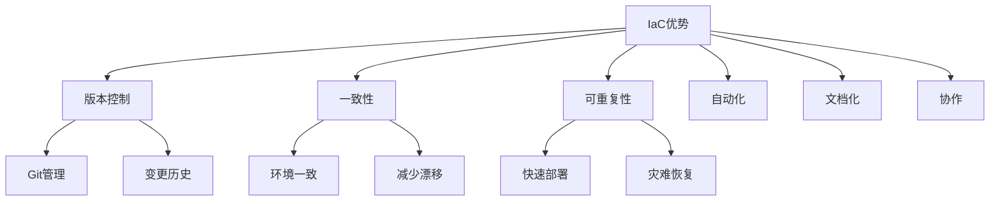

# IaC基础

## 📋 概述

基础设施即代码（Infrastructure as Code，IaC）是通过代码来定义和管理基础设施的实践。它将基础设施的配置和部署过程自动化，提高了一致性、可重复性和可维护性。

## 🎯 学习目标

- 理解IaC的核心概念和优势
- 掌握声明式vs命令式的区别
- 了解主流IaC工具和使用场景
- 学会设计可维护的基础设施代码

## 📚 IaC核心概念

### 声明式 vs 命令式

#### 声明式（推荐）

描述期望的最终状态，工具负责实现。

```yaml
# Terraform示例
resource "aws_instance" "web_server" {
  ami           = "ami-0c55b159cbfafe1d0"
  instance_type = "t2.micro"
  
  tags = {
    Name = "WebServer"
    Environment = "Production"
  }
}
```

#### 命令式

描述达到目标状态的具体步骤。

```bash
# Shell脚本示例
aws ec2 run-instances \
  --image-id ami-0c55b159cbfafe1d0 \
  --instance-type t2.micro \
  --tag-specifications 'ResourceType=instance,Tags=[{Key=Name,Value=WebServer}]'
```

### IaC的优势



## 🛠 Node.js应用IaC实践

### AWS基础设施配置

```yaml
# cloudformation.yaml
AWSTemplateFormatVersion: '2010-09-09'
Description: 'Node.js应用基础设施'

Parameters:
  Environment:
    Type: String
    Default: 'dev'
    AllowedValues: ['dev', 'staging', 'prod']
  
  InstanceType:
    Type: String
    Default: 't3.micro'
    AllowedValues: ['t3.micro', 't3.small', 't3.medium']

Mappings:
  EnvironmentMap:
    dev:
      MinSize: 1
      MaxSize: 2
      DesiredCapacity: 1
    staging:
      MinSize: 1
      MaxSize: 3
      DesiredCapacity: 2
    prod:
      MinSize: 2
      MaxSize: 10
      DesiredCapacity: 3

Resources:
  # VPC配置
  VPC:
    Type: AWS::EC2::VPC
    Properties:
      CidrBlock: 10.0.0.0/16
      EnableDnsHostnames: true
      EnableDnsSupport: true
      Tags:
        - Key: Name
          Value: !Sub '${Environment}-nodejs-vpc'

  # 公有子网
  PublicSubnet1:
    Type: AWS::EC2::Subnet
    Properties:
      VpcId: !Ref VPC
      CidrBlock: 10.0.1.0/24
      AvailabilityZone: !Select [0, !GetAZs '']
      MapPublicIpOnLaunch: true
      Tags:
        - Key: Name
          Value: !Sub '${Environment}-public-subnet-1'

  PublicSubnet2:
    Type: AWS::EC2::Subnet
    Properties:
      VpcId: !Ref VPC
      CidrBlock: 10.0.2.0/24
      AvailabilityZone: !Select [1, !GetAZs '']
      MapPublicIpOnLaunch: true
      Tags:
        - Key: Name
          Value: !Sub '${Environment}-public-subnet-2'

  # 私有子网
  PrivateSubnet1:
    Type: AWS::EC2::Subnet
    Properties:
      VpcId: !Ref VPC
      CidrBlock: 10.0.3.0/24
      AvailabilityZone: !Select [0, !GetAZs '']
      Tags:
        - Key: Name
          Value: !Sub '${Environment}-private-subnet-1'

  PrivateSubnet2:
    Type: AWS::EC2::Subnet
    Properties:
      VpcId: !Ref VPC
      CidrBlock: 10.0.4.0/24
      AvailabilityZone: !Select [1, !GetAZs '']
      Tags:
        - Key: Name
          Value: !Sub '${Environment}-private-subnet-2'

  # 互联网网关
  InternetGateway:
    Type: AWS::EC2::InternetGateway
    Properties:
      Tags:
        - Key: Name
          Value: !Sub '${Environment}-igw'

  InternetGatewayAttachment:
    Type: AWS::EC2::VPCGatewayAttachment
    Properties:
      InternetGatewayId: !Ref InternetGateway
      VpcId: !Ref VPC

  # 路由表
  PublicRouteTable:
    Type: AWS::EC2::RouteTable
    Properties:
      VpcId: !Ref VPC
      Tags:
        - Key: Name
          Value: !Sub '${Environment}-public-routes'

  DefaultPublicRoute:
    Type: AWS::EC2::Route
    DependsOn: InternetGatewayAttachment
    Properties:
      RouteTableId: !Ref PublicRouteTable
      DestinationCidrBlock: 0.0.0.0/0
      GatewayId: !Ref InternetGateway

  PublicSubnet1RouteTableAssociation:
    Type: AWS::EC2::SubnetRouteTableAssociation
    Properties:
      RouteTableId: !Ref PublicRouteTable
      SubnetId: !Ref PublicSubnet1

  PublicSubnet2RouteTableAssociation:
    Type: AWS::EC2::SubnetRouteTableAssociation
    Properties:
      RouteTableId: !Ref PublicRouteTable
      SubnetId: !Ref PublicSubnet2

  # 安全组
  WebServerSecurityGroup:
    Type: AWS::EC2::SecurityGroup
    Properties:
      GroupName: !Sub '${Environment}-web-sg'
      GroupDescription: 'Security group for web servers'
      VpcId: !Ref VPC
      SecurityGroupIngress:
        - IpProtocol: tcp
          FromPort: 80
          ToPort: 80
          CidrIp: 0.0.0.0/0
        - IpProtocol: tcp
          FromPort: 443
          ToPort: 443
          CidrIp: 0.0.0.0/0
        - IpProtocol: tcp
          FromPort: 22
          ToPort: 22
          CidrIp: 10.0.0.0/16
      SecurityGroupEgress:
        - IpProtocol: -1
          CidrIp: 0.0.0.0/0

  DatabaseSecurityGroup:
    Type: AWS::EC2::SecurityGroup
    Properties:
      GroupName: !Sub '${Environment}-db-sg'
      GroupDescription: 'Security group for database'
      VpcId: !Ref VPC
      SecurityGroupIngress:
        - IpProtocol: tcp
          FromPort: 5432
          ToPort: 5432
          SourceSecurityGroupId: !Ref WebServerSecurityGroup

  # RDS子网组
  DBSubnetGroup:
    Type: AWS::RDS::DBSubnetGroup
    Properties:
      DBSubnetGroupDescription: 'Subnet group for RDS database'
      SubnetIds:
        - !Ref PrivateSubnet1
        - !Ref PrivateSubnet2
      Tags:
        - Key: Name
          Value: !Sub '${Environment}-db-subnet-group'

  # RDS实例
  Database:
    Type: AWS::RDS::DBInstance
    Properties:
      DBInstanceIdentifier: !Sub '${Environment}-nodejs-db'
      DBInstanceClass: db.t3.micro
      Engine: postgres
      EngineVersion: '13.7'
      MasterUsername: postgres
      MasterUserPassword: !Ref DatabasePassword
      AllocatedStorage: 20
      StorageType: gp2
      DBSubnetGroupName: !Ref DBSubnetGroup
      VPCSecurityGroups:
        - !Ref DatabaseSecurityGroup
      BackupRetentionPeriod: 7
      MultiAZ: !If [IsProd, true, false]
      StorageEncrypted: true
      DeletionProtection: !If [IsProd, true, false]
      Tags:
        - Key: Name
          Value: !Sub '${Environment}-database'

  # ElastiCache子网组
  CacheSubnetGroup:
    Type: AWS::ElastiCache::SubnetGroup
    Properties:
      Description: 'Subnet group for ElastiCache'
      SubnetIds:
        - !Ref PrivateSubnet1
        - !Ref PrivateSubnet2

  # Redis集群
  RedisCluster:
    Type: AWS::ElastiCache::CacheCluster
    Properties:
      CacheClusterId: !Sub '${Environment}-redis'
      CacheNodeType: cache.t3.micro
      Engine: redis
      NumCacheNodes: 1
      CacheSubnetGroupName: !Ref CacheSubnetGroup
      VpcSecurityGroupIds:
        - !Ref CacheSecurityGroup
      Tags:
        - Key: Name
          Value: !Sub '${Environment}-redis'

  CacheSecurityGroup:
    Type: AWS::EC2::SecurityGroup
    Properties:
      GroupDescription: 'Security group for ElastiCache'
      VpcId: !Ref VPC
      SecurityGroupIngress:
        - IpProtocol: tcp
          FromPort: 6379
          ToPort: 6379
          SourceSecurityGroupId: !Ref WebServerSecurityGroup

  # Application Load Balancer
  ApplicationLoadBalancer:
    Type: AWS::ElasticLoadBalancingV2::LoadBalancer
    Properties:
      Name: !Sub '${Environment}-alb'
      Scheme: internet-facing
      Type: application
      Subnets:
        - !Ref PublicSubnet1
        - !Ref PublicSubnet2
      SecurityGroups:
        - !Ref WebServerSecurityGroup

  # Target Group
  TargetGroup:
    Type: AWS::ElasticLoadBalancingV2::TargetGroup
    Properties:
      Name: !Sub '${Environment}-tg'
      Port: 3000
      Protocol: HTTP
      VpcId: !Ref VPC
      HealthCheckPath: /health
      HealthCheckIntervalSeconds: 30
      HealthCheckTimeoutSeconds: 5
      HealthyThresholdCount: 2
      UnhealthyThresholdCount: 5

  # Listener
  Listener:
    Type: AWS::ElasticLoadBalancingV2::Listener
    Properties:
      DefaultActions:
        - Type: forward
          TargetGroupArn: !Ref TargetGroup
      LoadBalancerArn: !Ref ApplicationLoadBalancer
      Port: 80
      Protocol: HTTP

  # Launch Template
  LaunchTemplate:
    Type: AWS::EC2::LaunchTemplate
    Properties:
      LaunchTemplateName: !Sub '${Environment}-launch-template'
      LaunchTemplateData:
        ImageId: ami-0c55b159cbfafe1d0  # Amazon Linux 2
        InstanceType: !Ref InstanceType
        SecurityGroupIds:
          - !Ref WebServerSecurityGroup
        IamInstanceProfile:
          Arn: !GetAtt InstanceProfile.Arn
        UserData:
          Fn::Base64: !Sub |
            #!/bin/bash
            yum update -y
            yum install -y docker
            systemctl start docker
            systemctl enable docker
            usermod -a -G docker ec2-user
            
            # Install Node.js
            curl -sL https://rpm.nodesource.com/setup_18.x | bash -
            yum install -y nodejs
            
            # Install CloudWatch agent
            yum install -y amazon-cloudwatch-agent
            
            # Configure application
            export DATABASE_URL="postgresql://postgres:${DatabasePassword}@${Database.Endpoint.Address}:5432/postgres"
            export REDIS_URL="redis://${RedisCluster.RedisEndpoint.Address}:6379"
            export NODE_ENV="${Environment}"
            
            # Start application (this would typically pull from ECR or S3)
            # docker run -d -p 3000:3000 --env-file /etc/app.env your-app:latest

  # Auto Scaling Group
  AutoScalingGroup:
    Type: AWS::AutoScaling::AutoScalingGroup
    Properties:
      AutoScalingGroupName: !Sub '${Environment}-asg'
      VPCZoneIdentifier:
        - !Ref PrivateSubnet1
        - !Ref PrivateSubnet2
      LaunchTemplate:
        LaunchTemplateId: !Ref LaunchTemplate
        Version: !GetAtt LaunchTemplate.LatestVersionNumber
      MinSize: !FindInMap [EnvironmentMap, !Ref Environment, MinSize]
      MaxSize: !FindInMap [EnvironmentMap, !Ref Environment, MaxSize]
      DesiredCapacity: !FindInMap [EnvironmentMap, !Ref Environment, DesiredCapacity]
      TargetGroupARNs:
        - !Ref TargetGroup
      HealthCheckType: ELB
      HealthCheckGracePeriod: 300

  # IAM角色
  InstanceRole:
    Type: AWS::IAM::Role
    Properties:
      RoleName: !Sub '${Environment}-instance-role'
      AssumeRolePolicyDocument:
        Version: '2012-10-17'
        Statement:
          - Effect: Allow
            Principal:
              Service: ec2.amazonaws.com
            Action: sts:AssumeRole
      ManagedPolicyArns:
        - arn:aws:iam::aws:policy/CloudWatchAgentServerPolicy
        - arn:aws:iam::aws:policy/AmazonSSMManagedInstanceCore
      Policies:
        - PolicyName: S3Access
          PolicyDocument:
            Version: '2012-10-17'
            Statement:
              - Effect: Allow
                Action:
                  - s3:GetObject
                  - s3:PutObject
                Resource: !Sub 'arn:aws:s3:::${Environment}-app-bucket/*'

  InstanceProfile:
    Type: AWS::IAM::InstanceProfile
    Properties:
      InstanceProfileName: !Sub '${Environment}-instance-profile'
      Roles:
        - !Ref InstanceRole

Conditions:
  IsProd: !Equals [!Ref Environment, 'prod']

Parameters:
  DatabasePassword:
    Type: String
    NoEcho: true
    Description: 'Database password'
    MinLength: 8

Outputs:
  LoadBalancerDNS:
    Description: 'Load Balancer DNS Name'
    Value: !GetAtt ApplicationLoadBalancer.DNSName
    Export:
      Name: !Sub '${Environment}-alb-dns'

  DatabaseEndpoint:
    Description: 'Database endpoint'
    Value: !GetAtt Database.Endpoint.Address
    Export:
      Name: !Sub '${Environment}-db-endpoint'

  RedisEndpoint:
    Description: 'Redis endpoint'
    Value: !GetAtt RedisCluster.RedisEndpoint.Address
    Export:
      Name: !Sub '${Environment}-redis-endpoint'
```

### Terraform配置

```hcl
# main.tf
terraform {
  required_version = ">= 1.0"
  required_providers {
    aws = {
      source  = "hashicorp/aws"
      version = "~> 5.0"
    }
  }
  
  backend "s3" {
    bucket = "your-terraform-state-bucket"
    key    = "nodejs-app/terraform.tfstate"
    region = "us-west-2"
  }
}

provider "aws" {
  region = var.aws_region
}

# variables.tf
variable "environment" {
  description = "Environment name"
  type        = string
  default     = "dev"
}

variable "aws_region" {
  description = "AWS region"
  type        = string
  default     = "us-west-2"
}

variable "instance_type" {
  description = "EC2 instance type"
  type        = string
  default     = "t3.micro"
}

variable "db_password" {
  description = "Database password"
  type        = string
  sensitive   = true
}

# VPC模块
module "vpc" {
  source = "./modules/vpc"
  
  environment = var.environment
  vpc_cidr    = "10.0.0.0/16"
  
  public_subnets  = ["10.0.1.0/24", "10.0.2.0/24"]
  private_subnets = ["10.0.3.0/24", "10.0.4.0/24"]
  
  availability_zones = data.aws_availability_zones.available.names
}

# 安全组模块
module "security_groups" {
  source = "./modules/security"
  
  environment = var.environment
  vpc_id      = module.vpc.vpc_id
}

# 数据库模块
module "database" {
  source = "./modules/rds"
  
  environment     = var.environment
  vpc_id          = module.vpc.vpc_id
  private_subnets = module.vpc.private_subnets
  security_groups = [module.security_groups.database_sg_id]
  
  db_password = var.db_password
}

# Redis模块
module "redis" {
  source = "./modules/elasticache"
  
  environment     = var.environment
  private_subnets = module.vpc.private_subnets
  security_groups = [module.security_groups.cache_sg_id]
}

# 应用模块
module "application" {
  source = "./modules/app"
  
  environment     = var.environment
  vpc_id          = module.vpc.vpc_id
  public_subnets  = module.vpc.public_subnets
  private_subnets = module.vpc.private_subnets
  security_groups = [module.security_groups.web_sg_id]
  
  instance_type = var.instance_type
  
  database_endpoint = module.database.endpoint
  redis_endpoint    = module.redis.endpoint
}

# outputs.tf
output "load_balancer_dns" {
  description = "Load balancer DNS name"
  value       = module.application.load_balancer_dns
}

output "database_endpoint" {
  description = "Database endpoint"
  value       = module.database.endpoint
  sensitive   = true
}

# data.tf
data "aws_availability_zones" "available" {
  state = "available"
}
```

### Kubernetes配置

```yaml
# k8s/namespace.yaml
apiVersion: v1
kind: Namespace
metadata:
  name: nodejs-app
  labels:
    name: nodejs-app
    environment: production

---
# k8s/configmap.yaml
apiVersion: v1
kind: ConfigMap
metadata:
  name: app-config
  namespace: nodejs-app
data:
  NODE_ENV: "production"
  LOG_LEVEL: "info"
  PORT: "3000"

---
# k8s/secret.yaml
apiVersion: v1
kind: Secret
metadata:
  name: app-secrets
  namespace: nodejs-app
type: Opaque
data:
  database-url: <base64-encoded-database-url>
  jwt-secret: <base64-encoded-jwt-secret>
  redis-url: <base64-encoded-redis-url>

---
# k8s/deployment.yaml
apiVersion: apps/v1
kind: Deployment
metadata:
  name: nodejs-app
  namespace: nodejs-app
  labels:
    app: nodejs-app
spec:
  replicas: 3
  selector:
    matchLabels:
      app: nodejs-app
  template:
    metadata:
      labels:
        app: nodejs-app
    spec:
      containers:
      - name: app
        image: your-registry/nodejs-app:latest
        ports:
        - containerPort: 3000
        env:
        - name: NODE_ENV
          valueFrom:
            configMapKeyRef:
              name: app-config
              key: NODE_ENV
        - name: DATABASE_URL
          valueFrom:
            secretKeyRef:
              name: app-secrets
              key: database-url
        resources:
          requests:
            memory: "256Mi"
            cpu: "250m"
          limits:
            memory: "512Mi"
            cpu: "500m"
        livenessProbe:
          httpGet:
            path: /health
            port: 3000
          initialDelaySeconds: 30
          periodSeconds: 10
        readinessProbe:
          httpGet:
            path: /ready
            port: 3000
          initialDelaySeconds: 5
          periodSeconds: 5

---
# k8s/service.yaml
apiVersion: v1
kind: Service
metadata:
  name: nodejs-app-service
  namespace: nodejs-app
spec:
  selector:
    app: nodejs-app
  ports:
  - port: 80
    targetPort: 3000
  type: ClusterIP

---
# k8s/ingress.yaml
apiVersion: networking.k8s.io/v1
kind: Ingress
metadata:
  name: nodejs-app-ingress
  namespace: nodejs-app
  annotations:
    nginx.ingress.kubernetes.io/rewrite-target: /
    cert-manager.io/cluster-issuer: letsencrypt-prod
spec:
  tls:
  - hosts:
    - api.yourdomain.com
    secretName: api-tls
  rules:
  - host: api.yourdomain.com
    http:
      paths:
      - path: /
        pathType: Prefix
        backend:
          service:
            name: nodejs-app-service
            port:
              number: 80
```

## 🔧 IaC最佳实践

### 模块化设计

```
infrastructure/
├── modules/
│   ├── vpc/
│   │   ├── main.tf
│   │   ├── variables.tf
│   │   └── outputs.tf
│   ├── security/
│   │   ├── main.tf
│   │   ├── variables.tf
│   │   └── outputs.tf
│   ├── database/
│   │   ├── main.tf
│   │   ├── variables.tf
│   │   └── outputs.tf
│   └── application/
│       ├── main.tf
│       ├── variables.tf
│       └── outputs.tf
├── environments/
│   ├── dev/
│   │   ├── main.tf
│   │   ├── variables.tf
│   │   └── terraform.tfvars
│   ├── staging/
│   │   ├── main.tf
│   │   ├── variables.tf
│   │   └── terraform.tfvars
│   └── prod/
│       ├── main.tf
│       ├── variables.tf
│       └── terraform.tfvars
└── scripts/
    ├── deploy.sh
    ├── destroy.sh
    └── validate.sh
```

### 状态管理

```hcl
# backend.tf
terraform {
  backend "s3" {
    bucket         = "your-terraform-state"
    key            = "environments/prod/terraform.tfstate"
    region         = "us-west-2"
    encrypt        = true
    dynamodb_table = "terraform-state-lock"
  }
}

# 状态锁定表
resource "aws_dynamodb_table" "terraform_state_lock" {
  name           = "terraform-state-lock"
  billing_mode   = "PAY_PER_REQUEST"
  hash_key       = "LockID"

  attribute {
    name = "LockID"
    type = "S"
  }

  tags = {
    Name = "Terraform State Lock Table"
  }
}
```

### 变量管理

```hcl
# variables.tf
variable "environment" {
  description = "Environment name"
  type        = string
  validation {
    condition     = contains(["dev", "staging", "prod"], var.environment)
    error_message = "Environment must be dev, staging, or prod."
  }
}

variable "instance_config" {
  description = "Instance configuration"
  type = object({
    type         = string
    min_size     = number
    max_size     = number
    desired_size = number
  })
  
  validation {
    condition = var.instance_config.min_size <= var.instance_config.max_size
    error_message = "Min size must be less than or equal to max size."
  }
}

# terraform.tfvars
environment = "prod"

instance_config = {
  type         = "t3.medium"
  min_size     = 2
  max_size     = 10
  desired_size = 3
}

database_config = {
  instance_class = "db.t3.medium"
  storage_size   = 100
  multi_az       = true
}
```

### 安全配置

```hcl
# 敏感数据管理
variable "db_password" {
  description = "Database password"
  type        = string
  sensitive   = true
}

# 使用AWS Secrets Manager
resource "aws_secretsmanager_secret" "db_password" {
  name = "${var.environment}-db-password"
}

resource "aws_secretsmanager_secret_version" "db_password" {
  secret_id     = aws_secretsmanager_secret.db_password.id
  secret_string = var.db_password
}

# 数据源引用
data "aws_secretsmanager_secret_version" "db_password" {
  secret_id = aws_secretsmanager_secret.db_password.id
}

locals {
  db_password = jsondecode(data.aws_secretsmanager_secret_version.db_password.secret_string)
}
```

## 🚀 部署自动化

### CI/CD集成

```yaml
# .github/workflows/infrastructure.yml
name: Infrastructure Deployment

on:
  push:
    branches: [main]
    paths: ['infrastructure/**']
  pull_request:
    branches: [main]
    paths: ['infrastructure/**']

env:
  TF_VERSION: 1.5.0
  AWS_REGION: us-west-2

jobs:
  validate:
    runs-on: ubuntu-latest
    steps:
    - uses: actions/checkout@v3
    
    - name: Setup Terraform
      uses: hashicorp/setup-terraform@v2
      with:
        terraform_version: ${{ env.TF_VERSION }}
    
    - name: Terraform Format Check
      run: terraform fmt -check -recursive
    
    - name: Terraform Init
      run: terraform init
      working-directory: infrastructure/environments/prod
    
    - name: Terraform Validate
      run: terraform validate
      working-directory: infrastructure/environments/prod
    
    - name: Terraform Plan
      run: terraform plan -no-color
      working-directory: infrastructure/environments/prod
      env:
        AWS_ACCESS_KEY_ID: ${{ secrets.AWS_ACCESS_KEY_ID }}
        AWS_SECRET_ACCESS_KEY: ${{ secrets.AWS_SECRET_ACCESS_KEY }}

  deploy:
    if: github.ref == 'refs/heads/main'
    needs: validate
    runs-on: ubuntu-latest
    environment: production
    
    steps:
    - uses: actions/checkout@v3
    
    - name: Setup Terraform
      uses: hashicorp/setup-terraform@v2
      with:
        terraform_version: ${{ env.TF_VERSION }}
    
    - name: Terraform Init
      run: terraform init
      working-directory: infrastructure/environments/prod
    
    - name: Terraform Apply
      run: terraform apply -auto-approve
      working-directory: infrastructure/environments/prod
      env:
        AWS_ACCESS_KEY_ID: ${{ secrets.AWS_ACCESS_KEY_ID }}
        AWS_SECRET_ACCESS_KEY: ${{ secrets.AWS_SECRET_ACCESS_KEY }}
```

### 部署脚本

```bash
#!/bin/bash
# scripts/deploy.sh

set -e

ENVIRONMENT=${1:-dev}
ACTION=${2:-plan}

echo "🚀 Deploying infrastructure for environment: $ENVIRONMENT"

# 验证环境参数
if [[ ! "$ENVIRONMENT" =~ ^(dev|staging|prod)$ ]]; then
    echo "❌ Invalid environment: $ENVIRONMENT"
    echo "Valid environments: dev, staging, prod"
    exit 1
fi

# 切换到环境目录
cd "infrastructure/environments/$ENVIRONMENT"

# 初始化Terraform
echo "🔧 Initializing Terraform..."
terraform init

# 验证配置
echo "✅ Validating configuration..."
terraform validate

# 格式检查
echo "📝 Checking format..."
terraform fmt -check

# 安全扫描
echo "🔒 Running security scan..."
tfsec .

# 执行操作
case $ACTION in
    plan)
        echo "📋 Planning changes..."
        terraform plan -detailed-exitcode
        ;;
    apply)
        echo "🚀 Applying changes..."
        terraform plan -out=tfplan
        terraform apply tfplan
        rm tfplan
        ;;
    destroy)
        echo "💥 Destroying infrastructure..."
        terraform plan -destroy -out=tfplan
        terraform apply tfplan
        rm tfplan
        ;;
    *)
        echo "❌ Invalid action: $ACTION"
        echo "Valid actions: plan, apply, destroy"
        exit 1
        ;;
esac

echo "✅ Operation completed successfully!"
```

## 📝 总结

IaC为Node.js应用提供了：

- **版本控制的基础设施**：可追踪的变更历史
- **环境一致性**：开发、测试、生产环境的一致性
- **自动化部署**：减少人为错误和部署时间
- **灾难恢复**：快速重建基础设施的能力
- **成本控制**：通过代码管理资源使用

选择合适的IaC工具和实践对于现代应用部署至关重要。

## 🔗 相关资源

- [Terraform文档](https://www.terraform.io/docs)
- [AWS CloudFormation](https://aws.amazon.com/cloudformation/)
- [Pulumi文档](https://www.pulumi.com/docs/)
- [IaC最佳实践](https://www.terraform.io/docs/cloud/guides/recommended-practices/)
