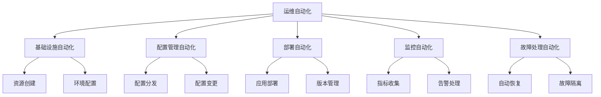

# 运维自动化

## 📋 概述

运维自动化是通过自动化工具和脚本来减少手工操作，提高运维效率和可靠性的实践。它涵盖了系统监控、故障处理、部署发布、资源管理等各个方面。

## 🎯 学习目标

- 理解运维自动化的核心概念和价值
- 掌握常见运维任务的自动化实现
- 学会设计和实施自动化运维流程
- 了解运维自动化工具和最佳实践

## 📚 运维自动化基础

### 自动化层次



### 自动化原则

```javascript
const AutomationPrinciples = {
  IDEMPOTENCY: '幂等性 - 重复执行产生相同结果',
  RELIABILITY: '可靠性 - 自动化系统本身要稳定',
  OBSERVABILITY: '可观测性 - 自动化过程要可监控',
  ROLLBACK: '可回滚 - 支持快速回滚到之前状态',
  TESTING: '可测试 - 自动化脚本要经过充分测试'
};
```

## 🛠 系统监控自动化

### 健康检查自动化

```javascript
// health-check-automation.js
const axios = require('axios');
const nodemailer = require('nodemailer');
const { Webhook } = require('discord-webhook-node');

class HealthCheckAutomation {
  constructor(config) {
    this.config = config;
    this.services = config.services || [];
    this.notifications = this.initializeNotifications();
    this.serviceStatus = new Map();
  }

  initializeNotifications() {
    const notifications = {};
    
    if (this.config.email) {
      notifications.email = nodemailer.createTransporter(this.config.email);
    }
    
    if (this.config.slack) {
      notifications.slack = new Webhook(this.config.slack.webhookUrl);
    }
    
    return notifications;
  }

  async startMonitoring() {
    console.log('🔍 启动健康检查自动化监控');
    
    // 初始化服务状态
    for (const service of this.services) {
      this.serviceStatus.set(service.name, {
        status: 'unknown',
        lastCheck: null,
        consecutiveFailures: 0
      });
    }

    // 定期检查
    setInterval(() => {
      this.performHealthChecks();
    }, this.config.checkInterval || 60000); // 默认1分钟

    // 立即执行一次检查
    await this.performHealthChecks();
  }

  async performHealthChecks() {
    const checkPromises = this.services.map(service => 
      this.checkService(service)
    );

    const results = await Promise.allSettled(checkPromises);
    
    // 处理检查结果
    results.forEach((result, index) => {
      const service = this.services[index];
      if (result.status === 'fulfilled') {
        this.handleServiceResult(service, result.value);
      } else {
        this.handleServiceResult(service, {
          healthy: false,
          error: result.reason.message
        });
      }
    });
  }

  async checkService(service) {
    const startTime = Date.now();
    
    try {
      const response = await axios.get(service.url, {
        timeout: service.timeout || 10000,
        headers: service.headers || {}
      });
      
      const responseTime = Date.now() - startTime;
      const isHealthy = this.evaluateHealth(service, response, responseTime);
      
      return {
        healthy: isHealthy,
        responseTime,
        statusCode: response.status,
        data: response.data
      };
    } catch (error) {
      return {
        healthy: false,
        error: error.message,
        responseTime: Date.now() - startTime
      };
    }
  }

  evaluateHealth(service, response, responseTime) {
    // 检查状态码
    if (response.status < 200 || response.status >= 300) {
      return false;
    }
    
    // 检查响应时间
    if (service.maxResponseTime && responseTime > service.maxResponseTime) {
      return false;
    }
    
    // 检查响应内容
    if (service.expectedContent) {
      const content = typeof response.data === 'string' 
        ? response.data 
        : JSON.stringify(response.data);
      
      if (!content.includes(service.expectedContent)) {
        return false;
      }
    }
    
    return true;
  }

  handleServiceResult(service, result) {
    const currentStatus = this.serviceStatus.get(service.name);
    const now = new Date();
    
    if (result.healthy) {
      // 服务健康
      if (currentStatus.status === 'down') {
        // 服务恢复
        this.handleServiceRecovery(service, result);
      }
      
      this.serviceStatus.set(service.name, {
        status: 'up',
        lastCheck: now,
        consecutiveFailures: 0,
        lastResult: result
      });
    } else {
      // 服务异常
      const consecutiveFailures = currentStatus.consecutiveFailures + 1;
      
      this.serviceStatus.set(service.name, {
        status: 'down',
        lastCheck: now,
        consecutiveFailures,
        lastResult: result
      });
      
      // 检查是否需要发送告警
      if (this.shouldSendAlert(service, consecutiveFailures)) {
        this.handleServiceFailure(service, result, consecutiveFailures);
      }
      
      // 尝试自动恢复
      if (service.autoRecover) {
        this.attemptAutoRecovery(service);
      }
    }
  }

  shouldSendAlert(service, consecutiveFailures) {
    const alertThreshold = service.alertThreshold || 3;
    return consecutiveFailures === alertThreshold || 
           (consecutiveFailures > alertThreshold && consecutiveFailures % 10 === 0);
  }

  async handleServiceFailure(service, result, consecutiveFailures) {
    const alertData = {
      service: service.name,
      url: service.url,
      status: 'DOWN',
      error: result.error || 'Service unhealthy',
      consecutiveFailures,
      timestamp: new Date().toISOString()
    };

    console.error(`🚨 服务异常: ${service.name}`, alertData);

    // 发送通知
    await this.sendAlert(alertData);
  }

  async handleServiceRecovery(service, result) {
    const recoveryData = {
      service: service.name,
      url: service.url,
      status: 'RECOVERED',
      responseTime: result.responseTime,
      timestamp: new Date().toISOString()
    };

    console.log(`✅ 服务恢复: ${service.name}`, recoveryData);

    // 发送恢复通知
    await this.sendRecoveryNotification(recoveryData);
  }

  async sendAlert(alertData) {
    const message = `🚨 服务告警\n服务: ${alertData.service}\nURL: ${alertData.url}\n状态: ${alertData.status}\n错误: ${alertData.error}\n连续失败次数: ${alertData.consecutiveFailures}`;

    // 发送邮件
    if (this.notifications.email) {
      try {
        await this.notifications.email.sendMail({
          from: this.config.email.from,
          to: this.config.email.alerts,
          subject: `🚨 服务告警: ${alertData.service}`,
          text: message
        });
      } catch (error) {
        console.error('邮件发送失败:', error);
      }
    }

    // 发送Slack通知
    if (this.notifications.slack) {
      try {
        await this.notifications.slack.send({
          content: message,
          embeds: [{
            title: '🚨 服务告警',
            color: 0xff0000,
            fields: [
              { name: '服务', value: alertData.service, inline: true },
              { name: '状态', value: alertData.status, inline: true },
              { name: '错误', value: alertData.error, inline: false }
            ],
            timestamp: alertData.timestamp
          }]
        });
      } catch (error) {
        console.error('Slack通知发送失败:', error);
      }
    }
  }

  async attemptAutoRecovery(service) {
    if (!service.recoveryActions) return;

    console.log(`🔄 尝试自动恢复服务: ${service.name}`);

    for (const action of service.recoveryActions) {
      try {
        await this.executeRecoveryAction(action);
        console.log(`✅ 恢复动作执行成功: ${action.type}`);
      } catch (error) {
        console.error(`❌ 恢复动作执行失败: ${action.type}`, error);
      }
    }
  }

  async executeRecoveryAction(action) {
    switch (action.type) {
      case 'restart_service':
        await this.restartService(action.service);
        break;
      case 'clear_cache':
        await this.clearCache(action.cache);
        break;
      case 'scale_up':
        await this.scaleService(action.service, action.instances);
        break;
      case 'webhook':
        await this.callWebhook(action.url, action.payload);
        break;
      default:
        throw new Error(`未知的恢复动作类型: ${action.type}`);
    }
  }

  async restartService(serviceName) {
    // 实现服务重启逻辑
    console.log(`重启服务: ${serviceName}`);
    // 这里可以调用Docker、systemctl、PM2等
  }

  async clearCache(cacheName) {
    // 实现缓存清理逻辑
    console.log(`清理缓存: ${cacheName}`);
  }

  async scaleService(serviceName, instances) {
    // 实现服务扩容逻辑
    console.log(`扩容服务: ${serviceName} 到 ${instances} 实例`);
  }

  async callWebhook(url, payload) {
    await axios.post(url, payload);
  }

  getServiceStatus() {
    const status = {};
    for (const [serviceName, serviceStatus] of this.serviceStatus) {
      status[serviceName] = serviceStatus;
    }
    return status;
  }
}

module.exports = HealthCheckAutomation;
```

### 配置示例

```javascript
// health-check-config.js
const config = {
  checkInterval: 30000, // 30秒检查一次
  
  services: [
    {
      name: 'nodejs-api',
      url: 'http://localhost:3000/health',
      timeout: 5000,
      maxResponseTime: 2000,
      expectedContent: 'OK',
      alertThreshold: 3,
      autoRecover: true,
      recoveryActions: [
        {
          type: 'restart_service',
          service: 'nodejs-app'
        },
        {
          type: 'clear_cache',
          cache: 'redis'
        }
      ]
    },
    {
      name: 'database',
      url: 'http://localhost:3000/db-health',
      timeout: 10000,
      alertThreshold: 2,
      recoveryActions: [
        {
          type: 'webhook',
          url: 'http://localhost:3000/api/db/reconnect',
          payload: { action: 'reconnect' }
        }
      ]
    }
  ],
  
  email: {
    host: 'smtp.gmail.com',
    port: 587,
    secure: false,
    auth: {
      user: 'alerts@company.com',
      pass: 'password'
    },
    from: 'alerts@company.com',
    alerts: ['admin@company.com', 'ops@company.com']
  },
  
  slack: {
    webhookUrl: 'https://hooks.slack.com/services/...'
  }
};

module.exports = config;
```

## 🔄 部署自动化

### 零停机部署自动化

```javascript
// zero-downtime-deployment.js
const { exec } = require('child_process');
const axios = require('axios');
const fs = require('fs').promises;

class ZeroDowntimeDeployment {
  constructor(config) {
    this.config = config;
    this.deploymentId = `deploy-${Date.now()}`;
    this.rollbackData = null;
  }

  async deploy(version) {
    console.log(`🚀 开始零停机部署: ${version}`);
    console.log(`部署ID: ${this.deploymentId}`);

    try {
      // 预检查
      await this.preDeploymentChecks();
      
      // 创建回滚点
      await this.createRollbackPoint();
      
      // 执行部署
      await this.executeDeployment(version);
      
      // 健康检查
      await this.performHealthCheck();
      
      // 流量切换
      await this.switchTraffic();
      
      // 后部署验证
      await this.postDeploymentVerification();
      
      // 清理旧版本
      await this.cleanup();
      
      console.log('✅ 部署成功完成');
      
    } catch (error) {
      console.error('❌ 部署失败:', error.message);
      await this.rollback();
      throw error;
    }
  }

  async preDeploymentChecks() {
    console.log('🔍 执行部署前检查...');
    
    // 检查系统资源
    await this.checkSystemResources();
    
    // 检查依赖服务
    await this.checkDependencies();
    
    // 检查当前服务状态
    await this.checkCurrentServiceHealth();
    
    console.log('✅ 部署前检查通过');
  }

  async checkSystemResources() {
    const diskUsage = await this.executeCommand("df -h / | tail -1 | awk '{print $5}' | sed 's/%//'");
    const memUsage = await this.executeCommand("free | grep Mem | awk '{printf \"%.0f\", $3/$2 * 100.0}'");
    
    if (parseInt(diskUsage) > 90) {
      throw new Error(`磁盘使用率过高: ${diskUsage}%`);
    }
    
    if (parseInt(memUsage) > 90) {
      throw new Error(`内存使用率过高: ${memUsage}%`);
    }
    
    console.log(`系统资源检查通过 - 磁盘: ${diskUsage}%, 内存: ${memUsage}%`);
  }

  async checkDependencies() {
    const dependencies = this.config.dependencies || [];
    
    for (const dep of dependencies) {
      try {
        const response = await axios.get(dep.url, { timeout: 5000 });
        if (response.status !== 200) {
          throw new Error(`依赖服务异常: ${dep.name}`);
        }
      } catch (error) {
        throw new Error(`依赖服务不可用: ${dep.name} - ${error.message}`);
      }
    }
    
    console.log('✅ 依赖服务检查通过');
  }

  async checkCurrentServiceHealth() {
    try {
      const response = await axios.get(this.config.healthCheckUrl, { timeout: 5000 });
      if (response.status !== 200) {
        throw new Error('当前服务健康检查失败');
      }
    } catch (error) {
      throw new Error(`当前服务不健康: ${error.message}`);
    }
  }

  async createRollbackPoint() {
    console.log('💾 创建回滚点...');
    
    const timestamp = new Date().toISOString();
    const backupDir = `/tmp/rollback-${this.deploymentId}`;
    
    // 创建备份目录
    await this.executeCommand(`mkdir -p ${backupDir}`);
    
    // 备份当前版本
    await this.executeCommand(`cp -r ${this.config.appDir} ${backupDir}/app`);
    
    // 备份配置文件
    if (this.config.configFiles) {
      for (const configFile of this.config.configFiles) {
        await this.executeCommand(`cp ${configFile} ${backupDir}/`);
      }
    }
    
    // 记录当前状态
    const rollbackData = {
      deploymentId: this.deploymentId,
      timestamp,
      backupDir,
      previousVersion: await this.getCurrentVersion(),
      configFiles: this.config.configFiles || []
    };
    
    await fs.writeFile(`${backupDir}/rollback-info.json`, JSON.stringify(rollbackData, null, 2));
    
    this.rollbackData = rollbackData;
    console.log(`✅ 回滚点创建完成: ${backupDir}`);
  }

  async executeDeployment(version) {
    console.log(`📦 执行部署: ${version}`);
    
    // 下载新版本
    await this.downloadVersion(version);
    
    // 停止应用
    await this.stopApplication();
    
    // 更新应用文件
    await this.updateApplication(version);
    
    // 更新配置
    await this.updateConfiguration();
    
    // 启动应用
    await this.startApplication();
    
    console.log('✅ 应用部署完成');
  }

  async downloadVersion(version) {
    console.log(`⬇️ 下载版本: ${version}`);
    
    const downloadUrl = `${this.config.artifactRepository}/${version}.tar.gz`;
    const downloadPath = `/tmp/${version}.tar.gz`;
    
    await this.executeCommand(`wget -O ${downloadPath} ${downloadUrl}`);
    await this.executeCommand(`tar -xzf ${downloadPath} -C /tmp/`);
    
    console.log(`✅ 版本下载完成: ${downloadPath}`);
  }

  async stopApplication() {
    console.log('⏹️ 停止应用...');
    
    if (this.config.stopCommand) {
      await this.executeCommand(this.config.stopCommand);
    } else {
      // 默认使用PM2
      await this.executeCommand('pm2 stop all');
    }
    
    // 等待进程完全停止
    await this.sleep(5000);
    
    console.log('✅ 应用已停止');
  }

  async updateApplication(version) {
    console.log('📁 更新应用文件...');
    
    const sourceDir = `/tmp/${version}`;
    const targetDir = this.config.appDir;
    
    // 备份当前版本
    await this.executeCommand(`mv ${targetDir} ${targetDir}.backup`);
    
    // 部署新版本
    await this.executeCommand(`mv ${sourceDir} ${targetDir}`);
    
    // 安装依赖
    if (this.config.installDependencies !== false) {
      await this.executeCommand(`cd ${targetDir} && npm ci --only=production`);
    }
    
    console.log('✅ 应用文件更新完成');
  }

  async updateConfiguration() {
    console.log('⚙️ 更新配置...');
    
    if (this.config.configUpdates) {
      for (const update of this.config.configUpdates) {
        await this.executeCommand(update);
      }
    }
    
    console.log('✅ 配置更新完成');
  }

  async startApplication() {
    console.log('▶️ 启动应用...');
    
    if (this.config.startCommand) {
      await this.executeCommand(this.config.startCommand);
    } else {
      // 默认使用PM2
      await this.executeCommand(`cd ${this.config.appDir} && pm2 start ecosystem.config.js`);
    }
    
    // 等待应用启动
    await this.sleep(10000);
    
    console.log('✅ 应用已启动');
  }

  async performHealthCheck() {
    console.log('🔍 执行健康检查...');
    
    const maxRetries = 30;
    const retryInterval = 2000;
    
    for (let i = 0; i < maxRetries; i++) {
      try {
        const response = await axios.get(this.config.healthCheckUrl, { timeout: 5000 });
        
        if (response.status === 200) {
          console.log('✅ 健康检查通过');
          return;
        }
      } catch (error) {
        console.log(`健康检查失败 (${i + 1}/${maxRetries}): ${error.message}`);
      }
      
      await this.sleep(retryInterval);
    }
    
    throw new Error('健康检查超时失败');
  }

  async switchTraffic() {
    console.log('🔄 切换流量...');
    
    if (this.config.loadBalancer) {
      // 更新负载均衡器配置
      await this.updateLoadBalancer();
    }
    
    if (this.config.dnsUpdate) {
      // 更新DNS记录
      await this.updateDNS();
    }
    
    console.log('✅ 流量切换完成');
  }

  async postDeploymentVerification() {
    console.log('🔍 执行部署后验证...');
    
    // 功能测试
    if (this.config.functionalTests) {
      await this.runFunctionalTests();
    }
    
    // 性能测试
    if (this.config.performanceTests) {
      await this.runPerformanceTests();
    }
    
    console.log('✅ 部署后验证通过');
  }

  async rollback() {
    if (!this.rollbackData) {
      throw new Error('没有可用的回滚数据');
    }
    
    console.log('🔄 开始回滚...');
    
    try {
      // 停止当前应用
      await this.stopApplication();
      
      // 恢复应用文件
      await this.executeCommand(`rm -rf ${this.config.appDir}`);
      await this.executeCommand(`cp -r ${this.rollbackData.backupDir}/app ${this.config.appDir}`);
      
      // 恢复配置文件
      for (const configFile of this.rollbackData.configFiles) {
        const fileName = configFile.split('/').pop();
        await this.executeCommand(`cp ${this.rollbackData.backupDir}/${fileName} ${configFile}`);
      }
      
      // 启动应用
      await this.startApplication();
      
      // 验证回滚
      await this.performHealthCheck();
      
      console.log('✅ 回滚完成');
      
    } catch (error) {
      console.error('❌ 回滚失败:', error.message);
      throw error;
    }
  }

  async cleanup() {
    console.log('🧹 清理临时文件...');
    
    // 清理下载的文件
    await this.executeCommand('rm -rf /tmp/deploy-*');
    
    // 清理旧的备份（保留最近3个）
    await this.executeCommand(`ls -dt ${this.config.appDir}.backup* | tail -n +4 | xargs rm -rf`);
    
    console.log('✅ 清理完成');
  }

  async executeCommand(command) {
    return new Promise((resolve, reject) => {
      exec(command, (error, stdout, stderr) => {
        if (error) {
          reject(new Error(`命令执行失败: ${command}\n${error.message}`));
        } else {
          resolve(stdout.trim());
        }
      });
    });
  }

  async getCurrentVersion() {
    try {
      const packageJson = await fs.readFile(`${this.config.appDir}/package.json`, 'utf8');
      const pkg = JSON.parse(packageJson);
      return pkg.version;
    } catch (error) {
      return 'unknown';
    }
  }

  sleep(ms) {
    return new Promise(resolve => setTimeout(resolve, ms));
  }
}

module.exports = ZeroDowntimeDeployment;
```

## 🔧 系统维护自动化

### 系统清理自动化

```bash
#!/bin/bash
# system-cleanup-automation.sh

set -e

# 配置变量
LOG_DIR="/var/log"
TEMP_DIR="/tmp"
LOG_RETENTION_DAYS=30
TEMP_FILE_AGE_HOURS=24
DISK_THRESHOLD=85
MEMORY_THRESHOLD=80

# 日志函数
log() {
    echo "$(date '+%Y-%m-%d %H:%M:%S') - $1" | tee -a /var/log/system-cleanup.log
}

# 检查磁盘使用率
check_disk_usage() {
    local usage=$(df / | tail -1 | awk '{print $5}' | sed 's/%//')
    
    if [ "$usage" -gt "$DISK_THRESHOLD" ]; then
        log "⚠️ 磁盘使用率过高: ${usage}%，开始清理"
        return 0
    else
        log "✅ 磁盘使用率正常: ${usage}%"
        return 1
    fi
}

# 清理日志文件
cleanup_logs() {
    log "🧹 开始清理日志文件..."
    
    # 清理系统日志
    find /var/log -name "*.log" -mtime +$LOG_RETENTION_DAYS -type f -delete
    find /var/log -name "*.gz" -mtime +$LOG_RETENTION_DAYS -type f -delete
    
    # 清理应用日志
    find /opt/*/logs -name "*.log" -mtime +$LOG_RETENTION_DAYS -type f -delete 2>/dev/null || true
    
    # 清理journal日志
    journalctl --vacuum-time=${LOG_RETENTION_DAYS}d
    
    log "✅ 日志清理完成"
}

# 清理临时文件
cleanup_temp_files() {
    log "🧹 开始清理临时文件..."
    
    # 清理/tmp目录
    find $TEMP_DIR -type f -atime +1 -delete 2>/dev/null || true
    find $TEMP_DIR -type d -empty -delete 2>/dev/null || true
    
    # 清理用户临时文件
    find /home/*/tmp -type f -mtime +1 -delete 2>/dev/null || true
    
    log "✅ 临时文件清理完成"
}

# 清理包管理器缓存
cleanup_package_cache() {
    log "🧹 开始清理包管理器缓存..."
    
    # 清理APT缓存
    if command -v apt-get >/dev/null 2>&1; then
        apt-get clean
        apt-get autoremove -y
    fi
    
    # 清理YUM缓存
    if command -v yum >/dev/null 2>&1; then
        yum clean all
    fi
    
    # 清理NPM缓存
    if command -v npm >/dev/null 2>&1; then
        npm cache clean --force
    fi
    
    log "✅ 包管理器缓存清理完成"
}

# 清理Docker资源
cleanup_docker() {
    if command -v docker >/dev/null 2>&1; then
        log "🧹 开始清理Docker资源..."
        
        # 清理停止的容器
        docker container prune -f
        
        # 清理未使用的镜像
        docker image prune -f
        
        # 清理未使用的网络
        docker network prune -f
        
        # 清理未使用的卷
        docker volume prune -f
        
        log "✅ Docker资源清理完成"
    fi
}

# 内存清理
cleanup_memory() {
    local mem_usage=$(free | grep Mem | awk '{printf "%.0f", $3/$2 * 100.0}')
    
    if [ "$mem_usage" -gt "$MEMORY_THRESHOLD" ]; then
        log "⚠️ 内存使用率过高: ${mem_usage}%，开始内存清理"
        
        # 清理页面缓存
        sync && echo 1 > /proc/sys/vm/drop_caches
        
        # 清理交换空间
        swapoff -a && swapon -a
        
        log "✅ 内存清理完成"
    else
        log "✅ 内存使用率正常: ${mem_usage}%"
    fi
}

# 服务状态检查和重启
check_and_restart_services() {
    log "🔍 检查服务状态..."
    
    local services=("nginx" "nodejs-app" "redis" "postgresql")
    
    for service in "${services[@]}"; do
        if systemctl is-active --quiet "$service"; then
            log "✅ 服务正常: $service"
        else
            log "⚠️ 服务异常: $service，尝试重启"
            systemctl restart "$service"
            
            if systemctl is-active --quiet "$service"; then
                log "✅ 服务重启成功: $service"
            else
                log "❌ 服务重启失败: $service"
            fi
        fi
    done
}

# 生成清理报告
generate_report() {
    local report_file="/tmp/cleanup-report-$(date +%Y%m%d-%H%M%S).txt"
    
    cat << EOF > "$report_file"
系统清理报告
=============
执行时间: $(date)
主机名: $(hostname)

磁盘使用情况:
$(df -h)

内存使用情况:
$(free -h)

系统负载:
$(uptime)

服务状态:
$(systemctl status nginx nodejs-app redis postgresql --no-pager -l)

Docker状态:
$(docker system df 2>/dev/null || echo "Docker未安装")

清理日志:
$(tail -20 /var/log/system-cleanup.log)
EOF

    log "📊 清理报告已生成: $report_file"
    
    # 发送报告邮件（如果配置了）
    if [ -n "$REPORT_EMAIL" ]; then
        mail -s "系统清理报告 - $(hostname)" "$REPORT_EMAIL" < "$report_file"
        log "📧 报告已发送到: $REPORT_EMAIL"
    fi
}

# 主函数
main() {
    log "🚀 开始系统维护自动化"
    
    # 检查是否需要清理
    if check_disk_usage; then
        cleanup_logs
        cleanup_temp_files
        cleanup_package_cache
        cleanup_docker
    fi
    
    # 内存清理
    cleanup_memory
    
    # 服务检查
    check_and_restart_services
    
    # 生成报告
    generate_report
    
    log "✅ 系统维护自动化完成"
}

# 执行主函数
main "$@"
```

### 定时任务配置

```bash
# 系统维护定时任务
# /etc/cron.d/system-maintenance

# 每天凌晨2点执行系统清理
0 2 * * * root /opt/scripts/system-cleanup-automation.sh

# 每小时检查服务状态
0 * * * * root /opt/scripts/service-health-check.sh

# 每周日凌晨3点执行完整系统维护
0 3 * * 0 root /opt/scripts/weekly-maintenance.sh

# 每天检查磁盘空间
*/30 * * * * root /opt/scripts/disk-space-monitor.sh
```

## 📊 性能监控自动化

### 性能指标收集

```javascript
// performance-monitor.js
const os = require('os');
const fs = require('fs').promises;
const { performance } = require('perf_hooks');

class PerformanceMonitor {
  constructor(config) {
    this.config = config;
    this.metrics = [];
    this.isRunning = false;
  }

  start() {
    if (this.isRunning) return;
    
    this.isRunning = true;
    console.log('📊 启动性能监控');
    
    // 定期收集指标
    this.metricsInterval = setInterval(() => {
      this.collectMetrics();
    }, this.config.interval || 30000);
    
    // 定期分析和报告
    this.analysisInterval = setInterval(() => {
      this.analyzePerformance();
    }, this.config.analysisInterval || 300000);
  }

  stop() {
    if (!this.isRunning) return;
    
    this.isRunning = false;
    clearInterval(this.metricsInterval);
    clearInterval(this.analysisInterval);
    console.log('⏹️ 停止性能监控');
  }

  async collectMetrics() {
    const timestamp = Date.now();
    
    const metrics = {
      timestamp,
      cpu: this.getCPUMetrics(),
      memory: this.getMemoryMetrics(),
      disk: await this.getDiskMetrics(),
      network: await this.getNetworkMetrics(),
      process: this.getProcessMetrics(),
      application: await this.getApplicationMetrics()
    };
    
    this.metrics.push(metrics);
    
    // 保持最近1小时的数据
    const oneHourAgo = timestamp - 60 * 60 * 1000;
    this.metrics = this.metrics.filter(m => m.timestamp > oneHourAgo);
    
    // 检查异常
    this.checkAnomalies(metrics);
  }

  getCPUMetrics() {
    const cpus = os.cpus();
    const loadAvg = os.loadavg();
    
    return {
      count: cpus.length,
      model: cpus[0].model,
      speed: cpus[0].speed,
      loadAverage: {
        '1m': loadAvg[0],
        '5m': loadAvg[1],
        '15m': loadAvg[2]
      },
      usage: this.calculateCPUUsage()
    };
  }

  calculateCPUUsage() {
    const cpus = os.cpus();
    let totalIdle = 0;
    let totalTick = 0;
    
    cpus.forEach(cpu => {
      for (const type in cpu.times) {
        totalTick += cpu.times[type];
      }
      totalIdle += cpu.times.idle;
    });
    
    return {
      idle: totalIdle / totalTick * 100,
      usage: (1 - totalIdle / totalTick) * 100
    };
  }

  getMemoryMetrics() {
    const totalMem = os.totalmem();
    const freeMem = os.freemem();
    const usedMem = totalMem - freeMem;
    
    const processMemory = process.memoryUsage();
    
    return {
      total: totalMem,
      free: freeMem,
      used: usedMem,
      usagePercent: (usedMem / totalMem) * 100,
      process: {
        rss: processMemory.rss,
        heapTotal: processMemory.heapTotal,
        heapUsed: processMemory.heapUsed,
        external: processMemory.external,
        arrayBuffers: processMemory.arrayBuffers
      }
    };
  }

  async getDiskMetrics() {
    try {
      const stats = await fs.stat('/');
      // 这里简化处理，实际应该读取/proc/diskstats
      return {
        available: 'N/A', // 需要实现具体的磁盘空间检查
        usage: 'N/A'
      };
    } catch (error) {
      return { error: error.message };
    }
  }

  async getNetworkMetrics() {
    const interfaces = os.networkInterfaces();
    const metrics = {};
    
    for (const [name, addresses] of Object.entries(interfaces)) {
      if (addresses) {
        metrics[name] = addresses.filter(addr => !addr.internal);
      }
    }
    
    return metrics;
  }

  getProcessMetrics() {
    return {
      pid: process.pid,
      uptime: process.uptime(),
      version: process.version,
      platform: process.platform,
      arch: process.arch,
      title: process.title,
      argv: process.argv,
      execPath: process.execPath,
      cwd: process.cwd()
    };
  }

  async getApplicationMetrics() {
    // 应用特定的指标
    return {
      activeConnections: await this.getActiveConnections(),
      responseTime: await this.measureResponseTime(),
      errorRate: this.calculateErrorRate(),
      throughput: this.calculateThroughput()
    };
  }

  async getActiveConnections() {
    // 实现获取活跃连接数的逻辑
    return 0;
  }

  async measureResponseTime() {
    const start = performance.now();
    try {
      // 模拟一个内部健康检查请求
      await new Promise(resolve => setTimeout(resolve, 1));
      return performance.now() - start;
    } catch (error) {
      return -1;
    }
  }

  calculateErrorRate() {
    // 从最近的指标计算错误率
    return 0;
  }

  calculateThroughput() {
    // 计算吞吐量
    return 0;
  }

  checkAnomalies(metrics) {
    const anomalies = [];
    
    // CPU使用率异常
    if (metrics.cpu.usage > 90) {
      anomalies.push({
        type: 'high_cpu',
        value: metrics.cpu.usage,
        threshold: 90,
        severity: 'critical'
      });
    }
    
    // 内存使用率异常
    if (metrics.memory.usagePercent > 85) {
      anomalies.push({
        type: 'high_memory',
        value: metrics.memory.usagePercent,
        threshold: 85,
        severity: 'warning'
      });
    }
    
    // 负载异常
    if (metrics.cpu.loadAverage['1m'] > metrics.cpu.count * 2) {
      anomalies.push({
        type: 'high_load',
        value: metrics.cpu.loadAverage['1m'],
        threshold: metrics.cpu.count * 2,
        severity: 'critical'
      });
    }
    
    if (anomalies.length > 0) {
      this.handleAnomalies(anomalies, metrics);
    }
  }

  handleAnomalies(anomalies, metrics) {
    console.warn('⚠️ 检测到性能异常:', anomalies);
    
    // 触发自动化处理
    anomalies.forEach(anomaly => {
      this.executeAnomalyResponse(anomaly, metrics);
    });
  }

  executeAnomalyResponse(anomaly, metrics) {
    switch (anomaly.type) {
      case 'high_cpu':
        this.handleHighCPU(anomaly, metrics);
        break;
      case 'high_memory':
        this.handleHighMemory(anomaly, metrics);
        break;
      case 'high_load':
        this.handleHighLoad(anomaly, metrics);
        break;
    }
  }

  handleHighCPU(anomaly, metrics) {
    console.log('🔄 处理高CPU使用率');
    // 实现CPU优化策略
  }

  handleHighMemory(anomaly, metrics) {
    console.log('🔄 处理高内存使用率');
    // 触发垃圾回收
    if (global.gc) {
      global.gc();
    }
  }

  handleHighLoad(anomaly, metrics) {
    console.log('🔄 处理高系统负载');
    // 实现负载优化策略
  }

  async analyzePerformance() {
    if (this.metrics.length < 10) return;
    
    console.log('📈 分析性能趋势');
    
    const analysis = {
      timestamp: Date.now(),
      period: '5min',
      summary: this.generateSummary(),
      trends: this.analyzeTrends(),
      recommendations: this.generateRecommendations()
    };
    
    await this.saveAnalysis(analysis);
    
    if (this.config.reportCallback) {
      this.config.reportCallback(analysis);
    }
  }

  generateSummary() {
    const recent = this.metrics.slice(-10);
    
    const avgCPU = recent.reduce((sum, m) => sum + m.cpu.usage, 0) / recent.length;
    const avgMemory = recent.reduce((sum, m) => sum + m.memory.usagePercent, 0) / recent.length;
    const avgLoad = recent.reduce((sum, m) => sum + m.cpu.loadAverage['1m'], 0) / recent.length;
    
    return {
      averageCPU: avgCPU.toFixed(2),
      averageMemory: avgMemory.toFixed(2),
      averageLoad: avgLoad.toFixed(2),
      sampleCount: recent.length
    };
  }

  analyzeTrends() {
    // 分析性能趋势
    return {
      cpu: 'stable',
      memory: 'increasing',
      load: 'stable'
    };
  }

  generateRecommendations() {
    // 生成优化建议
    return [
      '考虑增加内存容量',
      '优化数据库查询',
      '启用缓存机制'
    ];
  }

  async saveAnalysis(analysis) {
    try {
      const filename = `/tmp/performance-analysis-${analysis.timestamp}.json`;
      await fs.writeFile(filename, JSON.stringify(analysis, null, 2));
      console.log(`📊 性能分析已保存: ${filename}`);
    } catch (error) {
      console.error('保存性能分析失败:', error);
    }
  }
}

module.exports = PerformanceMonitor;
```

## 📝 总结

运维自动化为Node.js应用提供了：

- **提高效率**：减少重复性手工操作
- **降低错误**：自动化流程减少人为失误
- **快速响应**：自动检测和处理问题
- **一致性**：标准化的操作流程
- **可扩展性**：支持大规模环境管理

通过合理的自动化策略和工具选择，可以构建出高效、可靠的运维体系。

## 🔗 相关资源

- [Ansible自动化](https://docs.ansible.com/)
- [Puppet配置管理](https://puppet.com/docs/)
- [Chef基础设施自动化](https://docs.chef.io/)
- [运维自动化最佳实践](https://www.redhat.com/en/topics/automation)
