# Terraform使用

## 📋 概述

Terraform是HashiCorp开发的基础设施即代码工具，使用声明式配置语言来定义和提供数据中心基础设施。它支持多种云提供商和服务，是现代基础设施管理的重要工具。

## 🎯 学习目标

- 掌握Terraform的核心概念和工作流程
- 学会编写和组织Terraform配置
- 了解状态管理和远程后端配置
- 掌握模块化和最佳实践

## 📚 Terraform核心概念

### HCL语法基础

```hcl
# 变量定义
variable "environment" {
  description = "Environment name"
  type        = string
  default     = "dev"
  
  validation {
    condition     = contains(["dev", "staging", "prod"], var.environment)
    error_message = "Environment must be dev, staging, or prod."
  }
}

# 本地值
locals {
  common_tags = {
    Environment = var.environment
    Project     = "nodejs-app"
    ManagedBy   = "terraform"
  }
  
  name_prefix = "${var.environment}-nodejs"
}

# 数据源
data "aws_ami" "amazon_linux" {
  most_recent = true
  owners      = ["amazon"]
  
  filter {
    name   = "name"
    values = ["amzn2-ami-hvm-*-x86_64-gp2"]
  }
}

# 资源定义
resource "aws_instance" "web" {
  ami           = data.aws_ami.amazon_linux.id
  instance_type = var.instance_type
  
  tags = merge(local.common_tags, {
    Name = "${local.name_prefix}-web"
  })
}

# 输出
output "instance_ip" {
  description = "EC2 instance IP address"
  value       = aws_instance.web.public_ip
}
```

### 工作流程

```mermaid
graph LR
    A[terraform init] --> B[terraform plan]
    B --> C[terraform apply]
    C --> D[terraform destroy]
    
    A --> A1[初始化工作目录]
    B --> B1[创建执行计划]
    C --> C1[应用更改]
    D --> D1[销毁资源]
```



## 🛠 Node.js应用完整基础设施

### 项目结构

```
terraform/
├── environments/
│   ├── dev/
│   │   ├── main.tf
│   │   ├── variables.tf
│   │   ├── outputs.tf
│   │   └── terraform.tfvars
│   ├── staging/
│   └── prod/
├── modules/
│   ├── vpc/
│   ├── security/
│   ├── database/
│   ├── cache/
│   ├── compute/
│   └── monitoring/
├── shared/
│   ├── backend.tf
│   └── providers.tf
└── scripts/
    ├── deploy.sh
    ├── plan.sh
    └── destroy.sh
```

### VPC模块

```hcl
# modules/vpc/main.tf
resource "aws_vpc" "main" {
  cidr_block           = var.vpc_cidr
  enable_dns_hostnames = true
  enable_dns_support   = true
  
  tags = merge(var.tags, {
    Name = "${var.name_prefix}-vpc"
  })
}

resource "aws_internet_gateway" "main" {
  vpc_id = aws_vpc.main.id
  
  tags = merge(var.tags, {
    Name = "${var.name_prefix}-igw"
  })
}

resource "aws_subnet" "public" {
  count = length(var.public_subnets)
  
  vpc_id                  = aws_vpc.main.id
  cidr_block              = var.public_subnets[count.index]
  availability_zone       = var.availability_zones[count.index]
  map_public_ip_on_launch = true
  
  tags = merge(var.tags, {
    Name = "${var.name_prefix}-public-${count.index + 1}"
    Type = "public"
  })
}

resource "aws_subnet" "private" {
  count = length(var.private_subnets)
  
  vpc_id            = aws_vpc.main.id
  cidr_block        = var.private_subnets[count.index]
  availability_zone = var.availability_zones[count.index]
  
  tags = merge(var.tags, {
    Name = "${var.name_prefix}-private-${count.index + 1}"
    Type = "private"
  })
}

resource "aws_eip" "nat" {
  count = var.enable_nat_gateway ? length(var.public_subnets) : 0
  
  domain = "vpc"
  
  tags = merge(var.tags, {
    Name = "${var.name_prefix}-nat-eip-${count.index + 1}"
  })
  
  depends_on = [aws_internet_gateway.main]
}

resource "aws_nat_gateway" "main" {
  count = var.enable_nat_gateway ? length(var.public_subnets) : 0
  
  allocation_id = aws_eip.nat[count.index].id
  subnet_id     = aws_subnet.public[count.index].id
  
  tags = merge(var.tags, {
    Name = "${var.name_prefix}-nat-${count.index + 1}"
  })
  
  depends_on = [aws_internet_gateway.main]
}

resource "aws_route_table" "public" {
  vpc_id = aws_vpc.main.id
  
  route {
    cidr_block = "0.0.0.0/0"
    gateway_id = aws_internet_gateway.main.id
  }
  
  tags = merge(var.tags, {
    Name = "${var.name_prefix}-public-rt"
  })
}

resource "aws_route_table" "private" {
  count = var.enable_nat_gateway ? length(var.private_subnets) : 1
  
  vpc_id = aws_vpc.main.id
  
  dynamic "route" {
    for_each = var.enable_nat_gateway ? [1] : []
    content {
      cidr_block     = "0.0.0.0/0"
      nat_gateway_id = aws_nat_gateway.main[count.index].id
    }
  }
  
  tags = merge(var.tags, {
    Name = "${var.name_prefix}-private-rt-${count.index + 1}"
  })
}

resource "aws_route_table_association" "public" {
  count = length(var.public_subnets)
  
  subnet_id      = aws_subnet.public[count.index].id
  route_table_id = aws_route_table.public.id
}

resource "aws_route_table_association" "private" {
  count = length(var.private_subnets)
  
  subnet_id      = aws_subnet.private[count.index].id
  route_table_id = var.enable_nat_gateway ? aws_route_table.private[count.index].id : aws_route_table.private[0].id
}

# modules/vpc/variables.tf
variable "name_prefix" {
  description = "Name prefix for resources"
  type        = string
}

variable "vpc_cidr" {
  description = "CIDR block for VPC"
  type        = string
  default     = "10.0.0.0/16"
}

variable "public_subnets" {
  description = "List of public subnet CIDR blocks"
  type        = list(string)
  default     = ["10.0.1.0/24", "10.0.2.0/24"]
}

variable "private_subnets" {
  description = "List of private subnet CIDR blocks"
  type        = list(string)
  default     = ["10.0.3.0/24", "10.0.4.0/24"]
}

variable "availability_zones" {
  description = "List of availability zones"
  type        = list(string)
}

variable "enable_nat_gateway" {
  description = "Enable NAT Gateway for private subnets"
  type        = bool
  default     = true
}

variable "tags" {
  description = "A map of tags to assign to the resource"
  type        = map(string)
  default     = {}
}

# modules/vpc/outputs.tf
output "vpc_id" {
  description = "ID of the VPC"
  value       = aws_vpc.main.id
}

output "vpc_cidr_block" {
  description = "CIDR block of the VPC"
  value       = aws_vpc.main.cidr_block
}

output "public_subnet_ids" {
  description = "List of IDs of the public subnets"
  value       = aws_subnet.public[*].id
}

output "private_subnet_ids" {
  description = "List of IDs of the private subnets"
  value       = aws_subnet.private[*].id
}

output "internet_gateway_id" {
  description = "ID of the Internet Gateway"
  value       = aws_internet_gateway.main.id
}

output "nat_gateway_ids" {
  description = "List of IDs of the NAT Gateways"
  value       = aws_nat_gateway.main[*].id
}
```

### 数据库模块

```hcl
# modules/database/main.tf
resource "aws_db_subnet_group" "main" {
  name       = "${var.name_prefix}-db-subnet-group"
  subnet_ids = var.private_subnet_ids
  
  tags = merge(var.tags, {
    Name = "${var.name_prefix}-db-subnet-group"
  })
}

resource "aws_db_parameter_group" "main" {
  family = "postgres13"
  name   = "${var.name_prefix}-db-params"
  
  parameter {
    name  = "log_statement"
    value = "all"
  }
  
  parameter {
    name  = "log_min_duration_statement"
    value = "1000"
  }
  
  parameter {
    name  = "shared_preload_libraries"
    value = "pg_stat_statements"
  }
  
  tags = var.tags
}

resource "aws_db_instance" "main" {
  identifier = "${var.name_prefix}-database"
  
  # Engine configuration
  engine                = "postgres"
  engine_version        = var.engine_version
  instance_class        = var.instance_class
  allocated_storage     = var.allocated_storage
  max_allocated_storage = var.max_allocated_storage
  storage_type          = "gp2"
  storage_encrypted     = true
  
  # Database configuration
  db_name  = var.database_name
  username = var.master_username
  password = var.master_password
  port     = 5432
  
  # Network configuration
  db_subnet_group_name   = aws_db_subnet_group.main.name
  vpc_security_group_ids = var.security_group_ids
  publicly_accessible    = false
  
  # Parameter and option groups
  parameter_group_name = aws_db_parameter_group.main.name
  
  # Backup configuration
  backup_retention_period = var.backup_retention_period
  backup_window          = var.backup_window
  maintenance_window     = var.maintenance_window
  
  # Monitoring
  monitoring_interval = var.monitoring_interval
  monitoring_role_arn = var.monitoring_interval > 0 ? aws_iam_role.rds_monitoring[0].arn : null
  
  # Performance Insights
  performance_insights_enabled = var.performance_insights_enabled
  
  # Multi-AZ
  multi_az = var.multi_az
  
  # Deletion protection
  deletion_protection = var.deletion_protection
  
  # Skip final snapshot for non-prod environments
  skip_final_snapshot       = var.environment != "prod"
  final_snapshot_identifier = var.environment == "prod" ? "${var.name_prefix}-final-snapshot-${formatdate("YYYY-MM-DD-hhmm", timestamp())}" : null
  
  tags = merge(var.tags, {
    Name = "${var.name_prefix}-database"
  })
}

resource "aws_iam_role" "rds_monitoring" {
  count = var.monitoring_interval > 0 ? 1 : 0
  
  name = "${var.name_prefix}-rds-monitoring-role"
  
  assume_role_policy = jsonencode({
    Version = "2012-10-17"
    Statement = [
      {
        Action = "sts:AssumeRole"
        Effect = "Allow"
        Principal = {
          Service = "monitoring.rds.amazonaws.com"
        }
      }
    ]
  })
  
  tags = var.tags
}

resource "aws_iam_role_policy_attachment" "rds_monitoring" {
  count = var.monitoring_interval > 0 ? 1 : 0
  
  role       = aws_iam_role.rds_monitoring[0].name
  policy_arn = "arn:aws:iam::aws:policy/service-role/AmazonRDSEnhancedMonitoringRole"
}

# Read replica for read-heavy workloads
resource "aws_db_instance" "replica" {
  count = var.create_read_replica ? 1 : 0
  
  identifier             = "${var.name_prefix}-database-replica"
  replicate_source_db    = aws_db_instance.main.id
  instance_class         = var.replica_instance_class
  publicly_accessible    = false
  auto_minor_version_upgrade = false
  
  tags = merge(var.tags, {
    Name = "${var.name_prefix}-database-replica"
  })
}

# modules/database/variables.tf
variable "name_prefix" {
  description = "Name prefix for resources"
  type        = string
}

variable "environment" {
  description = "Environment name"
  type        = string
}

variable "vpc_id" {
  description = "VPC ID"
  type        = string
}

variable "private_subnet_ids" {
  description = "List of private subnet IDs"
  type        = list(string)
}

variable "security_group_ids" {
  description = "List of security group IDs"
  type        = list(string)
}

variable "engine_version" {
  description = "PostgreSQL engine version"
  type        = string
  default     = "13.7"
}

variable "instance_class" {
  description = "RDS instance class"
  type        = string
  default     = "db.t3.micro"
}

variable "allocated_storage" {
  description = "Initial allocated storage in GB"
  type        = number
  default     = 20
}

variable "max_allocated_storage" {
  description = "Maximum allocated storage in GB"
  type        = number
  default     = 100
}

variable "database_name" {
  description = "Name of the database"
  type        = string
  default     = "app"
}

variable "master_username" {
  description = "Master username for the DB instance"
  type        = string
  default     = "postgres"
}

variable "master_password" {
  description = "Master password for the DB instance"
  type        = string
  sensitive   = true
}

variable "backup_retention_period" {
  description = "Backup retention period in days"
  type        = number
  default     = 7
}

variable "backup_window" {
  description = "Backup window"
  type        = string
  default     = "03:00-04:00"
}

variable "maintenance_window" {
  description = "Maintenance window"
  type        = string
  default     = "sun:04:00-sun:05:00"
}

variable "monitoring_interval" {
  description = "Enhanced monitoring interval"
  type        = number
  default     = 60
}

variable "performance_insights_enabled" {
  description = "Enable Performance Insights"
  type        = bool
  default     = true
}

variable "multi_az" {
  description = "Enable Multi-AZ deployment"
  type        = bool
  default     = false
}

variable "deletion_protection" {
  description = "Enable deletion protection"
  type        = bool
  default     = false
}

variable "create_read_replica" {
  description = "Create read replica"
  type        = bool
  default     = false
}

variable "replica_instance_class" {
  description = "Instance class for read replica"
  type        = string
  default     = "db.t3.micro"
}

variable "tags" {
  description = "A map of tags to assign to the resource"
  type        = map(string)
  default     = {}
}

# modules/database/outputs.tf
output "db_instance_id" {
  description = "RDS instance ID"
  value       = aws_db_instance.main.id
}

output "db_instance_endpoint" {
  description = "RDS instance endpoint"
  value       = aws_db_instance.main.endpoint
  sensitive   = true
}

output "db_instance_port" {
  description = "RDS instance port"
  value       = aws_db_instance.main.port
}

output "db_subnet_group_id" {
  description = "DB subnet group ID"
  value       = aws_db_subnet_group.main.id
}

output "db_parameter_group_id" {
  description = "DB parameter group ID"
  value       = aws_db_parameter_group.main.id
}
```

### 应用模块

```hcl
# modules/compute/main.tf
data "aws_ami" "amazon_linux" {
  most_recent = true
  owners      = ["amazon"]
  
  filter {
    name   = "name"
    values = ["amzn2-ami-hvm-*-x86_64-gp2"]
  }
  
  filter {
    name   = "virtualization-type"
    values = ["hvm"]
  }
}

# IAM角色和实例配置文件
resource "aws_iam_role" "instance_role" {
  name = "${var.name_prefix}-instance-role"
  
  assume_role_policy = jsonencode({
    Version = "2012-10-17"
    Statement = [
      {
        Action = "sts:AssumeRole"
        Effect = "Allow"
        Principal = {
          Service = "ec2.amazonaws.com"
        }
      }
    ]
  })
  
  tags = var.tags
}

resource "aws_iam_role_policy" "instance_policy" {
  name = "${var.name_prefix}-instance-policy"
  role = aws_iam_role.instance_role.id
  
  policy = jsonencode({
    Version = "2012-10-17"
    Statement = [
      {
        Effect = "Allow"
        Action = [
          "s3:GetObject",
          "s3:PutObject"
        ]
        Resource = [
          "${aws_s3_bucket.app_bucket.arn}/*"
        ]
      },
      {
        Effect = "Allow"
        Action = [
          "secretsmanager:GetSecretValue"
        ]
        Resource = [
          aws_secretsmanager_secret.app_secrets.arn
        ]
      },
      {
        Effect = "Allow"
        Action = [
          "logs:CreateLogGroup",
          "logs:CreateLogStream",
          "logs:PutLogEvents"
        ]
        Resource = "arn:aws:logs:*:*:*"
      }
    ]
  })
}

resource "aws_iam_role_policy_attachment" "ssm_managed_instance" {
  role       = aws_iam_role.instance_role.name
  policy_arn = "arn:aws:iam::aws:policy/AmazonSSMManagedInstanceCore"
}

resource "aws_iam_role_policy_attachment" "cloudwatch_agent" {
  role       = aws_iam_role.instance_role.name
  policy_arn = "arn:aws:iam::aws:policy/CloudWatchAgentServerPolicy"
}

resource "aws_iam_instance_profile" "instance_profile" {
  name = "${var.name_prefix}-instance-profile"
  role = aws_iam_role.instance_role.name
  
  tags = var.tags
}

# S3存储桶
resource "aws_s3_bucket" "app_bucket" {
  bucket = "${var.name_prefix}-app-bucket-${random_id.bucket_suffix.hex}"
  
  tags = var.tags
}

resource "aws_s3_bucket_versioning" "app_bucket" {
  bucket = aws_s3_bucket.app_bucket.id
  versioning_configuration {
    status = "Enabled"
  }
}

resource "aws_s3_bucket_server_side_encryption_configuration" "app_bucket" {
  bucket = aws_s3_bucket.app_bucket.id
  
  rule {
    apply_server_side_encryption_by_default {
      sse_algorithm = "AES256"
    }
  }
}

resource "random_id" "bucket_suffix" {
  byte_length = 4
}

# Secrets Manager
resource "aws_secretsmanager_secret" "app_secrets" {
  name        = "${var.name_prefix}-app-secrets"
  description = "Application secrets"
  
  tags = var.tags
}

resource "aws_secretsmanager_secret_version" "app_secrets" {
  secret_id = aws_secretsmanager_secret.app_secrets.id
  secret_string = jsonencode({
    database_url = "postgresql://${var.db_username}:${var.db_password}@${var.db_endpoint}:5432/${var.db_name}"
    redis_url    = "redis://${var.redis_endpoint}:6379"
    jwt_secret   = var.jwt_secret
  })
}

# Launch Template
resource "aws_launch_template" "app" {
  name_prefix   = "${var.name_prefix}-"
  image_id      = data.aws_ami.amazon_linux.id
  instance_type = var.instance_type
  
  vpc_security_group_ids = var.security_group_ids
  
  iam_instance_profile {
    name = aws_iam_instance_profile.instance_profile.name
  }
  
  user_data = base64encode(templatefile("${path.module}/user_data.sh", {
    environment      = var.environment
    app_bucket      = aws_s3_bucket.app_bucket.bucket
    secrets_arn     = aws_secretsmanager_secret.app_secrets.arn
    cloudwatch_config = jsonencode({
      agent = {
        metrics_collection_interval = 60
        run_as_user = "cwagent"
      }
      logs = {
        logs_collected = {
          files = {
            collect_list = [
              {
                file_path = "/var/log/nodejs-app.log"
                log_group_name = aws_cloudwatch_log_group.app.name
                log_stream_name = "{instance_id}"
              }
            ]
          }
        }
      }
      metrics = {
        namespace = "NodeJS/Application"
        metrics_collected = {
          cpu = {
            measurement = ["cpu_usage_idle", "cpu_usage_iowait", "cpu_usage_user", "cpu_usage_system"]
            metrics_collection_interval = 60
          }
          disk = {
            measurement = ["used_percent"]
            metrics_collection_interval = 60
            resources = ["*"]
          }
          diskio = {
            measurement = ["io_time"]
            metrics_collection_interval = 60
            resources = ["*"]
          }
          mem = {
            measurement = ["mem_used_percent"]
            metrics_collection_interval = 60
          }
        }
      }
    })
  }))
  
  tag_specifications {
    resource_type = "instance"
    tags = merge(var.tags, {
      Name = "${var.name_prefix}-instance"
    })
  }
  
  lifecycle {
    create_before_destroy = true
  }
}

# Auto Scaling Group
resource "aws_autoscaling_group" "app" {
  name                = "${var.name_prefix}-asg"
  vpc_zone_identifier = var.private_subnet_ids
  target_group_arns   = [aws_lb_target_group.app.arn]
  health_check_type   = "ELB"
  health_check_grace_period = 300
  
  min_size         = var.min_size
  max_size         = var.max_size
  desired_capacity = var.desired_capacity
  
  launch_template {
    id      = aws_launch_template.app.id
    version = "$Latest"
  }
  
  dynamic "tag" {
    for_each = var.tags
    content {
      key                 = tag.key
      value               = tag.value
      propagate_at_launch = true
    }
  }
  
  tag {
    key                 = "Name"
    value               = "${var.name_prefix}-asg"
    propagate_at_launch = false
  }
  
  instance_refresh {
    strategy = "Rolling"
    preferences {
      min_healthy_percentage = 50
    }
    triggers = ["tag"]
  }
}

# Application Load Balancer
resource "aws_lb" "app" {
  name               = "${var.name_prefix}-alb"
  internal           = false
  load_balancer_type = "application"
  security_groups    = var.alb_security_group_ids
  subnets            = var.public_subnet_ids
  
  enable_deletion_protection = var.environment == "prod"
  
  tags = var.tags
}

resource "aws_lb_target_group" "app" {
  name     = "${var.name_prefix}-tg"
  port     = 3000
  protocol = "HTTP"
  vpc_id   = var.vpc_id
  
  health_check {
    enabled             = true
    healthy_threshold   = 2
    interval            = 30
    matcher             = "200"
    path                = "/health"
    port                = "traffic-port"
    protocol            = "HTTP"
    timeout             = 5
    unhealthy_threshold = 2
  }
  
  tags = var.tags
}

resource "aws_lb_listener" "app" {
  load_balancer_arn = aws_lb.app.arn
  port              = "80"
  protocol          = "HTTP"
  
  default_action {
    type             = "forward"
    target_group_arn = aws_lb_target_group.app.arn
  }
}

# HTTPS listener (if SSL certificate is provided)
resource "aws_lb_listener" "app_https" {
  count = var.ssl_certificate_arn != null ? 1 : 0
  
  load_balancer_arn = aws_lb.app.arn
  port              = "443"
  protocol          = "HTTPS"
  ssl_policy        = "ELBSecurityPolicy-TLS-1-2-2017-01"
  certificate_arn   = var.ssl_certificate_arn
  
  default_action {
    type             = "forward"
    target_group_arn = aws_lb_target_group.app.arn
  }
}

# CloudWatch Log Group
resource "aws_cloudwatch_log_group" "app" {
  name              = "/aws/ec2/${var.name_prefix}"
  retention_in_days = var.log_retention_days
  
  tags = var.tags
}

# Auto Scaling Policies
resource "aws_autoscaling_policy" "scale_up" {
  name                   = "${var.name_prefix}-scale-up"
  scaling_adjustment     = 1
  adjustment_type        = "ChangeInCapacity"
  cooldown              = 300
  autoscaling_group_name = aws_autoscaling_group.app.name
}

resource "aws_autoscaling_policy" "scale_down" {
  name                   = "${var.name_prefix}-scale-down"
  scaling_adjustment     = -1
  adjustment_type        = "ChangeInCapacity"
  cooldown              = 300
  autoscaling_group_name = aws_autoscaling_group.app.name
}

# CloudWatch Alarms
resource "aws_cloudwatch_metric_alarm" "high_cpu" {
  alarm_name          = "${var.name_prefix}-high-cpu"
  comparison_operator = "GreaterThanThreshold"
  evaluation_periods  = "2"
  metric_name         = "CPUUtilization"
  namespace           = "AWS/EC2"
  period              = "120"
  statistic           = "Average"
  threshold           = "70"
  alarm_description   = "This metric monitors ec2 cpu utilization"
  alarm_actions       = [aws_autoscaling_policy.scale_up.arn]
  
  dimensions = {
    AutoScalingGroupName = aws_autoscaling_group.app.name
  }
  
  tags = var.tags
}

resource "aws_cloudwatch_metric_alarm" "low_cpu" {
  alarm_name          = "${var.name_prefix}-low-cpu"
  comparison_operator = "LessThanThreshold"
  evaluation_periods  = "2"
  metric_name         = "CPUUtilization"
  namespace           = "AWS/EC2"
  period              = "120"
  statistic           = "Average"
  threshold           = "20"
  alarm_description   = "This metric monitors ec2 cpu utilization"
  alarm_actions       = [aws_autoscaling_policy.scale_down.arn]
  
  dimensions = {
    AutoScalingGroupName = aws_autoscaling_group.app.name
  }
  
  tags = var.tags
}
```

### 用户数据脚本

```bash
# modules/compute/user_data.sh
#!/bin/bash

set -e

# 变量
ENVIRONMENT="${environment}"
APP_BUCKET="${app_bucket}"
SECRETS_ARN="${secrets_arn}"
CLOUDWATCH_CONFIG='${cloudwatch_config}'

# 日志函数
log() {
    echo "$(date '+%Y-%m-%d %H:%M:%S') - $1" | tee -a /var/log/user-data.log
}

log "Starting user data script for environment: $ENVIRONMENT"

# 更新系统
log "Updating system packages"
yum update -y

# 安装必要软件
log "Installing required packages"
yum install -y \
    docker \
    aws-cli \
    amazon-cloudwatch-agent \
    jq

# 启动Docker
log "Starting Docker service"
systemctl start docker
systemctl enable docker
usermod -a -G docker ec2-user

# 安装Node.js
log "Installing Node.js"
curl -sL https://rpm.nodesource.com/setup_18.x | bash -
yum install -y nodejs

# 创建应用目录
log "Creating application directories"
mkdir -p /opt/nodejs-app
mkdir -p /var/log/nodejs-app
chown ec2-user:ec2-user /opt/nodejs-app
chown ec2-user:ec2-user /var/log/nodejs-app

# 获取应用密钥
log "Retrieving application secrets"
aws secretsmanager get-secret-value \
    --secret-id "$SECRETS_ARN" \
    --region $(curl -s http://169.254.169.254/latest/meta-data/placement/region) \
    --query SecretString --output text | jq -r 'to_entries[] | "\(.key)=\(.value)"' > /opt/nodejs-app/.env

# 设置环境变量
cat << EOF >> /opt/nodejs-app/.env
NODE_ENV=$ENVIRONMENT
AWS_REGION=$(curl -s http://169.254.169.254/latest/meta-data/placement/region)
INSTANCE_ID=$(curl -s http://169.254.169.254/latest/meta-data/instance-id)
S3_BUCKET=$APP_BUCKET
EOF

# 配置CloudWatch Agent
log "Configuring CloudWatch Agent"
echo "$CLOUDWATCH_CONFIG" > /opt/aws/amazon-cloudwatch-agent/etc/amazon-cloudwatch-agent.json

# 启动CloudWatch Agent
log "Starting CloudWatch Agent"
/opt/aws/amazon-cloudwatch-agent/bin/amazon-cloudwatch-agent-ctl \
    -a fetch-config \
    -m ec2 \
    -s \
    -c file:/opt/aws/amazon-cloudwatch-agent/etc/amazon-cloudwatch-agent.json

# 下载应用代码（这里假设从S3下载）
log "Downloading application code"
aws s3 cp s3://$APP_BUCKET/app.tar.gz /tmp/app.tar.gz
tar -xzf /tmp/app.tar.gz -C /opt/nodejs-app
chown -R ec2-user:ec2-user /opt/nodejs-app

# 安装应用依赖
log "Installing application dependencies"
cd /opt/nodejs-app
sudo -u ec2-user npm ci --only=production

# 创建systemd服务
log "Creating systemd service"
cat << EOF > /etc/systemd/system/nodejs-app.service
[Unit]
Description=Node.js Application
After=network.target

[Service]
Type=simple
User=ec2-user
WorkingDirectory=/opt/nodejs-app
EnvironmentFile=/opt/nodejs-app/.env
ExecStart=/usr/bin/node server.js
Restart=always
RestartSec=5
StandardOutput=append:/var/log/nodejs-app/app.log
StandardError=append:/var/log/nodejs-app/error.log

[Install]
WantedBy=multi-user.target
EOF

# 启动应用服务
log "Starting Node.js application"
systemctl daemon-reload
systemctl enable nodejs-app
systemctl start nodejs-app

# 验证服务状态
log "Checking service status"
sleep 10
if systemctl is-active --quiet nodejs-app; then
    log "Node.js application started successfully"
else
    log "ERROR: Node.js application failed to start"
    systemctl status nodejs-app
    exit 1
fi

log "User data script completed successfully"
```

### 环境配置示例

```hcl
# environments/prod/main.tf
terraform {
  required_version = ">= 1.0"
  
  required_providers {
    aws = {
      source  = "hashicorp/aws"
      version = "~> 5.0"
    }
    random = {
      source  = "hashicorp/random"
      version = "~> 3.1"
    }
  }
  
  backend "s3" {
    bucket = "your-terraform-state-prod"
    key    = "nodejs-app/prod/terraform.tfstate"
    region = "us-west-2"
    encrypt = true
    dynamodb_table = "terraform-state-lock"
  }
}

provider "aws" {
  region = var.aws_region
  
  default_tags {
    tags = {
      Environment = var.environment
      Project     = "nodejs-app"
      ManagedBy   = "terraform"
    }
  }
}

locals {
  name_prefix = "${var.environment}-nodejs-app"
  
  common_tags = {
    Environment = var.environment
    Project     = "nodejs-app"
    ManagedBy   = "terraform"
  }
}

data "aws_availability_zones" "available" {
  state = "available"
}

# VPC模块
module "vpc" {
  source = "../../modules/vpc"
  
  name_prefix        = local.name_prefix
  vpc_cidr          = var.vpc_cidr
  public_subnets    = var.public_subnets
  private_subnets   = var.private_subnets
  availability_zones = slice(data.aws_availability_zones.available.names, 0, 2)
  enable_nat_gateway = true
  
  tags = local.common_tags
}

# 安全组模块
module "security" {
  source = "../../modules/security"
  
  name_prefix = local.name_prefix
  vpc_id      = module.vpc.vpc_id
  
  tags = local.common_tags
}

# 数据库模块
module "database" {
  source = "../../modules/database"
  
  name_prefix        = local.name_prefix
  environment        = var.environment
  vpc_id             = module.vpc.vpc_id
  private_subnet_ids = module.vpc.private_subnet_ids
  security_group_ids = [module.security.database_sg_id]
  
  instance_class              = var.db_instance_class
  allocated_storage          = var.db_allocated_storage
  max_allocated_storage      = var.db_max_allocated_storage
  master_password           = var.db_password
  backup_retention_period   = 30
  multi_az                  = true
  deletion_protection       = true
  performance_insights_enabled = true
  create_read_replica       = true
  
  tags = local.common_tags
}

# 缓存模块
module "cache" {
  source = "../../modules/cache"
  
  name_prefix        = local.name_prefix
  vpc_id             = module.vpc.vpc_id
  private_subnet_ids = module.vpc.private_subnet_ids
  security_group_ids = [module.security.cache_sg_id]
  
  node_type          = var.redis_node_type
  num_cache_nodes    = var.redis_num_nodes
  parameter_group_name = "default.redis7"
  
  tags = local.common_tags
}

# 计算模块
module "compute" {
  source = "../../modules/compute"
  
  name_prefix           = local.name_prefix
  environment          = var.environment
  vpc_id               = module.vpc.vpc_id
  public_subnet_ids    = module.vpc.public_subnet_ids
  private_subnet_ids   = module.vpc.private_subnet_ids
  security_group_ids   = [module.security.web_sg_id]
  alb_security_group_ids = [module.security.alb_sg_id]
  
  instance_type        = var.instance_type
  min_size            = var.asg_min_size
  max_size            = var.asg_max_size
  desired_capacity    = var.asg_desired_capacity
  
  db_endpoint         = module.database.db_instance_endpoint
  db_username         = "postgres"
  db_password         = var.db_password
  db_name             = "app"
  redis_endpoint      = module.cache.redis_endpoint
  jwt_secret          = var.jwt_secret
  
  ssl_certificate_arn = var.ssl_certificate_arn
  log_retention_days  = 30
  
  tags = local.common_tags
}

# environments/prod/variables.tf
variable "aws_region" {
  description = "AWS region"
  type        = string
  default     = "us-west-2"
}

variable "environment" {
  description = "Environment name"
  type        = string
  default     = "prod"
}

variable "vpc_cidr" {
  description = "CIDR block for VPC"
  type        = string
  default     = "10.0.0.0/16"
}

variable "public_subnets" {
  description = "Public subnet CIDR blocks"
  type        = list(string)
  default     = ["10.0.1.0/24", "10.0.2.0/24"]
}

variable "private_subnets" {
  description = "Private subnet CIDR blocks"
  type        = list(string)
  default     = ["10.0.3.0/24", "10.0.4.0/24"]
}

variable "instance_type" {
  description = "EC2 instance type"
  type        = string
  default     = "t3.medium"
}

variable "asg_min_size" {
  description = "Auto Scaling Group minimum size"
  type        = number
  default     = 2
}

variable "asg_max_size" {
  description = "Auto Scaling Group maximum size"
  type        = number
  default     = 10
}

variable "asg_desired_capacity" {
  description = "Auto Scaling Group desired capacity"
  type        = number
  default     = 3
}

variable "db_instance_class" {
  description = "RDS instance class"
  type        = string
  default     = "db.t3.medium"
}

variable "db_allocated_storage" {
  description = "RDS allocated storage"
  type        = number
  default     = 100
}

variable "db_max_allocated_storage" {
  description = "RDS maximum allocated storage"
  type        = number
  default     = 1000
}

variable "db_password" {
  description = "Database password"
  type        = string
  sensitive   = true
}

variable "redis_node_type" {
  description = "Redis node type"
  type        = string
  default     = "cache.t3.medium"
}

variable "redis_num_nodes" {
  description = "Number of Redis nodes"
  type        = number
  default     = 1
}

variable "jwt_secret" {
  description = "JWT secret key"
  type        = string
  sensitive   = true
}

variable "ssl_certificate_arn" {
  description = "SSL certificate ARN"
  type        = string
  default     = null
}

# environments/prod/terraform.tfvars
aws_region   = "us-west-2"
environment  = "prod"

# Network configuration
vpc_cidr        = "10.0.0.0/16"
public_subnets  = ["10.0.1.0/24", "10.0.2.0/24"]
private_subnets = ["10.0.3.0/24", "10.0.4.0/24"]

# Compute configuration
instance_type        = "t3.medium"
asg_min_size        = 2
asg_max_size        = 10
asg_desired_capacity = 3

# Database configuration
db_instance_class        = "db.t3.medium"
db_allocated_storage     = 100
db_max_allocated_storage = 1000

# Cache configuration
redis_node_type = "cache.t3.medium"
redis_num_nodes = 1

# SSL certificate (optional)
# ssl_certificate_arn = "arn:aws:acm:us-west-2:123456789012:certificate/12345678-1234-1234-1234-123456789012"
```

## 🚀 Terraform工作流程

### 初始化和规划

```bash
#!/bin/bash
# scripts/plan.sh

set -e

ENVIRONMENT=${1:-dev}

echo "🔧 Planning Terraform deployment for $ENVIRONMENT environment"

cd "environments/$ENVIRONMENT"

# 初始化
terraform init -upgrade

# 验证配置
terraform validate

# 格式化代码
terraform fmt -recursive

# 创建执行计划
terraform plan \
  -var-file="terraform.tfvars" \
  -var="db_password=$DB_PASSWORD" \
  -var="jwt_secret=$JWT_SECRET" \
  -out="tfplan"

echo "✅ Plan created successfully. Review the plan and run apply if everything looks good."
```

### 应用更改

```bash
#!/bin/bash
# scripts/apply.sh

set -e

ENVIRONMENT=${1:-dev}

echo "🚀 Applying Terraform changes for $ENVIRONMENT environment"

cd "environments/$ENVIRONMENT"

if [ ! -f "tfplan" ]; then
    echo "❌ Plan file not found. Run plan.sh first."
    exit 1
fi

# 应用计划
terraform apply "tfplan"

# 清理计划文件
rm -f tfplan

echo "✅ Infrastructure deployed successfully!"

# 显示输出
terraform output
```

### 销毁资源

```bash
#!/bin/bash
# scripts/destroy.sh

set -e

ENVIRONMENT=${1:-dev}

echo "💥 Destroying Terraform infrastructure for $ENVIRONMENT environment"

if [ "$ENVIRONMENT" = "prod" ]; then
    echo "⚠️  WARNING: You are about to destroy PRODUCTION infrastructure!"
    read -p "Type 'yes' to confirm: " confirm
    if [ "$confirm" != "yes" ]; then
        echo "Operation cancelled."
        exit 1
    fi
fi

cd "environments/$ENVIRONMENT"

# 创建销毁计划
terraform plan -destroy \
  -var-file="terraform.tfvars" \
  -var="db_password=$DB_PASSWORD" \
  -var="jwt_secret=$JWT_SECRET" \
  -out="destroy-plan"

# 应用销毁计划
terraform apply "destroy-plan"

# 清理计划文件
rm -f destroy-plan

echo "✅ Infrastructure destroyed successfully!"
```

## 📝 总结

Terraform为Node.js应用提供了强大的基础设施管理能力：

- **声明式配置**：清晰描述期望状态
- **模块化设计**：可重用的基础设施组件
- **状态管理**：跟踪基础设施变更
- **多环境支持**：统一管理不同环境
- **丰富的提供商**：支持多种云平台和服务

通过合理的模块设计和工作流程，可以构建出可维护、可扩展的基础设施代码。

## 🔗 相关资源

- [Terraform官方文档](https://www.terraform.io/docs)
- [AWS Provider文档](https://registry.terraform.io/providers/hashicorp/aws/latest/docs)
- [Terraform最佳实践](https://www.terraform-best-practices.com/)
- [Terraform模块注册表](https://registry.terraform.io/)
