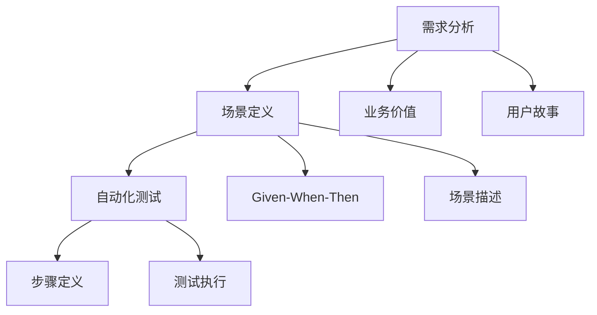

# 行为驱动开发（BDD）

## 📋 概述

行为驱动开发（Behavior-Driven Development, BDD）是一种敏捷软件开发技术，强调通过定义系统行为来驱动开发过程。BDD使用自然语言描述功能需求，促进业务人员、开发者和测试人员之间的协作。

## 🎯 学习目标

- 理解BDD的核心概念和价值
- 掌握Given-When-Then的语法结构
- 学会使用Cucumber和Jest编写BDD测试
- 了解BDD与TDD的区别和联系

## 🔍 BDD核心概念

### BDD的三个层次



### BDD语法结构

```gherkin
Feature: 用户注册
  As a 访客
  I want to 注册账户
  So that I can 使用网站功能

  Scenario: 成功注册新用户
    Given 我是一个新用户
    When 我填写有效的注册信息
    And 我点击注册按钮
    Then 我应该看到注册成功消息
    And 我应该收到确认邮件

  Scenario: 注册时邮箱已存在
    Given 系统中已存在邮箱 "existing@example.com"
    When 我尝试用邮箱 "existing@example.com" 注册
    Then 我应该看到错误消息 "邮箱已存在"
    And 注册应该失败
```

## 🛠 Node.js中的BDD实现

### 使用Cucumber.js

```bash
# 安装Cucumber.js
npm install --save-dev @cucumber/cucumber
npm install --save-dev @cucumber/pretty-formatter
```

```javascript
// cucumber.js - Cucumber配置
module.exports = {
  default: {
    require: [
      'tests/features/step-definitions/**/*.js',
      'tests/features/support/**/*.js'
    ],
    format: [
      'progress-bar',
      'json:tests/reports/cucumber.json'
    ],
    formatOptions: {
      snippetInterface: 'async-await'
    }
  }
};
```

### 功能文件（Feature Files）

```gherkin
# tests/features/user-registration.feature
Feature: 用户注册功能
  As a 网站访客
  I want to 创建新账户
  So that I can 访问受保护的功能

  Background:
    Given 注册页面已加载
    And 数据库是空的

  Scenario: 使用有效信息注册
    Given 我在注册页面
    When 我输入以下信息:
      | 字段     | 值                    |
      | 姓名     | John Doe             |
      | 邮箱     | john@example.com     |
      | 密码     | SecurePassword123    |
      | 确认密码 | SecurePassword123    |
    And 我点击"注册"按钮
    Then 我应该被重定向到仪表板页面
    And 我应该看到欢迎消息 "欢迎, John Doe"
    And 用户 "john@example.com" 应该存在于数据库中

  Scenario Outline: 无效输入验证
    Given 我在注册页面
    When 我输入 "<字段>" 为 "<值>"
    And 我点击"注册"按钮
    Then 我应该看到错误消息 "<错误消息>"
    And 我应该仍在注册页面

    Examples:
      | 字段   | 值              | 错误消息         |
      | 邮箱   |                 | 邮箱不能为空     |
      | 邮箱   | invalid-email   | 邮箱格式无效     |
      | 密码   |                 | 密码不能为空     |
      | 密码   | 123             | 密码至少8个字符  |
      | 姓名   |                 | 姓名不能为空     |
```

### 步骤定义（Step Definitions）

```javascript
// tests/features/step-definitions/user-registration.steps.js
const { Given, When, Then, Before, After } = require('@cucumber/cucumber');
const { expect } = require('@jest/globals');
const request = require('supertest');
const app = require('@/app');
const User = require('@/models/user');

// 测试状态存储
let testContext = {};

Before(async function() {
  // 每个场景前清理
  testContext = {};
  await User.deleteMany({});
});

After(async function() {
  // 每个场景后清理
  testContext = {};
});

// Background步骤
Given('注册页面已加载', async function() {
  // 模拟页面加载
  testContext.pageLoaded = true;
});

Given('数据库是空的', async function() {
  const userCount = await User.countDocuments();
  expect(userCount).toBe(0);
});

// 场景步骤
Given('我在注册页面', function() {
  testContext.currentPage = 'register';
});

Given('系统中已存在邮箱 {string}', async function(email) {
  await User.create({
    name: 'Existing User',
    email: email,
    password: 'hashedPassword'
  });
});

When('我输入以下信息:', function(dataTable) {
  testContext.formData = {};
  const rows = dataTable.hashes();
  
  rows.forEach(row => {
    const field = row['字段'];
    const value = row['值'];
    
    switch(field) {
      case '姓名':
        testContext.formData.name = value;
        break;
      case '邮箱':
        testContext.formData.email = value;
        break;
      case '密码':
        testContext.formData.password = value;
        break;
      case '确认密码':
        testContext.formData.confirmPassword = value;
        break;
    }
  });
});

When('我输入 {string} 为 {string}', function(field, value) {
  if (!testContext.formData) {
    testContext.formData = {};
  }
  
  switch(field) {
    case '邮箱':
      testContext.formData.email = value;
      break;
    case '密码':
      testContext.formData.password = value;
      break;
    case '姓名':
      testContext.formData.name = value;
      break;
  }
});

When('我尝试用邮箱 {string} 注册', function(email) {
  testContext.formData = {
    name: 'Test User',
    email: email,
    password: 'password123'
  };
});

When('我点击{string}按钮', async function(buttonText) {
  if (buttonText === '注册') {
    // 执行注册API调用
    testContext.response = await request(app)
      .post('/api/auth/register')
      .send(testContext.formData);
  }
});

Then('我应该被重定向到仪表板页面', function() {
  expect(testContext.response.status).toBe(201);
  expect(testContext.response.body.redirectUrl).toBe('/dashboard');
});

Then('我应该看到欢迎消息 {string}', function(expectedMessage) {
  expect(testContext.response.body.message).toContain(expectedMessage);
});

Then('用户 {string} 应该存在于数据库中', async function(email) {
  const user = await User.findOne({ email });
  expect(user).toBeTruthy();
  expect(user.email).toBe(email);
});

Then('我应该看到错误消息 {string}', function(expectedError) {
  expect(testContext.response.status).toBeGreaterThanOrEqual(400);
  expect(testContext.response.body.error).toContain(expectedError);
});

Then('我应该仍在注册页面', function() {
  expect(testContext.response.body.redirectUrl).toBeUndefined();
});

Then('注册应该失败', function() {
  expect(testContext.response.status).toBeGreaterThanOrEqual(400);
});
```

### 支持文件

```javascript
// tests/features/support/world.js
const { setWorldConstructor } = require('@cucumber/cucumber');

class CustomWorld {
  constructor() {
    this.context = {};
  }
  
  setContext(key, value) {
    this.context[key] = value;
  }
  
  getContext(key) {
    return this.context[key];
  }
}

setWorldConstructor(CustomWorld);
```

## 🔧 使用Jest进行BDD

### Jest BDD风格测试

```javascript
// tests/bdd/user-management.spec.js
describe('Feature: 用户管理', () => {
  describe('Scenario: 创建新用户', () => {
    let userService;
    let mockUserRepository;
    let result;
    let error;
    
    beforeEach(() => {
      // Given 步骤通常在 beforeEach 中设置
    });
    
    describe('Given 我有有效的用户数据', () => {
      beforeEach(() => {
        // 设置测试数据和模拟
        mockUserRepository = {
          findByEmail: jest.fn(),
          create: jest.fn()
        };
        userService = new UserService(mockUserRepository);
      });
      
      describe('When 我创建用户', () => {
        beforeEach(async () => {
          const userData = {
            name: 'John Doe',
            email: 'john@example.com',
            password: 'securePassword123'
          };
          
          mockUserRepository.findByEmail.mockResolvedValue(null);
          mockUserRepository.create.mockResolvedValue({
            id: '123',
            ...userData,
            createdAt: new Date()
          });
          
          try {
            result = await userService.createUser(userData);
          } catch (err) {
            error = err;
          }
        });
        
        it('Then 用户应该被成功创建', () => {
          expect(error).toBeUndefined();
          expect(result).toEqual(
            expect.objectContaining({
              id: expect.any(String),
              name: 'John Doe',
              email: 'john@example.com'
            })
          );
        });
        
        it('And 应该检查邮箱是否已存在', () => {
          expect(mockUserRepository.findByEmail)
            .toHaveBeenCalledWith('john@example.com');
        });
        
        it('And 应该保存用户到数据库', () => {
          expect(mockUserRepository.create)
            .toHaveBeenCalledWith(
              expect.objectContaining({
                name: 'John Doe',
                email: 'john@example.com'
              })
            );
        });
      });
    });
  });
  
  describe('Scenario: 邮箱已存在的情况', () => {
    let userService;
    let mockUserRepository;
    let error;
    
    describe('Given 系统中已存在邮箱', () => {
      beforeEach(() => {
        mockUserRepository = {
          findByEmail: jest.fn(),
          create: jest.fn()
        };
        userService = new UserService(mockUserRepository);
        
        // 模拟邮箱已存在
        mockUserRepository.findByEmail.mockResolvedValue({
          id: '456',
          email: 'existing@example.com'
        });
      });
      
      describe('When 我尝试用相同邮箱注册', () => {
        beforeEach(async () => {
          const userData = {
            name: 'Another User',
            email: 'existing@example.com',
            password: 'password123'
          };
          
          try {
            await userService.createUser(userData);
          } catch (err) {
            error = err;
          }
        });
        
        it('Then 应该抛出邮箱已存在错误', () => {
          expect(error).toBeDefined();
          expect(error.message).toContain('邮箱已存在');
        });
        
        it('And 不应该创建新用户', () => {
          expect(mockUserRepository.create).not.toHaveBeenCalled();
        });
      });
    });
  });
});
```

### BDD测试工具类

```javascript
// tests/bdd/helpers/bdd-helpers.js
class BDDHelper {
  static describe(description, tests) {
    return describe(`Feature: ${description}`, tests);
  }
  
  static scenario(description, tests) {
    return describe(`Scenario: ${description}`, tests);
  }
  
  static given(description, setup) {
    return describe(`Given ${description}`, setup);
  }
  
  static when(description, action) {
    return describe(`When ${description}`, action);
  }
  
  static then(description, assertion) {
    return it(`Then ${description}`, assertion);
  }
  
  static and(description, assertion) {
    return it(`And ${description}`, assertion);
  }
  
  static but(description, assertion) {
    return it(`But ${description}`, assertion);
  }
}

// 导出BDD风格的函数
module.exports = {
  Feature: BDDHelper.describe,
  Scenario: BDDHelper.scenario,
  Given: BDDHelper.given,
  When: BDDHelper.when,
  Then: BDDHelper.then,
  And: BDDHelper.and,
  But: BDDHelper.but
};
```

```javascript
// 使用BDD助手的测试
const { Feature, Scenario, Given, When, Then, And } = require('./helpers/bdd-helpers');

Feature('订单处理系统', () => {
  Scenario('成功处理订单', () => {
    let orderService;
    let order;
    let result;
    
    Given('我有一个有效的订单', () => {
      beforeEach(() => {
        orderService = new OrderService();
        order = {
          customerId: '123',
          items: [
            { productId: 'p1', quantity: 2, price: 100 },
            { productId: 'p2', quantity: 1, price: 50 }
          ]
        };
      });
    });
    
    When('我处理订单', () => {
      beforeEach(async () => {
        result = await orderService.processOrder(order);
      });
    });
    
    Then('订单应该被成功处理', () => {
      expect(result.status).toBe('processed');
      expect(result.total).toBe(250);
    });
    
    And('应该生成订单号', () => {
      expect(result.orderNumber).toBeDefined();
      expect(result.orderNumber).toMatch(/^ORD-\\d{8}$/);
    });
    
    And('应该计算正确的总价', () => {
      expect(result.total).toBe(250); // (2*100) + (1*50)
    });
  });
});
```

## 📊 BDD测试报告

### 自定义报告生成器

```javascript
// tests/bdd/reporters/bdd-reporter.js
class BDDReporter {
  constructor() {
    this.features = [];
    this.currentFeature = null;
    this.currentScenario = null;
  }
  
  onRunStart() {
    console.log('🚀 开始BDD测试执行');
  }
  
  onTestFileStart(test) {
    this.currentFeature = {
      name: test.path,
      scenarios: [],
      status: 'pending'
    };
  }
  
  onTestStart(test) {
    this.currentScenario = {
      name: test.name,
      steps: [],
      status: 'running',
      startTime: Date.now()
    };
  }
  
  onTestComplete(test, result) {
    this.currentScenario.status = result.status;
    this.currentScenario.duration = Date.now() - this.currentScenario.startTime;
    this.currentScenario.errors = result.errors;
    
    this.currentFeature.scenarios.push(this.currentScenario);
  }
  
  onTestFileComplete(test, result) {
    this.currentFeature.status = result.success ? 'passed' : 'failed';
    this.features.push(this.currentFeature);
  }
  
  onRunComplete() {
    this.generateReport();
  }
  
  generateReport() {
    const report = {
      summary: this.generateSummary(),
      features: this.features,
      timestamp: new Date().toISOString()
    };
    
    // 生成HTML报告
    this.generateHTMLReport(report);
    
    // 生成JSON报告
    this.generateJSONReport(report);
    
    // 控制台输出
    this.printSummary(report.summary);
  }
  
  generateSummary() {
    const totalFeatures = this.features.length;
    const passedFeatures = this.features.filter(f => f.status === 'passed').length;
    const totalScenarios = this.features.reduce((sum, f) => sum + f.scenarios.length, 0);
    const passedScenarios = this.features.reduce((sum, f) => 
      sum + f.scenarios.filter(s => s.status === 'passed').length, 0
    );
    
    return {
      features: {
        total: totalFeatures,
        passed: passedFeatures,
        failed: totalFeatures - passedFeatures
      },
      scenarios: {
        total: totalScenarios,
        passed: passedScenarios,
        failed: totalScenarios - passedScenarios
      },
      passRate: totalScenarios > 0 ? (passedScenarios / totalScenarios * 100).toFixed(2) : 0
    };
  }
  
  printSummary(summary) {
    console.log('\\n📊 BDD测试报告');
    console.log('================');
    console.log(`功能: ${summary.features.passed}/${summary.features.total} 通过`);
    console.log(`场景: ${summary.scenarios.passed}/${summary.scenarios.total} 通过`);
    console.log(`通过率: ${summary.passRate}%`);
    
    if (summary.scenarios.failed > 0) {
      console.log(`\\n❌ 失败的场景:`);
      this.features.forEach(feature => {
        feature.scenarios.filter(s => s.status === 'failed').forEach(scenario => {
          console.log(`  - ${feature.name}: ${scenario.name}`);
        });
      });
    }
  }
}

module.exports = BDDReporter;
```

## 🔄 BDD与TDD的结合

### 由外而内的开发方法

```javascript
// 1. 从BDD场景开始（外层）
describe('Feature: 用户购物流程', () => {
  describe('Scenario: 用户完成购买', () => {
    // BDD层面的集成测试
    it('应该允许用户完成整个购买流程', async () => {
      // Given - 用户有商品在购物车中
      const user = await createTestUser();
      const cart = await addItemsToCart(user.id, testItems);
      
      // When - 用户进行结账
      const order = await checkoutService.processCheckout(user.id, cart.id);
      
      // Then - 订单应该被创建并支付成功
      expect(order.status).toBe('completed');
      expect(order.total).toBe(expectedTotal);
    });
  });
});

// 2. 然后用TDD实现具体组件（内层）
describe('CheckoutService (TDD)', () => {
  // TDD红-绿-重构循环
  it('应该计算订单总价', () => {
    // 红色：写失败测试
    const items = [
      { price: 100, quantity: 2 },
      { price: 50, quantity: 1 }
    ];
    
    const total = checkoutService.calculateTotal(items);
    expect(total).toBe(250);
  });
  
  // 绿色：实现最少代码
  // 重构：改进设计
});
```

### 多层次测试策略

```javascript
// 测试金字塔中的BDD应用
const TestStrategy = {
  BDD_ACCEPTANCE: {
    level: 'E2E/Integration',
    purpose: '验证用户故事和业务需求',
    tools: ['Cucumber', 'Cypress'],
    focus: '业务价值和用户体验'
  },
  
  TDD_UNIT: {
    level: 'Unit',
    purpose: '驱动代码设计和实现',
    tools: ['Jest', 'Mocha'],
    focus: '代码质量和功能正确性'
  },
  
  COMBINED_APPROACH: {
    workflow: [
      '1. 编写BDD场景描述需求',
      '2. 运行BDD测试（红色）',
      '3. 用TDD实现所需组件',
      '4. 运行BDD测试（绿色）',
      '5. 重构和优化'
    ]
  }
};
```

## 📝 BDD最佳实践

### 编写好的场景

```gherkin
# ✅ 好的场景
Scenario: 顾客购买商品
  Given 我是已登录用户
  And 购物车中有商品
  When 我进行结账
  Then 订单应该被创建
  And 我应该收到确认邮件

# ❌ 避免的场景
Scenario: 测试购买功能
  Given 用户登录系统
  When 点击购买按钮
  Then 系统处理订单
  And 数据库更新
  And 发送邮件API被调用
```

### 场景组织原则

```javascript
const BDDBestPractices = {
  SCENARIO_WRITING: {
    DO: [
      '使用业务语言，避免技术术语',
      '专注于行为和结果，不是实现',
      '保持场景简短和专注',
      '使用具体的例子和数据',
      '确保场景是可执行的'
    ],
    DONT: [
      '不要描述UI细节',
      '不要测试多个业务规则',
      '不要使用模糊的语言',
      '不要包含实现细节',
      '不要编写过于复杂的场景'
    ]
  },
  
  STEP_DEFINITIONS: {
    DO: [
      '保持步骤定义简单',
      '使用参数化提高重用性',
      '实现幂等的Given步骤',
      '确保When步骤触发行为',
      '在Then步骤中进行断言'
    ],
    DONT: [
      '不要在步骤间共享状态',
      '不要在Given中包含断言',
      '不要让步骤定义过于复杂',
      '不要忽略错误处理',
      '不要硬编码测试数据'
    ]
  }
};
```

## 📝 总结

BDD为Node.js开发提供了以行为为中心的开发方法：

- **需求驱动**：从业务需求和用户故事开始
- **协作促进**：使用自然语言促进团队沟通
- **活文档**：可执行的规格说明文档
- **质量保证**：确保开发符合业务期望
- **TDD集成**：与TDD结合实现全面质量保证

BDD特别适用于需要业务人员深度参与的项目，有助于确保交付的软件真正满足用户需求。

## 🔗 相关资源

- [Cucumber.js官方文档](https://cucumber.io/docs/cucumber/)
- [BDD基础教程](https://cucumber.io/docs/bdd/)
- [Gherkin语法指南](https://cucumber.io/docs/gherkin/)
- [BDD最佳实践](https://automationpanda.com/bdd/)
