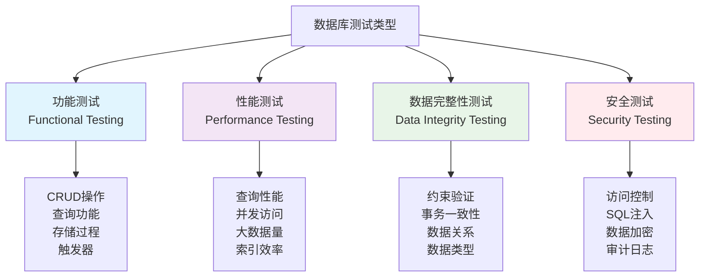

# 数据库测试

## 📋 概述

数据库测试是验证数据持久化层功能、性能和数据完整性的关键测试环节。在Node.js应用中，数据库测试确保数据访问层（DAL）、ORM操作、事务处理、数据迁移等功能正确无误，是构建可靠数据驱动应用的基础。

## 🎯 学习目标

- 理解数据库测试的核心概念和策略
- 掌握不同类型数据库的测试方法
- 学会设计数据库测试环境和数据管理
- 了解数据库性能测试和优化验证

## 🗄️ 数据库测试类型

### 数据库测试分类



### 测试层级策略

```javascript
const DatabaseTestingStrategy = {
  UNIT_LEVEL: {
    scope: '单个数据访问方法',
    focus: [
      '单一表的CRUD操作',
      '简单查询逻辑验证',
      '数据映射正确性',
      '参数绑定安全性'
    ],
    tools: ['Jest', 'Mocha', 'In-memory DB'],
    characteristics: [
      '快速执行',
      '隔离测试',
      '模拟数据',
      '专注单一功能'
    ]
  },
  
  INTEGRATION_LEVEL: {
    scope: '数据访问层与业务逻辑集成',
    focus: [
      '多表联合查询',
      '事务边界验证',
      '数据一致性检查',
      '外键约束验证'
    ],
    tools: ['Test Containers', 'Database Fixtures', 'Migration Scripts'],
    characteristics: [
      '真实数据库环境',
      '完整数据流验证',
      '业务场景覆盖',
      '环境接近生产'
    ]
  },
  
  SYSTEM_LEVEL: {
    scope: '完整系统的数据库交互',
    focus: [
      '端到端数据流',
      '并发数据访问',
      '大数据量处理',
      '备份恢复验证'
    ],
    tools: ['Load Testing Tools', 'Monitoring Solutions', 'Backup Tools'],
    characteristics: [
      '生产环境模拟',
      '性能基准验证',
      '容灾能力测试',
      '运维场景覆盖'
    ]
  }
};
```

## 🛠 数据库测试环境设置

### 多数据库测试配置

```javascript
// database-test-manager.js
const { Pool } = require('pg');
const mongoose = require('mongoose');
const { MongoMemoryServer } = require('mongodb-memory-server');
const mysql = require('mysql2/promise');
const redis = require('redis');

class DatabaseTestManager {
  constructor() {
    this.connections = new Map();
    this.testDatabases = [];
    this.mongoServer = null;
    this.redisClient = null;
  }
  
  // PostgreSQL测试环境
  async setupPostgreSQL(config = {}) {
    const defaultConfig = {
      user: process.env.TEST_PG_USER || 'test_user',
      host: process.env.TEST_PG_HOST || 'localhost',
      password: process.env.TEST_PG_PASSWORD || 'test_password',
      port: process.env.TEST_PG_PORT || 5432,
      database: `test_db_${Date.now()}_${Math.random().toString(36).substr(2, 9)}`
    };
    
    const testConfig = { ...defaultConfig, ...config };
    
    // 创建测试数据库
    const adminPool = new Pool({
      ...testConfig,
      database: 'postgres'
    });
    
    try {
      await adminPool.query(`CREATE DATABASE "${testConfig.database}"`);
      console.log(`✅ PostgreSQL test database created: ${testConfig.database}`);
    } catch (error) {
      console.warn('⚠️  PostgreSQL database creation warning:', error.message);
    } finally {
      await adminPool.end();
    }
    
    // 连接到测试数据库
    const testPool = new Pool(testConfig);
    this.connections.set('postgresql', testPool);
    
    this.testDatabases.push({
      type: 'postgresql',
      name: testConfig.database,
      connection: testPool,
      config: testConfig
    });
    
    // 初始化数据库结构
    await this.initializePostgreSQLSchema(testPool);
    
    return testPool;
  }
  
  // MySQL测试环境
  async setupMySQL(config = {}) {
    const defaultConfig = {
      host: process.env.TEST_MYSQL_HOST || 'localhost',
      user: process.env.TEST_MYSQL_USER || 'test_user',
      password: process.env.TEST_MYSQL_PASSWORD || 'test_password',
      port: process.env.TEST_MYSQL_PORT || 3306,
      database: `test_db_${Date.now()}_${Math.random().toString(36).substr(2, 9)}`
    };
    
    const testConfig = { ...defaultConfig, ...config };
    
    // 创建测试数据库
    const adminConnection = await mysql.createConnection({
      ...testConfig,
      database: undefined
    });
    
    try {
      await adminConnection.execute(`CREATE DATABASE \`${testConfig.database}\``);
      console.log(`✅ MySQL test database created: ${testConfig.database}`);
    } catch (error) {
      console.warn('⚠️  MySQL database creation warning:', error.message);
    } finally {
      await adminConnection.end();
    }
    
    // 连接到测试数据库
    const testConnection = await mysql.createConnection(testConfig);
    this.connections.set('mysql', testConnection);
    
    this.testDatabases.push({
      type: 'mysql',
      name: testConfig.database,
      connection: testConnection,
      config: testConfig
    });
    
    // 初始化数据库结构
    await this.initializeMySQLSchema(testConnection);
    
    return testConnection;
  }
  
  // MongoDB测试环境
  async setupMongoDB(config = {}) {
    const defaultConfig = {
      dbName: `test_db_${Date.now()}_${Math.random().toString(36).substr(2, 9)}`,
      storageEngine: 'wiredTiger'
    };
    
    const testConfig = { ...defaultConfig, ...config };
    
    // 启动内存MongoDB服务器
    this.mongoServer = await MongoMemoryServer.create({
      instance: {
        dbName: testConfig.dbName,
        storageEngine: testConfig.storageEngine
      }
    });
    
    const mongoUri = this.mongoServer.getUri();
    
    // 连接到MongoDB
    const connection = await mongoose.createConnection(mongoUri);
    this.connections.set('mongodb', connection);
    
    this.testDatabases.push({
      type: 'mongodb',
      uri: mongoUri,
      connection: connection,
      server: this.mongoServer
    });
    
    // 初始化MongoDB集合和索引
    await this.initializeMongoDBSchema(connection);
    
    console.log(`✅ MongoDB test server started: ${mongoUri}`);
    return connection;
  }
  
  // Redis测试环境
  async setupRedis(config = {}) {
    const defaultConfig = {
      host: process.env.TEST_REDIS_HOST || 'localhost',
      port: process.env.TEST_REDIS_PORT || 6379,
      db: Math.floor(Math.random() * 15) + 1 // 使用随机数据库编号
    };
    
    const testConfig = { ...defaultConfig, ...config };
    
    this.redisClient = redis.createClient(testConfig);
    await this.redisClient.connect();
    
    this.connections.set('redis', this.redisClient);
    
    this.testDatabases.push({
      type: 'redis',
      client: this.redisClient,
      config: testConfig
    });
    
    console.log(`✅ Redis test connection established: db${testConfig.db}`);
    return this.redisClient;
  }
  
  // PostgreSQL架构初始化
  async initializePostgreSQLSchema(pool) {
    const schemas = [
      // 用户表
      `
        CREATE TABLE IF NOT EXISTS users (
          id SERIAL PRIMARY KEY,
          username VARCHAR(50) UNIQUE NOT NULL,
          email VARCHAR(100) UNIQUE NOT NULL,
          password_hash VARCHAR(255) NOT NULL,
          first_name VARCHAR(50),
          last_name VARCHAR(50),
          date_of_birth DATE,
          is_active BOOLEAN DEFAULT true,
          created_at TIMESTAMP WITH TIME ZONE DEFAULT CURRENT_TIMESTAMP,
          updated_at TIMESTAMP WITH TIME ZONE DEFAULT CURRENT_TIMESTAMP
        )
      `,
      
      // 分类表
      `
        CREATE TABLE IF NOT EXISTS categories (
          id SERIAL PRIMARY KEY,
          name VARCHAR(100) NOT NULL,
          description TEXT,
          parent_id INTEGER REFERENCES categories(id),
          is_active BOOLEAN DEFAULT true,
          created_at TIMESTAMP WITH TIME ZONE DEFAULT CURRENT_TIMESTAMP
        )
      `,
      
      // 产品表
      `
        CREATE TABLE IF NOT EXISTS products (
          id SERIAL PRIMARY KEY,
          name VARCHAR(200) NOT NULL,
          description TEXT,
          price DECIMAL(10,2) NOT NULL CHECK (price >= 0),
          category_id INTEGER REFERENCES categories(id),
          stock_quantity INTEGER DEFAULT 0 CHECK (stock_quantity >= 0),
          sku VARCHAR(50) UNIQUE,
          is_available BOOLEAN DEFAULT true,
          created_at TIMESTAMP WITH TIME ZONE DEFAULT CURRENT_TIMESTAMP,
          updated_at TIMESTAMP WITH TIME ZONE DEFAULT CURRENT_TIMESTAMP
        )
      `,
      
      // 订单表
      `
        CREATE TABLE IF NOT EXISTS orders (
          id SERIAL PRIMARY KEY,
          user_id INTEGER NOT NULL REFERENCES users(id),
          order_number VARCHAR(50) UNIQUE NOT NULL,
          status VARCHAR(20) DEFAULT 'pending' CHECK (status IN ('pending', 'confirmed', 'processing', 'shipped', 'delivered', 'cancelled')),
          total_amount DECIMAL(10,2) NOT NULL CHECK (total_amount >= 0),
          shipping_address JSONB,
          billing_address JSONB,
          created_at TIMESTAMP WITH TIME ZONE DEFAULT CURRENT_TIMESTAMP,
          updated_at TIMESTAMP WITH TIME ZONE DEFAULT CURRENT_TIMESTAMP
        )
      `,
      
      // 订单项表
      `
        CREATE TABLE IF NOT EXISTS order_items (
          id SERIAL PRIMARY KEY,
          order_id INTEGER NOT NULL REFERENCES orders(id) ON DELETE CASCADE,
          product_id INTEGER NOT NULL REFERENCES products(id),
          quantity INTEGER NOT NULL CHECK (quantity > 0),
          unit_price DECIMAL(10,2) NOT NULL CHECK (unit_price >= 0),
          total_price DECIMAL(10,2) GENERATED ALWAYS AS (quantity * unit_price) STORED,
          created_at TIMESTAMP WITH TIME ZONE DEFAULT CURRENT_TIMESTAMP
        )
      `,
      
      // 创建索引
      `
        CREATE INDEX IF NOT EXISTS idx_users_email ON users(email);
        CREATE INDEX IF NOT EXISTS idx_users_username ON users(username);
        CREATE INDEX IF NOT EXISTS idx_users_active ON users(is_active);
        CREATE INDEX IF NOT EXISTS idx_products_category ON products(category_id);
        CREATE INDEX IF NOT EXISTS idx_products_sku ON products(sku);
        CREATE INDEX IF NOT EXISTS idx_products_available ON products(is_available);
        CREATE INDEX IF NOT EXISTS idx_orders_user ON orders(user_id);
        CREATE INDEX IF NOT EXISTS idx_orders_status ON orders(status);
        CREATE INDEX IF NOT EXISTS idx_orders_created ON orders(created_at);
        CREATE INDEX IF NOT EXISTS idx_order_items_order ON order_items(order_id);
        CREATE INDEX IF NOT EXISTS idx_order_items_product ON order_items(product_id);
      `,
      
      // 创建触发器更新updated_at字段
      `
        CREATE OR REPLACE FUNCTION update_updated_at_column()
        RETURNS TRIGGER AS $$
        BEGIN
          NEW.updated_at = CURRENT_TIMESTAMP;
          RETURN NEW;
        END;
        $$ language 'plpgsql';
        
        DROP TRIGGER IF EXISTS update_users_updated_at ON users;
        CREATE TRIGGER update_users_updated_at
          BEFORE UPDATE ON users
          FOR EACH ROW
          EXECUTE FUNCTION update_updated_at_column();
          
        DROP TRIGGER IF EXISTS update_products_updated_at ON products;
        CREATE TRIGGER update_products_updated_at
          BEFORE UPDATE ON products
          FOR EACH ROW
          EXECUTE FUNCTION update_updated_at_column();
          
        DROP TRIGGER IF EXISTS update_orders_updated_at ON orders;
        CREATE TRIGGER update_orders_updated_at
          BEFORE UPDATE ON orders
          FOR EACH ROW
          EXECUTE FUNCTION update_updated_at_column();
      `
    ];
    
    for (const schema of schemas) {
      try {
        await pool.query(schema);
      } catch (error) {
        console.warn('Schema creation warning:', error.message);
      }
    }
    
    console.log('✅ PostgreSQL schema initialized');
  }
  
  // MySQL架构初始化
  async initializeMySQLSchema(connection) {
    const schemas = [
      `
        CREATE TABLE IF NOT EXISTS users (
          id INT AUTO_INCREMENT PRIMARY KEY,
          username VARCHAR(50) UNIQUE NOT NULL,
          email VARCHAR(100) UNIQUE NOT NULL,
          password_hash VARCHAR(255) NOT NULL,
          first_name VARCHAR(50),
          last_name VARCHAR(50),
          date_of_birth DATE,
          is_active BOOLEAN DEFAULT true,
          created_at TIMESTAMP DEFAULT CURRENT_TIMESTAMP,
          updated_at TIMESTAMP DEFAULT CURRENT_TIMESTAMP ON UPDATE CURRENT_TIMESTAMP
        )
      `,
      
      `
        CREATE TABLE IF NOT EXISTS categories (
          id INT AUTO_INCREMENT PRIMARY KEY,
          name VARCHAR(100) NOT NULL,
          description TEXT,
          parent_id INT,
          is_active BOOLEAN DEFAULT true,
          created_at TIMESTAMP DEFAULT CURRENT_TIMESTAMP,
          FOREIGN KEY (parent_id) REFERENCES categories(id)
        )
      `,
      
      `
        CREATE TABLE IF NOT EXISTS products (
          id INT AUTO_INCREMENT PRIMARY KEY,
          name VARCHAR(200) NOT NULL,
          description TEXT,
          price DECIMAL(10,2) NOT NULL CHECK (price >= 0),
          category_id INT,
          stock_quantity INT DEFAULT 0 CHECK (stock_quantity >= 0),
          sku VARCHAR(50) UNIQUE,
          is_available BOOLEAN DEFAULT true,
          created_at TIMESTAMP DEFAULT CURRENT_TIMESTAMP,
          updated_at TIMESTAMP DEFAULT CURRENT_TIMESTAMP ON UPDATE CURRENT_TIMESTAMP,
          FOREIGN KEY (category_id) REFERENCES categories(id)
        )
      `,
      
      `
        CREATE INDEX idx_users_email ON users(email);
        CREATE INDEX idx_products_category ON products(category_id);
        CREATE INDEX idx_products_sku ON products(sku);
      `
    ];
    
    for (const schema of schemas) {
      try {
        await connection.execute(schema);
      } catch (error) {
        console.warn('MySQL schema creation warning:', error.message);
      }
    }
    
    console.log('✅ MySQL schema initialized');
  }
  
  // MongoDB架构初始化
  async initializeMongoDBSchema(connection) {
    // 定义用户模式
    const userSchema = new mongoose.Schema({
      username: { type: String, required: true, unique: true },
      email: { type: String, required: true, unique: true },
      passwordHash: { type: String, required: true },
      firstName: String,
      lastName: String,
      dateOfBirth: Date,
      isActive: { type: Boolean, default: true },
      profile: {
        avatar: String,
        bio: String,
        preferences: mongoose.Schema.Types.Mixed
      }
    }, {
      timestamps: true,
      collection: 'users'
    });
    
    // 产品模式
    const productSchema = new mongoose.Schema({
      name: { type: String, required: true },
      description: String,
      price: { type: Number, required: true, min: 0 },
      category: { type: mongoose.Schema.Types.ObjectId, ref: 'Category' },
      stockQuantity: { type: Number, default: 0, min: 0 },
      sku: { type: String, unique: true, sparse: true },
      isAvailable: { type: Boolean, default: true },
      attributes: [{ 
        name: String, 
        value: mongoose.Schema.Types.Mixed 
      }],
      tags: [String]
    }, {
      timestamps: true,
      collection: 'products'
    });
    
    // 订单模式
    const orderSchema = new mongoose.Schema({
      orderNumber: { type: String, required: true, unique: true },
      user: { type: mongoose.Schema.Types.ObjectId, ref: 'User', required: true },
      items: [{
        product: { type: mongoose.Schema.Types.ObjectId, ref: 'Product', required: true },
        quantity: { type: Number, required: true, min: 1 },
        unitPrice: { type: Number, required: true, min: 0 }
      }],
      status: {
        type: String,
        enum: ['pending', 'confirmed', 'processing', 'shipped', 'delivered', 'cancelled'],
        default: 'pending'
      },
      totalAmount: { type: Number, required: true, min: 0 },
      shippingAddress: {
        street: String,
        city: String,
        state: String,
        zipCode: String,
        country: String
      },
      paymentInfo: {
        method: String,
        transactionId: String,
        paidAt: Date
      }
    }, {
      timestamps: true,
      collection: 'orders'
    });
    
    // 创建模型
    const User = connection.model('User', userSchema);
    const Product = connection.model('Product', productSchema);
    const Order = connection.model('Order', orderSchema);
    
    // 创建索引
    await User.createIndexes();
    await Product.createIndexes();
    await Order.createIndexes();
    
    // 创建额外索引
    await Product.collection.createIndex({ name: 'text', description: 'text' });
    await Order.collection.createIndex({ 'user': 1, 'createdAt': -1 });
    await Order.collection.createIndex({ 'status': 1, 'createdAt': -1 });
    
    console.log('✅ MongoDB schema and indexes initialized');
  }
  
  // 插入测试数据
  async seedTestData(databaseType) {
    const connection = this.connections.get(databaseType);
    
    switch (databaseType) {
      case 'postgresql':
        await this.seedPostgreSQLData(connection);
        break;
      case 'mysql':
        await this.seedMySQLData(connection);
        break;
      case 'mongodb':
        await this.seedMongoDBData(connection);
        break;
      case 'redis':
        await this.seedRedisData(connection);
        break;
    }
  }
  
  async seedPostgreSQLData(pool) {
    // 插入分类数据
    await pool.query(`
      INSERT INTO categories (name, description) VALUES
      ('Electronics', 'Electronic devices and gadgets'),
      ('Books', 'Physical and digital books'),
      ('Clothing', 'Apparel and accessories')
      ON CONFLICT DO NOTHING
    `);
    
    // 插入用户数据
    await pool.query(`
      INSERT INTO users (username, email, password_hash, first_name, last_name) VALUES
      ('john_doe', 'john@test.com', '$2b$10$hash1', 'John', 'Doe'),
      ('jane_smith', 'jane@test.com', '$2b$10$hash2', 'Jane', 'Smith'),
      ('bob_wilson', 'bob@test.com', '$2b$10$hash3', 'Bob', 'Wilson')
      ON CONFLICT DO NOTHING
    `);
    
    // 插入产品数据
    await pool.query(`
      INSERT INTO products (name, description, price, category_id, stock_quantity, sku) VALUES
      ('Laptop Pro', 'High-performance laptop', 1299.99, 1, 10, 'LP001'),
      ('Programming Book', 'Learn Node.js', 49.99, 2, 25, 'PB001'),
      ('T-Shirt', 'Cotton t-shirt', 19.99, 3, 50, 'TS001')
      ON CONFLICT (sku) DO NOTHING
    `);
    
    console.log('✅ PostgreSQL test data seeded');
  }
  
  async seedMySQLData(connection) {
    // 插入测试数据的MySQL版本
    await connection.execute(`
      INSERT IGNORE INTO categories (name, description) VALUES
      ('Electronics', 'Electronic devices and gadgets'),
      ('Books', 'Physical and digital books'),
      ('Clothing', 'Apparel and accessories')
    `);
    
    await connection.execute(`
      INSERT IGNORE INTO users (username, email, password_hash, first_name, last_name) VALUES
      ('john_doe', 'john@test.com', '$2b$10$hash1', 'John', 'Doe'),
      ('jane_smith', 'jane@test.com', '$2b$10$hash2', 'Jane', 'Smith'),
      ('bob_wilson', 'bob@test.com', '$2b$10$hash3', 'Bob', 'Wilson')
    `);
    
    console.log('✅ MySQL test data seeded');
  }
  
  async seedMongoDBData(connection) {
    const User = connection.model('User');
    const Product = connection.model('Product');
    
    // 插入测试用户
    await User.insertMany([
      {
        username: 'john_doe',
        email: 'john@test.com',
        passwordHash: '$2b$10$hash1',
        firstName: 'John',
        lastName: 'Doe'
      },
      {
        username: 'jane_smith',
        email: 'jane@test.com',
        passwordHash: '$2b$10$hash2',
        firstName: 'Jane',
        lastName: 'Smith'
      }
    ]);
    
    // 插入测试产品
    await Product.insertMany([
      {
        name: 'Laptop Pro',
        description: 'High-performance laptop',
        price: 1299.99,
        stockQuantity: 10,
        sku: 'LP001'
      },
      {
        name: 'Programming Book',
        description: 'Learn Node.js',
        price: 49.99,
        stockQuantity: 25,
        sku: 'PB001'
      }
    ]);
    
    console.log('✅ MongoDB test data seeded');
  }
  
  async seedRedisData(client) {
    // 设置测试缓存数据
    await client.set('user:1', JSON.stringify({
      id: 1,
      username: 'john_doe',
      email: 'john@test.com'
    }));
    
    await client.set('product:1', JSON.stringify({
      id: 1,
      name: 'Laptop Pro',
      price: 1299.99
    }));
    
    // 设置测试计数器
    await client.set('visit_count', '100');
    
    // 设置测试列表
    await client.lpush('recent_orders', '1001', '1002', '1003');
    
    console.log('✅ Redis test data seeded');
  }
  
  // 清理测试数据
  async cleanupTestData(databaseType) {
    const connection = this.connections.get(databaseType);
    
    switch (databaseType) {
      case 'postgresql':
        await this.cleanupPostgreSQLData(connection);
        break;
      case 'mysql':
        await this.cleanupMySQLData(connection);
        break;
      case 'mongodb':
        await this.cleanupMongoDBData(connection);
        break;
      case 'redis':
        await this.cleanupRedisData(connection);
        break;
    }
  }
  
  async cleanupPostgreSQLData(pool) {
    const tables = ['order_items', 'orders', 'products', 'categories', 'users'];
    
    for (const table of tables) {
      await pool.query(`TRUNCATE TABLE ${table} RESTART IDENTITY CASCADE`);
    }
    
    console.log('✅ PostgreSQL test data cleaned');
  }
  
  async cleanupMySQLData(connection) {
    await connection.execute('SET FOREIGN_KEY_CHECKS = 0');
    
    const tables = ['products', 'categories', 'users'];
    for (const table of tables) {
      await connection.execute(`TRUNCATE TABLE ${table}`);
    }
    
    await connection.execute('SET FOREIGN_KEY_CHECKS = 1');
    
    console.log('✅ MySQL test data cleaned');
  }
  
  async cleanupMongoDBData(connection) {
    const collections = await connection.db.collections();
    
    for (const collection of collections) {
      await collection.deleteMany({});
    }
    
    console.log('✅ MongoDB test data cleaned');
  }
  
  async cleanupRedisData(client) {
    await client.flushDb();
    console.log('✅ Redis test data cleaned');
  }
  
  // 关闭所有连接
  async cleanup() {
    for (const [type, connection] of this.connections) {
      try {
        switch (type) {
          case 'postgresql':
            await connection.end();
            break;
          case 'mysql':
            await connection.end();
            break;
          case 'mongodb':
            await connection.close();
            break;
          case 'redis':
            await connection.quit();
            break;
        }
        console.log(`✅ ${type} connection closed`);
      } catch (error) {
        console.warn(`⚠️  Error closing ${type} connection:`, error.message);
      }
    }
    
    // 停止MongoDB内存服务器
    if (this.mongoServer) {
      await this.mongoServer.stop();
      console.log('✅ MongoDB memory server stopped');
    }
    
    // 清理测试数据库
    for (const db of this.testDatabases) {
      if (db.type === 'postgresql' || db.type === 'mysql') {
        try {
          // 这里可以添加删除测试数据库的逻辑
          console.log(`✅ Test database cleanup: ${db.name}`);
        } catch (error) {
          console.warn(`⚠️  Error cleaning up database ${db.name}:`, error.message);
        }
      }
    }
    
    this.connections.clear();
    this.testDatabases = [];
  }
}

module.exports = DatabaseTestManager;
```

## 📝 数据库测试最佳实践

### 测试数据管理策略

```javascript
const DatabaseTestBestPractices = {
  TEST_DATA_STRATEGY: {
    isolation: [
      '每个测试使用独立的数据集',
      '避免测试间的数据污染',
      '使用事务回滚恢复状态',
      '并行测试的数据隔离'
    ],
    
    generation: [
      '使用工厂模式生成测试数据',
      '建立数据的层次关系',
      '支持复杂业务场景',
      '确保数据的一致性'
    ],
    
    lifecycle: [
      '测试前准备基础数据',
      '测试中创建特定数据',
      '测试后清理临时数据',
      '批量操作提高效率'
    ]
  },
  
  PERFORMANCE_CONSIDERATIONS: {
    execution: [
      '使用内存数据库加速测试',
      '并行执行独立测试',
      '优化数据库连接管理',
      '减少不必要的数据操作'
    ],
    
    monitoring: [
      '监控测试执行时间',
      '分析慢查询',
      '检测资源泄漏',
      '优化测试数据量'
    ]
  },
  
  RELIABILITY_PRACTICES: {
    stability: [
      '确保测试的可重复性',
      '处理并发访问冲突',
      '验证数据完整性',
      '测试异常恢复能力'
    ],
    
    maintenance: [
      '定期更新测试数据',
      '保持架构同步',
      '文档化测试场景',
      '监控测试覆盖率'
    ]
  }
};
```

## 📝 总结

数据库测试是确保数据层可靠性的关键环节：

- **全面覆盖**：功能、性能、完整性、安全性测试
- **环境管理**：多数据库支持、自动化环境配置
- **数据策略**：隔离、生成、清理的完整生命周期
- **性能优化**：内存数据库、并行执行、资源管理

通过系统化的数据库测试，可以确保数据访问层的正确性和可靠性，为应用提供稳固的数据基础。

## 🔗 相关资源

- [MongoDB Memory Server](https://github.com/nodkz/mongodb-memory-server)
- [Testcontainers Node.js](https://github.com/testcontainers/testcontainers-node)
- [Database Testing Best Practices](https://www.softwaretestinghelp.com/database-testing/)
- [SQL Test Data Management](https://databaserefactoring.com/)
