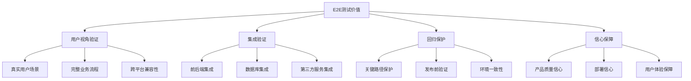

# E2E测试基础

## 📋 概述

端到端测试（End-to-End Testing，E2E）是从用户角度验证整个应用程序工作流程的测试方法。它模拟真实用户与应用程序的交互，验证从前端到后端的完整数据流，确保所有组件协同工作正常。

## 🎯 学习目标

- 理解E2E测试的核心概念和价值
- 掌握E2E测试的设计原则和策略
- 学会编写稳定可靠的E2E测试
- 了解E2E测试的工具选择和最佳实践

## 🔍 E2E测试特点

### E2E测试价值



### E2E测试特征

```javascript
const E2ECharacteristics = {
  SCOPE: {
    coverage: '完整应用栈',
    perspective: '用户视角',
    environment: '接近生产环境',
    dataFlow: '端到端数据流'
  },
  
  BENEFITS: {
    realWorldValidation: '真实世界验证',
    integrationTesting: '完整集成测试',
    userExperienceValidation: '用户体验验证',
    regressionPrevention: '回归问题预防'
  },
  
  CHALLENGES: {
    executionSpeed: '执行速度慢',
    maintenance: '维护成本高',
    flakiness: '测试不稳定性',
    complexity: '环境复杂性',
    debugging: '调试困难'
  },
  
  TRADEOFFS: {
    confidence: 'HIGH',
    speed: 'LOW',
    cost: 'HIGH',
    maintenance: 'HIGH',
    isolation: 'LOW'
  }
};
```

## 🏗️ E2E测试架构

### 测试架构模式

```javascript
// E2E测试架构设计
class E2ETestArchitecture {
  constructor() {
    this.layers = {
      testRunner: '测试运行器层',
      pageObjects: '页面对象层',
      testData: '测试数据层',
      utilities: '工具函数层',
      reporting: '报告生成层'
    };
  }
  
  // 页面对象模式
  getPageObjectStructure() {
    return {
      pages: {
        basePage: '基础页面类',
        loginPage: '登录页面',
        dashboardPage: '仪表板页面',
        userProfilePage: '用户资料页面'
      },
      
      components: {
        navigation: '导航组件',
        modal: '模态框组件',
        form: '表单组件',
        table: '表格组件'
      },
      
      flows: {
        authFlow: '认证流程',
        userManagementFlow: '用户管理流程',
        orderFlow: '订单流程'
      }
    };
  }
  
  // 数据管理策略
  getDataManagementStrategy() {
    return {
      testData: {
        fixtures: '固定测试数据',
        factories: '动态数据生成',
        seeds: '数据库种子数据'
      },
      
      dataIsolation: {
        beforeEach: '每个测试前清理',
        testContainers: '容器化隔离',
        namespacing: '命名空间隔离'
      },
      
      stateManagement: {
        setup: '测试前状态设置',
        cleanup: '测试后状态清理',
        reset: '状态重置机制'
      }
    };
  }
}
```

### 环境配置

```javascript
// e2e.config.js
module.exports = {
  // 基础配置
  baseUrl: process.env.E2E_BASE_URL || 'http://localhost:3000',
  
  // 浏览器配置
  browser: {
    name: process.env.BROWSER || 'chromium',
    headless: process.env.HEADLESS !== 'false',
    viewport: { width: 1280, height: 720 },
    timeout: 30000
  },
  
  // 测试配置
  testDir: './tests/e2e',
  testMatch: '**/*.e2e.{js,ts}',
  testTimeout: 60000,
  
  // 重试配置
  retries: process.env.CI ? 2 : 0,
  
  // 并行配置
  workers: process.env.CI ? 1 : undefined,
  
  // 报告配置
  reporter: [
    ['html', { outputFolder: 'e2e-reports' }],
    ['json', { outputFile: 'e2e-results.json' }],
    ['junit', { outputFile: 'e2e-results.xml' }]
  ],
  
  // 环境变量
  use: {
    screenshot: 'only-on-failure',
    video: 'retain-on-failure',
    trace: 'retain-on-failure'
  },
  
  // 项目配置
  projects: [
    {
      name: 'chromium',
      use: { ...devices['Desktop Chrome'] }
    },
    {
      name: 'firefox',
      use: { ...devices['Desktop Firefox'] }
    },
    {
      name: 'webkit',
      use: { ...devices['Desktop Safari'] }
    },
    {
      name: 'mobile',
      use: { ...devices['iPhone 12'] }
    }
  ],
  
  // 全局设置
  globalSetup: './tests/e2e/global-setup.js',
  globalTeardown: './tests/e2e/global-teardown.js'
};
```

## 📄 页面对象模式

### 基础页面类

```javascript
// pages/base-page.js
class BasePage {
  constructor(page) {
    this.page = page;
    this.timeout = 30000;
  }
  
  // 基础等待方法
  async waitForElement(selector, options = {}) {
    return await this.page.waitForSelector(selector, {
      timeout: this.timeout,
      ...options
    });
  }
  
  async waitForUrl(url, options = {}) {
    return await this.page.waitForURL(url, {
      timeout: this.timeout,
      ...options
    });
  }
  
  async waitForResponse(urlPattern) {
    return await this.page.waitForResponse(urlPattern);
  }
  
  // 基础交互方法
  async click(selector, options = {}) {
    await this.waitForElement(selector);
    return await this.page.click(selector, options);
  }
  
  async fill(selector, value, options = {}) {
    await this.waitForElement(selector);
    await this.page.fill(selector, '', options); // 清空
    return await this.page.fill(selector, value, options);
  }
  
  async selectOption(selector, value) {
    await this.waitForElement(selector);
    return await this.page.selectOption(selector, value);
  }
  
  // 信息获取方法
  async getText(selector) {
    await this.waitForElement(selector);
    return await this.page.textContent(selector);
  }
  
  async getValue(selector) {
    await this.waitForElement(selector);
    return await this.page.inputValue(selector);
  }
  
  async isVisible(selector) {
    try {
      await this.waitForElement(selector, { timeout: 5000 });
      return await this.page.isVisible(selector);
    } catch {
      return false;
    }
  }
  
  async isEnabled(selector) {
    await this.waitForElement(selector);
    return await this.page.isEnabled(selector);
  }
  
  // 导航方法
  async navigate(url) {
    return await this.page.goto(url);
  }
  
  async reload() {
    return await this.page.reload();
  }
  
  async goBack() {
    return await this.page.goBack();
  }
  
  // 等待和验证方法
  async waitForNetworkIdle() {
    return await this.page.waitForLoadState('networkidle');
  }
  
  async screenshot(options = {}) {
    return await this.page.screenshot({
      fullPage: true,
      ...options
    });
  }
  
  // 错误处理
  async handleDialog(accept = true, promptText = '') {
    this.page.on('dialog', async dialog => {
      if (accept) {
        await dialog.accept(promptText);
      } else {
        await dialog.dismiss();
      }
    });
  }
  
  // 文件操作
  async uploadFile(selector, filePath) {
    await this.waitForElement(selector);
    return await this.page.setInputFiles(selector, filePath);
  }
  
  async downloadFile(selector) {
    const [download] = await Promise.all([
      this.page.waitForEvent('download'),
      this.page.click(selector)
    ]);
    return download;
  }
}

module.exports = BasePage;
```

### 具体页面实现

```javascript
// pages/login-page.js
const BasePage = require('./base-page');

class LoginPage extends BasePage {
  constructor(page) {
    super(page);
    
    // 元素选择器
    this.selectors = {
      emailInput: '[data-testid="email-input"]',
      passwordInput: '[data-testid="password-input"]',
      loginButton: '[data-testid="login-button"]',
      errorMessage: '[data-testid="error-message"]',
      forgotPasswordLink: '[data-testid="forgot-password-link"]',
      registerLink: '[data-testid="register-link"]',
      rememberMeCheckbox: '[data-testid="remember-me"]',
      showPasswordButton: '[data-testid="show-password"]'
    };
    
    // 页面URL
    this.url = '/login';
  }
  
  // 导航到登录页面
  async goto() {
    await this.navigate(this.url);
    await this.waitForElement(this.selectors.loginButton);
  }
  
  // 填写登录表单
  async fillLoginForm(email, password) {
    await this.fill(this.selectors.emailInput, email);
    await this.fill(this.selectors.passwordInput, password);
  }
  
  // 执行登录
  async login(email, password) {
    await this.fillLoginForm(email, password);
    await this.click(this.selectors.loginButton);
    
    // 等待登录完成（URL变化或特定元素出现）
    await Promise.race([
      this.waitForUrl('/dashboard'),
      this.waitForElement(this.selectors.errorMessage)
    ]);
  }
  
  // 快速登录（有效凭据）
  async quickLogin(email = 'test@example.com', password = 'password123') {
    await this.goto();
    await this.login(email, password);
  }
  
  // 获取错误消息
  async getErrorMessage() {
    try {
      return await this.getText(this.selectors.errorMessage);
    } catch {
      return null;
    }
  }
  
  // 验证页面元素
  async verifyPageElements() {
    const elements = Object.values(this.selectors);
    const visibilityChecks = elements.map(selector => 
      this.isVisible(selector)
    );
    
    return await Promise.all(visibilityChecks);
  }
  
  // 点击忘记密码
  async clickForgotPassword() {
    await this.click(this.selectors.forgotPasswordLink);
    await this.waitForUrl('/forgot-password');
  }
  
  // 点击注册链接
  async clickRegister() {
    await this.click(this.selectors.registerLink);
    await this.waitForUrl('/register');
  }
  
  // 切换记住我
  async toggleRememberMe() {
    await this.click(this.selectors.rememberMeCheckbox);
  }
  
  // 显示/隐藏密码
  async togglePasswordVisibility() {
    await this.click(this.selectors.showPasswordButton);
  }
  
  // 验证登录成功
  async verifyLoginSuccess() {
    await this.waitForUrl('/dashboard');
    return this.page.url().includes('/dashboard');
  }
  
  // 验证登录失败
  async verifyLoginFailure() {
    const errorMessage = await this.getErrorMessage();
    return errorMessage !== null && errorMessage.length > 0;
  }
}

module.exports = LoginPage;
```

```javascript
// pages/dashboard-page.js
const BasePage = require('./base-page');

class DashboardPage extends BasePage {
  constructor(page) {
    super(page);
    
    this.selectors = {
      welcomeMessage: '[data-testid="welcome-message"]',
      userMenu: '[data-testid="user-menu"]',
      logoutButton: '[data-testid="logout-button"]',
      profileLink: '[data-testid="profile-link"]',
      settingsLink: '[data-testid="settings-link"]',
      notificationBell: '[data-testid="notification-bell"]',
      mainContent: '[data-testid="main-content"]',
      sidebar: '[data-testid="sidebar"]',
      searchBox: '[data-testid="search-box"]'
    };
    
    this.url = '/dashboard';
  }
  
  // 验证仪表板加载
  async verifyDashboardLoaded() {
    await this.waitForElement(this.selectors.welcomeMessage);
    await this.waitForElement(this.selectors.userMenu);
    return await this.isVisible(this.selectors.mainContent);
  }
  
  // 获取欢迎消息
  async getWelcomeMessage() {
    return await this.getText(this.selectors.welcomeMessage);
  }
  
  // 打开用户菜单
  async openUserMenu() {
    await this.click(this.selectors.userMenu);
    await this.waitForElement(this.selectors.logoutButton);
  }
  
  // 退出登录
  async logout() {
    await this.openUserMenu();
    await this.click(this.selectors.logoutButton);
    await this.waitForUrl('/login');
  }
  
  // 导航到个人资料
  async goToProfile() {
    await this.openUserMenu();
    await this.click(this.selectors.profileLink);
    await this.waitForUrl('/profile');
  }
  
  // 搜索功能
  async search(query) {
    await this.fill(this.selectors.searchBox, query);
    await this.page.keyboard.press('Enter');
    await this.waitForNetworkIdle();
  }
  
  // 检查通知
  async hasNotifications() {
    const notificationElement = await this.page.$(this.selectors.notificationBell);
    const hasNotificationDot = await notificationElement.evaluate(el => 
      el.classList.contains('has-notifications')
    );
    return hasNotificationDot;
  }
}

module.exports = DashboardPage;
```

## 🔄 测试流程设计

### 用户旅程测试

```javascript
// tests/e2e/user-journey.e2e.js
const { test, expect } = require('@playwright/test');
const LoginPage = require('../pages/login-page');
const DashboardPage = require('../pages/dashboard-page');
const ProfilePage = require('../pages/profile-page');

test.describe('用户完整旅程', () => {
  let loginPage;
  let dashboardPage;
  let profilePage;
  
  test.beforeEach(async ({ page }) => {
    loginPage = new LoginPage(page);
    dashboardPage = new DashboardPage(page);
    profilePage = new ProfilePage(page);
  });
  
  test('新用户注册到使用完整流程', async ({ page }) => {
    // 1. 注册新用户
    await test.step('用户注册', async () => {
      await page.goto('/register');
      
      const userData = {
        name: 'New User',
        email: `test-${Date.now()}@example.com`,
        password: 'SecurePassword123!'
      };
      
      await page.fill('[data-testid="name-input"]', userData.name);
      await page.fill('[data-testid="email-input"]', userData.email);
      await page.fill('[data-testid="password-input"]', userData.password);
      await page.fill('[data-testid="confirm-password-input"]', userData.password);
      
      await page.click('[data-testid="register-button"]');
      
      // 验证注册成功并自动登录
      await expect(page).toHaveURL('/dashboard');
    });
    
    // 2. 验证仪表板
    await test.step('验证仪表板', async () => {
      const isLoaded = await dashboardPage.verifyDashboardLoaded();
      expect(isLoaded).toBe(true);
      
      const welcomeMessage = await dashboardPage.getWelcomeMessage();
      expect(welcomeMessage).toContain('欢迎');
    });
    
    // 3. 更新个人资料
    await test.step('更新个人资料', async () => {
      await dashboardPage.goToProfile();
      
      await profilePage.updateProfile({
        name: 'Updated User Name',
        bio: '这是我的个人简介',
        location: '北京'
      });
      
      const successMessage = await profilePage.getSuccessMessage();
      expect(successMessage).toContain('更新成功');
    });
    
    // 4. 使用搜索功能
    await test.step('使用搜索功能', async () => {
      await page.goto('/dashboard');
      await dashboardPage.search('test query');
      
      // 验证搜索结果页面
      await expect(page).toHaveURL(/.*search.*query=test%20query/);
    });
    
    // 5. 退出登录
    await test.step('退出登录', async () => {
      await page.goto('/dashboard');
      await dashboardPage.logout();
      
      await expect(page).toHaveURL('/login');
    });
  });
  
  test('已有用户登录使用流程', async ({ page }) => {
    const credentials = {
      email: 'existing@example.com',
      password: 'password123'
    };
    
    // 1. 登录
    await test.step('用户登录', async () => {
      await loginPage.goto();
      await loginPage.login(credentials.email, credentials.password);
      
      const loginSuccess = await loginPage.verifyLoginSuccess();
      expect(loginSuccess).toBe(true);
    });
    
    // 2. 执行核心任务
    await test.step('执行核心任务', async () => {
      // 检查通知
      const hasNotifications = await dashboardPage.hasNotifications();
      if (hasNotifications) {
        await page.click('[data-testid="notification-bell"]');
        // 处理通知...
      }
      
      // 访问设置
      await dashboardPage.openUserMenu();
      await page.click('[data-testid="settings-link"]');
      await expect(page).toHaveURL('/settings');
      
      // 修改设置
      await page.selectOption('[data-testid="language-select"]', 'zh-CN');
      await page.click('[data-testid="save-settings"]');
      
      await expect(page.locator('[data-testid="success-toast"]')).toBeVisible();
    });
  });
});
```

### 错误场景测试

```javascript
// tests/e2e/error-scenarios.e2e.js
const { test, expect } = require('@playwright/test');
const LoginPage = require('../pages/login-page');

test.describe('错误场景处理', () => {
  let loginPage;
  
  test.beforeEach(async ({ page }) => {
    loginPage = new LoginPage(page);
  });
  
  test('网络错误处理', async ({ page }) => {
    // 模拟网络离线
    await page.context().setOffline(true);
    
    await loginPage.goto();
    await loginPage.fillLoginForm('test@example.com', 'password123');
    await loginPage.click(loginPage.selectors.loginButton);
    
    // 验证离线错误提示
    await expect(page.locator('[data-testid="network-error"]')).toBeVisible();
    
    // 恢复网络
    await page.context().setOffline(false);
    
    // 重试登录
    await page.click('[data-testid="retry-button"]');
    await expect(page).toHaveURL('/dashboard');
  });
  
  test('服务器错误处理', async ({ page }) => {
    // 拦截API请求并返回错误
    await page.route('/api/auth/login', route => {
      route.fulfill({
        status: 500,
        contentType: 'application/json',
        body: JSON.stringify({ error: 'Internal Server Error' })
      });
    });
    
    await loginPage.goto();
    await loginPage.login('test@example.com', 'password123');
    
    // 验证服务器错误提示
    const errorMessage = await loginPage.getErrorMessage();
    expect(errorMessage).toContain('服务器错误');
  });
  
  test('表单验证错误', async ({ page }) => {
    await loginPage.goto();
    
    // 提交空表单
    await loginPage.click(loginPage.selectors.loginButton);
    
    // 验证客户端验证
    await expect(page.locator('[data-testid="email-error"]')).toBeVisible();
    await expect(page.locator('[data-testid="password-error"]')).toBeVisible();
    
    // 输入无效邮箱
    await loginPage.fill(loginPage.selectors.emailInput, 'invalid-email');
    await loginPage.click(loginPage.selectors.loginButton);
    
    await expect(page.locator('[data-testid="email-error"]'))
      .toContainText('邮箱格式无效');
  });
  
  test('会话过期处理', async ({ page }) => {
    // 先正常登录
    await loginPage.quickLogin();
    await expect(page).toHaveURL('/dashboard');
    
    // 清除会话cookie模拟过期
    await page.context().clearCookies();
    
    // 尝试访问受保护页面
    await page.goto('/profile');
    
    // 应该被重定向到登录页面
    await expect(page).toHaveURL(/.*login.*redirect=/);
    
    // 登录后应该重定向回原页面
    await loginPage.login('test@example.com', 'password123');
    await expect(page).toHaveURL('/profile');
  });
});
```

## 🔧 测试数据管理

### 测试数据策略

```javascript
// tests/e2e/fixtures/test-data.js
class TestDataManager {
  constructor() {
    this.baseUsers = {
      admin: {
        email: 'admin@example.com',
        password: 'admin123!',
        role: 'admin'
      },
      user: {
        email: 'user@example.com',
        password: 'user123!',
        role: 'user'
      },
      premium: {
        email: 'premium@example.com',
        password: 'premium123!',
        role: 'premium'
      }
    };
  }
  
  // 生成唯一用户数据
  generateUser(overrides = {}) {
    const timestamp = Date.now();
    return {
      name: `Test User ${timestamp}`,
      email: `test-${timestamp}@example.com`,
      password: 'TestPassword123!',
      ...overrides
    };
  }
  
  // 生成测试产品数据
  generateProduct(overrides = {}) {
    const timestamp = Date.now();
    return {
      name: `Test Product ${timestamp}`,
      description: 'This is a test product description',
      price: 29.99,
      category: 'Electronics',
      inStock: 100,
      ...overrides
    };
  }
  
  // 获取测试用户
  getTestUser(type = 'user') {
    return this.baseUsers[type];
  }
  
  // 生成测试订单数据
  generateOrder(userId, items = []) {
    return {
      userId,
      items: items.length > 0 ? items : [
        { productId: 1, quantity: 2, price: 19.99 },
        { productId: 2, quantity: 1, price: 39.99 }
      ],
      status: 'pending',
      createdAt: new Date().toISOString()
    };
  }
}

module.exports = new TestDataManager();
```

### 数据库设置和清理

```javascript
// tests/e2e/helpers/database-helper.js
const { Pool } = require('pg');

class DatabaseHelper {
  constructor() {
    this.pool = new Pool({
      connectionString: process.env.TEST_DATABASE_URL
    });
  }
  
  // 清理所有测试数据
  async cleanup() {
    await this.pool.query('DELETE FROM orders WHERE email LIKE \'%test%\'');
    await this.pool.query('DELETE FROM users WHERE email LIKE \'%test%\'');
    await this.pool.query('DELETE FROM products WHERE name LIKE \'%Test%\'');
  }
  
  // 创建测试用户
  async createUser(userData) {
    const query = `
      INSERT INTO users (name, email, password, role, created_at)
      VALUES ($1, $2, $3, $4, NOW())
      RETURNING id, name, email, role
    `;
    
    const result = await this.pool.query(query, [
      userData.name,
      userData.email,
      userData.password,
      userData.role || 'user'
    ]);
    
    return result.rows[0];
  }
  
  // 创建测试产品
  async createProduct(productData) {
    const query = `
      INSERT INTO products (name, description, price, category, in_stock)
      VALUES ($1, $2, $3, $4, $5)
      RETURNING id, name, price
    `;
    
    const result = await this.pool.query(query, [
      productData.name,
      productData.description,
      productData.price,
      productData.category,
      productData.inStock
    ]);
    
    return result.rows[0];
  }
  
  // 设置用户权限
  async setUserRole(userId, role) {
    await this.pool.query('UPDATE users SET role = $1 WHERE id = $2', [role, userId]);
  }
  
  // 关闭连接
  async close() {
    await this.pool.end();
  }
}

module.exports = DatabaseHelper;
```

## 🚀 高级E2E测试技巧

### API模拟和拦截

```javascript
// tests/e2e/api-mocking.e2e.js
const { test, expect } = require('@playwright/test');

test.describe('API模拟测试', () => {
  test('模拟慢速API响应', async ({ page }) => {
    // 拦截API请求并添加延迟
    await page.route('/api/users', async route => {
      // 模拟3秒延迟
      await new Promise(resolve => setTimeout(resolve, 3000));
      
      await route.fulfill({
        status: 200,
        contentType: 'application/json',
        body: JSON.stringify([
          { id: 1, name: 'User 1', email: 'user1@example.com' },
          { id: 2, name: 'User 2', email: 'user2@example.com' }
        ])
      });
    });
    
    await page.goto('/users');
    
    // 验证加载状态显示
    await expect(page.locator('[data-testid="loading-spinner"]')).toBeVisible();
    
    // 等待数据加载完成
    await expect(page.locator('[data-testid="user-list"]')).toBeVisible();
    await expect(page.locator('[data-testid="loading-spinner"]')).toBeHidden();
  });
  
  test('模拟不同API响应场景', async ({ page }) => {
    let requestCount = 0;
    
    await page.route('/api/data', route => {
      requestCount++;
      
      if (requestCount === 1) {
        // 第一次请求失败
        route.fulfill({
          status: 500,
          contentType: 'application/json',
          body: JSON.stringify({ error: 'Server Error' })
        });
      } else {
        // 第二次请求成功
        route.fulfill({
          status: 200,
          contentType: 'application/json',
          body: JSON.stringify({ data: 'Success' })
        });
      }
    });
    
    await page.goto('/data-page');
    
    // 验证错误状态
    await expect(page.locator('[data-testid="error-message"]')).toBeVisible();
    
    // 点击重试
    await page.click('[data-testid="retry-button"]');
    
    // 验证成功状态
    await expect(page.locator('[data-testid="success-data"]')).toBeVisible();
  });
});
```

### 视觉回归测试

```javascript
// tests/e2e/visual-regression.e2e.js
const { test, expect } = require('@playwright/test');

test.describe('视觉回归测试', () => {
  test('首页视觉对比', async ({ page }) => {
    await page.goto('/');
    
    // 等待页面完全加载
    await page.waitForLoadState('networkidle');
    
    // 截图对比
    await expect(page).toHaveScreenshot('homepage.png');
  });
  
  test('登录表单视觉对比', async ({ page }) => {
    await page.goto('/login');
    
    // 对比正常状态
    await expect(page.locator('[data-testid="login-form"]'))
      .toHaveScreenshot('login-form-normal.png');
    
    // 填写表单后对比
    await page.fill('[data-testid="email-input"]', 'test@example.com');
    await page.fill('[data-testid="password-input"]', 'password123');
    
    await expect(page.locator('[data-testid="login-form"]'))
      .toHaveScreenshot('login-form-filled.png');
    
    // 验证错误状态
    await page.click('[data-testid="login-button"]');
    await page.waitForSelector('[data-testid="error-message"]');
    
    await expect(page.locator('[data-testid="login-form"]'))
      .toHaveScreenshot('login-form-error.png');
  });
  
  test('响应式设计测试', async ({ page }) => {
    await page.goto('/dashboard');
    
    // 桌面视图
    await page.setViewportSize({ width: 1280, height: 720 });
    await expect(page).toHaveScreenshot('dashboard-desktop.png');
    
    // 平板视图
    await page.setViewportSize({ width: 768, height: 1024 });
    await expect(page).toHaveScreenshot('dashboard-tablet.png');
    
    // 移动端视图
    await page.setViewportSize({ width: 375, height: 667 });
    await expect(page).toHaveScreenshot('dashboard-mobile.png');
  });
});
```

### 性能测试

```javascript
// tests/e2e/performance.e2e.js
const { test, expect } = require('@playwright/test');

test.describe('性能测试', () => {
  test('页面加载性能', async ({ page }) => {
    // 开始性能监控
    await page.goto('/dashboard', { waitUntil: 'networkidle' });
    
    // 获取性能指标
    const metrics = await page.evaluate(() => {
      const navigation = performance.getEntriesByType('navigation')[0];
      return {
        domContentLoaded: navigation.domContentLoadedEventEnd - navigation.domContentLoadedEventStart,
        loadComplete: navigation.loadEventEnd - navigation.loadEventStart,
        firstPaint: performance.getEntriesByType('paint')[0]?.startTime,
        firstContentfulPaint: performance.getEntriesByType('paint')[1]?.startTime
      };
    });
    
    // 验证性能指标
    expect(metrics.domContentLoaded).toBeLessThan(2000); // DOMContentLoaded < 2s
    expect(metrics.loadComplete).toBeLessThan(3000);     // Load complete < 3s
    expect(metrics.firstPaint).toBeLessThan(1000);       // First paint < 1s
  });
  
  test('资源加载优化', async ({ page }) => {
    const resources = [];
    
    // 监听所有资源请求
    page.on('response', response => {
      resources.push({
        url: response.url(),
        status: response.status(),
        size: response.headers()['content-length'],
        type: response.request().resourceType()
      });
    });
    
    await page.goto('/');
    await page.waitForLoadState('networkidle');
    
    // 分析资源
    const images = resources.filter(r => r.type === 'image');
    const scripts = resources.filter(r => r.type === 'script');
    const stylesheets = resources.filter(r => r.type === 'stylesheet');
    
    // 验证资源优化
    expect(images.length).toBeLessThan(20);  // 图片数量控制
    expect(scripts.length).toBeLessThan(10); // JS文件数量控制
    expect(stylesheets.length).toBeLessThan(5); // CSS文件数量控制
    
    // 验证没有404资源
    const notFoundResources = resources.filter(r => r.status === 404);
    expect(notFoundResources).toHaveLength(0);
  });
});
```

## 📝 E2E测试最佳实践

### 稳定性策略

```javascript
// E2E测试稳定性最佳实践
const E2EBestPractices = {
  STABILITY: {
    waitStrategies: [
      '使用显式等待而非隐式等待',
      '等待元素可见而非仅存在',
      '等待网络请求完成',
      '使用重试机制处理临时失败'
    ],
    
    selectors: [
      '优先使用data-testid属性',
      '避免依赖CSS类名和样式',
      '使用稳定的文本内容定位',
      '避免使用索引选择器'
    ],
    
    testData: [
      '使用独立的测试数据',
      '每个测试前清理状态',
      '避免测试间的数据依赖',
      '使用随机数据避免冲突'
    ]
  },
  
  MAINTAINABILITY: {
    pageObjects: [
      '封装页面交互逻辑',
      '提供高级业务方法',
      '隐藏实现细节',
      '复用通用组件'
    ],
    
    testStructure: [
      '按用户旅程组织测试',
      '使用描述性的测试名称',
      '保持测试独立性',
      '合理使用测试步骤'
    ]
  },
  
  PERFORMANCE: {
    execution: [
      '并行执行独立测试',
      '使用浏览器复用',
      '优化页面加载等待',
      '减少不必要的UI交互'
    ],
    
    debugging: [
      '启用详细日志记录',
      '保存失败时的截图',
      '记录网络请求',
      '使用调试模式'
    ]
  }
};
```

## 📝 总结

E2E测试为Node.js应用提供了最高层次的质量保障：

- **用户视角**：从真实用户角度验证完整功能
- **集成验证**：确保所有组件协同工作
- **回归保护**：防止新变更破坏现有功能
- **部署信心**：提供生产环境部署的信心

关键在于平衡测试覆盖率与执行效率，专注于关键用户路径。

## 🔗 相关资源

- [Playwright官方文档](https://playwright.dev/)
- [Cypress E2E测试指南](https://docs.cypress.io/)
- [页面对象模式](https://martinfowler.com/bliki/PageObject.html)
- [E2E测试最佳实践](https://docs.cypress.io/guides/references/best-practices)
