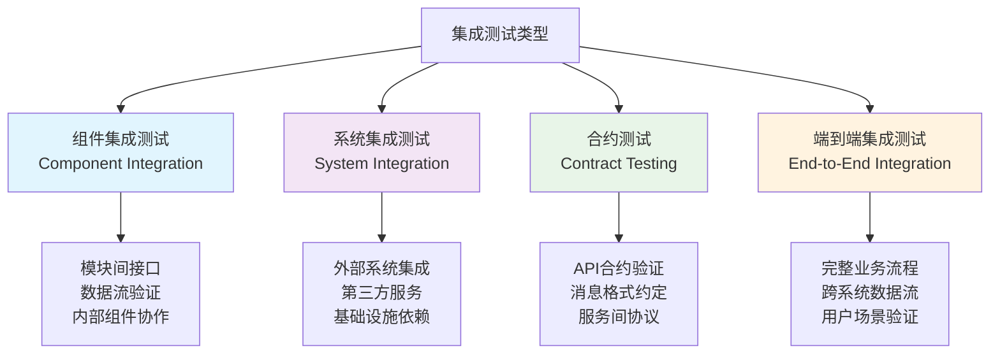

# 集成测试基础

## 📋 概述

集成测试是验证不同组件、模块或服务之间交互是否正确的测试方法。在Node.js应用中，集成测试确保数据库操作、外部API调用、文件系统访问、消息队列等各个模块能够正确协同工作，是构建可靠系统的重要环节。

## 🎯 学习目标

- 理解集成测试的核心概念和重要性
- 掌握Node.js集成测试的设计和实施方法
- 学会测试数据库、API、文件系统等外部依赖
- 了解集成测试的最佳实践和常见挑战

## 🔗 集成测试分类

### 集成测试层次



### 集成测试策略

```javascript
const IntegrationTestingStrategies = {
  BIG_BANG: {
    name: '大爆炸集成',
    description: '同时集成所有组件进行测试',
    advantages: [
      '实施简单快速',
      '能发现整体集成问题',
      '适合小型系统'
    ],
    disadvantages: [
      '故障定位困难',
      '调试复杂',
      '测试覆盖不全面'
    ],
    useCase: '小型应用或原型验证'
  },
  
  INCREMENTAL: {
    name: '增量集成',
    description: '逐步添加组件进行集成测试',
    types: {
      topDown: '自顶向下集成',
      bottomUp: '自底向上集成',
      sandwich: '三明治集成（混合方式）'
    },
    advantages: [
      '故障定位准确',
      '测试覆盖全面',
      '风险控制好'
    ],
    disadvantages: [
      '需要测试桩或驱动程序',
      '实施复杂',
      '时间成本高'
    ]
  },
  
  CONTINUOUS: {
    name: '持续集成测试',
    description: '在CI/CD流程中持续执行集成测试',
    principles: [
      '快速反馈',
      '自动化执行',
      '环境一致性',
      '依赖管理'
    ],
    implementation: [
      '容器化测试环境',
      '数据库迁移脚本',
      '外部服务模拟',
      '测试数据管理'
    ]
  }
};
```

## 🗄️ 数据库集成测试

### 数据库测试设置

```javascript
// database-integration-test-setup.js
const { Pool } = require('pg');
const { MongoMemoryServer } = require('mongodb-memory-server');
const mongoose = require('mongoose');

class DatabaseTestSetup {
  constructor() {
    this.pgPool = null;
    this.mongoServer = null;
    this.testDatabases = [];
  }
  
  // PostgreSQL测试设置
  async setupPostgreSQL() {
    const testConfig = {
      user: process.env.TEST_DB_USER || 'test_user',
      host: process.env.TEST_DB_HOST || 'localhost',
      database: `test_db_${Date.now()}`,
      password: process.env.TEST_DB_PASSWORD || 'test_password',
      port: process.env.TEST_DB_PORT || 5432,
    };
    
    // 创建测试数据库
    const adminPool = new Pool({
      ...testConfig,
      database: 'postgres' // 连接到默认数据库创建测试数据库
    });
    
    try {
      await adminPool.query(`CREATE DATABASE "${testConfig.database}"`);
      console.log(`Test database created: ${testConfig.database}`);
    } catch (error) {
      console.warn('Database may already exist:', error.message);
    } finally {
      await adminPool.end();
    }
    
    // 连接到测试数据库
    this.pgPool = new Pool(testConfig);
    this.testDatabases.push({
      type: 'postgresql',
      name: testConfig.database,
      pool: this.pgPool
    });
    
    // 运行迁移脚本
    await this.runMigrations(this.pgPool);
    
    return this.pgPool;
  }
  
  // MongoDB测试设置
  async setupMongoDB() {
    this.mongoServer = await MongoMemoryServer.create({
      instance: {
        dbName: `test_db_${Date.now()}`
      }
    });
    
    const mongoUri = this.mongoServer.getUri();
    await mongoose.connect(mongoUri);
    
    this.testDatabases.push({
      type: 'mongodb',
      uri: mongoUri,
      server: this.mongoServer
    });
    
    console.log('MongoDB test server started:', mongoUri);
    return mongoose.connection;
  }
  
  // 运行数据库迁移
  async runMigrations(pool) {
    const migrations = [
      `
        CREATE TABLE IF NOT EXISTS users (
          id SERIAL PRIMARY KEY,
          name VARCHAR(255) NOT NULL,
          email VARCHAR(255) UNIQUE NOT NULL,
          password_hash VARCHAR(255) NOT NULL,
          created_at TIMESTAMP DEFAULT CURRENT_TIMESTAMP,
          updated_at TIMESTAMP DEFAULT CURRENT_TIMESTAMP
        )
      `,
      `
        CREATE TABLE IF NOT EXISTS products (
          id SERIAL PRIMARY KEY,
          name VARCHAR(255) NOT NULL,
          description TEXT,
          price DECIMAL(10,2) NOT NULL,
          category_id INTEGER,
          stock_quantity INTEGER DEFAULT 0,
          created_at TIMESTAMP DEFAULT CURRENT_TIMESTAMP
        )
      `,
      `
        CREATE TABLE IF NOT EXISTS orders (
          id SERIAL PRIMARY KEY,
          user_id INTEGER REFERENCES users(id),
          total_amount DECIMAL(10,2) NOT NULL,
          status VARCHAR(50) DEFAULT 'pending',
          created_at TIMESTAMP DEFAULT CURRENT_TIMESTAMP
        )
      `,
      `
        CREATE INDEX IF NOT EXISTS idx_users_email ON users(email);
        CREATE INDEX IF NOT EXISTS idx_orders_user_id ON orders(user_id);
        CREATE INDEX IF NOT EXISTS idx_orders_status ON orders(status);
      `
    ];
    
    for (const migration of migrations) {
      try {
        await pool.query(migration);
      } catch (error) {
        console.warn('Migration warning:', error.message);
      }
    }
    
    console.log('Database migrations completed');
  }
  
  // 插入测试数据
  async seedTestData(pool) {
    const testUsers = [
      { name: 'John Doe', email: 'john@test.com', password_hash: 'hash1' },
      { name: 'Jane Smith', email: 'jane@test.com', password_hash: 'hash2' },
      { name: 'Bob Johnson', email: 'bob@test.com', password_hash: 'hash3' }
    ];
    
    const testProducts = [
      { name: 'Laptop', description: 'Gaming laptop', price: 999.99, stock_quantity: 10 },
      { name: 'Mouse', description: 'Wireless mouse', price: 29.99, stock_quantity: 50 },
      { name: 'Keyboard', description: 'Mechanical keyboard', price: 79.99, stock_quantity: 25 }
    ];
    
    // 插入用户数据
    for (const user of testUsers) {
      await pool.query(
        'INSERT INTO users (name, email, password_hash) VALUES ($1, $2, $3) ON CONFLICT (email) DO NOTHING',
        [user.name, user.email, user.password_hash]
      );
    }
    
    // 插入产品数据
    for (const product of testProducts) {
      await pool.query(
        'INSERT INTO products (name, description, price, stock_quantity) VALUES ($1, $2, $3, $4)',
        [product.name, product.description, product.price, product.stock_quantity]
      );
    }
    
    console.log('Test data seeded successfully');
  }
  
  // 清理测试数据
  async cleanupTestData(pool) {
    const tables = ['orders', 'products', 'users'];
    
    for (const table of tables) {
      await pool.query(`TRUNCATE TABLE ${table} RESTART IDENTITY CASCADE`);
    }
    
    console.log('Test data cleaned up');
  }
  
  // 清理所有测试资源
  async cleanup() {
    for (const db of this.testDatabases) {
      try {
        if (db.type === 'postgresql' && db.pool) {
          await db.pool.end();
          console.log(`PostgreSQL pool closed for: ${db.name}`);
        }
        
        if (db.type === 'mongodb' && db.server) {
          await mongoose.disconnect();
          await db.server.stop();
          console.log('MongoDB test server stopped');
        }
      } catch (error) {
        console.warn(`Error cleaning up ${db.type}:`, error.message);
      }
    }
    
    this.testDatabases = [];
  }
}

module.exports = DatabaseTestSetup;
```

### 数据库集成测试示例

```javascript
// user-repository.integration.test.js
const DatabaseTestSetup = require('./database-integration-test-setup');
const UserRepository = require('../src/repositories/user-repository');

describe('UserRepository Integration Tests', () => {
  let dbSetup;
  let pool;
  let userRepository;
  
  beforeAll(async () => {
    dbSetup = new DatabaseTestSetup();
    pool = await dbSetup.setupPostgreSQL();
    userRepository = new UserRepository(pool);
  });
  
  afterAll(async () => {
    await dbSetup.cleanup();
  });
  
  beforeEach(async () => {
    await dbSetup.cleanupTestData(pool);
    await dbSetup.seedTestData(pool);
  });
  
  describe('createUser', () => {
    it('should create a new user in database', async () => {
      const userData = {
        name: 'New User',
        email: 'newuser@test.com',
        password: 'password123'
      };
      
      const createdUser = await userRepository.createUser(userData);
      
      expect(createdUser).toMatchObject({
        id: expect.any(Number),
        name: userData.name,
        email: userData.email,
        created_at: expect.any(Date)
      });
      expect(createdUser.password_hash).toBeDefined();
      expect(createdUser.password_hash).not.toBe(userData.password);
      
      // 验证数据库中的记录
      const result = await pool.query('SELECT * FROM users WHERE id = $1', [createdUser.id]);
      expect(result.rows).toHaveLength(1);
      expect(result.rows[0].email).toBe(userData.email);
    });
    
    it('should throw error when creating user with duplicate email', async () => {
      const userData = {
        name: 'Duplicate User',
        email: 'john@test.com', // 已存在的邮箱
        password: 'password123'
      };
      
      await expect(userRepository.createUser(userData))
        .rejects
        .toThrow('Email already exists');
    });
    
    it('should hash password before storing', async () => {
      const userData = {
        name: 'Security Test User',
        email: 'security@test.com',
        password: 'plaintext-password'
      };
      
      const createdUser = await userRepository.createUser(userData);
      
      // 验证密码已被哈希
      expect(createdUser.password_hash).not.toBe(userData.password);
      expect(createdUser.password_hash).toMatch(/^\$2[ayb]\$\d{1,2}\$/); // bcrypt格式
      
      // 验证密码可以正确验证
      const isValid = await userRepository.verifyPassword(userData.password, createdUser.password_hash);
      expect(isValid).toBe(true);
    });
  });
  
  describe('findUserById', () => {
    it('should find existing user by id', async () => {
      // 获取种子数据中的用户
      const result = await pool.query('SELECT * FROM users WHERE email = $1', ['john@test.com']);
      const seedUser = result.rows[0];
      
      const foundUser = await userRepository.findUserById(seedUser.id);
      
      expect(foundUser).toMatchObject({
        id: seedUser.id,
        name: seedUser.name,
        email: seedUser.email
      });
    });
    
    it('should return null for non-existent user', async () => {
      const nonExistentId = 99999;
      
      const foundUser = await userRepository.findUserById(nonExistentId);
      
      expect(foundUser).toBeNull();
    });
  });
  
  describe('updateUser', () => {
    it('should update user information', async () => {
      // 获取种子数据中的用户
      const result = await pool.query('SELECT * FROM users WHERE email = $1', ['jane@test.com']);
      const existingUser = result.rows[0];
      
      const updateData = {
        name: 'Jane Updated',
        email: 'jane.updated@test.com'
      };
      
      const updatedUser = await userRepository.updateUser(existingUser.id, updateData);
      
      expect(updatedUser).toMatchObject({
        id: existingUser.id,
        name: updateData.name,
        email: updateData.email,
        updated_at: expect.any(Date)
      });
      
      // 验证数据库中的更新
      const verifyResult = await pool.query('SELECT * FROM users WHERE id = $1', [existingUser.id]);
      expect(verifyResult.rows[0].name).toBe(updateData.name);
      expect(verifyResult.rows[0].email).toBe(updateData.email);
    });
    
    it('should not allow updating to duplicate email', async () => {
      const result1 = await pool.query('SELECT * FROM users WHERE email = $1', ['john@test.com']);
      const result2 = await pool.query('SELECT * FROM users WHERE email = $1', ['jane@test.com']);
      
      const user1 = result1.rows[0];
      const user2 = result2.rows[0];
      
      await expect(userRepository.updateUser(user1.id, { email: user2.email }))
        .rejects
        .toThrow('Email already exists');
    });
  });
  
  describe('deleteUser', () => {
    it('should delete user and return deletion count', async () => {
      const result = await pool.query('SELECT * FROM users WHERE email = $1', ['bob@test.com']);
      const userToDelete = result.rows[0];
      
      const deletedCount = await userRepository.deleteUser(userToDelete.id);
      
      expect(deletedCount).toBe(1);
      
      // 验证用户已被删除
      const verifyResult = await pool.query('SELECT * FROM users WHERE id = $1', [userToDelete.id]);
      expect(verifyResult.rows).toHaveLength(0);
    });
    
    it('should return 0 when deleting non-existent user', async () => {
      const nonExistentId = 99999;
      
      const deletedCount = await userRepository.deleteUser(nonExistentId);
      
      expect(deletedCount).toBe(0);
    });
  });
  
  describe('transaction handling', () => {
    it('should rollback transaction on error', async () => {
      const initialUserCount = await pool.query('SELECT COUNT(*) FROM users');
      const initialCount = parseInt(initialUserCount.rows[0].count);
      
      try {
        await userRepository.createUsersTransaction([
          { name: 'User 1', email: 'user1@test.com', password: 'pass123' },
          { name: 'User 2', email: 'john@test.com', password: 'pass123' }, // 重复邮箱
          { name: 'User 3', email: 'user3@test.com', password: 'pass123' }
        ]);
      } catch (error) {
        // 期望错误
      }
      
      // 验证事务回滚，用户数量不变
      const finalUserCount = await pool.query('SELECT COUNT(*) FROM users');
      const finalCount = parseInt(finalUserCount.rows[0].count);
      
      expect(finalCount).toBe(initialCount);
    });
    
    it('should commit transaction when all operations succeed', async () => {
      const initialUserCount = await pool.query('SELECT COUNT(*) FROM users');
      const initialCount = parseInt(initialUserCount.rows[0].count);
      
      const users = await userRepository.createUsersTransaction([
        { name: 'Batch User 1', email: 'batch1@test.com', password: 'pass123' },
        { name: 'Batch User 2', email: 'batch2@test.com', password: 'pass123' }
      ]);
      
      expect(users).toHaveLength(2);
      
      // 验证事务提交，用户数量增加
      const finalUserCount = await pool.query('SELECT COUNT(*) FROM users');
      const finalCount = parseInt(finalUserCount.rows[0].count);
      
      expect(finalCount).toBe(initialCount + 2);
    });
  });
});
```

## 🌐 外部API集成测试

### HTTP客户端集成测试

```javascript
// api-client.integration.test.js
const nock = require('nock');
const ApiClient = require('../src/services/api-client');

describe('ApiClient Integration Tests', () => {
  let apiClient;
  const baseURL = 'https://api.example.com';
  
  beforeEach(() => {
    apiClient = new ApiClient(baseURL);
    nock.cleanAll();
  });
  
  afterEach(() => {
    nock.cleanAll();
  });
  
  describe('getUser', () => {
    it('should successfully fetch user data', async () => {
      const userId = 123;
      const userData = {
        id: userId,
        name: 'John Doe',
        email: 'john@example.com'
      };
      
      nock(baseURL)
        .get(`/users/${userId}`)
        .reply(200, userData);
      
      const result = await apiClient.getUser(userId);
      
      expect(result).toEqual(userData);
    });
    
    it('should handle 404 errors gracefully', async () => {
      const userId = 999;
      
      nock(baseURL)
        .get(`/users/${userId}`)
        .reply(404, { error: 'User not found' });
      
      await expect(apiClient.getUser(userId))
        .rejects
        .toThrow('User not found');
    });
    
    it('should retry on network failures', async () => {
      const userId = 123;
      const userData = { id: userId, name: 'John Doe' };
      
      // 第一次请求失败
      nock(baseURL)
        .get(`/users/${userId}`)
        .replyWithError('Network error');
      
      // 第二次请求成功
      nock(baseURL)
        .get(`/users/${userId}`)
        .reply(200, userData);
      
      const result = await apiClient.getUser(userId);
      
      expect(result).toEqual(userData);
    });
    
    it('should handle timeout errors', async () => {
      const userId = 123;
      
      nock(baseURL)
        .get(`/users/${userId}`)
        .delay(6000) // 延迟6秒，超过5秒超时设置
        .reply(200, {});
      
      await expect(apiClient.getUser(userId))
        .rejects
        .toThrow('timeout');
    });
  });
  
  describe('createUser', () => {
    it('should create user with proper request format', async () => {
      const userData = {
        name: 'Jane Doe',
        email: 'jane@example.com'
      };
      
      const createdUser = {
        id: 456,
        ...userData,
        createdAt: '2023-01-01T00:00:00.000Z'
      };
      
      const scope = nock(baseURL)
        .post('/users', userData)
        .reply(201, createdUser);
      
      const result = await apiClient.createUser(userData);
      
      expect(result).toEqual(createdUser);
      expect(scope.isDone()).toBe(true);
    });
    
    it('should include authentication headers', async () => {
      const userData = { name: 'Test User', email: 'test@example.com' };
      const authToken = 'bearer-token-123';
      
      apiClient.setAuthToken(authToken);
      
      const scope = nock(baseURL)
        .post('/users')
        .matchHeader('Authorization', `Bearer ${authToken}`)
        .reply(201, { id: 789, ...userData });
      
      await apiClient.createUser(userData);
      
      expect(scope.isDone()).toBe(true);
    });
    
    it('should handle validation errors', async () => {
      const invalidUserData = {
        name: '', // 空名称
        email: 'invalid-email' // 无效邮箱
      };
      
      const validationErrors = {
        errors: [
          { field: 'name', message: 'Name is required' },
          { field: 'email', message: 'Invalid email format' }
        ]
      };
      
      nock(baseURL)
        .post('/users', invalidUserData)
        .reply(400, validationErrors);
      
      await expect(apiClient.createUser(invalidUserData))
        .rejects
        .toThrow('Validation failed');
    });
  });
  
  describe('rate limiting', () => {
    it('should handle rate limit responses', async () => {
      const userId = 123;
      
      nock(baseURL)
        .get(`/users/${userId}`)
        .reply(429, { error: 'Rate limit exceeded' }, {
          'Retry-After': '60'
        });
      
      await expect(apiClient.getUser(userId))
        .rejects
        .toThrow('Rate limit exceeded');
    });
    
    it('should respect rate limit and retry after delay', async () => {
      const userId = 123;
      const userData = { id: userId, name: 'John Doe' };
      
      // 第一次请求被限流
      nock(baseURL)
        .get(`/users/${userId}`)
        .reply(429, { error: 'Rate limit exceeded' }, {
          'Retry-After': '1' // 1秒后重试
        });
      
      // 第二次请求成功
      nock(baseURL)
        .get(`/users/${userId}`)
        .reply(200, userData);
      
      const startTime = Date.now();
      const result = await apiClient.getUser(userId);
      const endTime = Date.now();
      
      expect(result).toEqual(userData);
      expect(endTime - startTime).toBeGreaterThan(1000); // 确认等待了至少1秒
    });
  });
  
  describe('pagination', () => {
    it('should handle paginated responses', async () => {
      const page1Data = {
        users: [
          { id: 1, name: 'User 1' },
          { id: 2, name: 'User 2' }
        ],
        pagination: {
          page: 1,
          perPage: 2,
          total: 5,
          hasNext: true
        }
      };
      
      const page2Data = {
        users: [
          { id: 3, name: 'User 3' },
          { id: 4, name: 'User 4' }
        ],
        pagination: {
          page: 2,
          perPage: 2,
          total: 5,
          hasNext: true
        }
      };
      
      nock(baseURL)
        .get('/users?page=1&limit=2')
        .reply(200, page1Data);
      
      nock(baseURL)
        .get('/users?page=2&limit=2')
        .reply(200, page2Data);
      
      const result1 = await apiClient.getUsers({ page: 1, limit: 2 });
      const result2 = await apiClient.getUsers({ page: 2, limit: 2 });
      
      expect(result1.users).toHaveLength(2);
      expect(result1.pagination.hasNext).toBe(true);
      expect(result2.users).toHaveLength(2);
      expect(result2.pagination.page).toBe(2);
    });
    
    it('should auto-fetch all pages when requested', async () => {
      // 模拟多页数据
      nock(baseURL)
        .get('/users?page=1&limit=10')
        .reply(200, {
          users: Array.from({ length: 10 }, (_, i) => ({ id: i + 1, name: `User ${i + 1}` })),
          pagination: { page: 1, perPage: 10, total: 25, hasNext: true }
        });
      
      nock(baseURL)
        .get('/users?page=2&limit=10')
        .reply(200, {
          users: Array.from({ length: 10 }, (_, i) => ({ id: i + 11, name: `User ${i + 11}` })),
          pagination: { page: 2, perPage: 10, total: 25, hasNext: true }
        });
      
      nock(baseURL)
        .get('/users?page=3&limit=10')
        .reply(200, {
          users: Array.from({ length: 5 }, (_, i) => ({ id: i + 21, name: `User ${i + 21}` })),
          pagination: { page: 3, perPage: 10, total: 25, hasNext: false }
        });
      
      const allUsers = await apiClient.getAllUsers();
      
      expect(allUsers).toHaveLength(25);
      expect(allUsers[0].id).toBe(1);
      expect(allUsers[24].id).toBe(25);
    });
  });
});
```

### 第三方服务集成测试

```javascript
// payment-service.integration.test.js
const PaymentService = require('../src/services/payment-service');
const nock = require('nock');

describe('PaymentService Integration Tests', () => {
  let paymentService;
  const stripeBaseURL = 'https://api.stripe.com';
  
  beforeEach(() => {
    paymentService = new PaymentService({
      stripeApiKey: 'sk_test_fake_key',
      environment: 'test'
    });
    nock.cleanAll();
  });
  
  afterEach(() => {
    nock.cleanAll();
  });
  
  describe('createPaymentIntent', () => {
    it('should create payment intent successfully', async () => {
      const paymentData = {
        amount: 2000, // $20.00
        currency: 'usd',
        customer: 'cus_test123'
      };
      
      const mockResponse = {
        id: 'pi_test123',
        amount: 2000,
        currency: 'usd',
        status: 'requires_confirmation',
        client_secret: 'pi_test123_secret'
      };
      
      nock(stripeBaseURL)
        .post('/v1/payment_intents')
        .reply(200, mockResponse);
      
      const result = await paymentService.createPaymentIntent(paymentData);
      
      expect(result).toMatchObject({
        id: 'pi_test123',
        amount: 2000,
        currency: 'usd',
        status: 'requires_confirmation'
      });
    });
    
    it('should handle authentication errors', async () => {
      nock(stripeBaseURL)
        .post('/v1/payment_intents')
        .reply(401, {
          error: {
            type: 'invalid_request_error',
            message: 'Invalid API key provided'
          }
        });
      
      await expect(paymentService.createPaymentIntent({ amount: 1000, currency: 'usd' }))
        .rejects
        .toThrow('Invalid API key provided');
    });
    
    it('should handle card declined errors', async () => {
      const paymentData = {
        amount: 1000,
        currency: 'usd',
        payment_method: 'pm_card_declined'
      };
      
      nock(stripeBaseURL)
        .post('/v1/payment_intents')
        .reply(402, {
          error: {
            type: 'card_error',
            code: 'card_declined',
            message: 'Your card was declined.'
          }
        });
      
      await expect(paymentService.createPaymentIntent(paymentData))
        .rejects
        .toThrow('Your card was declined.');
    });
  });
  
  describe('webhook handling', () => {
    it('should verify and process webhook events', async () => {
      const webhookPayload = {
        id: 'evt_test123',
        type: 'payment_intent.succeeded',
        data: {
          object: {
            id: 'pi_test123',
            status: 'succeeded',
            amount: 2000
          }
        }
      };
      
      const signature = 'test_signature';
      const webhookSecret = 'whsec_test';
      
      // Mock Stripe's webhook signature verification
      jest.spyOn(paymentService, 'verifyWebhookSignature')
        .mockReturnValue(true);
      
      const result = await paymentService.processWebhook(
        JSON.stringify(webhookPayload),
        signature,
        webhookSecret
      );
      
      expect(result).toMatchObject({
        processed: true,
        eventType: 'payment_intent.succeeded',
        paymentIntentId: 'pi_test123'
      });
    });
    
    it('should reject invalid webhook signatures', async () => {
      const webhookPayload = { id: 'evt_test123', type: 'test' };
      const invalidSignature = 'invalid_signature';
      const webhookSecret = 'whsec_test';
      
      jest.spyOn(paymentService, 'verifyWebhookSignature')
        .mockReturnValue(false);
      
      await expect(paymentService.processWebhook(
        JSON.stringify(webhookPayload),
        invalidSignature,
        webhookSecret
      )).rejects.toThrow('Invalid webhook signature');
    });
  });
  
  describe('error handling and retries', () => {
    it('should retry on temporary failures', async () => {
      const paymentData = { amount: 1000, currency: 'usd' };
      const successResponse = {
        id: 'pi_retry_success',
        amount: 1000,
        currency: 'usd',
        status: 'requires_confirmation'
      };
      
      // 第一次请求失败（网络错误）
      nock(stripeBaseURL)
        .post('/v1/payment_intents')
        .replyWithError('Network error');
      
      // 第二次请求成功
      nock(stripeBaseURL)
        .post('/v1/payment_intents')
        .reply(200, successResponse);
      
      const result = await paymentService.createPaymentIntent(paymentData);
      
      expect(result.id).toBe('pi_retry_success');
    });
    
    it('should not retry on permanent failures', async () => {
      const paymentData = { amount: -1000, currency: 'usd' }; // 无效金额
      
      nock(stripeBaseURL)
        .post('/v1/payment_intents')
        .reply(400, {
          error: {
            type: 'invalid_request_error',
            message: 'Amount must be positive'
          }
        });
      
      await expect(paymentService.createPaymentIntent(paymentData))
        .rejects
        .toThrow('Amount must be positive');
      
      // 验证只调用了一次，没有重试
      expect(nock.pendingMocks()).toHaveLength(0);
    });
  });
});
```

## 📁 文件系统集成测试

### 文件操作集成测试

```javascript
// file-service.integration.test.js
const fs = require('fs').promises;
const path = require('path');
const os = require('os');
const FileService = require('../src/services/file-service');

describe('FileService Integration Tests', () => {
  let fileService;
  let testDir;
  
  beforeEach(async () => {
    // 创建临时测试目录
    testDir = await fs.mkdtemp(path.join(os.tmpdir(), 'fileservice-test-'));
    fileService = new FileService({
      baseDir: testDir,
      maxFileSize: 10 * 1024 * 1024, // 10MB
      allowedExtensions: ['.txt', '.json', '.csv', '.pdf']
    });
  });
  
  afterEach(async () => {
    // 清理测试目录
    try {
      await fs.rmdir(testDir, { recursive: true });
    } catch (error) {
      console.warn('Failed to cleanup test directory:', error.message);
    }
  });
  
  describe('saveFile', () => {
    it('should save file to correct location', async () => {
      const fileName = 'test-file.txt';
      const fileContent = 'Hello, World!';
      const buffer = Buffer.from(fileContent, 'utf8');
      
      const result = await fileService.saveFile(fileName, buffer);
      
      expect(result).toMatchObject({
        fileName,
        filePath: expect.stringContaining(fileName),
        size: buffer.length,
        mimeType: 'text/plain'
      });
      
      // 验证文件确实被保存
      const savedContent = await fs.readFile(result.filePath, 'utf8');
      expect(savedContent).toBe(fileContent);
    });
    
    it('should generate unique filename for duplicates', async () => {
      const fileName = 'duplicate.txt';
      const content1 = 'First file';
      const content2 = 'Second file';
      
      const result1 = await fileService.saveFile(fileName, Buffer.from(content1));
      const result2 = await fileService.saveFile(fileName, Buffer.from(content2));
      
      expect(result1.fileName).toBe('duplicate.txt');
      expect(result2.fileName).toMatch(/^duplicate-\d+\.txt$/);
      
      // 验证两个文件都存在且内容不同
      const content1Saved = await fs.readFile(result1.filePath, 'utf8');
      const content2Saved = await fs.readFile(result2.filePath, 'utf8');
      
      expect(content1Saved).toBe(content1);
      expect(content2Saved).toBe(content2);
    });
    
    it('should reject files with disallowed extensions', async () => {
      const fileName = 'malicious.exe';
      const buffer = Buffer.from('malicious content');
      
      await expect(fileService.saveFile(fileName, buffer))
        .rejects
        .toThrow('File extension not allowed');
    });
    
    it('should reject files exceeding size limit', async () => {
      const fileName = 'large-file.txt';
      const largeBuffer = Buffer.alloc(15 * 1024 * 1024); // 15MB
      
      await expect(fileService.saveFile(fileName, largeBuffer))
        .rejects
        .toThrow('File size exceeds limit');
    });
  });
  
  describe('readFile', () => {
    it('should read existing file', async () => {
      const fileName = 'read-test.txt';
      const originalContent = 'Content to read';
      
      // 先保存文件
      await fileService.saveFile(fileName, Buffer.from(originalContent));
      
      // 然后读取文件
      const readResult = await fileService.readFile(fileName);
      
      expect(readResult.content.toString('utf8')).toBe(originalContent);
      expect(readResult.metadata).toMatchObject({
        fileName,
        size: originalContent.length,
        mimeType: 'text/plain'
      });
    });
    
    it('should throw error for non-existent file', async () => {
      await expect(fileService.readFile('non-existent.txt'))
        .rejects
        .toThrow('File not found');
    });
  });
  
  describe('deleteFile', () => {
    it('should delete existing file', async () => {
      const fileName = 'delete-test.txt';
      const content = 'File to delete';
      
      // 保存文件
      const saveResult = await fileService.saveFile(fileName, Buffer.from(content));
      
      // 验证文件存在
      expect(await fileService.fileExists(fileName)).toBe(true);
      
      // 删除文件
      const deleteResult = await fileService.deleteFile(fileName);
      expect(deleteResult.deleted).toBe(true);
      
      // 验证文件不存在
      expect(await fileService.fileExists(fileName)).toBe(false);
    });
    
    it('should handle deletion of non-existent file gracefully', async () => {
      const result = await fileService.deleteFile('non-existent.txt');
      
      expect(result.deleted).toBe(false);
      expect(result.reason).toBe('File not found');
    });
  });
  
  describe('listFiles', () => {
    it('should list files in directory', async () => {
      const files = [
        { name: 'file1.txt', content: 'Content 1' },
        { name: 'file2.json', content: '{"key": "value"}' },
        { name: 'file3.csv', content: 'col1,col2\\nval1,val2' }
      ];
      
      // 保存多个文件
      for (const file of files) {
        await fileService.saveFile(file.name, Buffer.from(file.content));
      }
      
      const fileList = await fileService.listFiles();
      
      expect(fileList).toHaveLength(3);
      expect(fileList.map(f => f.fileName)).toEqual(
        expect.arrayContaining(['file1.txt', 'file2.json', 'file3.csv'])
      );
      
      fileList.forEach(file => {
        expect(file).toMatchObject({
          fileName: expect.any(String),
          size: expect.any(Number),
          mimeType: expect.any(String),
          createdAt: expect.any(Date),
          modifiedAt: expect.any(Date)
        });
      });
    });
    
    it('should filter files by extension', async () => {
      const files = [
        { name: 'document.txt', content: 'Text content' },
        { name: 'data.json', content: '{}' },
        { name: 'another.txt', content: 'More text' }
      ];
      
      for (const file of files) {
        await fileService.saveFile(file.name, Buffer.from(file.content));
      }
      
      const txtFiles = await fileService.listFiles({ extension: '.txt' });
      
      expect(txtFiles).toHaveLength(2);
      expect(txtFiles.every(f => f.fileName.endsWith('.txt'))).toBe(true);
    });
  });
  
  describe('file operations with subdirectories', () => {
    it('should create and manage subdirectories', async () => {
      const subDirPath = 'uploads/images';
      const fileName = 'image.txt'; // 简化测试用文本文件
      const content = 'Image placeholder';
      
      const result = await fileService.saveFile(
        fileName,
        Buffer.from(content),
        { subDirectory: subDirPath }
      );
      
      expect(result.filePath).toMatch(/uploads[/\\]images[/\\]image\.txt$/);
      
      // 验证子目录被创建
      const fullSubDirPath = path.join(testDir, subDirPath);
      const stat = await fs.stat(fullSubDirPath);
      expect(stat.isDirectory()).toBe(true);
      
      // 验证文件在正确位置
      const savedContent = await fs.readFile(result.filePath, 'utf8');
      expect(savedContent).toBe(content);
    });
  });
  
  describe('concurrent file operations', () => {
    it('should handle concurrent file saves', async () => {
      const concurrentSaves = Array.from({ length: 10 }, (_, i) => 
        fileService.saveFile(`concurrent-${i}.txt`, Buffer.from(`Content ${i}`))
      );
      
      const results = await Promise.all(concurrentSaves);
      
      expect(results).toHaveLength(10);
      results.forEach((result, i) => {
        expect(result.fileName).toBe(`concurrent-${i}.txt`);
      });
      
      // 验证所有文件都被正确保存
      const fileList = await fileService.listFiles();
      expect(fileList).toHaveLength(10);
    });
  });
});
```

## 📝 集成测试最佳实践

### 测试环境隔离

```javascript
const IntegrationTestBestPractices = {
  ENVIRONMENT_ISOLATION: {
    testContainers: [
      '使用Docker容器隔离测试环境',
      '每个测试套件使用独立的容器实例',
      '自动化容器的启动和清理过程',
      '确保测试环境的一致性和可重现性'
    ],
    
    databaseIsolation: [
      '为每个测试创建独立的数据库',
      '使用事务回滚清理测试数据',
      '内存数据库用于快速测试',
      '种子数据的一致性管理'
    ],
    
    networkIsolation: [
      '使用测试专用的网络端口',
      '模拟外部服务调用',
      '网络延迟和错误的模拟',
      '并发访问的控制'
    ]
  },
  
  DATA_MANAGEMENT: {
    testDataStrategy: [
      '使用工厂模式生成测试数据',
      '建立测试数据的层次结构',
      '确保测试数据的完整性',
      '支持复杂业务场景的数据准备'
    ],
    
    cleanupStrategy: [
      '每个测试后清理数据',
      '避免测试间的数据污染',
      '级联删除相关数据',
      '性能优化的批量操作'
    ]
  },
  
  ERROR_HANDLING: {
    resilience: [
      '测试各种错误情况',
      '验证错误恢复机制',
      '测试超时和重试逻辑',
      '资源泄漏的检测'
    ],
    
    monitoring: [
      '集成测试执行时间监控',
      '资源使用情况追踪',
      '失败模式分析',
      '测试稳定性指标'
    ]
  }
};
```

## 📝 总结

集成测试是确保Node.js应用组件协作正确的关键测试环节：

- **全面覆盖**：数据库、API、文件系统等外部依赖的集成验证
- **真实环境**：模拟生产环境的配置和数据流
- **错误处理**：验证异常情况下的系统行为
- **自动化执行**：集成到CI/CD流程中的自动化测试

通过系统化的集成测试，可以在早期发现组件间的协作问题，确保系统的整体稳定性。

## 🔗 相关资源

- [Testcontainers Node.js](https://github.com/testcontainers/testcontainers-node)
- [Nock HTTP模拟库](https://github.com/nock/nock)
- [MongoDB Memory Server](https://github.com/nodkz/mongodb-memory-server)
- [集成测试最佳实践](https://martinfowler.com/articles/practical-test-pyramid.html)
