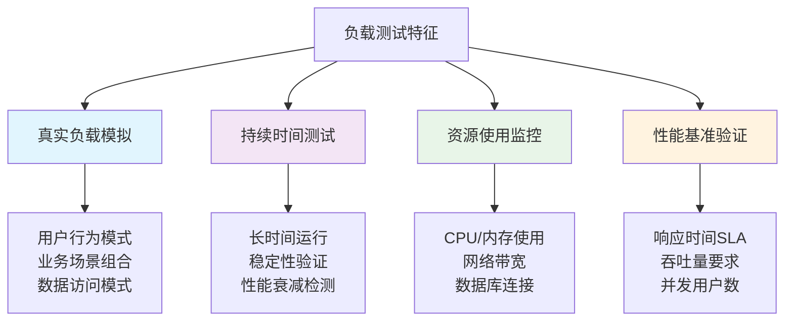

# 负载测试

## 📋 概述

负载测试是在预期的正常工作负载下验证系统性能的测试方法。通过模拟真实用户访问模式和业务场景，负载测试帮助确保Node.js应用在生产环境中能够处理预期的用户负载，满足性能要求和用户体验标准。

## 🎯 学习目标

- 理解负载测试的核心概念和实施策略
- 掌握负载测试工具的使用和配置
- 学会设计真实的负载测试场景
- 了解负载测试结果分析和性能优化方法

## 📊 负载测试基础概念

### 负载测试特征



### 负载测试指标体系

```javascript
const LoadTestingMetrics = {
  CORE_METRICS: {
    responseTime: {
      name: '响应时间',
      measurements: [
        'Average Response Time (平均响应时间)',
        'Median Response Time (中位数响应时间)',
        'P95 Response Time (95百分位响应时间)',
        'P99 Response Time (99百分位响应时间)',
        'Max Response Time (最大响应时间)'
      ],
      targets: {
        web: '< 2000ms',
        api: '< 500ms',
        database: '< 100ms'
      }
    },
    
    throughput: {
      name: '吞吐量',
      measurements: [
        'Requests Per Second (每秒请求数)',
        'Transactions Per Second (每秒事务数)',
        'Pages Per Second (每页面访问数)',
        'Data Transfer Rate (数据传输速率)'
      ],
      considerations: [
        '业务高峰期预期流量',
        '系统设计容量',
        '未来增长预测'
      ]
    },
    
    concurrency: {
      name: '并发性能',
      measurements: [
        'Concurrent Users (并发用户数)',
        'Active Connections (活跃连接数)',
        'Thread Pool Usage (线程池使用率)',
        'Connection Pool Utilization (连接池利用率)'
      ]
    },
    
    errorRate: {
      name: '错误率',
      types: [
        'HTTP 4xx Errors (客户端错误)',
        'HTTP 5xx Errors (服务器错误)',
        'Timeout Errors (超时错误)',
        'Connection Errors (连接错误)'
      ],
      acceptableThreshold: '< 0.1%'
    }
  },
  
  RESOURCE_METRICS: {
    systemResources: [
      'CPU Utilization (CPU使用率)',
      'Memory Usage (内存使用)',
      'Disk I/O (磁盘读写)',
      'Network I/O (网络读写)'
    ],
    
    applicationMetrics: [
      'Heap Memory Usage (堆内存使用)',
      'Event Loop Lag (事件循环延迟)',
      'Database Connection Count (数据库连接数)',
      'Cache Hit Rate (缓存命中率)'
    ]
  }
};
```

## 🛠 负载测试工具和配置

### Artillery.js 高级负载测试

```javascript
// artillery-config.yml
config:
  target: 'http://localhost:3000'
  phases:
    # 阶段1：预热
    - duration: 60
      arrivalRate: 5
      name: "Warm up"
    
    # 阶段2：逐步增加负载
    - duration: 300
      arrivalRate: 10
      rampTo: 50
      name: "Load ramp-up"
    
    # 阶段3：持续负载
    - duration: 600
      arrivalRate: 50
      name: "Sustained load"
    
    # 阶段4：峰值负载
    - duration: 120
      arrivalRate: 100
      name: "Peak load"
    
    # 阶段5：负载下降
    - duration: 180
      arrivalRate: 100
      rampTo: 10
      name: "Load ramp-down"
  
  # 默认配置
  defaults:
    headers:
      'User-Agent': 'Artillery Load Test'
      'Accept': 'application/json'
  
  # 插件配置
  plugins:
    metrics-by-endpoint: {}
    slack: {}
    cloudwatch: {}
  
  # 负载生成器配置
  http:
    timeout: 30
    pool: 100  # 连接池大小
  
  # 变量定义
  variables:
    usernames:
      - "user1"
      - "user2"
      - "user3"
    emails:
      - "test1@example.com"
      - "test2@example.com"
      - "test3@example.com"

scenarios:
  # 场景1：用户注册和登录流程
  - name: "User Authentication Flow"
    weight: 30
    flow:
      - post:
          url: "/api/auth/register"
          headers:
            Content-Type: "application/json"
          json:
            name: "{{ $randomString() }}"
            email: "{{ $randomString() }}@test.com"
            password: "testpass123"
          capture:
            - json: "$.token"
              as: "authToken"
            - json: "$.user.id"
              as: "userId"
          expect:
            - statusCode: 201
      
      - get:
          url: "/api/auth/profile"
          headers:
            Authorization: "Bearer {{ authToken }}"
          expect:
            - statusCode: 200
      
      - think: 2  # 用户思考时间
      
      - post:
          url: "/api/auth/logout"
          headers:
            Authorization: "Bearer {{ authToken }}"
          expect:
            - statusCode: 200
  
  # 场景2：API浏览和搜索
  - name: "Browse and Search"
    weight: 50
    flow:
      - get:
          url: "/api/products"
          expect:
            - statusCode: 200
            - hasHeader: "content-type"
      
      - think: 1
      
      - get:
          url: "/api/products?category=electronics"
          expect:
            - statusCode: 200
      
      - get:
          url: "/api/products/search?q={{ $randomString() }}"
          expect:
            - statusCode: 200
      
      - loop:
          - get:
              url: "/api/products/{{ $randomInt(1, 100) }}"
              expect:
                - statusCode: [200, 404]
        count: 3
  
  # 场景3：购物车操作
  - name: "Shopping Cart Operations"
    weight: 20
    flow:
      # 先登录获取token
      - post:
          url: "/api/auth/login"
          json:
            email: "{{ $pick(emails) }}"
            password: "testpass123"
          capture:
            - json: "$.token"
              as: "authToken"
          expect:
            - statusCode: 200
      
      # 添加商品到购物车
      - post:
          url: "/api/cart/items"
          headers:
            Authorization: "Bearer {{ authToken }}"
            Content-Type: "application/json"
          json:
            productId: "{{ $randomInt(1, 50) }}"
            quantity: "{{ $randomInt(1, 5) }}"
          expect:
            - statusCode: 201
      
      - think: 3
      
      # 查看购物车
      - get:
          url: "/api/cart"
          headers:
            Authorization: "Bearer {{ authToken }}"
          expect:
            - statusCode: 200
      
      # 更新购物车
      - put:
          url: "/api/cart/items/{{ $randomInt(1, 10) }}"
          headers:
            Authorization: "Bearer {{ authToken }}"
            Content-Type: "application/json"
          json:
            quantity: "{{ $randomInt(1, 3) }}"
          expect:
            - statusCode: [200, 404]
```

### K6 负载测试脚本

```javascript
// k6-load-test.js
import http from 'k6/http';
import { check, group, sleep } from 'k6';
import { Rate, Trend, Counter } from 'k6/metrics';

// 自定义指标
const errorRate = new Rate('error_rate');
const responseTime = new Trend('response_time');
const successfulLogins = new Counter('successful_logins');

// 测试配置
export const options = {
  stages: [
    { duration: '2m', target: 20 },   // 预热：2分钟内增加到20用户
    { duration: '5m', target: 20 },   // 保持：20用户持续5分钟
    { duration: '2m', target: 50 },   // 增长：2分钟内增加到50用户
    { duration: '5m', target: 50 },   // 保持：50用户持续5分钟
    { duration: '2m', target: 100 },  // 峰值：2分钟内增加到100用户
    { duration: '5m', target: 100 },  // 保持：100用户持续5分钟
    { duration: '5m', target: 0 },    // 下降：5分钟内减少到0用户
  ],
  
  thresholds: {
    http_req_duration: ['p(95)<500'],        // 95%的请求响应时间<500ms
    http_req_failed: ['rate<0.01'],          // 错误率<1%
    error_rate: ['rate<0.01'],               // 自定义错误率<1%
    response_time: ['p(95)<400'],            // 95%的响应时间<400ms
    successful_logins: ['count>100'],        // 成功登录次数>100
  },
  
  // 系统资源限制
  noConnectionReuse: false,
  userAgent: 'K6LoadTest/1.0',
  insecureSkipTLSVerify: true,
  
  // 批量请求配置
  batch: 20,
  batchPerHost: 10,
};

// 测试数据
const BASE_URL = 'http://localhost:3000';
const users = [
  { email: 'user1@test.com', password: 'password123' },
  { email: 'user2@test.com', password: 'password123' },
  { email: 'user3@test.com', password: 'password123' },
];

// 主测试函数
export default function() {
  // 用户认证流程
  group('Authentication Flow', function() {
    testUserLogin();
  });
  
  // API浏览流程
  group('API Browsing', function() {
    testAPIBrowsing();
  });
  
  // 业务操作流程
  group('Business Operations', function() {
    testBusinessOperations();
  });
  
  sleep(1); // 用户间隔时间
}

function testUserLogin() {
  const user = users[Math.floor(Math.random() * users.length)];
  
  const loginResponse = http.post(`${BASE_URL}/api/auth/login`, {
    email: user.email,
    password: user.password
  }, {
    headers: { 'Content-Type': 'application/json' },
    tags: { name: 'UserLogin' }
  });
  
  const loginSuccess = check(loginResponse, {
    'login status is 200': (r) => r.status === 200,
    'login response has token': (r) => r.json('token') !== undefined,
    'login response time < 300ms': (r) => r.timings.duration < 300,
  });
  
  if (loginSuccess) {
    successfulLogins.add(1);
    
    // 获取用户资料
    const token = loginResponse.json('token');
    const profileResponse = http.get(`${BASE_URL}/api/auth/profile`, {
      headers: { 'Authorization': `Bearer ${token}` },
      tags: { name: 'GetProfile' }
    });
    
    check(profileResponse, {
      'profile status is 200': (r) => r.status === 200,
      'profile has user data': (r) => r.json('user') !== undefined,
    });
    
    responseTime.add(profileResponse.timings.duration);
  }
  
  errorRate.add(!loginSuccess);
}

function testAPIBrowsing() {
  // 获取产品列表
  const productsResponse = http.get(`${BASE_URL}/api/products`, {
    tags: { name: 'GetProducts' }
  });
  
  check(productsResponse, {
    'products status is 200': (r) => r.status === 200,
    'products response has data': (r) => r.json().length > 0,
    'products response time < 200ms': (r) => r.timings.duration < 200,
  });
  
  sleep(0.5);
  
  // 搜索产品
  const searchQuery = ['laptop', 'phone', 'tablet'][Math.floor(Math.random() * 3)];
  const searchResponse = http.get(`${BASE_URL}/api/products/search?q=${searchQuery}`, {
    tags: { name: 'SearchProducts' }
  });
  
  check(searchResponse, {
    'search status is 200': (r) => r.status === 200,
    'search response time < 300ms': (r) => r.timings.duration < 300,
  });
  
  sleep(0.3);
  
  // 获取特定产品详情
  const productId = Math.floor(Math.random() * 100) + 1;
  const productResponse = http.get(`${BASE_URL}/api/products/${productId}`, {
    tags: { name: 'GetProduct' }
  });
  
  check(productResponse, {
    'product status is 200 or 404': (r) => [200, 404].includes(r.status),
  });
}

function testBusinessOperations() {
  // 模拟购物车操作
  const user = users[Math.floor(Math.random() * users.length)];
  
  // 登录获取token
  const loginResponse = http.post(`${BASE_URL}/api/auth/login`, {
    email: user.email,
    password: user.password
  }, {
    headers: { 'Content-Type': 'application/json' }
  });
  
  if (loginResponse.status === 200) {
    const token = loginResponse.json('token');
    const headers = { 
      'Authorization': `Bearer ${token}`,
      'Content-Type': 'application/json'
    };
    
    // 添加商品到购物车
    const addToCartResponse = http.post(`${BASE_URL}/api/cart/items`, {
      productId: Math.floor(Math.random() * 50) + 1,
      quantity: Math.floor(Math.random() * 3) + 1
    }, {
      headers,
      tags: { name: 'AddToCart' }
    });
    
    check(addToCartResponse, {
      'add to cart status is 201': (r) => r.status === 201,
      'add to cart response time < 400ms': (r) => r.timings.duration < 400,
    });
    
    sleep(1);
    
    // 查看购物车
    const cartResponse = http.get(`${BASE_URL}/api/cart`, {
      headers,
      tags: { name: 'GetCart' }
    });
    
    check(cartResponse, {
      'cart status is 200': (r) => r.status === 200,
      'cart response time < 200ms': (r) => r.timings.duration < 200,
    });
    
    sleep(2);
    
    // 模拟结账流程
    const checkoutResponse = http.post(`${BASE_URL}/api/orders`, {
      paymentMethod: 'credit_card',
      shippingAddress: {
        street: '123 Test St',
        city: 'Test City',
        zipCode: '12345'
      }
    }, {
      headers,
      tags: { name: 'Checkout' }
    });
    
    check(checkoutResponse, {
      'checkout status is 201': (r) => r.status === 201,
      'checkout response time < 1000ms': (r) => r.timings.duration < 1000,
    });
  }
}

// 测试初始化
export function setup() {
  console.log('Starting load test setup...');
  
  // 检查服务器是否可用
  const healthCheck = http.get(`${BASE_URL}/health`);
  if (healthCheck.status !== 200) {
    throw new Error('Server is not available');
  }
  
  console.log('Server health check passed');
  return { baseUrl: BASE_URL };
}

// 测试清理
export function teardown(data) {
  console.log('Load test completed');
  console.log(`Base URL: ${data.baseUrl}`);
}
```

### JMeter 测试计划配置

```xml
<!-- jmeter-load-test.jmx 核心配置片段 -->
<?xml version="1.0" encoding="UTF-8"?>
<jmeterTestPlan version="1.2">
  <hashTree>
    <TestPlan guiclass="TestPlanGui" testclass="TestPlan" testname="Node.js Load Test">
      <stringProp name="TestPlan.comments">Node.js应用负载测试计划</stringProp>
      <boolProp name="TestPlan.functional_mode">false</boolProp>
      <boolProp name="TestPlan.serialize_threadgroups">false</boolProp>
      <elementProp name="TestPlan.arguments" elementType="Arguments" guiclass="ArgumentsPanel">
        <collectionProp name="Arguments.arguments"/>
      </elementProp>
      <stringProp name="TestPlan.user_define_classpath"></stringProp>
    </TestPlan>
    
    <hashTree>
      <!-- 用户变量 -->
      <Arguments guiclass="ArgumentsPanel" testclass="Arguments" testname="User Defined Variables">
        <collectionProp name="Arguments.arguments">
          <elementProp name="BASE_URL" elementType="Argument">
            <stringProp name="Argument.name">BASE_URL</stringProp>
            <stringProp name="Argument.value">localhost</stringProp>
          </elementProp>
          <elementProp name="PORT" elementType="Argument">
            <stringProp name="Argument.name">PORT</stringProp>
            <stringProp name="Argument.value">3000</stringProp>
          </elementProp>
        </collectionProp>
      </Arguments>
      
      <!-- 线程组配置 -->
      <ThreadGroup guiclass="ThreadGroupGui" testclass="ThreadGroup" testname="Load Test Users">
        <stringProp name="ThreadGroup.on_sample_error">continue</stringProp>
        <elementProp name="ThreadGroup.main_controller" elementType="LoopController">
          <boolProp name="LoopController.continue_forever">false</boolProp>
          <intProp name="LoopController.loops">-1</intProp>
        </elementProp>
        <stringProp name="ThreadGroup.num_threads">100</stringProp>
        <stringProp name="ThreadGroup.ramp_time">300</stringProp>
        <longProp name="ThreadGroup.start_time">1640995200000</longProp>
        <longProp name="ThreadGroup.end_time">1640995200000</longProp>
        <boolProp name="ThreadGroup.scheduler">true</boolProp>
        <stringProp name="ThreadGroup.duration">1800</stringProp>
        <stringProp name="ThreadGroup.delay">0</stringProp>
      </ThreadGroup>
      
      <!-- HTTP请求配置 -->
      <ConfigTestElement guiclass="HttpDefaultsGui" testclass="ConfigTestElement" testname="HTTP Request Defaults">
        <elementProp name="HTTPsampler.Arguments" elementType="Arguments" guiclass="HTTPArgumentsPanel">
          <collectionProp name="Arguments.arguments"/>
        </elementProp>
        <stringProp name="HTTPSampler.domain">${BASE_URL}</stringProp>
        <stringProp name="HTTPSampler.port">${PORT}</stringProp>
        <stringProp name="HTTPSampler.protocol">http</stringProp>
        <stringProp name="HTTPSampler.contentEncoding"></stringProp>
        <stringProp name="HTTPSampler.path"></stringProp>
        <stringProp name="HTTPSampler.implementation">HttpClient4</stringProp>
        <stringProp name="HTTPSampler.connect_timeout">30000</stringProp>
        <stringProp name="HTTPSampler.response_timeout">30000</stringProp>
      </ConfigTestElement>
      
      <!-- Cookie管理器 -->
      <CookieManager guiclass="CookiePanel" testclass="CookieManager" testname="HTTP Cookie Manager">
        <collectionProp name="CookieManager.cookies"/>
        <boolProp name="CookieManager.clearEachIteration">true</boolProp>
      </CookieManager>
      
      <!-- 缓存管理器 -->
      <CacheManager guiclass="CacheManagerGui" testclass="CacheManager" testname="HTTP Cache Manager">
        <boolProp name="clearEachIteration">true</boolProp>
        <boolProp name="useExpires">true</boolProp>
      </CacheManager>
    </hashTree>
  </hashTree>
</jmeterTestPlan>
```

## 📊 负载测试实施策略

### 负载测试场景设计

```javascript
// load-test-scenarios.js
class LoadTestScenarios {
  constructor() {
    this.scenarios = {
      // 日常业务场景
      dailyBusiness: {
        name: '日常业务负载',
        description: '模拟正常工作日的用户访问模式',
        userBehavior: [
          { action: 'login', weight: 10, duration: 2000 },
          { action: 'browse', weight: 40, duration: 5000 },
          { action: 'search', weight: 30, duration: 3000 },
          { action: 'purchase', weight: 15, duration: 8000 },
          { action: 'logout', weight: 5, duration: 1000 }
        ],
        loadProfile: {
          concurrent_users: 50,
          duration: '30m',
          ramp_up: '5m',
          ramp_down: '5m'
        }
      },
      
      // 促销活动场景
      promotionEvent: {
        name: '促销活动负载',
        description: '模拟促销期间的高负载访问',
        userBehavior: [
          { action: 'browse_deals', weight: 50, duration: 3000 },
          { action: 'add_to_cart', weight: 30, duration: 2000 },
          { action: 'checkout', weight: 20, duration: 10000 }
        ],
        loadProfile: {
          concurrent_users: 200,
          duration: '1h',
          ramp_up: '10m',
          ramp_down: '15m'
        }
      },
      
      // 移动端场景
      mobileAccess: {
        name: '移动端访问负载',
        description: '模拟移动设备的访问模式',
        userBehavior: [
          { action: 'quick_browse', weight: 60, duration: 2000 },
          { action: 'social_share', weight: 20, duration: 1000 },
          { action: 'mobile_purchase', weight: 20, duration: 6000 }
        ],
        loadProfile: {
          concurrent_users: 100,
          duration: '45m',
          ramp_up: '8m',
          ramp_down: '7m'
        }
      }
    };
  }
  
  // 生成负载测试配置
  generateTestConfig(scenarioName) {
    const scenario = this.scenarios[scenarioName];
    if (!scenario) {
      throw new Error(`Scenario ${scenarioName} not found`);
    }
    
    return {
      scenario: scenario,
      artillery_config: this.generateArtilleryConfig(scenario),
      k6_config: this.generateK6Config(scenario),
      monitoring: this.generateMonitoringConfig(scenario)
    };
  }
  
  generateArtilleryConfig(scenario) {
    const { loadProfile, userBehavior } = scenario;
    
    return {
      config: {
        target: 'http://localhost:3000',
        phases: [
          {
            duration: this.parseDuration(loadProfile.ramp_up),
            arrivalRate: 1,
            rampTo: Math.floor(loadProfile.concurrent_users * 0.8),
            name: 'Ramp up'
          },
          {
            duration: this.parseDuration(loadProfile.duration),
            arrivalRate: loadProfile.concurrent_users,
            name: 'Sustained load'
          },
          {
            duration: this.parseDuration(loadProfile.ramp_down),
            arrivalRate: loadProfile.concurrent_users,
            rampTo: 1,
            name: 'Ramp down'
          }
        ]
      },
      scenarios: this.generateArtilleryScenarios(userBehavior)
    };
  }
  
  generateK6Config(scenario) {
    const { loadProfile } = scenario;
    
    return {
      stages: [
        { 
          duration: loadProfile.ramp_up, 
          target: Math.floor(loadProfile.concurrent_users * 0.3) 
        },
        { 
          duration: loadProfile.duration, 
          target: loadProfile.concurrent_users 
        },
        { 
          duration: loadProfile.ramp_down, 
          target: 0 
        }
      ],
      thresholds: {
        http_req_duration: ['p(95)<2000'],
        http_req_failed: ['rate<0.02'],
        checks: ['rate>0.95']
      }
    };
  }
  
  generateArtilleryScenarios(userBehavior) {
    return userBehavior.map(behavior => ({
      name: behavior.action,
      weight: behavior.weight,
      flow: this.generateActionFlow(behavior)
    }));
  }
  
  generateActionFlow(behavior) {
    const flows = {
      login: [
        {
          post: {
            url: '/api/auth/login',
            json: {
              email: '{{ $randomEmail() }}',
              password: 'testpass123'
            },
            capture: [
              { json: '$.token', as: 'authToken' }
            ]
          }
        }
      ],
      
      browse: [
        { get: { url: '/api/products' } },
        { think: 2 },
        { get: { url: '/api/products?category={{ $randomCategory() }}' } },
        { think: 1 },
        { get: { url: '/api/products/{{ $randomInt(1, 100) }}' } }
      ],
      
      search: [
        { get: { url: '/api/products/search?q={{ $randomKeyword() }}' } },
        { think: 1 },
        { get: { url: '/api/products/search?q={{ $randomKeyword() }}&sort=price' } }
      ],
      
      purchase: [
        { post: { url: '/api/cart/items', json: { productId: '{{ $randomInt(1, 50) }}', quantity: 1 } } },
        { think: 3 },
        { get: { url: '/api/cart' } },
        { think: 2 },
        { post: { url: '/api/orders', json: { paymentMethod: 'credit_card' } } }
      ]
    };
    
    return flows[behavior.action] || [{ get: { url: '/' } }];
  }
  
  parseDuration(duration) {
    const match = duration.match(/(\d+)([hms])/);
    if (!match) return 60;
    
    const value = parseInt(match[1]);
    const unit = match[2];
    
    switch (unit) {
      case 'h': return value * 3600;
      case 'm': return value * 60;
      case 's': return value;
      default: return 60;
    }
  }
  
  generateMonitoringConfig(scenario) {
    return {
      metrics: [
        'response_time',
        'throughput',
        'error_rate',
        'concurrent_users'
      ],
      alerts: [
        {
          condition: 'response_time_p95 > 2000',
          action: 'email',
          severity: 'high'
        },
        {
          condition: 'error_rate > 0.05',
          action: 'slack',
          severity: 'critical'
        }
      ],
      dashboards: [
        'real_time_metrics',
        'resource_utilization',
        'error_analysis'
      ]
    };
  }
}

module.exports = LoadTestScenarios;
```

### 负载测试执行器

```javascript
// load-test-executor.js
const { spawn } = require('child_process');
const fs = require('fs');
const path = require('path');

class LoadTestExecutor {
  constructor() {
    this.testResults = [];
    this.isRunning = false;
  }
  
  async executeLoadTest(config) {
    if (this.isRunning) {
      throw new Error('Another test is already running');
    }
    
    this.isRunning = true;
    
    try {
      console.log('🚀 Starting load test execution...');
      
      // 预检查
      await this.preTestValidation(config);
      
      // 执行测试
      const results = await this.runTestSuite(config);
      
      // 后处理
      const analysis = await this.postTestAnalysis(results);
      
      return {
        config,
        results,
        analysis,
        timestamp: new Date().toISOString()
      };
      
    } finally {
      this.isRunning = false;
    }
  }
  
  async preTestValidation(config) {
    console.log('🔍 Performing pre-test validation...');
    
    // 检查目标服务器是否可用
    const serverCheck = await this.checkServerHealth(config.target);
    if (!serverCheck.healthy) {
      throw new Error(`Target server is not healthy: ${serverCheck.error}`);
    }
    
    // 检查测试工具是否可用
    const toolsCheck = await this.checkTestTools();
    if (!toolsCheck.artillery && !toolsCheck.k6) {
      throw new Error('No load testing tools available');
    }
    
    // 检查系统资源
    const resourceCheck = await this.checkSystemResources();
    if (!resourceCheck.sufficient) {
      console.warn('⚠️  System resources may be insufficient for load testing');
    }
    
    console.log('✅ Pre-test validation completed');
  }
  
  async checkServerHealth(target) {
    try {
      const http = require('http');
      const url = new URL(target);
      
      return new Promise((resolve) => {
        const req = http.get(`${target}/health`, (res) => {
          resolve({ 
            healthy: res.statusCode === 200,
            statusCode: res.statusCode 
          });
        });
        
        req.on('error', (error) => {
          resolve({ 
            healthy: false, 
            error: error.message 
          });
        });
        
        req.setTimeout(5000, () => {
          req.destroy();
          resolve({ 
            healthy: false, 
            error: 'Timeout' 
          });
        });
      });
    } catch (error) {
      return { healthy: false, error: error.message };
    }
  }
  
  async checkTestTools() {
    const checkTool = (command) => {
      return new Promise((resolve) => {
        const child = spawn(command, ['--version'], { stdio: 'ignore' });
        child.on('close', (code) => resolve(code === 0));
        child.on('error', () => resolve(false));
      });
    };
    
    return {
      artillery: await checkTool('artillery'),
      k6: await checkTool('k6'),
      jmeter: await checkTool('jmeter')
    };
  }
  
  async checkSystemResources() {
    const os = require('os');
    
    const totalMemory = os.totalmem();
    const freeMemory = os.freemem();
    const cpuCount = os.cpus().length;
    const loadAverage = os.loadavg()[0];
    
    const memoryUsage = (totalMemory - freeMemory) / totalMemory;
    const cpuLoad = loadAverage / cpuCount;
    
    return {
      sufficient: memoryUsage < 0.8 && cpuLoad < 0.7,
      memory: {
        total: totalMemory,
        free: freeMemory,
        usage: memoryUsage
      },
      cpu: {
        count: cpuCount,
        load: cpuLoad
      }
    };
  }
  
  async runTestSuite(config) {
    const results = {};
    
    // 运行Artillery测试
    if (config.tools.includes('artillery')) {
      console.log('🏹 Running Artillery load test...');
      results.artillery = await this.runArtilleryTest(config.artillery);
    }
    
    // 运行K6测试
    if (config.tools.includes('k6')) {
      console.log('⚡ Running K6 load test...');
      results.k6 = await this.runK6Test(config.k6);
    }
    
    return results;
  }
  
  async runArtilleryTest(config) {
    return new Promise((resolve, reject) => {
      // 创建临时配置文件
      const configFile = path.join(__dirname, 'temp-artillery-config.yml');
      const configYaml = this.generateArtilleryYaml(config);
      fs.writeFileSync(configFile, configYaml);
      
      const args = ['run', configFile, '--output', 'artillery-results.json'];
      const artillery = spawn('artillery', args);
      
      let stdout = '';
      let stderr = '';
      
      artillery.stdout.on('data', (data) => {
        stdout += data.toString();
        process.stdout.write(data); // 实时输出
      });
      
      artillery.stderr.on('data', (data) => {
        stderr += data.toString();
        process.stderr.write(data);
      });
      
      artillery.on('close', (code) => {
        // 清理临时文件
        if (fs.existsSync(configFile)) {
          fs.unlinkSync(configFile);
        }
        
        if (code === 0) {
          try {
            const results = JSON.parse(fs.readFileSync('artillery-results.json', 'utf8'));
            resolve({
              success: true,
              results,
              stdout,
              exitCode: code
            });
          } catch (error) {
            resolve({
              success: false,
              error: 'Failed to parse results',
              stdout,
              stderr,
              exitCode: code
            });
          }
        } else {
          resolve({
            success: false,
            error: `Artillery exited with code ${code}`,
            stdout,
            stderr,
            exitCode: code
          });
        }
      });
      
      artillery.on('error', (error) => {
        reject(error);
      });
    });
  }
  
  async runK6Test(config) {
    return new Promise((resolve, reject) => {
      // 创建临时K6脚本
      const scriptFile = path.join(__dirname, 'temp-k6-script.js');
      const scriptContent = this.generateK6Script(config);
      fs.writeFileSync(scriptFile, scriptContent);
      
      const args = ['run', '--out', 'json=k6-results.json', scriptFile];
      const k6 = spawn('k6', args);
      
      let stdout = '';
      let stderr = '';
      
      k6.stdout.on('data', (data) => {
        stdout += data.toString();
        process.stdout.write(data);
      });
      
      k6.stderr.on('data', (data) => {
        stderr += data.toString();
        process.stderr.write(data);
      });
      
      k6.on('close', (code) => {
        // 清理临时文件
        if (fs.existsSync(scriptFile)) {
          fs.unlinkSync(scriptFile);
        }
        
        resolve({
          success: code === 0,
          stdout,
          stderr,
          exitCode: code
        });
      });
      
      k6.on('error', (error) => {
        reject(error);
      });
    });
  }
  
  generateArtilleryYaml(config) {
    const yaml = require('js-yaml');
    return yaml.dump(config);
  }
  
  generateK6Script(config) {
    return `
import http from 'k6/http';
import { check, sleep } from 'k6';

export const options = ${JSON.stringify(config.options, null, 2)};

export default function() {
  const response = http.get('${config.target}');
  check(response, {
    'status is 200': (r) => r.status === 200,
    'response time < 500ms': (r) => r.timings.duration < 500,
  });
  sleep(1);
}
    `;
  }
  
  async postTestAnalysis(results) {
    console.log('📊 Performing post-test analysis...');
    
    const analysis = {
      summary: {},
      performance: {},
      recommendations: []
    };
    
    // 分析Artillery结果
    if (results.artillery?.success) {
      analysis.artillery = this.analyzeArtilleryResults(results.artillery.results);
    }
    
    // 分析K6结果
    if (results.k6?.success) {
      analysis.k6 = this.analyzeK6Results(results.k6);
    }
    
    // 生成综合分析
    analysis.summary = this.generateSummaryAnalysis(analysis);
    
    // 生成改进建议
    analysis.recommendations = this.generateRecommendations(analysis);
    
    return analysis;
  }
  
  analyzeArtilleryResults(results) {
    const aggregate = results.aggregate;
    
    return {
      requests: {
        total: aggregate.counters['http.requests'],
        rps: aggregate.rates['http.request_rate']
      },
      latency: {
        min: aggregate.latency.min,
        max: aggregate.latency.max,
        median: aggregate.latency.median,
        p95: aggregate.latency.p95,
        p99: aggregate.latency.p99
      },
      errors: aggregate.counters['errors.ECONNREFUSED'] || 0,
      codes: aggregate.counters
    };
  }
  
  analyzeK6Results(results) {
    // K6结果分析（简化版）
    return {
      status: 'completed',
      stdout: results.stdout,
      success: results.success
    };
  }
  
  generateSummaryAnalysis(analysis) {
    return {
      overallStatus: 'COMPLETED',
      testDuration: '30m',
      totalRequests: analysis.artillery?.requests?.total || 0,
      averageRPS: analysis.artillery?.requests?.rps || 0,
      averageLatency: analysis.artillery?.latency?.median || 0
    };
  }
  
  generateRecommendations(analysis) {
    const recommendations = [];
    
    if (analysis.artillery?.latency?.p95 > 2000) {
      recommendations.push({
        priority: 'HIGH',
        category: 'Performance',
        message: 'P95响应时间超过2秒，需要性能优化'
      });
    }
    
    if (analysis.artillery?.errors > 0) {
      recommendations.push({
        priority: 'CRITICAL',
        category: 'Reliability',
        message: `检测到${analysis.artillery.errors}个错误，需要检查系统稳定性`
      });
    }
    
    return recommendations;
  }
}

module.exports = LoadTestExecutor;
```

## 📝 负载测试最佳实践

### 测试环境管理

```javascript
const LoadTestBestPractices = {
  ENVIRONMENT_PREPARATION: {
    infrastructure: [
      '使用与生产环境相同的硬件规格',
      '网络配置应反映真实环境',
      '数据库应包含生产规模的数据',
      '确保监控系统正常工作'
    ],
    
    dataManagement: [
      '使用生产数据的匿名化副本',
      '确保测试数据的一致性',
      '建立数据清理和重置机制',
      '考虑数据增长对性能的影响'
    ],
    
    applicationSetup: [
      '使用生产环境的配置参数',
      '启用所有生产环境的功能',
      '配置适当的日志级别',
      '确保缓存策略一致'
    ]
  },
  
  TEST_EXECUTION: {
    gradualIncrease: [
      '从低负载开始测试',
      '逐步增加并发用户数',
      '观察系统响应的变化',
      '识别性能拐点'
    ],
    
    sustainedLoad: [
      '维持目标负载足够长的时间',
      '观察系统长期稳定性',
      '监控资源使用趋势',
      '检测内存泄漏等问题'
    ],
    
    realisticScenarios: [
      '模拟真实的用户行为模式',
      '包含不同类型的操作',
      '考虑用户思考时间',
      '反映实际的数据访问模式'
    ]
  },
  
  MONITORING_AND_ANALYSIS: {
    keyMetrics: [
      '响应时间分布',
      '吞吐量和处理能力',
      '系统资源利用率',
      '错误率和异常情况'
    ],
    
    continuousMonitoring: [
      '实时监控测试进度',
      '及时发现异常情况',
      '记录系统行为变化',
      '保存详细的测试日志'
    ]
  }
};
```

## 📝 总结

负载测试是验证Node.js应用性能的重要手段：

- **真实模拟**：模拟生产环境的用户负载和业务场景
- **性能验证**：确保应用满足性能要求和SLA
- **容量规划**：为系统扩展和容量规划提供数据支持
- **问题发现**：在生产环境前发现性能瓶颈

通过系统化的负载测试，可以确保应用在预期负载下的稳定性和性能表现。

## 🔗 相关资源

- [Artillery.js官方文档](https://artillery.io/docs/)
- [K6负载测试指南](https://k6.io/docs/)
- [Apache JMeter用户手册](https://jmeter.apache.org/usermanual/)
- [负载测试最佳实践](https://loadfocus.com/blog/2014/12/load-testing-best-practices/)
