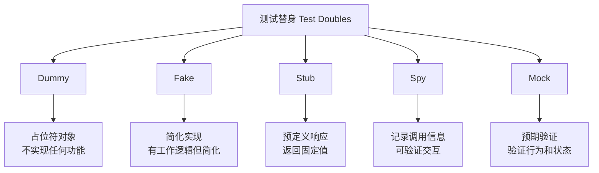

# Mock和Stub

## 📋 概述

Mock和Stub是软件测试中的重要概念，用于隔离被测试代码与其依赖项。通过使用这些测试替身（Test Doubles），我们可以编写快速、可靠且独立的单元测试，确保测试只关注被测试代码本身的逻辑。

## 🎯 学习目标

- 理解Mock、Stub、Spy等测试替身的概念和区别
- 掌握Jest中的模拟功能使用方法
- 学会在不同场景下选择合适的模拟策略
- 了解模拟的最佳实践和常见陷阱

## 📚 测试替身类型

### 测试替身分类



### 各类型特点对比

```javascript
const TestDoubleTypes = {
  DUMMY: {
    purpose: '占位符，满足接口要求',
    behavior: '不执行任何逻辑',
    example: 'null, undefined, 空对象',
    useCase: '参数填充，不会被实际调用'
  },
  
  FAKE: {
    purpose: '简化的工作实现',
    behavior: '有真实逻辑但简化',
    example: '内存数据库，简化的外部服务',
    useCase: '集成测试，复杂依赖的替换'
  },
  
  STUB: {
    purpose: '提供预定义的响应',
    behavior: '返回固定值或执行预设行为',
    example: 'mockReturnValue, mockResolvedValue',
    useCase: '控制依赖的返回值'
  },
  
  SPY: {
    purpose: '记录调用信息',
    behavior: '透传真实调用并记录',
    example: 'jest.spyOn, 调用统计',
    useCase: '验证方法调用，保留原有逻辑'
  },
  
  MOCK: {
    purpose: '验证交互行为',
    behavior: '预期调用方式和参数',
    example: 'jest.fn, 完整的模拟对象',
    useCase: '行为验证，交互测试'
  }
};
```

## 🛠 Jest中的模拟功能

### 基本Mock函数

```javascript
// basic-mocking.test.js
describe('Jest Mock Functions', () => {
  describe('创建Mock函数', () => {
    it('应该创建基本的mock函数', () => {
      const mockFn = jest.fn();
      
      // 调用mock函数
      mockFn('arg1', 'arg2');
      mockFn('arg3');
      
      // 验证调用
      expect(mockFn).toHaveBeenCalledTimes(2);
      expect(mockFn).toHaveBeenCalledWith('arg1', 'arg2');
      expect(mockFn).toHaveBeenLastCalledWith('arg3');
      expect(mockFn).toHaveBeenNthCalledWith(1, 'arg1', 'arg2');
    });
    
    it('应该设置返回值', () => {
      const mockFn = jest.fn();
      
      // 设置返回值
      mockFn.mockReturnValue('mocked result');
      expect(mockFn()).toBe('mocked result');
      
      // 设置一次性返回值
      mockFn.mockReturnValueOnce('first call');
      mockFn.mockReturnValueOnce('second call');
      
      expect(mockFn()).toBe('first call');
      expect(mockFn()).toBe('second call');
      expect(mockFn()).toBe('mocked result'); // 回到默认值
    });
    
    it('应该模拟异步返回值', async () => {
      const mockAsyncFn = jest.fn();
      
      // 模拟Promise resolve
      mockAsyncFn.mockResolvedValue('async success');
      await expect(mockAsyncFn()).resolves.toBe('async success');
      
      // 模拟Promise reject
      mockAsyncFn.mockRejectedValue(new Error('async error'));
      await expect(mockAsyncFn()).rejects.toThrow('async error');
      
      // 一次性异步值
      mockAsyncFn.mockResolvedValueOnce('once success');
      await expect(mockAsyncFn()).resolves.toBe('once success');
    });
    
    it('应该模拟实现', () => {
      const mockFn = jest.fn();
      
      // 设置实现
      mockFn.mockImplementation((x, y) => x + y);
      expect(mockFn(2, 3)).toBe(5);
      
      // 一次性实现
      mockFn.mockImplementationOnce((x, y) => x * y);
      expect(mockFn(2, 3)).toBe(6);
      expect(mockFn(2, 3)).toBe(5); // 回到默认实现
    });
  });
  
  describe('Mock函数信息', () => {
    it('应该提供调用信息', () => {
      const mockFn = jest.fn();
      
      mockFn('arg1', 'arg2');
      mockFn('arg3', 'arg4');
      
      // 调用信息
      expect(mockFn.mock.calls).toEqual([
        ['arg1', 'arg2'],
        ['arg3', 'arg4']
      ]);
      
      // 调用次数
      expect(mockFn.mock.calls.length).toBe(2);
      
      // 最后一次调用
      expect(mockFn.mock.lastCall).toEqual(['arg3', 'arg4']);
    });
    
    it('应该提供返回值信息', () => {
      const mockFn = jest.fn();
      
      mockFn.mockReturnValue('result1');
      mockFn();
      
      mockFn.mockReturnValue('result2');
      mockFn();
      
      expect(mockFn.mock.results).toEqual([
        { type: 'return', value: 'result1' },
        { type: 'return', value: 'result2' }
      ]);
    });
    
    it('应该提供实例信息', () => {
      const MockConstructor = jest.fn();
      
      const instance1 = new MockConstructor();
      const instance2 = new MockConstructor();
      
      expect(MockConstructor.mock.instances).toEqual([instance1, instance2]);
    });
  });
});
```

### 模块模拟

```javascript
// user-service.js - 被测试的服务
const axios = require('axios');
const emailService = require('./email-service');
const logger = require('./logger');

class UserService {
  constructor() {
    this.apiBaseUrl = 'https://api.example.com';
  }
  
  async createUser(userData) {
    try {
      // 验证用户数据
      if (!userData.email) {
        throw new Error('Email is required');
      }
      
      // 调用API创建用户
      const response = await axios.post(`${this.apiBaseUrl}/users`, userData);
      const user = response.data;
      
      // 发送欢迎邮件
      await emailService.sendWelcomeEmail(user.email, user.name);
      
      // 记录日志
      logger.info(`User created: ${user.id}`);
      
      return user;
    } catch (error) {
      logger.error(`Failed to create user: ${error.message}`);
      throw error;
    }
  }
  
  async getUser(id) {
    const response = await axios.get(`${this.apiBaseUrl}/users/${id}`);
    return response.data;
  }
  
  async updateUser(id, userData) {
    const response = await axios.put(`${this.apiBaseUrl}/users/${id}`, userData);
    return response.data;
  }
}

module.exports = UserService;
```

```javascript
// user-service.test.js
const axios = require('axios');
const emailService = require('./email-service');
const logger = require('./logger');
const UserService = require('./user-service');

// 完整模块模拟
jest.mock('axios');
jest.mock('./email-service');
jest.mock('./logger');

// 类型化的模拟对象
const mockedAxios = axios;
const mockedEmailService = emailService;
const mockedLogger = logger;

describe('UserService', () => {
  let userService;
  
  beforeEach(() => {
    userService = new UserService();
    // 清除所有模拟
    jest.clearAllMocks();
  });
  
  describe('createUser', () => {
    const userData = {
      name: 'John Doe',
      email: 'john@example.com'
    };
    
    const createdUser = {
      id: '123',
      name: 'John Doe',
      email: 'john@example.com',
      createdAt: '2023-01-01T00:00:00.000Z'
    };
    
    it('应该成功创建用户', async () => {
      // 设置模拟返回值
      mockedAxios.post.mockResolvedValue({ data: createdUser });
      mockedEmailService.sendWelcomeEmail.mockResolvedValue(true);
      
      const result = await userService.createUser(userData);
      
      // 验证结果
      expect(result).toEqual(createdUser);
      
      // 验证API调用
      expect(mockedAxios.post).toHaveBeenCalledWith(
        'https://api.example.com/users',
        userData
      );
      
      // 验证邮件发送
      expect(mockedEmailService.sendWelcomeEmail).toHaveBeenCalledWith(
        userData.email,
        userData.name
      );
      
      // 验证日志记录
      expect(mockedLogger.info).toHaveBeenCalledWith('User created: 123');
    });
    
    it('应该在邮箱缺失时抛出错误', async () => {
      const invalidUserData = { name: 'John Doe' };
      
      await expect(userService.createUser(invalidUserData))
        .rejects
        .toThrow('Email is required');
      
      // 验证没有调用外部服务
      expect(mockedAxios.post).not.toHaveBeenCalled();
      expect(mockedEmailService.sendWelcomeEmail).not.toHaveBeenCalled();
    });
    
    it('应该处理API错误', async () => {
      const apiError = new Error('API Error');
      mockedAxios.post.mockRejectedValue(apiError);
      
      await expect(userService.createUser(userData))
        .rejects
        .toThrow('API Error');
      
      // 验证错误日志
      expect(mockedLogger.error).toHaveBeenCalledWith(
        'Failed to create user: API Error'
      );
    });
    
    it('应该处理邮件发送失败', async () => {
      mockedAxios.post.mockResolvedValue({ data: createdUser });
      mockedEmailService.sendWelcomeEmail.mockRejectedValue(new Error('Email failed'));
      
      await expect(userService.createUser(userData))
        .rejects
        .toThrow('Email failed');
      
      // 验证用户仍然被创建了
      expect(mockedAxios.post).toHaveBeenCalled();
    });
  });
  
  describe('getUser', () => {
    it('应该获取用户信息', async () => {
      const user = { id: '123', name: 'John Doe' };
      mockedAxios.get.mockResolvedValue({ data: user });
      
      const result = await userService.getUser('123');
      
      expect(result).toEqual(user);
      expect(mockedAxios.get).toHaveBeenCalledWith(
        'https://api.example.com/users/123'
      );
    });
  });
});
```

### 部分模拟和Spy

```javascript
// math-utils.js
const MathUtils = {
  add: (a, b) => a + b,
  multiply: (a, b) => a * b,
  complex: (a, b) => {
    const sum = MathUtils.add(a, b);
    const product = MathUtils.multiply(a, b);
    return { sum, product };
  }
};

module.exports = MathUtils;
```

```javascript
// math-utils.test.js
const MathUtils = require('./math-utils');

describe('MathUtils Spying', () => {
  afterEach(() => {
    // 恢复所有spy
    jest.restoreAllMocks();
  });
  
  describe('Spy on existing methods', () => {
    it('应该spy方法调用但保留原有实现', () => {
      const addSpy = jest.spyOn(MathUtils, 'add');
      const multiplySpy = jest.spyOn(MathUtils, 'multiply');
      
      const result = MathUtils.complex(2, 3);
      
      expect(result).toEqual({ sum: 5, product: 6 });
      expect(addSpy).toHaveBeenCalledWith(2, 3);
      expect(multiplySpy).toHaveBeenCalledWith(2, 3);
    });
    
    it('应该能够修改spy的实现', () => {
      const addSpy = jest.spyOn(MathUtils, 'add')
        .mockImplementation((a, b) => a * 10 + b);
      
      const result = MathUtils.complex(2, 3);
      
      expect(result).toEqual({ sum: 23, product: 6 }); // add被修改了
      expect(addSpy).toHaveBeenCalledWith(2, 3);
    });
    
    it('应该能够一次性修改spy行为', () => {
      const addSpy = jest.spyOn(MathUtils, 'add');
      
      // 第一次调用返回特殊值
      addSpy.mockReturnValueOnce(100);
      
      expect(MathUtils.add(2, 3)).toBe(100);
      expect(MathUtils.add(2, 3)).toBe(5); // 恢复原实现
    });
  });
  
  describe('部分模块模拟', () => {
    it('应该只模拟部分方法', () => {
      // 只模拟add方法，保留其他方法
      jest.spyOn(MathUtils, 'add').mockReturnValue(999);
      
      const result = MathUtils.complex(2, 3);
      
      expect(result).toEqual({ sum: 999, product: 6 });
    });
  });
});
```

### 高级模拟技巧

```javascript
// advanced-mocking.test.js
describe('Advanced Mocking Techniques', () => {
  describe('条件模拟', () => {
    it('应该基于参数返回不同值', () => {
      const mockFn = jest.fn((x) => {
        if (x > 0) return 'positive';
        if (x < 0) return 'negative';
        return 'zero';
      });
      
      expect(mockFn(5)).toBe('positive');
      expect(mockFn(-3)).toBe('negative');
      expect(mockFn(0)).toBe('zero');
    });
    
    it('应该模拟链式调用', () => {
      const mockBuilder = {
        setName: jest.fn().mockReturnThis(),
        setAge: jest.fn().mockReturnThis(),
        build: jest.fn().mockReturnValue({ name: 'test', age: 25 })
      };
      
      const result = mockBuilder
        .setName('John')
        .setAge(30)
        .build();
      
      expect(result).toEqual({ name: 'test', age: 25 });
      expect(mockBuilder.setName).toHaveBeenCalledWith('John');
      expect(mockBuilder.setAge).toHaveBeenCalledWith(30);
    });
  });
  
  describe('异步模拟模式', () => {
    it('应该模拟延迟响应', async () => {
      const mockAsyncFn = jest.fn();
      
      // 模拟延迟
      mockAsyncFn.mockImplementation(() => 
        new Promise(resolve => 
          setTimeout(() => resolve('delayed result'), 100)
        )
      );
      
      const start = Date.now();
      const result = await mockAsyncFn();
      const duration = Date.now() - start;
      
      expect(result).toBe('delayed result');
      expect(duration).toBeGreaterThanOrEqual(90);
    });
    
    it('应该模拟渐进失败', async () => {
      const mockFn = jest.fn();
      
      // 前两次调用失败，第三次成功
      mockFn
        .mockRejectedValueOnce(new Error('First failure'))
        .mockRejectedValueOnce(new Error('Second failure'))
        .mockResolvedValue('Success');
      
      await expect(mockFn()).rejects.toThrow('First failure');
      await expect(mockFn()).rejects.toThrow('Second failure');
      await expect(mockFn()).resolves.toBe('Success');
    });
  });
  
  describe('Mock状态管理', () => {
    it('应该跟踪mock状态变化', () => {
      const mockFn = jest.fn();
      
      // 检查初始状态
      expect(mockFn.mock.calls).toEqual([]);
      
      mockFn('first');
      expect(mockFn.mock.calls).toHaveLength(1);
      
      mockFn('second');
      expect(mockFn.mock.calls).toHaveLength(2);
      
      // 清除调用历史
      mockFn.mockClear();
      expect(mockFn.mock.calls).toEqual([]);
    });
    
    it('应该重置mock配置', () => {
      const mockFn = jest.fn();
      
      mockFn.mockReturnValue('test');
      expect(mockFn()).toBe('test');
      
      // 重置所有配置
      mockFn.mockReset();
      expect(mockFn()).toBeUndefined();
      
      // 恢复到原始状态
      mockFn.mockRestore(); // 对jest.fn()无效，但对spyOn有效
    });
  });
});
```

## 🏗️ 复杂依赖模拟

### 类和构造函数模拟

```javascript
// database.js
class Database {
  constructor(connectionString) {
    this.connectionString = connectionString;
    this.isConnected = false;
  }
  
  async connect() {
    // 模拟连接逻辑
    this.isConnected = true;
    return 'Connected';
  }
  
  async query(sql, params) {
    if (!this.isConnected) {
      throw new Error('Database not connected');
    }
    
    // 模拟查询逻辑
    return { rows: [], affectedRows: 0 };
  }
  
  async close() {
    this.isConnected = false;
  }
}

module.exports = Database;
```

```javascript
// user-repository.js
const Database = require('./database');

class UserRepository {
  constructor(connectionString) {
    this.db = new Database(connectionString);
  }
  
  async init() {
    await this.db.connect();
  }
  
  async findById(id) {
    const result = await this.db.query('SELECT * FROM users WHERE id = ?', [id]);
    return result.rows[0] || null;
  }
  
  async create(userData) {
    const result = await this.db.query(
      'INSERT INTO users (name, email) VALUES (?, ?)',
      [userData.name, userData.email]
    );
    
    return {
      id: result.insertId,
      ...userData
    };
  }
  
  async close() {
    await this.db.close();
  }
}

module.exports = UserRepository;
```

```javascript
// user-repository.test.js
const Database = require('./database');
const UserRepository = require('./user-repository');

// 模拟整个Database类
jest.mock('./database');

describe('UserRepository', () => {
  let userRepository;
  let mockDatabase;
  
  beforeEach(() => {
    // 清除模拟
    jest.clearAllMocks();
    
    // 创建mock实例
    mockDatabase = new Database();
    
    userRepository = new UserRepository('test-connection');
  });
  
  describe('init', () => {
    it('应该连接数据库', async () => {
      mockDatabase.connect.mockResolvedValue('Connected');
      
      await userRepository.init();
      
      expect(mockDatabase.connect).toHaveBeenCalled();
    });
  });
  
  describe('findById', () => {
    it('应该查找并返回用户', async () => {
      const mockUser = { id: 1, name: 'John', email: 'john@example.com' };
      mockDatabase.query.mockResolvedValue({ rows: [mockUser] });
      
      const result = await userRepository.findById(1);
      
      expect(result).toEqual(mockUser);
      expect(mockDatabase.query).toHaveBeenCalledWith(
        'SELECT * FROM users WHERE id = ?',
        [1]
      );
    });
    
    it('应该在用户不存在时返回null', async () => {
      mockDatabase.query.mockResolvedValue({ rows: [] });
      
      const result = await userRepository.findById(999);
      
      expect(result).toBeNull();
    });
  });
  
  describe('create', () => {
    it('应该创建新用户', async () => {
      const userData = { name: 'Jane', email: 'jane@example.com' };
      mockDatabase.query.mockResolvedValue({ insertId: 2 });
      
      const result = await userRepository.create(userData);
      
      expect(result).toEqual({ id: 2, ...userData });
      expect(mockDatabase.query).toHaveBeenCalledWith(
        'INSERT INTO users (name, email) VALUES (?, ?)',
        [userData.name, userData.email]
      );
    });
  });
});
```

### 手动模拟

```javascript
// 手动模拟axios
// __mocks__/axios.js
module.exports = {
  get: jest.fn(() => Promise.resolve({ data: {} })),
  post: jest.fn(() => Promise.resolve({ data: {} })),
  put: jest.fn(() => Promise.resolve({ data: {} })),
  delete: jest.fn(() => Promise.resolve({ data: {} })),
  create: jest.fn(() => ({
    get: jest.fn(() => Promise.resolve({ data: {} })),
    post: jest.fn(() => Promise.resolve({ data: {} })),
    put: jest.fn(() => Promise.resolve({ data: {} })),
    delete: jest.fn(() => Promise.resolve({ data: {} }))
  }))
};
```

```javascript
// 使用手动模拟
// api-client.test.js
const axios = require('axios');
const ApiClient = require('./api-client');

// 使用手动模拟
jest.mock('axios');

describe('ApiClient with manual mock', () => {
  let apiClient;
  
  beforeEach(() => {
    apiClient = new ApiClient();
    jest.clearAllMocks();
  });
  
  it('应该使用手动模拟的axios', async () => {
    const mockData = { id: 1, name: 'Test' };
    axios.get.mockResolvedValue({ data: mockData });
    
    const result = await apiClient.getUser(1);
    
    expect(result).toEqual(mockData);
    expect(axios.get).toHaveBeenCalledWith('/users/1');
  });
});
```

## 🎭 模拟策略和模式

### 依赖注入模拟

```javascript
// user-service-di.js - 使用依赖注入的服务
class UserServiceDI {
  constructor(database, emailService, logger) {
    this.database = database;
    this.emailService = emailService;
    this.logger = logger;
  }
  
  async createUser(userData) {
    try {
      const user = await this.database.createUser(userData);
      await this.emailService.sendWelcomeEmail(user.email);
      this.logger.info(`User created: ${user.id}`);
      return user;
    } catch (error) {
      this.logger.error(`Failed to create user: ${error.message}`);
      throw error;
    }
  }
}

module.exports = UserServiceDI;
```

```javascript
// user-service-di.test.js
const UserServiceDI = require('./user-service-di');

describe('UserServiceDI', () => {
  let userService;
  let mockDatabase;
  let mockEmailService;
  let mockLogger;
  
  beforeEach(() => {
    // 创建mock依赖
    mockDatabase = {
      createUser: jest.fn()
    };
    
    mockEmailService = {
      sendWelcomeEmail: jest.fn()
    };
    
    mockLogger = {
      info: jest.fn(),
      error: jest.fn()
    };
    
    // 注入mock依赖
    userService = new UserServiceDI(mockDatabase, mockEmailService, mockLogger);
  });
  
  it('应该成功创建用户', async () => {
    const userData = { name: 'John', email: 'john@example.com' };
    const createdUser = { id: 1, ...userData };
    
    mockDatabase.createUser.mockResolvedValue(createdUser);
    mockEmailService.sendWelcomeEmail.mockResolvedValue(true);
    
    const result = await userService.createUser(userData);
    
    expect(result).toEqual(createdUser);
    expect(mockDatabase.createUser).toHaveBeenCalledWith(userData);
    expect(mockEmailService.sendWelcomeEmail).toHaveBeenCalledWith(userData.email);
    expect(mockLogger.info).toHaveBeenCalledWith('User created: 1');
  });
});
```

### 工厂模式模拟

```javascript
// mock-factory.js
class MockFactory {
  static createUserService(overrides = {}) {
    return {
      getUser: jest.fn().mockResolvedValue({ id: 1, name: 'Mock User' }),
      createUser: jest.fn().mockResolvedValue({ id: 2, name: 'Created User' }),
      updateUser: jest.fn().mockResolvedValue({ id: 1, name: 'Updated User' }),
      deleteUser: jest.fn().mockResolvedValue(true),
      ...overrides
    };
  }
  
  static createDatabase(overrides = {}) {
    return {
      connect: jest.fn().mockResolvedValue(true),
      query: jest.fn().mockResolvedValue({ rows: [], affectedRows: 0 }),
      close: jest.fn().mockResolvedValue(true),
      ...overrides
    };
  }
  
  static createHttpClient(overrides = {}) {
    return {
      get: jest.fn().mockResolvedValue({ status: 200, data: {} }),
      post: jest.fn().mockResolvedValue({ status: 201, data: {} }),
      put: jest.fn().mockResolvedValue({ status: 200, data: {} }),
      delete: jest.fn().mockResolvedValue({ status: 204 }),
      ...overrides
    };
  }
  
  static createLogger(overrides = {}) {
    return {
      debug: jest.fn(),
      info: jest.fn(),
      warn: jest.fn(),
      error: jest.fn(),
      ...overrides
    };
  }
}

module.exports = MockFactory;
```

```javascript
// using-mock-factory.test.js
const MockFactory = require('./mock-factory');
const OrderService = require('./order-service');

describe('OrderService with Mock Factory', () => {
  it('应该使用mock factory创建依赖', async () => {
    const mockUserService = MockFactory.createUserService({
      getUser: jest.fn().mockResolvedValue({
        id: 1,
        name: 'Premium User',
        tier: 'premium'
      })
    });
    
    const mockDatabase = MockFactory.createDatabase({
      query: jest.fn().mockResolvedValue({
        rows: [{ id: 1, total: 100 }],
        affectedRows: 1
      })
    });
    
    const orderService = new OrderService(mockUserService, mockDatabase);
    
    const order = await orderService.createOrder(1, [
      { productId: 1, quantity: 2 }
    ]);
    
    expect(order).toBeDefined();
    expect(mockUserService.getUser).toHaveBeenCalledWith(1);
    expect(mockDatabase.query).toHaveBeenCalled();
  });
});
```

## ⚠️ 模拟的最佳实践和陷阱

### 最佳实践

```javascript
// 好的模拟实践
describe('Good Mocking Practices', () => {
  describe('明确的模拟意图', () => {
    it('应该清楚地表达模拟的目的', () => {
      const mockEmailService = {
        sendEmail: jest.fn().mockResolvedValue({ messageId: '123' })
      };
      
      // 测试目的明确：验证邮件发送成功后的行为
      const userService = new UserService(mockEmailService);
      
      // ... 测试逻辑
    });
  });
  
  describe('最小化模拟范围', () => {
    it('应该只模拟必要的部分', () => {
      // 不好：模拟整个复杂对象
      // const mockService = jest.mock('./complex-service');
      
      // 好：只模拟需要的方法
      const mockDatabase = {
        findUser: jest.fn().mockResolvedValue({ id: 1 })
        // 不模拟不需要的方法
      };
      
      // ... 测试逻辑
    });
  });
  
  describe('验证交互而非实现', () => {
    it('应该验证行为而不是内部实现', () => {
      const mockEmailService = jest.fn();
      const userService = new UserService(mockEmailService);
      
      userService.notifyUser('123', 'Welcome');
      
      // 好：验证行为
      expect(mockEmailService).toHaveBeenCalledWith('123', 'Welcome');
      
      // 避免：验证内部实现细节
      // expect(mockEmailService.someInternalMethod).toHaveBeenCalled();
    });
  });
});
```

### 常见陷阱

```javascript
// 模拟陷阱示例
describe('Common Mocking Pitfalls', () => {
  describe('过度模拟', () => {
    it('应该避免模拟太多细节', () => {
      // 陷阱：模拟过于详细
      const overMockedService = {
        validateInput: jest.fn().mockReturnValue(true),
        sanitizeInput: jest.fn().mockReturnValue('clean'),
        processData: jest.fn().mockReturnValue('processed'),
        formatOutput: jest.fn().mockReturnValue('formatted'),
        logAction: jest.fn(),
        updateMetrics: jest.fn()
      };
      
      // 这样的测试变得脆弱，过于依赖实现细节
    });
  });
  
  describe('模拟泄漏', () => {
    it('应该避免测试间的模拟污染', () => {
      // 问题：没有清理模拟状态
      const mockFn = jest.fn();
      mockFn('test');
      
      // 在另一个测试中，这个调用信息仍然存在
      expect(mockFn).toHaveBeenCalledTimes(1);
      
      // 解决：使用beforeEach清理
      beforeEach(() => {
        jest.clearAllMocks();
      });
    });
  });
  
  describe('不现实的模拟', () => {
    it('应该保持模拟的现实性', () => {
      // 陷阱：不现实的模拟行为
      const unrealisticMock = jest.fn()
        .mockResolvedValue('instant success'); // 真实服务可能需要时间
      
      // 更好：模拟现实的行为
      const realisticMock = jest.fn()
        .mockImplementation(() => 
          new Promise(resolve => 
            setTimeout(() => resolve('success'), 10)
          )
        );
    });
  });
  
  describe('忽略错误情况', () => {
    it('应该测试错误路径', () => {
      const mockService = jest.fn();
      
      // 不仅测试成功情况
      mockService.mockResolvedValue('success');
      
      // 也要测试失败情况
      mockService.mockRejectedValue(new Error('Service unavailable'));
      
      // ... 测试错误处理逻辑
    });
  });
});
```

### 模拟重构安全性

```javascript
// refactor-safe-mocking.test.js
describe('Refactor-Safe Mocking', () => {
  it('应该编写对重构友好的模拟测试', () => {
    // 脆弱的测试：依赖具体实现
    const mockDatabase = {
      query: jest.fn().mockResolvedValue({ rows: [{ id: 1 }] })
    };
    
    // 如果实现改为使用findById而不是query，测试会失败
    
    // 更好的方式：关注行为而非实现
    const mockUserRepository = {
      findById: jest.fn().mockResolvedValue({ id: 1, name: 'User' })
    };
    
    // 这样即使内部实现改变，只要接口不变，测试仍然有效
  });
  
  it('应该使用接口而非具体实现', () => {
    // 定义接口约定
    const userServiceInterface = {
      async getUser(id) { throw new Error('Not implemented'); },
      async createUser(data) { throw new Error('Not implemented'); }
    };
    
    // 模拟接口而非具体类
    const mockUserService = {
      getUser: jest.fn().mockResolvedValue({ id: 1 }),
      createUser: jest.fn().mockResolvedValue({ id: 2 })
    };
    
    // 这样的测试更稳定
  });
});
```

## 📝 总结

Mock和Stub是单元测试的重要工具：

- **隔离依赖**：确保测试只关注被测代码
- **控制环境**：提供可预测的测试条件
- **验证交互**：检查组件间的协作
- **提高效率**：避免真实依赖的开销

关键在于适度使用，保持测试的现实性和可维护性。

## 🔗 相关资源

- [Jest Mock Functions](https://jestjs.io/docs/mock-functions)
- [测试替身模式](https://martinfowler.com/articles/mocksArentStubs.html)
- [Sinon.js模拟库](https://sinonjs.org/)
- [模拟最佳实践](https://blog.pragmatists.com/test-doubles-fakes-mocks-and-stubs-1a7491dfa3da)
