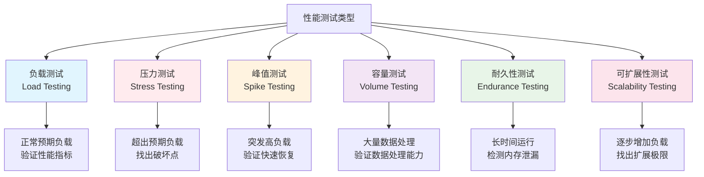

# 性能测试基础

## 📋 概述

性能测试是验证系统在特定工作负载下的响应时间、吞吐量、资源利用率和稳定性的测试方法。对于Node.js应用，性能测试帮助识别性能瓶颈、验证扩展能力，确保应用在生产环境中能够满足性能要求。

## 🎯 学习目标

- 理解性能测试的核心概念和指标
- 掌握Node.js应用性能测试的方法和工具
- 学会设计和执行各种类型的性能测试
- 了解性能测试结果分析和优化策略

## 📊 性能测试类型

### 性能测试分类



### 性能测试指标

```javascript
const PerformanceMetrics = {
  RESPONSE_TIME: {
    name: '响应时间',
    description: '从请求发送到响应接收的时间',
    types: {
      averageResponseTime: '平均响应时间',
      medianResponseTime: '中位数响应时间',
      percentileResponseTime: '百分位响应时间 (P95, P99)',
      maxResponseTime: '最大响应时间'
    },
    targets: {
      excellent: '< 100ms',
      good: '< 300ms',
      acceptable: '< 1000ms',
      poor: '> 1000ms'
    }
  },
  
  THROUGHPUT: {
    name: '吞吐量',
    description: '单位时间内处理的请求数量',
    measurements: {
      requestsPerSecond: 'RPS (Requests Per Second)',
      transactionsPerSecond: 'TPS (Transactions Per Second)',
      dataTransferRate: '数据传输速率'
    },
    factors: [
      '服务器硬件配置',
      '应用程序效率',
      '数据库性能',
      '网络带宽'
    ]
  },
  
  RESOURCE_UTILIZATION: {
    name: '资源利用率',
    metrics: {
      cpuUsage: 'CPU使用率',
      memoryUsage: '内存使用率',
      diskIO: '磁盘I/O',
      networkIO: '网络I/O',
      databaseConnections: '数据库连接数'
    },
    thresholds: {
      cpu: '< 80%',
      memory: '< 85%',
      disk: '< 90%'
    }
  },
  
  CONCURRENCY: {
    name: '并发能力',
    measurements: {
      concurrentUsers: '并发用户数',
      simultaneousConnections: '同时连接数',
      activeThreads: '活跃线程数'
    }
  },
  
  ERROR_RATE: {
    name: '错误率',
    types: {
      httpErrors: 'HTTP错误率 (4xx, 5xx)',
      timeoutErrors: '超时错误率',
      connectionErrors: '连接错误率'
    },
    target: '< 1%'
  }
};
```

## 🛠 Node.js性能测试工具

### 基准测试工具

```javascript
// benchmark.js - 微基准测试
const Benchmark = require('benchmark');

// 创建测试套件
const suite = new Benchmark.Suite();

// 测试不同的数组操作性能
const testArray = Array.from({ length: 10000 }, (_, i) => i);

suite
  // 使用for循环
  .add('for loop', function() {
    let sum = 0;
    for (let i = 0; i < testArray.length; i++) {
      sum += testArray[i];
    }
    return sum;
  })
  
  // 使用forEach
  .add('forEach', function() {
    let sum = 0;
    testArray.forEach(num => sum += num);
    return sum;
  })
  
  // 使用reduce
  .add('reduce', function() {
    return testArray.reduce((sum, num) => sum + num, 0);
  })
  
  // 使用for...of
  .add('for...of', function() {
    let sum = 0;
    for (const num of testArray) {
      sum += num;
    }
    return sum;
  })
  
  // 监听事件
  .on('cycle', function(event) {
    console.log(String(event.target));
  })
  
  .on('complete', function() {
    console.log('Fastest is ' + this.filter('fastest').map('name'));
  })
  
  // 运行测试
  .run({ async: true });
```

### HTTP负载测试工具

```javascript
// autocannon-test.js - 使用autocannon进行HTTP负载测试
const autocannon = require('autocannon');

async function runLoadTest() {
  console.log('Starting load test...');
  
  const result = await autocannon({
    url: 'http://localhost:3000',
    connections: 100,        // 并发连接数
    duration: 30,           // 测试持续时间（秒）
    pipelining: 1,          // 流水线请求数
    headers: {
      'Content-Type': 'application/json'
    },
    
    // 自定义请求
    requests: [
      {
        method: 'GET',
        path: '/api/users'
      },
      {
        method: 'POST',
        path: '/api/users',
        headers: {
          'Content-Type': 'application/json'
        },
        body: JSON.stringify({
          name: 'Test User',
          email: 'test@example.com'
        })
      },
      {
        method: 'GET',
        path: '/api/users/1'
      }
    ]
  });
  
  console.log('Load test completed:');
  console.log(`Requests: ${result.requests.total}`);
  console.log(`Duration: ${result.duration}s`);
  console.log(`RPS: ${result.requests.average}`);
  console.log(`Latency: ${result.latency.average}ms`);
  console.log(`Throughput: ${result.throughput.average} bytes/sec`);
  
  // 分析结果
  analyzeResults(result);
}

function analyzeResults(result) {
  const analysis = {
    performance: 'UNKNOWN',
    recommendations: []
  };
  
  // 分析响应时间
  if (result.latency.average < 100) {
    analysis.performance = 'EXCELLENT';
  } else if (result.latency.average < 300) {
    analysis.performance = 'GOOD';
  } else if (result.latency.average < 1000) {
    analysis.performance = 'ACCEPTABLE';
    analysis.recommendations.push('考虑优化响应时间');
  } else {
    analysis.performance = 'POOR';
    analysis.recommendations.push('需要严重关注响应时间问题');
  }
  
  // 分析错误率
  const errorRate = (result.errors / result.requests.total) * 100;
  if (errorRate > 1) {
    analysis.recommendations.push(`错误率过高: ${errorRate.toFixed(2)}%`);
  }
  
  // 分析吞吐量
  if (result.requests.average < 100) {
    analysis.recommendations.push('吞吐量较低，考虑性能优化');
  }
  
  console.log('\\nPerformance Analysis:');
  console.log(`Overall: ${analysis.performance}`);
  if (analysis.recommendations.length > 0) {
    console.log('Recommendations:');
    analysis.recommendations.forEach(rec => console.log(`- ${rec}`));
  }
}

// 执行测试
runLoadTest().catch(console.error);
```

### 内存和CPU性能监控

```javascript
// performance-monitor.js
const os = require('os');
const v8 = require('v8');

class PerformanceMonitor {
  constructor() {
    this.startTime = Date.now();
    this.measurements = [];
  }
  
  // 获取当前性能指标
  getCurrentMetrics() {
    const memUsage = process.memoryUsage();
    const cpuUsage = process.cpuUsage();
    const heapStats = v8.getHeapStatistics();
    
    return {
      timestamp: Date.now(),
      
      // 内存使用情况
      memory: {
        rss: memUsage.rss,                    // 常驻内存
        heapTotal: memUsage.heapTotal,        // 堆总大小
        heapUsed: memUsage.heapUsed,          // 已用堆内存
        external: memUsage.external,          // 外部内存
        arrayBuffers: memUsage.arrayBuffers   // ArrayBuffer内存
      },
      
      // CPU使用情况
      cpu: {
        user: cpuUsage.user,
        system: cpuUsage.system
      },
      
      // 堆统计
      heap: {
        totalHeapSize: heapStats.total_heap_size,
        usedHeapSize: heapStats.used_heap_size,
        heapSizeLimit: heapStats.heap_size_limit,
        mallocedMemory: heapStats.malloced_memory,
        peakMallocedMemory: heapStats.peak_malloced_memory
      },
      
      // 系统信息
      system: {
        loadAverage: os.loadavg(),
        freeMemory: os.freemem(),
        totalMemory: os.totalmem(),
        uptime: os.uptime()
      }
    };
  }
  
  // 开始监控
  startMonitoring(interval = 1000) {
    this.monitoringInterval = setInterval(() => {
      const metrics = this.getCurrentMetrics();
      this.measurements.push(metrics);
      
      // 检测内存泄漏
      this.detectMemoryLeak(metrics);
      
      // 检测CPU异常
      this.detectCPUAnomaly(metrics);
      
    }, interval);
  }
  
  // 停止监控
  stopMonitoring() {
    if (this.monitoringInterval) {
      clearInterval(this.monitoringInterval);
    }
  }
  
  // 检测内存泄漏
  detectMemoryLeak(currentMetrics) {
    if (this.measurements.length < 10) return;
    
    const recent = this.measurements.slice(-10);
    const memoryTrend = recent.map(m => m.memory.heapUsed);
    
    // 检查内存是否持续增长
    let increasingCount = 0;
    for (let i = 1; i < memoryTrend.length; i++) {
      if (memoryTrend[i] > memoryTrend[i-1]) {
        increasingCount++;
      }
    }
    
    if (increasingCount > 7) { // 70%的时间在增长
      console.warn('⚠️  Potential memory leak detected!');
      console.warn(`Current heap usage: ${(currentMetrics.memory.heapUsed / 1024 / 1024).toFixed(2)} MB`);
    }
  }
  
  // 检测CPU异常
  detectCPUAnomaly(currentMetrics) {
    const cpuCount = os.cpus().length;
    const loadAvg1min = currentMetrics.system.loadAverage[0];
    
    if (loadAvg1min > cpuCount * 0.8) {
      console.warn('⚠️  High CPU load detected!');
      console.warn(`Load average: ${loadAvg1min.toFixed(2)} (CPU cores: ${cpuCount})`);
    }
  }
  
  // 生成性能报告
  generateReport() {
    if (this.measurements.length === 0) {
      return { error: 'No measurements available' };
    }
    
    const report = {
      duration: Date.now() - this.startTime,
      totalMeasurements: this.measurements.length,
      
      memory: this.analyzeMemoryUsage(),
      cpu: this.analyzeCPUUsage(),
      trends: this.analyzeTrends()
    };
    
    return report;
  }
  
  analyzeMemoryUsage() {
    const memoryData = this.measurements.map(m => m.memory.heapUsed);
    
    return {
      min: Math.min(...memoryData),
      max: Math.max(...memoryData),
      average: memoryData.reduce((a, b) => a + b, 0) / memoryData.length,
      current: memoryData[memoryData.length - 1],
      growth: memoryData[memoryData.length - 1] - memoryData[0]
    };
  }
  
  analyzeCPUUsage() {
    const cpuData = this.measurements.map(m => m.cpu.user + m.cpu.system);
    
    return {
      min: Math.min(...cpuData),
      max: Math.max(...cpuData),
      average: cpuData.reduce((a, b) => a + b, 0) / cpuData.length
    };
  }
  
  analyzeTrends() {
    const memoryTrend = this.calculateTrend(
      this.measurements.map(m => m.memory.heapUsed)
    );
    
    return {
      memory: memoryTrend > 0 ? 'INCREASING' : memoryTrend < 0 ? 'DECREASING' : 'STABLE'
    };
  }
  
  calculateTrend(data) {
    if (data.length < 2) return 0;
    
    const n = data.length;
    const sumX = n * (n - 1) / 2;
    const sumY = data.reduce((a, b) => a + b, 0);
    const sumXY = data.reduce((sum, y, x) => sum + x * y, 0);
    const sumXX = n * (n - 1) * (2 * n - 1) / 6;
    
    return (n * sumXY - sumX * sumY) / (n * sumXX - sumX * sumX);
  }
}

module.exports = PerformanceMonitor;
```

## 🧪 实际性能测试示例

### Express应用性能测试

```javascript
// test-server.js - 测试用的Express服务器
const express = require('express');
const mongoose = require('mongoose');

const app = express();
app.use(express.json());

// 模拟数据库
const users = [];
let idCounter = 1;

// 用户模型
const userSchema = {
  id: Number,
  name: String,
  email: String,
  createdAt: Date
};

// API端点
app.get('/api/users', (req, res) => {
  // 模拟数据库查询延迟
  setTimeout(() => {
    res.json(users);
  }, Math.random() * 50); // 0-50ms随机延迟
});

app.post('/api/users', (req, res) => {
  const user = {
    id: idCounter++,
    name: req.body.name,
    email: req.body.email,
    createdAt: new Date()
  };
  
  users.push(user);
  
  // 模拟数据库写入延迟
  setTimeout(() => {
    res.status(201).json(user);
  }, Math.random() * 100); // 0-100ms随机延迟
});

app.get('/api/users/:id', (req, res) => {
  const user = users.find(u => u.id === parseInt(req.params.id));
  
  if (!user) {
    return res.status(404).json({ error: 'User not found' });
  }
  
  setTimeout(() => {
    res.json(user);
  }, Math.random() * 30);
});

// 计算密集型端点（测试CPU性能）
app.get('/api/compute/:n', (req, res) => {
  const n = parseInt(req.params.n);
  
  // 计算斐波那契数列
  function fibonacci(num) {
    if (num < 2) return num;
    return fibonacci(num - 1) + fibonacci(num - 2);
  }
  
  const result = fibonacci(n);
  res.json({ input: n, result });
});

// 内存密集型端点（测试内存性能）
app.get('/api/memory/:size', (req, res) => {
  const size = parseInt(req.params.size);
  
  // 创建大数组
  const largeArray = new Array(size).fill(0).map((_, i) => ({
    id: i,
    data: `Data item ${i}`,
    timestamp: Date.now()
  }));
  
  res.json({
    size: largeArray.length,
    sampleData: largeArray.slice(0, 5)
  });
});

// 健康检查端点
app.get('/health', (req, res) => {
  const usage = process.memoryUsage();
  
  res.json({
    status: 'healthy',
    uptime: process.uptime(),
    memory: {
      rss: `${Math.round(usage.rss / 1024 / 1024)} MB`,
      heapTotal: `${Math.round(usage.heapTotal / 1024 / 1024)} MB`,
      heapUsed: `${Math.round(usage.heapUsed / 1024 / 1024)} MB`
    }
  });
});

const PORT = process.env.PORT || 3000;
app.listen(PORT, () => {
  console.log(`Test server running on port ${PORT}`);
});

module.exports = app;
```

### 综合性能测试套件

```javascript
// performance-test-suite.js
const autocannon = require('autocannon');
const PerformanceMonitor = require('./performance-monitor');

class PerformanceTestSuite {
  constructor(baseUrl = 'http://localhost:3000') {
    this.baseUrl = baseUrl;
    this.monitor = new PerformanceMonitor();
    this.results = {};
  }
  
  async runCompleteTestSuite() {
    console.log('🚀 Starting comprehensive performance test suite...');
    
    // 启动性能监控
    this.monitor.startMonitoring(1000);
    
    try {
      // 1. 基础负载测试
      this.results.loadTest = await this.runLoadTest();
      
      // 2. 压力测试
      this.results.stressTest = await this.runStressTest();
      
      // 3. 峰值测试
      this.results.spikeTest = await this.runSpikeTest();
      
      // 4. CPU密集型测试
      this.results.cpuTest = await this.runCPUIntensiveTest();
      
      // 5. 内存密集型测试
      this.results.memoryTest = await this.runMemoryIntensiveTest();
      
      // 6. 并发测试
      this.results.concurrencyTest = await this.runConcurrencyTest();
      
    } finally {
      // 停止监控
      this.monitor.stopMonitoring();
    }
    
    // 生成综合报告
    return this.generateComprehensiveReport();
  }
  
  async runLoadTest() {
    console.log('\\n📊 Running load test...');
    
    return await autocannon({
      url: this.baseUrl,
      connections: 50,
      duration: 30,
      requests: [
        { method: 'GET', path: '/api/users' },
        { method: 'GET', path: '/health' }
      ]
    });
  }
  
  async runStressTest() {
    console.log('\\n🔥 Running stress test...');
    
    return await autocannon({
      url: this.baseUrl,
      connections: 200,
      duration: 60,
      requests: [
        { method: 'GET', path: '/api/users' },
        {
          method: 'POST',
          path: '/api/users',
          headers: { 'Content-Type': 'application/json' },
          body: JSON.stringify({
            name: 'Stress Test User',
            email: 'stress@test.com'
          })
        }
      ]
    });
  }
  
  async runSpikeTest() {
    console.log('\\n⚡ Running spike test...');
    
    // 峰值测试：短时间内大量并发
    return await autocannon({
      url: this.baseUrl,
      connections: 500,
      duration: 10,
      path: '/api/users'
    });
  }
  
  async runCPUIntensiveTest() {
    console.log('\\n🧮 Running CPU intensive test...');
    
    return await autocannon({
      url: this.baseUrl,
      connections: 20,
      duration: 30,
      path: '/api/compute/30' // 计算斐波那契数列
    });
  }
  
  async runMemoryIntensiveTest() {
    console.log('\\n💾 Running memory intensive test...');
    
    return await autocannon({
      url: this.baseUrl,
      connections: 10,
      duration: 20,
      path: '/api/memory/100000' // 创建大数组
    });
  }
  
  async runConcurrencyTest() {
    console.log('\\n👥 Running concurrency test...');
    
    // 测试不同并发级别
    const concurrencyLevels = [10, 50, 100, 200];
    const results = {};
    
    for (const level of concurrencyLevels) {
      console.log(`  Testing ${level} concurrent connections...`);
      
      results[level] = await autocannon({
        url: this.baseUrl,
        connections: level,
        duration: 15,
        path: '/api/users'
      });
      
      // 等待一段时间让系统恢复
      await new Promise(resolve => setTimeout(resolve, 5000));
    }
    
    return results;
  }
  
  generateComprehensiveReport() {
    const report = {
      timestamp: new Date().toISOString(),
      systemInfo: this.monitor.generateReport(),
      testResults: {}
    };
    
    // 分析各项测试结果
    Object.keys(this.results).forEach(testType => {
      const result = this.results[testType];
      
      if (testType === 'concurrencyTest') {
        report.testResults[testType] = this.analyzeConcurrencyResults(result);
      } else {
        report.testResults[testType] = this.analyzeTestResult(result);
      }
    });
    
    // 生成总体评估
    report.overallAssessment = this.generateOverallAssessment(report);
    
    // 生成改进建议
    report.recommendations = this.generateRecommendations(report);
    
    return report;
  }
  
  analyzeTestResult(result) {
    const analysis = {
      requests: {
        total: result.requests.total,
        average: result.requests.average,
        min: result.requests.min,
        max: result.requests.max
      },
      latency: {
        average: result.latency.average,
        min: result.latency.min,
        max: result.latency.max,
        p99: result.latency.p99
      },
      throughput: {
        average: result.throughput.average,
        min: result.throughput.min,
        max: result.throughput.max
      },
      errors: result.errors,
      timeouts: result.timeouts
    };
    
    // 性能等级评估
    analysis.grade = this.calculatePerformanceGrade(analysis);
    
    return analysis;
  }
  
  analyzeConcurrencyResults(results) {
    const analysis = {
      scalability: {},
      breakdown: {}
    };
    
    Object.keys(results).forEach(level => {
      const result = results[level];
      analysis.breakdown[level] = this.analyzeTestResult(result);
    });
    
    // 分析可扩展性趋势
    const throughputTrend = Object.keys(results).map(level => ({
      connections: parseInt(level),
      rps: results[level].requests.average
    }));
    
    analysis.scalability.linear = this.assessLinearScaling(throughputTrend);
    analysis.scalability.breakdown = this.findScalingBreakdown(throughputTrend);
    
    return analysis;
  }
  
  calculatePerformanceGrade(analysis) {
    let score = 100;
    
    // 响应时间评分
    if (analysis.latency.average > 1000) score -= 30;
    else if (analysis.latency.average > 500) score -= 20;
    else if (analysis.latency.average > 200) score -= 10;
    
    // 吞吐量评分
    if (analysis.requests.average < 100) score -= 20;
    else if (analysis.requests.average < 500) score -= 10;
    
    // 错误率评分
    const errorRate = analysis.errors / analysis.requests.total;
    if (errorRate > 0.05) score -= 30;
    else if (errorRate > 0.01) score -= 15;
    
    if (score >= 90) return 'A';
    if (score >= 80) return 'B';
    if (score >= 70) return 'C';
    if (score >= 60) return 'D';
    return 'F';
  }
  
  assessLinearScaling(throughputTrend) {
    // 简单的线性回归分析
    const n = throughputTrend.length;
    const sumX = throughputTrend.reduce((sum, p) => sum + p.connections, 0);
    const sumY = throughputTrend.reduce((sum, p) => sum + p.rps, 0);
    const sumXY = throughputTrend.reduce((sum, p) => sum + p.connections * p.rps, 0);
    const sumXX = throughputTrend.reduce((sum, p) => sum + p.connections * p.connections, 0);
    
    const slope = (n * sumXY - sumX * sumY) / (n * sumXX - sumX * sumX);
    const correlation = slope > 0.5; // 简化的相关性判断
    
    return {
      isLinear: correlation,
      slope: slope.toFixed(3),
      efficiency: correlation ? 'GOOD' : 'POOR'
    };
  }
  
  findScalingBreakdown(throughputTrend) {
    // 寻找性能下降点
    let maxRPS = 0;
    let breakdownPoint = null;
    
    throughputTrend.forEach(point => {
      if (point.rps > maxRPS) {
        maxRPS = point.rps;
      } else if (point.rps < maxRPS * 0.9) {
        breakdownPoint = point.connections;
      }
    });
    
    return breakdownPoint;
  }
  
  generateOverallAssessment(report) {
    const grades = Object.values(report.testResults)
      .filter(result => result.grade)
      .map(result => result.grade);
    
    const gradePoints = {
      'A': 4, 'B': 3, 'C': 2, 'D': 1, 'F': 0
    };
    
    const avgGrade = grades.reduce((sum, grade) => sum + gradePoints[grade], 0) / grades.length;
    
    let overallGrade;
    if (avgGrade >= 3.5) overallGrade = 'A';
    else if (avgGrade >= 2.5) overallGrade = 'B';
    else if (avgGrade >= 1.5) overallGrade = 'C';
    else if (avgGrade >= 0.5) overallGrade = 'D';
    else overallGrade = 'F';
    
    return {
      grade: overallGrade,
      score: avgGrade.toFixed(2),
      status: avgGrade >= 2.5 ? 'PASS' : 'NEEDS_IMPROVEMENT'
    };
  }
  
  generateRecommendations(report) {
    const recommendations = [];
    
    // 基于测试结果生成建议
    Object.keys(report.testResults).forEach(testType => {
      const result = report.testResults[testType];
      
      if (testType === 'loadTest' && result.grade === 'F') {
        recommendations.push({
          priority: 'HIGH',
          category: 'Performance',
          message: '基础负载测试失败，需要立即优化应用性能'
        });
      }
      
      if (testType === 'memoryTest' && result.latency?.average > 2000) {
        recommendations.push({
          priority: 'MEDIUM',
          category: 'Memory',
          message: '内存密集型操作响应缓慢，考虑优化内存使用'
        });
      }
      
      if (testType === 'concurrencyTest') {
        const breakdown = result.scalability?.breakdown;
        if (breakdown && breakdown < 200) {
          recommendations.push({
            priority: 'HIGH',
            category: 'Scalability',
            message: `并发能力有限，在${breakdown}个连接时性能下降`
          });
        }
      }
    });
    
    // 基于系统监控生成建议
    const systemInfo = report.systemInfo;
    if (systemInfo.memory?.growth > 50 * 1024 * 1024) { // 50MB增长
      recommendations.push({
        priority: 'HIGH',
        category: 'Memory Leak',
        message: '检测到潜在内存泄漏，需要检查代码'
      });
    }
    
    return recommendations;
  }
}

module.exports = PerformanceTestSuite;
```

### 使用示例

```javascript
// run-performance-tests.js
const PerformanceTestSuite = require('./performance-test-suite');

async function main() {
  const testSuite = new PerformanceTestSuite('http://localhost:3000');
  
  try {
    const report = await testSuite.runCompleteTestSuite();
    
    console.log('\\n📋 Performance Test Report');
    console.log('============================');
    console.log(`Overall Grade: ${report.overallAssessment.grade}`);
    console.log(`Status: ${report.overallAssessment.status}`);
    
    console.log('\\nTest Results:');
    Object.keys(report.testResults).forEach(testType => {
      const result = report.testResults[testType];
      if (result.grade) {
        console.log(`${testType}: ${result.grade}`);
      }
    });
    
    if (report.recommendations.length > 0) {
      console.log('\\n💡 Recommendations:');
      report.recommendations.forEach((rec, index) => {
        console.log(`${index + 1}. [${rec.priority}] ${rec.message}`);
      });
    }
    
    // 保存详细报告
    const fs = require('fs');
    fs.writeFileSync(
      `performance-report-${Date.now()}.json`,
      JSON.stringify(report, null, 2)
    );
    
  } catch (error) {
    console.error('Performance test failed:', error);
  }
}

// 运行测试
main();
```

## 📝 性能测试最佳实践

### 测试环境准备

```javascript
const PerformanceTestBestPractices = {
  ENVIRONMENT_SETUP: {
    principles: [
      '使用与生产环境相似的硬件配置',
      '网络条件应模拟真实环境',
      '数据库应包含生产级别的数据量',
      '确保测试环境的稳定性和一致性'
    ],
    
    preparation: [
      '清理系统缓存和临时文件',
      '关闭不必要的后台进程',
      '预热应用程序和数据库连接池',
      '设置监控和日志记录'
    ]
  },
  
  TEST_DATA_MANAGEMENT: {
    strategies: [
      '使用真实的生产数据子集',
      '生成符合实际分布的测试数据',
      '考虑数据的时间分布特征',
      '包含各种边界条件的数据'
    ],
    
    considerations: [
      '数据隐私和安全要求',
      '数据一致性和完整性',
      '测试可重复性要求'
    ]
  },
  
  EXECUTION_STRATEGY: {
    phases: [
      '基线测试：建立性能基准',
      '增量测试：逐步增加负载',
      '峰值测试：测试极限能力',
      '恢复测试：验证恢复能力'
    ],
    
    monitoring: [
      '实时监控系统资源',
      '记录应用程序指标',
      '捕获错误和异常',
      '分析网络和数据库性能'
    ]
  }
};
```

## 📝 总结

性能测试是确保Node.js应用质量的关键环节：

- **全面覆盖**：负载、压力、峰值、容量等多种测试类型
- **科学方法**：基于指标的量化分析和评估
- **工具支持**：利用专业工具进行自动化测试
- **持续改进**：基于测试结果持续优化性能

性能测试应该成为开发流程的重要组成部分，确保应用在生产环境中的稳定性和用户体验。

## 🔗 相关资源

- [Autocannon负载测试工具](https://github.com/mcollina/autocannon)
- [Benchmark.js微基准测试](https://benchmarkjs.com/)
- [Node.js性能最佳实践](https://nodejs.org/en/docs/guides/simple-profiling/)
- [Web性能测试指南](https://web.dev/performance/)
