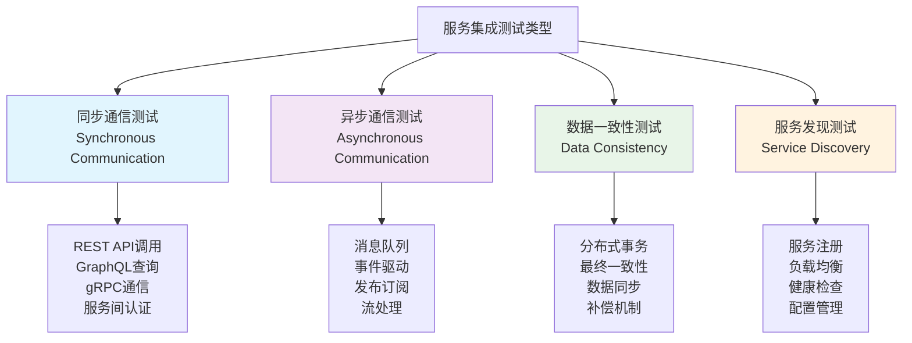

# 服务集成测试

## 📋 概述

服务集成测试专注于验证微服务架构中不同服务之间的交互和协作。在Node.js微服务生态中，服务集成测试确保服务间API调用、消息传递、数据一致性、事务处理等关键集成点正常工作，是构建可靠分布式系统的重要保障。

## 🎯 学习目标

- 理解微服务集成测试的核心概念和挑战
- 掌握服务间通信测试的设计和实施
- 学会契约测试、消息队列测试等关键技术
- 了解分布式系统测试的最佳实践和工具

## 🏗️ 微服务集成测试架构

### 服务集成测试分类



### 微服务测试策略

```javascript
const MicroserviceTestStrategy = {
  ISOLATION_LEVELS: {
    unitLevel: {
      scope: '单个服务内部逻辑',
      dependencies: '全部Mock',
      speed: 'fastest',
      confidence: 'low',
      maintenance: 'low'
    },
    
    serviceLevel: {
      scope: '单个服务完整功能',
      dependencies: '外部依赖Mock，内部真实',
      speed: 'fast',
      confidence: 'medium',
      maintenance: 'medium'
    },
    
    integrationLevel: {
      scope: '服务间交互',
      dependencies: '关键服务真实，其他Mock',
      speed: 'medium',
      confidence: 'high',
      maintenance: 'high'
    },
    
    systemLevel: {
      scope: '完整系统',
      dependencies: '所有服务真实',
      speed: 'slow',
      confidence: 'highest',
      maintenance: 'highest'
    }
  },
  
  TESTING_PATTERNS: {
    contractTesting: {
      purpose: '验证API契约一致性',
      tools: ['Pact', 'Spring Cloud Contract', 'OpenAPI'],
      benefits: ['早期发现接口变更', '独立开发验证', '向后兼容性保证']
    },
    
    stubTesting: {
      purpose: '模拟外部服务行为',
      tools: ['WireMock', 'MockServer', 'JSON Server'],
      benefits: ['快速反馈', '控制测试场景', '避免外部依赖']
    },
    
    testContainers: {
      purpose: '轻量级集成环境',
      tools: ['Testcontainers', 'Docker Compose', 'Kind'],
      benefits: ['真实环境', '隔离性好', '可重复性强']
    }
  }
};
```

## 🤝 契约测试实现

### Pact契约测试

```javascript
// pact-setup.js
const { Pact } = require('@pact-foundation/pact');
const path = require('path');

class PactTestSetup {
  constructor() {
    this.providers = new Map();
    this.consumers = new Map();
  }
  
  // 消费者端设置
  setupConsumer(consumerName, providerName, options = {}) {
    const defaultOptions = {
      consumer: consumerName,
      provider: providerName,
      port: options.port || 1234,
      log: path.resolve(process.cwd(), 'logs', 'pact.log'),
      dir: path.resolve(process.cwd(), 'pacts'),
      logLevel: 'INFO',
      spec: 2
    };
    
    const pact = new Pact({ ...defaultOptions, ...options });
    this.consumers.set(`${consumerName}-${providerName}`, pact);
    
    return pact;
  }
  
  // 获取消费者Pact实例
  getConsumerPact(consumerName, providerName) {
    return this.consumers.get(`${consumerName}-${providerName}`);
  }
  
  // 清理所有Pact实例
  async cleanup() {
    for (const [key, pact] of this.consumers) {
      try {
        await pact.finalize();
        console.log(`✅ Pact finalized: ${key}`);
      } catch (error) {
        console.warn(`⚠️  Failed to finalize pact ${key}:`, error.message);
      }
    }
    
    this.consumers.clear();
    this.providers.clear();
  }
}

module.exports = new PactTestSetup();
```

### 消费者契约测试

```javascript
// tests/contract/user-service-consumer.test.js
const { Matchers } = require('@pact-foundation/pact');
const pactSetup = require('./pact-setup');
const UserApiClient = require('../../src/clients/user-api-client');

describe('User Service Consumer Contract', () => {
  let pact;
  let userApiClient;
  
  beforeAll(async () => {
    pact = pactSetup.setupConsumer('order-service', 'user-service', {
      port: 1234
    });
    
    await pact.setup();
    
    userApiClient = new UserApiClient('http://localhost:1234');
  });
  
  afterAll(async () => {
    await pact.finalize();
  });
  
  afterEach(async () => {
    await pact.verify();
  });
  
  describe('获取用户信息', () => {
    it('应该返回有效用户数据', async () => {
      // 定义期望的交互
      const expectedInteraction = {
        state: 'user with ID 123 exists',
        uponReceiving: 'a request for user 123',
        withRequest: {
          method: 'GET',
          path: '/api/users/123',
          headers: {
            'Accept': 'application/json',
            'Authorization': Matchers.like('Bearer token123')
          }
        },
        willRespondWith: {
          status: 200,
          headers: {
            'Content-Type': 'application/json'
          },
          body: {
            id: Matchers.like(123),
            name: Matchers.like('John Doe'),
            email: Matchers.like('john@example.com'),
            createdAt: Matchers.iso8601DateTime(),
            profile: {
              avatar: Matchers.like('https://example.com/avatar.jpg'),
              bio: Matchers.like('Software developer')
            }
          }
        }
      };
      
      await pact.addInteraction(expectedInteraction);
      
      // 执行实际的API调用
      const user = await userApiClient.getUser(123, 'Bearer token123');
      
      // 验证返回的数据结构
      expect(user).toMatchObject({
        id: expect.any(Number),
        name: expect.any(String),
        email: expect.any(String),
        createdAt: expect.any(String),
        profile: {
          avatar: expect.any(String),
          bio: expect.any(String)
        }
      });
      
      expect(user.id).toBe(123);
      expect(user.name).toBe('John Doe');
    });
    
    it('应该处理用户不存在的情况', async () => {
      const expectedInteraction = {
        state: 'user with ID 999 does not exist',
        uponReceiving: 'a request for non-existent user 999',
        withRequest: {
          method: 'GET',
          path: '/api/users/999',
          headers: {
            'Accept': 'application/json',
            'Authorization': Matchers.like('Bearer token123')
          }
        },
        willRespondWith: {
          status: 404,
          headers: {
            'Content-Type': 'application/json'
          },
          body: {
            error: 'User not found',
            code: 'USER_NOT_FOUND'
          }
        }
      };
      
      await pact.addInteraction(expectedInteraction);
      
      await expect(userApiClient.getUser(999, 'Bearer token123'))
        .rejects
        .toThrow('User not found');
    });
    
    it('应该处理认证失败', async () => {
      const expectedInteraction = {
        state: 'invalid authentication token',
        uponReceiving: 'a request with invalid token',
        withRequest: {
          method: 'GET',
          path: '/api/users/123',
          headers: {
            'Accept': 'application/json',
            'Authorization': 'Bearer invalid-token'
          }
        },
        willRespondWith: {
          status: 401,
          headers: {
            'Content-Type': 'application/json'
          },
          body: {
            error: 'Unauthorized',
            code: 'INVALID_TOKEN'
          }
        }
      };
      
      await pact.addInteraction(expectedInteraction);
      
      await expect(userApiClient.getUser(123, 'Bearer invalid-token'))
        .rejects
        .toThrow('Unauthorized');
    });
  });
  
  describe('创建用户', () => {
    it('应该成功创建新用户', async () => {
      const newUserData = {
        name: 'Jane Smith',
        email: 'jane@example.com',
        password: 'securepassword'
      };
      
      const expectedInteraction = {
        state: 'create user is available',
        uponReceiving: 'a request to create a new user',
        withRequest: {
          method: 'POST',
          path: '/api/users',
          headers: {
            'Content-Type': 'application/json',
            'Accept': 'application/json',
            'Authorization': Matchers.like('Bearer token123')
          },
          body: {
            name: Matchers.like(newUserData.name),
            email: Matchers.like(newUserData.email),
            password: Matchers.like(newUserData.password)
          }
        },
        willRespondWith: {
          status: 201,
          headers: {
            'Content-Type': 'application/json'
          },
          body: {
            id: Matchers.like(456),
            name: newUserData.name,
            email: newUserData.email,
            createdAt: Matchers.iso8601DateTime()
          }
        }
      };
      
      await pact.addInteraction(expectedInteraction);
      
      const createdUser = await userApiClient.createUser(newUserData, 'Bearer token123');
      
      expect(createdUser).toMatchObject({
        id: expect.any(Number),
        name: newUserData.name,
        email: newUserData.email,
        createdAt: expect.any(String)
      });
    });
  });
});
```

### 提供者契约验证

```javascript
// tests/contract/user-service-provider.test.js
const { Verifier } = require('@pact-foundation/pact');
const path = require('path');
const app = require('../../src/app');
const DatabaseSetup = require('../helpers/database-setup');

describe('User Service Provider Contract Verification', () => {
  let server;
  let dbSetup;
  
  beforeAll(async () => {
    // 设置测试数据库
    dbSetup = new DatabaseSetup();
    await dbSetup.setup();
    
    // 启动应用服务器
    server = app.listen(3000);
    console.log('Provider server started on port 3000');
  });
  
  afterAll(async () => {
    if (server) {
      server.close();
    }
    await dbSetup.cleanup();
  });
  
  it('验证与order-service的契约', async () => {
    const opts = {
      provider: 'user-service',
      providerBaseUrl: 'http://localhost:3000',
      
      // Pact文件位置
      pactUrls: [
        path.resolve(__dirname, '../../pacts/order-service-user-service.json')
      ],
      
      // 状态处理器
      stateHandlers: {
        'user with ID 123 exists': async () => {
          // 创建测试用户数据
          await dbSetup.createUser({
            id: 123,
            name: 'John Doe',
            email: 'john@example.com',
            profile: {
              avatar: 'https://example.com/avatar.jpg',
              bio: 'Software developer'
            }
          });
        },
        
        'user with ID 999 does not exist': async () => {
          // 确保用户不存在
          await dbSetup.deleteUser(999);
        },
        
        'invalid authentication token': async () => {
          // 不需要特殊处理，应用会自动验证token
        },
        
        'create user is available': async () => {
          // 确保系统可以创建用户
          await dbSetup.clearUsers();
        }
      },
      
      // 请求过滤器（添加认证等）
      requestFilter: (req, res, next) => {
        // 为测试请求添加有效的认证token
        if (req.headers.authorization && req.headers.authorization.includes('token123')) {
          req.user = { id: 1, role: 'user' };
        }
        next();
      },
      
      // 日志配置
      logLevel: 'INFO',
      
      // 发布验证结果到Pact Broker
      publishVerificationResult: process.env.CI === 'true',
      providerVersion: process.env.GIT_COMMIT || '1.0.0'
    };
    
    const verifier = new Verifier(opts);
    return verifier.verifyProvider();
  });
});
```

## 📨 消息队列集成测试

### RabbitMQ集成测试

```javascript
// tests/integration/message-queue.test.js
const amqp = require('amqplib');
const { v4: uuidv4 } = require('uuid');
const OrderService = require('../../src/services/order-service');
const PaymentService = require('../../src/services/payment-service');

describe('Message Queue Integration Tests', () => {
  let connection;
  let channel;
  let orderService;
  let paymentService;
  
  beforeAll(async () => {
    // 连接到测试RabbitMQ实例
    connection = await amqp.connect(process.env.RABBITMQ_URL || 'amqp://localhost');
    channel = await connection.createChannel();
    
    // 声明测试队列和交换机
    await setupTestQueues();
    
    orderService = new OrderService(channel);
    paymentService = new PaymentService(channel);
  });
  
  afterAll(async () => {
    if (connection) {
      await connection.close();
    }
  });
  
  beforeEach(async () => {
    // 清空队列
    await channel.purgeQueue('order.created');
    await channel.purgeQueue('payment.processed');
    await channel.purgeQueue('order.updated');
  });
  
  async function setupTestQueues() {
    // 声明交换机
    await channel.assertExchange('order-events', 'topic', { durable: false });
    await channel.assertExchange('payment-events', 'topic', { durable: false });
    
    // 声明队列
    await channel.assertQueue('order.created', { durable: false });
    await channel.assertQueue('payment.processed', { durable: false });
    await channel.assertQueue('order.updated', { durable: false });
    
    // 绑定队列到交换机
    await channel.bindQueue('order.created', 'order-events', 'order.created');
    await channel.bindQueue('payment.processed', 'payment-events', 'payment.processed');
    await channel.bindQueue('order.updated', 'order-events', 'order.updated');
  }
  
  describe('订单创建流程', () => {
    it('应该在订单创建后发送消息', async () => {
      const orderData = {
        userId: 123,
        items: [
          { productId: 'prod-1', quantity: 2, price: 29.99 },
          { productId: 'prod-2', quantity: 1, price: 49.99 }
        ],
        totalAmount: 109.97
      };
      
      // 监听订单创建事件
      const messagePromise = new Promise((resolve) => {
        channel.consume('order.created', (msg) => {
          if (msg) {
            const content = JSON.parse(msg.content.toString());
            channel.ack(msg);
            resolve(content);
          }
        });
      });
      
      // 创建订单
      const order = await orderService.createOrder(orderData);
      
      // 验证消息被发送
      const receivedMessage = await messagePromise;
      
      expect(receivedMessage).toMatchObject({
        orderId: order.id,
        userId: orderData.userId,
        totalAmount: orderData.totalAmount,
        status: 'pending'
      });
      
      expect(receivedMessage.createdAt).toBeDefined();
      expect(receivedMessage.eventType).toBe('ORDER_CREATED');
    });
    
    it('应该处理支付完成事件', async () => {
      // 先创建一个订单
      const order = await orderService.createOrder({
        userId: 456,
        items: [{ productId: 'prod-3', quantity: 1, price: 99.99 }],
        totalAmount: 99.99
      });
      
      // 监听订单更新事件
      const orderUpdatePromise = new Promise((resolve) => {
        channel.consume('order.updated', (msg) => {
          if (msg) {
            const content = JSON.parse(msg.content.toString());
            channel.ack(msg);
            resolve(content);
          }
        });
      });
      
      // 模拟支付完成事件
      const paymentEvent = {
        orderId: order.id,
        paymentId: uuidv4(),
        amount: 99.99,
        status: 'completed',
        processedAt: new Date().toISOString()
      };
      
      // 发送支付完成消息
      await channel.publish(
        'payment-events',
        'payment.processed',
        Buffer.from(JSON.stringify(paymentEvent)),
        { messageId: uuidv4() }
      );
      
      // 等待订单服务处理支付事件并更新订单
      const orderUpdateEvent = await orderUpdatePromise;
      
      expect(orderUpdateEvent).toMatchObject({
        orderId: order.id,
        status: 'paid',
        paymentId: paymentEvent.paymentId
      });
    });
  });
  
  describe('消息处理可靠性', () => {
    it('应该处理重复消息', async () => {
      const messageId = uuidv4();
      const orderData = {
        userId: 789,
        items: [{ productId: 'prod-4', quantity: 1, price: 19.99 }],
        totalAmount: 19.99
      };
      
      // 发送相同的消息两次
      const message = {
        messageId,
        eventType: 'ORDER_CREATION_REQUEST',
        data: orderData
      };
      
      await channel.sendToQueue(
        'order.created',
        Buffer.from(JSON.stringify(message)),
        { messageId }
      );
      
      await channel.sendToQueue(
        'order.created',
        Buffer.from(JSON.stringify(message)),
        { messageId }
      );
      
      // 等待处理
      await new Promise(resolve => setTimeout(resolve, 1000));
      
      // 验证只创建了一个订单（幂等性）
      const orders = await orderService.getOrdersByUser(789);
      expect(orders).toHaveLength(1);
    });
    
    it('应该处理消息处理失败并重试', async () => {
      let attemptCount = 0;
      
      // Mock订单服务使其前两次失败
      const originalCreateOrder = orderService.createOrder;
      orderService.createOrder = jest.fn().mockImplementation(async (data) => {
        attemptCount++;
        if (attemptCount < 3) {
          throw new Error('Temporary failure');
        }
        return originalCreateOrder.call(orderService, data);
      });
      
      const orderData = {
        userId: 999,
        items: [{ productId: 'prod-5', quantity: 1, price: 39.99 }],
        totalAmount: 39.99
      };
      
      // 设置消息重试处理
      const message = {
        messageId: uuidv4(),
        eventType: 'ORDER_CREATION_REQUEST',
        data: orderData,
        retryCount: 0
      };
      
      await channel.sendToQueue(
        'order.created',
        Buffer.from(JSON.stringify(message)),
        { 
          messageId: message.messageId,
          headers: { 'x-retry-count': '0' }
        }
      );
      
      // 等待重试完成
      await new Promise(resolve => setTimeout(resolve, 5000));
      
      // 验证最终创建成功
      const orders = await orderService.getOrdersByUser(999);
      expect(orders).toHaveLength(1);
      expect(attemptCount).toBe(3);
      
      // 恢复原始方法
      orderService.createOrder = originalCreateOrder;
    });
  });
  
  describe('消息路由测试', () => {
    it('应该正确路由不同类型的消息', async () => {
      const messages = [];
      
      // 设置消息监听
      const setupListener = (queue, handler) => {
        channel.consume(queue, (msg) => {
          if (msg) {
            const content = JSON.parse(msg.content.toString());
            messages.push({ queue, content });
            channel.ack(msg);
            handler(content);
          }
        });
      };
      
      setupListener('order.created', () => {});
      setupListener('payment.processed', () => {});
      setupListener('order.updated', () => {});
      
      // 发送不同类型的事件
      const events = [
        {
          exchange: 'order-events',
          routingKey: 'order.created',
          data: { orderId: '001', type: 'order_created' }
        },
        {
          exchange: 'payment-events',
          routingKey: 'payment.processed',
          data: { paymentId: '002', type: 'payment_processed' }
        },
        {
          exchange: 'order-events',
          routingKey: 'order.updated',
          data: { orderId: '003', type: 'order_updated' }
        }
      ];
      
      // 发送所有事件
      for (const event of events) {
        await channel.publish(
          event.exchange,
          event.routingKey,
          Buffer.from(JSON.stringify(event.data)),
          { messageId: uuidv4() }
        );
      }
      
      // 等待消息处理
      await new Promise(resolve => setTimeout(resolve, 1000));
      
      // 验证消息路由正确
      expect(messages).toHaveLength(3);
      expect(messages.find(m => m.queue === 'order.created')).toBeDefined();
      expect(messages.find(m => m.queue === 'payment.processed')).toBeDefined();
      expect(messages.find(m => m.queue === 'order.updated')).toBeDefined();
    });
  });
});
```

### Redis Pub/Sub集成测试

```javascript
// tests/integration/redis-pubsub.test.js
const redis = require('redis');
const NotificationService = require('../../src/services/notification-service');
const ChatService = require('../../src/services/chat-service');

describe('Redis Pub/Sub Integration Tests', () => {
  let publisher;
  let subscriber;
  let notificationService;
  let chatService;
  
  beforeAll(async () => {
    publisher = redis.createClient({
      url: process.env.REDIS_URL || 'redis://localhost:6379'
    });
    
    subscriber = redis.createClient({
      url: process.env.REDIS_URL || 'redis://localhost:6379'
    });
    
    await publisher.connect();
    await subscriber.connect();
    
    notificationService = new NotificationService(publisher);
    chatService = new ChatService(publisher, subscriber);
  });
  
  afterAll(async () => {
    await publisher.quit();
    await subscriber.quit();
  });
  
  beforeEach(async () => {
    // 清理订阅
    await subscriber.unsubscribe();
    await subscriber.pUnsubscribe();
  });
  
  describe('实时通知系统', () => {
    it('应该发布和接收用户通知', async () => {
      const receivedNotifications = [];
      
      // 订阅用户通知频道
      await subscriber.subscribe('user:123:notifications', (message) => {
        receivedNotifications.push(JSON.parse(message));
      });
      
      // 发送通知
      const notification = {
        id: 'notif-001',
        userId: 123,
        type: 'order_update',
        title: '订单状态更新',
        message: '您的订单已发货',
        timestamp: new Date().toISOString()
      };
      
      await notificationService.sendUserNotification(123, notification);
      
      // 等待消息传递
      await new Promise(resolve => setTimeout(resolve, 100));
      
      expect(receivedNotifications).toHaveLength(1);
      expect(receivedNotifications[0]).toMatchObject(notification);
    });
    
    it('应该支持频道模式匹配', async () => {
      const receivedMessages = [];
      
      // 订阅所有订单相关频道
      await subscriber.pSubscribe('order:*:updates', (message, channel) => {
        receivedMessages.push({ 
          channel, 
          message: JSON.parse(message) 
        });
      });
      
      // 发送不同订单的更新
      const orders = ['order-001', 'order-002', 'order-003'];
      
      for (const orderId of orders) {
        const update = {
          orderId,
          status: 'shipped',
          updatedAt: new Date().toISOString()
        };
        
        await publisher.publish(
          `order:${orderId}:updates`,
          JSON.stringify(update)
        );
      }
      
      // 等待消息传递
      await new Promise(resolve => setTimeout(resolve, 200));
      
      expect(receivedMessages).toHaveLength(3);
      
      orders.forEach((orderId, index) => {
        expect(receivedMessages[index].channel).toBe(`order:${orderId}:updates`);
        expect(receivedMessages[index].message.orderId).toBe(orderId);
      });
    });
  });
  
  describe('实时聊天系统', () => {
    it('应该处理聊天室消息', async () => {
      const chatMessages = [];
      const roomId = 'room-123';
      
      // 用户加入聊天室
      await subscriber.subscribe(`chat:${roomId}`, (message) => {
        chatMessages.push(JSON.parse(message));
      });
      
      // 发送聊天消息
      const messages = [
        {
          id: 'msg-001',
          roomId,
          userId: 'user-1',
          username: 'Alice',
          content: 'Hello everyone!',
          timestamp: new Date().toISOString()
        },
        {
          id: 'msg-002',
          roomId,
          userId: 'user-2',
          username: 'Bob',
          content: 'Hi Alice!',
          timestamp: new Date().toISOString()
        }
      ];
      
      for (const message of messages) {
        await chatService.sendMessage(roomId, message);
      }
      
      // 等待消息传递
      await new Promise(resolve => setTimeout(resolve, 100));
      
      expect(chatMessages).toHaveLength(2);
      expect(chatMessages[0].content).toBe('Hello everyone!');
      expect(chatMessages[1].content).toBe('Hi Alice!');
    });
    
    it('应该处理用户状态更新', async () => {
      const statusUpdates = [];
      const roomId = 'room-456';
      
      // 订阅用户状态更新
      await subscriber.subscribe(`chat:${roomId}:status`, (message) => {
        statusUpdates.push(JSON.parse(message));
      });
      
      // 模拟用户状态变化
      const statusEvents = [
        { userId: 'user-1', status: 'online', timestamp: new Date().toISOString() },
        { userId: 'user-2', status: 'typing', timestamp: new Date().toISOString() },
        { userId: 'user-1', status: 'idle', timestamp: new Date().toISOString() }
      ];
      
      for (const event of statusEvents) {
        await chatService.updateUserStatus(roomId, event);
      }
      
      // 等待状态更新
      await new Promise(resolve => setTimeout(resolve, 100));
      
      expect(statusUpdates).toHaveLength(3);
      expect(statusUpdates[0].status).toBe('online');
      expect(statusUpdates[1].status).toBe('typing');
      expect(statusUpdates[2].status).toBe('idle');
    });
  });
  
  describe('分布式缓存失效', () => {
    it('应该通知所有实例缓存失效', async () => {
      const cacheInvalidations = [];
      
      // 模拟多个服务实例监听缓存失效
      await subscriber.subscribe('cache:invalidate', (message) => {
        cacheInvalidations.push(JSON.parse(message));
      });
      
      // 触发缓存失效
      const invalidationEvent = {
        key: 'user:123:profile',
        reason: 'user_profile_updated',
        timestamp: new Date().toISOString()
      };
      
      await publisher.publish(
        'cache:invalidate',
        JSON.stringify(invalidationEvent)
      );
      
      // 等待失效通知
      await new Promise(resolve => setTimeout(resolve, 50));
      
      expect(cacheInvalidations).toHaveLength(1);
      expect(cacheInvalidations[0]).toMatchObject(invalidationEvent);
    });
  });
});
```

## 🔄 分布式事务测试

### Saga模式测试

```javascript
// tests/integration/saga-pattern.test.js
const SagaOrchestrator = require('../../src/saga/saga-orchestrator');
const OrderService = require('../../src/services/order-service');
const PaymentService = require('../../src/services/payment-service');
const InventoryService = require('../../src/services/inventory-service');
const ShippingService = require('../../src/services/shipping-service');

describe('Saga Pattern Integration Tests', () => {
  let sagaOrchestrator;
  let orderService;
  let paymentService;
  let inventoryService;
  let shippingService;
  
  beforeEach(async () => {
    // 初始化服务（使用真实实现或测试替身）
    orderService = new OrderService();
    paymentService = new PaymentService();
    inventoryService = new InventoryService();
    shippingService = new ShippingService();
    
    sagaOrchestrator = new SagaOrchestrator({
      orderService,
      paymentService,
      inventoryService,
      shippingService
    });
    
    // 清理测试数据
    await orderService.clearAll();
    await inventoryService.resetStock();
  });
  
  describe('成功的订单处理流程', () => {
    it('应该完成完整的订单处理Saga', async () => {
      // 准备测试数据
      const orderData = {
        userId: 123,
        items: [
          { productId: 'prod-1', quantity: 2, price: 50.00 },
          { productId: 'prod-2', quantity: 1, price: 30.00 }
        ],
        totalAmount: 130.00,
        shippingAddress: {
          street: '123 Main St',
          city: 'Springfield',
          zipCode: '12345'
        }
      };
      
      // 设置库存
      await inventoryService.setStock('prod-1', 10);
      await inventoryService.setStock('prod-2', 5);
      
      // 执行订单处理Saga
      const sagaResult = await sagaOrchestrator.processOrder(orderData);
      
      expect(sagaResult.status).toBe('completed');
      expect(sagaResult.orderId).toBeDefined();
      
      // 验证各个步骤的执行结果
      const order = await orderService.getOrder(sagaResult.orderId);
      expect(order.status).toBe('confirmed');
      
      // 验证库存已扣减
      const stock1 = await inventoryService.getStock('prod-1');
      const stock2 = await inventoryService.getStock('prod-2');
      expect(stock1).toBe(8); // 10 - 2
      expect(stock2).toBe(4); // 5 - 1
      
      // 验证支付已处理
      const payment = await paymentService.getPaymentByOrderId(sagaResult.orderId);
      expect(payment.status).toBe('completed');
      
      // 验证运输已安排
      const shipping = await shippingService.getShippingByOrderId(sagaResult.orderId);
      expect(shipping.status).toBe('scheduled');
    });
  });
  
  describe('Saga补偿机制', () => {
    it('应该在支付失败时执行补偿操作', async () => {
      const orderData = {
        userId: 456,
        items: [{ productId: 'prod-3', quantity: 1, price: 100.00 }],
        totalAmount: 100.00
      };
      
      // 设置库存
      await inventoryService.setStock('prod-3', 5);
      
      // Mock支付服务使其失败
      jest.spyOn(paymentService, 'processPayment')
        .mockRejectedValue(new Error('Payment gateway timeout'));
      
      // 执行Saga
      const sagaResult = await sagaOrchestrator.processOrder(orderData);
      
      expect(sagaResult.status).toBe('failed');
      expect(sagaResult.error).toContain('Payment gateway timeout');
      
      // 验证补偿操作已执行
      const order = await orderService.getOrder(sagaResult.orderId);
      expect(order.status).toBe('cancelled');
      
      // 验证库存已恢复
      const stock = await inventoryService.getStock('prod-3');
      expect(stock).toBe(5); // 库存应该恢复
      
      // 验证没有创建支付记录或已标记为失败
      const payment = await paymentService.getPaymentByOrderId(sagaResult.orderId);
      expect(payment).toBeNull();
    });
    
    it('应该在库存不足时快速失败', async () => {
      const orderData = {
        userId: 789,
        items: [{ productId: 'prod-4', quantity: 10, price: 25.00 }],
        totalAmount: 250.00
      };
      
      // 设置不足的库存
      await inventoryService.setStock('prod-4', 5);
      
      // 执行Saga
      const sagaResult = await sagaOrchestrator.processOrder(orderData);
      
      expect(sagaResult.status).toBe('failed');
      expect(sagaResult.error).toContain('Insufficient stock');
      
      // 验证订单被标记为失败
      const order = await orderService.getOrder(sagaResult.orderId);
      expect(order.status).toBe('failed');
      
      // 验证没有进行支付处理
      const payment = await paymentService.getPaymentByOrderId(sagaResult.orderId);
      expect(payment).toBeNull();
    });
    
    it('应该处理部分补偿失败的情况', async () => {
      const orderData = {
        userId: 999,
        items: [{ productId: 'prod-5', quantity: 3, price: 40.00 }],
        totalAmount: 120.00
      };
      
      await inventoryService.setStock('prod-5', 10);
      
      // Mock运输服务失败
      jest.spyOn(shippingService, 'scheduleShipping')
        .mockRejectedValue(new Error('Shipping service unavailable'));
      
      // Mock库存恢复也失败
      jest.spyOn(inventoryService, 'restoreStock')
        .mockRejectedValue(new Error('Inventory service error'));
      
      const sagaResult = await sagaOrchestrator.processOrder(orderData);
      
      expect(sagaResult.status).toBe('failed');
      
      // 验证Saga记录了补偿失败
      expect(sagaResult.compensationFailures).toBeDefined();
      expect(sagaResult.compensationFailures.length).toBeGreaterThan(0);
      
      // 验证这种情况被标记需要人工干预
      expect(sagaResult.requiresManualIntervention).toBe(true);
    });
  });
  
  describe('Saga状态恢复', () => {
    it('应该能够从中断点恢复Saga执行', async () => {
      const orderData = {
        userId: 111,
        items: [{ productId: 'prod-6', quantity: 1, price: 75.00 }],
        totalAmount: 75.00
      };
      
      await inventoryService.setStock('prod-6', 3);
      
      // 模拟在支付步骤中断
      let paymentCallCount = 0;
      jest.spyOn(paymentService, 'processPayment')
        .mockImplementation(async () => {
          paymentCallCount++;
          if (paymentCallCount === 1) {
            throw new Error('Network timeout'); // 第一次失败
          }
          return { paymentId: 'pay-123', status: 'completed' };
        });
      
      // 第一次执行Saga（失败）
      const firstResult = await sagaOrchestrator.processOrder(orderData);
      expect(firstResult.status).toBe('failed');
      
      // 验证Saga状态被保存
      const sagaState = await sagaOrchestrator.getSagaState(firstResult.sagaId);
      expect(sagaState).toBeDefined();
      expect(sagaState.currentStep).toBe('payment');
      
      // 恢复Saga执行
      const resumeResult = await sagaOrchestrator.resumeSaga(firstResult.sagaId);
      expect(resumeResult.status).toBe('completed');
      
      // 验证最终状态正确
      const order = await orderService.getOrder(resumeResult.orderId);
      expect(order.status).toBe('confirmed');
    });
  });
});
```

## 🔍 服务发现和负载均衡测试

### 服务注册发现测试

```javascript
// tests/integration/service-discovery.test.js
const ConsulClient = require('consul');
const ServiceRegistry = require('../../src/services/service-registry');
const ApiGateway = require('../../src/gateway/api-gateway');

describe('Service Discovery Integration Tests', () => {
  let consul;
  let serviceRegistry;
  let apiGateway;
  
  beforeAll(async () => {
    consul = new ConsulClient({
      host: process.env.CONSUL_HOST || 'localhost',
      port: process.env.CONSUL_PORT || 8500
    });
    
    serviceRegistry = new ServiceRegistry(consul);
    apiGateway = new ApiGateway(serviceRegistry);
  });
  
  afterEach(async () => {
    // 清理注册的服务
    await serviceRegistry.deregisterAll();
  });
  
  describe('服务注册和发现', () => {
    it('应该成功注册和发现服务', async () => {
      const serviceInfo = {
        name: 'user-service',
        id: 'user-service-1',
        address: '192.168.1.100',
        port: 3001,
        tags: ['api', 'user', 'v1'],
        check: {
          http: 'http://192.168.1.100:3001/health',
          interval: '10s'
        }
      };
      
      // 注册服务
      await serviceRegistry.register(serviceInfo);
      
      // 发现服务
      const services = await serviceRegistry.discover('user-service');
      
      expect(services).toHaveLength(1);
      expect(services[0]).toMatchObject({
        id: serviceInfo.id,
        address: serviceInfo.address,
        port: serviceInfo.port,
        tags: serviceInfo.tags
      });
    });
    
    it('应该支持多实例服务注册', async () => {
      const services = [
        {
          name: 'order-service',
          id: 'order-service-1',
          address: '192.168.1.101',
          port: 3002
        },
        {
          name: 'order-service',
          id: 'order-service-2',
          address: '192.168.1.102',
          port: 3002
        },
        {
          name: 'order-service',
          id: 'order-service-3',
          address: '192.168.1.103',
          port: 3002
        }
      ];
      
      // 注册多个实例
      for (const service of services) {
        await serviceRegistry.register(service);
      }
      
      // 发现所有实例
      const discoveredServices = await serviceRegistry.discover('order-service');
      
      expect(discoveredServices).toHaveLength(3);
      
      const addresses = discoveredServices.map(s => s.address);
      expect(addresses).toContain('192.168.1.101');
      expect(addresses).toContain('192.168.1.102');
      expect(addresses).toContain('192.168.1.103');
    });
    
    it('应该检测服务健康状态', async () => {
      const healthyService = {
        name: 'payment-service',
        id: 'payment-service-1',
        address: '192.168.1.104',
        port: 3003,
        check: {
          http: 'http://192.168.1.104:3003/health',
          interval: '5s'
        }
      };
      
      await serviceRegistry.register(healthyService);
      
      // 等待健康检查
      await new Promise(resolve => setTimeout(resolve, 6000));
      
      // 获取健康的服务实例
      const healthyServices = await serviceRegistry.getHealthyServices('payment-service');
      
      // 注意：在实际测试中，需要模拟健康检查端点
      // 这里假设服务是健康的
      expect(healthyServices.length).toBeGreaterThanOrEqual(0);
    });
  });
  
  describe('负载均衡策略', () => {
    beforeEach(async () => {
      // 注册多个服务实例
      const services = [
        { name: 'api-service', id: 'api-1', address: '10.0.1.1', port: 3000 },
        { name: 'api-service', id: 'api-2', address: '10.0.1.2', port: 3000 },
        { name: 'api-service', id: 'api-3', address: '10.0.1.3', port: 3000 }
      ];
      
      for (const service of services) {
        await serviceRegistry.register(service);
      }
    });
    
    it('应该实现轮询负载均衡', async () => {
      const selectedServices = [];
      
      // 连续选择服务多次
      for (let i = 0; i < 6; i++) {
        const service = await apiGateway.selectService('api-service', 'round-robin');
        selectedServices.push(service.id);
      }
      
      // 验证轮询模式
      expect(selectedServices).toEqual([
        'api-1', 'api-2', 'api-3',
        'api-1', 'api-2', 'api-3'
      ]);
    });
    
    it('应该实现随机负载均衡', async () => {
      const selectedServices = [];
      
      // 多次随机选择
      for (let i = 0; i < 20; i++) {
        const service = await apiGateway.selectService('api-service', 'random');
        selectedServices.push(service.id);
      }
      
      // 验证所有实例都被选择过
      const uniqueServices = [...new Set(selectedServices)];
      expect(uniqueServices).toContain('api-1');
      expect(uniqueServices).toContain('api-2');
      expect(uniqueServices).toContain('api-3');
    });
    
    it('应该实现加权负载均衡', async () => {
      // 更新服务权重
      await serviceRegistry.updateServiceWeight('api-1', 1);
      await serviceRegistry.updateServiceWeight('api-2', 2);
      await serviceRegistry.updateServiceWeight('api-3', 3);
      
      const selectedServices = [];
      
      // 多次选择以观察权重分布
      for (let i = 0; i < 60; i++) {
        const service = await apiGateway.selectService('api-service', 'weighted');
        selectedServices.push(service.id);
      }
      
      // 统计各实例被选择的次数
      const counts = selectedServices.reduce((acc, id) => {
        acc[id] = (acc[id] || 0) + 1;
        return acc;
      }, {});
      
      // 验证权重分布（允许一定误差）
      expect(counts['api-3']).toBeGreaterThan(counts['api-2']);
      expect(counts['api-2']).toBeGreaterThan(counts['api-1']);
    });
  });
  
  describe('服务故障处理', () => {
    it('应该自动移除不健康的服务', async () => {
      const services = [
        { name: 'data-service', id: 'data-1', address: '10.0.2.1', port: 4000 },
        { name: 'data-service', id: 'data-2', address: '10.0.2.2', port: 4000 }
      ];
      
      for (const service of services) {
        await serviceRegistry.register(service);
      }
      
      // 模拟其中一个服务变为不健康
      await serviceRegistry.markUnhealthy('data-1');
      
      // 获取健康服务列表
      const healthyServices = await serviceRegistry.getHealthyServices('data-service');
      
      expect(healthyServices).toHaveLength(1);
      expect(healthyServices[0].id).toBe('data-2');
    });
    
    it('应该实现断路器模式', async () => {
      const service = {
        name: 'external-service',
        id: 'external-1',
        address: '10.0.3.1',
        port: 5000
      };
      
      await serviceRegistry.register(service);
      
      // 模拟连续失败
      const circuitBreaker = apiGateway.getCircuitBreaker('external-service');
      
      // 触发多次失败
      for (let i = 0; i < 5; i++) {
        try {
          await circuitBreaker.call(async () => {
            throw new Error('Service unavailable');
          });
        } catch (error) {
          // 预期的失败
        }
      }
      
      // 验证断路器已打开
      expect(circuitBreaker.isOpen()).toBe(true);
      
      // 尝试调用应该立即失败
      await expect(circuitBreaker.call(async () => {
        return 'success';
      })).rejects.toThrow('Circuit breaker is open');
    });
  });
});
```

## 📝 服务集成测试最佳实践

### 测试环境管理

```javascript
const ServiceIntegrationBestPractices = {
  ENVIRONMENT_STRATEGY: {
    isolation: [
      '使用Docker Compose编排测试环境',
      '每个测试套件使用独立的网络',
      '服务实例使用随机端口避免冲突',
      '测试数据完全隔离'
    ],
    
    serviceStubs: [
      '对外部依赖使用服务桩',
      '模拟各种响应场景',
      '支持故障注入测试',
      '记录和验证交互'
    ],
    
    dataConsistency: [
      '确保测试数据的一致性',
      '支持事务性数据清理',
      '处理异步数据同步',
      '验证最终一致性'
    ]
  },
  
  CONTRACT_TESTING: {
    implementation: [
      '使用Pact进行消费者驱动的契约测试',
      '在CI/CD中集成契约验证',
      '版本化API契约',
      '向后兼容性保证'
    ],
    
    maintenance: [
      '定期更新契约测试',
      '监控契约变更影响',
      '自动化契约发布',
      '团队间协作机制'
    ]
  },
  
  MONITORING: {
    observability: [
      '集成分布式追踪',
      '监控服务间调用链',
      '记录详细的测试日志',
      '性能指标收集'
    ],
    
    alerting: [
      '测试失败即时通知',
      '服务健康状态监控',
      '性能回归检测',
      '依赖关系变更提醒'
    ]
  }
};
```

## 📝 总结

服务集成测试是微服务架构质量保障的核心：

- **契约驱动**：通过契约测试确保API一致性
- **异步通信**：验证消息队列、事件驱动架构
- **分布式事务**：测试Saga模式、补偿机制
- **服务治理**：验证服务发现、负载均衡、熔断机制

通过系统化的服务集成测试，可以确保微服务系统的可靠性和稳定性。

## 🔗 相关资源

- [Pact契约测试](https://docs.pact.io/)
- [Testcontainers集成测试](https://testcontainers.com/)
- [微服务测试策略](https://martinfowler.com/articles/microservice-testing/)
- [分布式系统测试模式](https://microservices.io/patterns/testing/)
