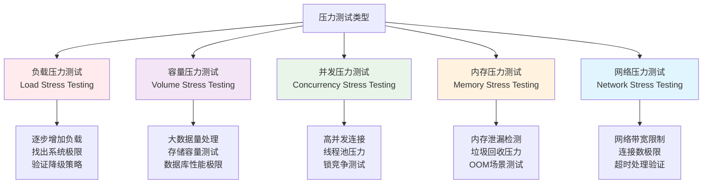

# 压力测试

## 📋 概述

压力测试是在极限条件下验证系统稳定性和可靠性的测试方法。通过超出正常工作负载的方式测试Node.js应用，压力测试帮助发现系统的破坏点、资源瓶颈和故障恢复能力，确保应用在异常情况下的稳定性和用户体验。

## 🎯 学习目标

- 理解压力测试的核心概念和实施策略
- 掌握压力测试工具的使用和配置
- 学会设计有效的压力测试场景
- 了解压力测试结果分析和系统优化方法

## ⚡ 压力测试基础概念

### 压力测试类型



### 压力测试指标

```javascript
const StressTestingMetrics = {
  BREAKING_POINT: {
    definition: '系统开始出现错误或性能急剧下降的临界点',
    measurements: [
      'Maximum Requests Per Second (最大RPS)',
      'Maximum Concurrent Users (最大并发用户)',
      'Resource Exhaustion Point (资源耗尽点)',
      'Response Time Breakdown (响应时间崩溃点)'
    ],
    indicators: [
      '错误率超过5%',
      'P95响应时间超过10秒',
      '内存使用率超过90%',
      'CPU使用率持续100%'
    ]
  },
  
  RECOVERY_METRICS: {
    definition: '系统从压力状态恢复正常的能力指标',
    measurements: [
      'Recovery Time (恢复时间)',
      'Data Integrity (数据完整性)',
      'Service Availability (服务可用性)',
      'Resource Cleanup (资源清理效率)'
    ],
    targets: [
      '恢复时间 < 5分钟',
      '数据零丢失',
      '服务自动恢复',
      '资源完全释放'
    ]
  },
  
  DEGRADATION_PATTERNS: {
    graceful: {
      description: '优雅降级',
      characteristics: [
        '错误率缓慢上升',
        '响应时间逐渐增加',
        '功能有序关闭',
        '用户体验平滑下降'
      ]
    },
    
    sudden: {
      description: '突然失效',
      characteristics: [
        '错误率急剧上升',
        '响应时间急剧增加',
        '服务突然不可用',
        '系统崩溃或超时'
      ]
    }
  }
};
```

## 🛠 压力测试工具和实现

### Artillery.js 高强度压力测试

```javascript
// artillery-stress-config.yml
config:
  target: 'http://localhost:3000'
  phases:
    # 阶段1：预热阶段
    - duration: 60
      arrivalRate: 10
      name: "Warmup Phase"
    
    # 阶段2：逐步施压
    - duration: 300
      arrivalRate: 50
      rampTo: 500
      name: "Stress Ramp-up"
    
    # 阶段3：极限压力
    - duration: 600
      arrivalRate: 1000
      name: "Peak Stress"
    
    # 阶段4：超限测试
    - duration: 300
      arrivalRate: 1000
      rampTo: 2000
      name: "Breaking Point Test"
    
    # 阶段5：恢复测试
    - duration: 180
      arrivalRate: 2000
      rampTo: 10
      name: "Recovery Phase"
  
  # 压力测试配置
  http:
    timeout: 30
    pool: 200  # 连接池大小
    maxSockets: 500
  
  # 插件配置
  plugins:
    metrics-by-endpoint: {}
    publish-metrics:
      - type: statsd
        host: localhost
        port: 8125
  
  # 测试数据生成
  variables:
    userId:
      - "{{ $randomInt(1, 10000) }}"
    requestId:
      - "{{ $uuid() }}"

scenarios:
  # 场景1：API密集调用
  - name: "API Intensive Load"
    weight: 40
    flow:
      - loop:
          - get:
              url: "/api/users/{{ $randomInt(1, 1000) }}"
              headers:
                X-Request-ID: "{{ requestId }}"
          - think: 0.1
          - post:
              url: "/api/analytics/events"
              json:
                userId: "{{ userId }}"
                eventType: "page_view"
                timestamp: "{{ $timestamp() }}"
          - think: 0.05
        count: 10
  
  # 场景2：数据库密集操作
  - name: "Database Intensive Operations"
    weight: 30
    flow:
      - post:
          url: "/api/orders"
          json:
            userId: "{{ userId }}"
            items:
              - productId: "{{ $randomInt(1, 100) }}"
                quantity: "{{ $randomInt(1, 5) }}"
            totalAmount: "{{ $randomFloat(10, 1000) }}"
      
      - get:
          url: "/api/orders/search"
          qs:
            userId: "{{ userId }}"
            status: "pending"
            limit: 50
      
      - put:
          url: "/api/orders/{{ $randomInt(1, 10000) }}"
          json:
            status: "processing"
            updatedAt: "{{ $timestamp() }}"
  
  # 场景3：文件上传压力
  - name: "File Upload Stress"
    weight: 20
    flow:
      - post:
          url: "/api/files/upload"
          beforeRequest: "generateLargePayload"
          json:
            filename: "test-{{ $randomString(10) }}.json"
            content: "{{ largeData }}"
            metadata:
              size: "{{ dataSize }}"
              type: "application/json"
  
  # 场景4：实时连接压力
  - name: "WebSocket Connection Stress"
    weight: 10
    flow:
      - function: "establishWebSocketConnection"
      - loop:
          - function: "sendWebSocketMessage"
          - think: 0.2
        count: 50
      - function: "closeWebSocketConnection"

# 自定义函数
functions:
  generateLargePayload:
    - set:
        dataSize: "{{ $randomInt(1000, 10000) }}"
        largeData: "{{ $randomString(dataSize) }}"
  
  establishWebSocketConnection:
    - log: "Establishing WebSocket connection"
  
  sendWebSocketMessage:
    - log: "Sending WebSocket message"
  
  closeWebSocketConnection:
    - log: "Closing WebSocket connection"
```

### K6 极限压力测试

```javascript
// k6-stress-test.js
import http from 'k6/http';
import ws from 'k6/ws';
import { check, group, sleep } from 'k6';
import { Rate, Trend, Counter, Gauge } from 'k6/metrics';

// 自定义指标
const errorRate = new Rate('error_rate');
const responseTime = new Trend('response_time');
const activeConnections = new Gauge('active_connections');
const memoryUsage = new Gauge('memory_usage');
const failedRequests = new Counter('failed_requests');

// 压力测试配置
export const options = {
  stages: [
    // 预热阶段
    { duration: '2m', target: 50 },
    
    // 压力爬升阶段
    { duration: '5m', target: 200 },
    { duration: '5m', target: 500 },
    { duration: '5m', target: 1000 },
    
    // 极限压力阶段
    { duration: '10m', target: 2000 },
    { duration: '5m', target: 3000 },
    
    // 破坏点测试
    { duration: '5m', target: 5000 },
    
    // 恢复阶段
    { duration: '5m', target: 1000 },
    { duration: '3m', target: 100 },
    { duration: '2m', target: 0 },
  ],
  
  thresholds: {
    // 压力测试的阈值更宽松
    http_req_duration: ['p(95)<5000', 'p(99)<10000'],
    http_req_failed: ['rate<0.1'],  // 允许10%的失败率
    error_rate: ['rate<0.15'],
    active_connections: ['value<6000'],
  },
  
  // 系统资源限制
  noConnectionReuse: false,
  userAgent: 'K6StressTest/1.0',
  insecureSkipTLSVerify: true,
  
  // 批量请求设置
  batch: 50,
  batchPerHost: 20,
};

const BASE_URL = 'http://localhost:3000';

// 测试数据生成器
function generateTestData() {
  return {
    userId: Math.floor(Math.random() * 10000),
    requestId: Math.random().toString(36).substring(7),
    timestamp: Date.now(),
    sessionId: Math.random().toString(36).substring(7)
  };
}

// 主测试函数
export default function() {
  const testData = generateTestData();
  
  group('API Stress Tests', () => {
    apiStressTest(testData);
  });
  
  group('Database Stress Tests', () => {
    databaseStressTest(testData);
  });
  
  group('Memory Stress Tests', () => {
    memoryStressTest(testData);
  });
  
  group('Concurrent Operations', () => {
    concurrentOperationsTest(testData);
  });
  
  // 很短的思考时间，增加压力
  sleep(Math.random() * 0.1);
}

function apiStressTest(testData) {
  // 并发API调用
  const responses = http.batch([
    ['GET', `${BASE_URL}/api/users/${testData.userId}`],
    ['GET', `${BASE_URL}/api/products/random`],
    ['GET', `${BASE_URL}/api/analytics/stats`],
    ['POST', `${BASE_URL}/api/events`, JSON.stringify({
      type: 'stress_test',
      userId: testData.userId,
      timestamp: testData.timestamp
    }), { headers: { 'Content-Type': 'application/json' } }]
  ]);
  
  responses.forEach((response, index) => {
    const success = check(response, {
      [`API call ${index} status ok`]: (r) => r.status < 400,
      [`API call ${index} response time ok`]: (r) => r.timings.duration < 5000,
    });
    
    if (!success) {
      failedRequests.add(1);
    }
    
    errorRate.add(!success);
    responseTime.add(response.timings.duration);
  });
}

function databaseStressTest(testData) {
  // 数据库密集操作
  const createResponse = http.post(`${BASE_URL}/api/stress-test/data`, JSON.stringify({
    userId: testData.userId,
    data: {
      // 生成大量数据
      items: Array.from({ length: 100 }, (_, i) => ({
        id: i,
        value: Math.random().toString(36).repeat(10),
        timestamp: Date.now()
      }))
    }
  }), {
    headers: { 'Content-Type': 'application/json' }
  });
  
  check(createResponse, {
    'database create status ok': (r) => r.status < 400,
    'database create time ok': (r) => r.timings.duration < 3000,
  });
  
  // 复杂查询操作
  const searchResponse = http.get(`${BASE_URL}/api/stress-test/search`, {
    params: {
      userId: testData.userId,
      limit: 100,
      sort: 'timestamp',
      filter: 'complex_query'
    }
  });
  
  check(searchResponse, {
    'database search status ok': (r) => r.status < 400,
    'database search time ok': (r) => r.timings.duration < 2000,
  });
  
  // 批量更新操作
  const updateResponse = http.put(`${BASE_URL}/api/stress-test/batch-update`, JSON.stringify({
    userIds: Array.from({ length: 50 }, () => Math.floor(Math.random() * 1000)),
    updateData: {
      lastActive: Date.now(),
      score: Math.floor(Math.random() * 100)
    }
  }), {
    headers: { 'Content-Type': 'application/json' }
  });
  
  check(updateResponse, {
    'batch update status ok': (r) => r.status < 400,
    'batch update time ok': (r) => r.timings.duration < 5000,
  });
}

function memoryStressTest(testData) {
  // 内存压力测试 - 大数据传输
  const largePayload = {
    userId: testData.userId,
    sessionId: testData.sessionId,
    data: Array.from({ length: 1000 }, (_, i) => ({
      id: i,
      content: 'x'.repeat(1000), // 1KB per item
      metadata: {
        created: Date.now(),
        hash: Math.random().toString(36),
        tags: Array.from({ length: 10 }, () => Math.random().toString(36))
      }
    }))
  };
  
  const response = http.post(`${BASE_URL}/api/stress-test/large-data`, JSON.stringify(largePayload), {
    headers: { 'Content-Type': 'application/json' },
    timeout: '30s'
  });
  
  const success = check(response, {
    'large data upload status ok': (r) => r.status < 400,
    'large data upload time ok': (r) => r.timings.duration < 10000,
    'response size reasonable': (r) => r.body.length < 100000,
  });
  
  if (!success) {
    failedRequests.add(1);
  }
  
  // 检查服务器内存使用情况
  const healthResponse = http.get(`${BASE_URL}/health/memory`);
  if (healthResponse.status === 200) {
    try {
      const healthData = JSON.parse(healthResponse.body);
      memoryUsage.add(healthData.memoryUsage || 0);
    } catch (e) {
      // 忽略解析错误
    }
  }
}

function concurrentOperationsTest(testData) {
  // 并发操作压力测试
  const concurrentRequests = [];
  
  // 创建大量并发请求
  for (let i = 0; i < 20; i++) {
    concurrentRequests.push([
      'POST',
      `${BASE_URL}/api/stress-test/concurrent`,
      JSON.stringify({
        operationId: `${testData.sessionId}-${i}`,
        userId: testData.userId,
        data: Math.random().toString(36).repeat(100)
      }),
      { headers: { 'Content-Type': 'application/json' } }
    ]);
  }
  
  const startTime = Date.now();
  const responses = http.batch(concurrentRequests);
  const endTime = Date.now();
  
  activeConnections.add(responses.length);
  
  let successCount = 0;
  responses.forEach((response, index) => {
    const success = check(response, {
      [`concurrent operation ${index} success`]: (r) => r.status < 400,
    });
    
    if (success) {
      successCount++;
    }
  });
  
  check({ successCount, total: responses.length }, {
    'concurrent operations success rate > 80%': (data) => (data.successCount / data.total) > 0.8,
    'concurrent operations completed in reasonable time': () => (endTime - startTime) < 5000,
  });
}

// WebSocket压力测试
export function websocketStressTest() {
  const url = 'ws://localhost:3000/ws';
  const params = { tags: { name: 'WebSocketStress' } };
  
  const response = ws.connect(url, params, function (socket) {
    socket.on('open', () => {
      console.log('WebSocket connection opened');
      
      // 发送大量消息
      for (let i = 0; i < 100; i++) {
        socket.send(JSON.stringify({
          type: 'stress_message',
          id: i,
          data: 'x'.repeat(1000), // 1KB message
          timestamp: Date.now()
        }));
      }
    });
    
    socket.on('message', (data) => {
      check(data, {
        'message received': (msg) => msg.length > 0,
      });
    });
    
    socket.on('error', (e) => {
      console.log('WebSocket error:', e.error());
      failedRequests.add(1);
    });
    
    // 保持连接一段时间
    sleep(10);
  });
  
  check(response, {
    'websocket connection established': (r) => r && r.status === 101,
  });
}

// 测试设置
export function setup() {
  console.log('Starting stress test setup...');
  
  // 预热服务器
  const warmupResponse = http.get(`${BASE_URL}/health`);
  if (warmupResponse.status !== 200) {
    throw new Error('Server is not available for stress testing');
  }
  
  console.log('Stress test setup completed');
  return { baseUrl: BASE_URL };
}

// 测试清理
export function teardown(data) {
  console.log('Stress test completed');
  console.log(`Target URL: ${data.baseUrl}`);
  
  // 获取最终的健康状态
  const finalHealth = http.get(`${data.baseUrl}/health`);
  console.log(`Final server status: ${finalHealth.status}`);
}
```

### Node.js 内存压力测试

```javascript
// memory-stress-test.js
const { Worker, isMainThread, parentPort, workerData } = require('worker_threads');
const v8 = require('v8');
const fs = require('fs');

class MemoryStressTest {
  constructor() {
    this.workers = [];
    this.memoryLeaks = [];
    this.results = {
      initialMemory: process.memoryUsage(),
      peakMemory: process.memoryUsage(),
      finalMemory: null,
      gcStats: [],
      errors: []
    };
  }
  
  // 启动内存压力测试
  async runMemoryStressTest(options = {}) {
    const {
      duration = 60000,        // 测试持续时间
      workerCount = 4,         // 工作线程数
      memoryPressure = 'high', // 内存压力级别
      gcMonitoring = true      // 是否监控GC
    } = options;
    
    console.log(`🚀 Starting memory stress test for ${duration}ms`);
    
    if (gcMonitoring) {
      this.startGCMonitoring();
    }
    
    // 启动内存压力监控
    const memoryMonitor = this.startMemoryMonitoring();
    
    try {
      // 启动工作线程
      await this.startWorkers(workerCount, memoryPressure);
      
      // 主线程内存压力
      await this.mainThreadMemoryStress(duration);
      
      // 等待测试完成
      await new Promise(resolve => setTimeout(resolve, duration));
      
    } finally {
      // 清理资源
      await this.cleanup();
      clearInterval(memoryMonitor);
      
      this.results.finalMemory = process.memoryUsage();
    }
    
    return this.generateMemoryReport();
  }
  
  // 启动工作线程
  async startWorkers(count, pressureLevel) {
    const workerPromises = [];
    
    for (let i = 0; i < count; i++) {
      const workerPromise = new Promise((resolve, reject) => {
        const worker = new Worker(__filename, {
          workerData: { 
            workerId: i, 
            pressureLevel,
            isWorker: true 
          }
        });
        
        worker.on('message', (message) => {
          if (message.type === 'memory_stats') {
            this.updateMemoryStats(message.data);
          }
        });
        
        worker.on('error', (error) => {
          this.results.errors.push({
            worker: i,
            error: error.message,
            timestamp: Date.now()
          });
          reject(error);
        });
        
        worker.on('exit', (code) => {
          if (code !== 0) {
            this.results.errors.push({
              worker: i,
              error: `Worker exited with code ${code}`,
              timestamp: Date.now()
            });
          }
          resolve();
        });
        
        this.workers.push(worker);
      });
      
      workerPromises.push(workerPromise);
    }
    
    return Promise.allSettled(workerPromises);
  }
  
  // 主线程内存压力
  async mainThreadMemoryStress(duration) {
    const startTime = Date.now();
    const chunks = [];
    
    const stressInterval = setInterval(() => {
      try {
        // 创建大量对象
        for (let i = 0; i < 1000; i++) {
          chunks.push({
            id: i,
            data: Buffer.alloc(1024), // 1KB buffer
            timestamp: Date.now(),
            metadata: {
              created: new Date(),
              random: Math.random().toString(36).repeat(100)
            }
          });
        }
        
        // 偶尔清理一些对象，模拟真实场景
        if (chunks.length > 10000) {
          chunks.splice(0, 5000);
        }
        
        // 创建内存泄漏（故意的，用于测试）
        this.memoryLeaks.push({
          largeArray: new Array(1000).fill(Math.random().toString(36)),
          circularRef: null
        });
        
        // 创建循环引用
        const last = this.memoryLeaks[this.memoryLeaks.length - 1];
        last.circularRef = last;
        
      } catch (error) {
        this.results.errors.push({
          source: 'main_thread',
          error: error.message,
          timestamp: Date.now()
        });
      }
    }, 10);
    
    // 清理定时器
    setTimeout(() => {
      clearInterval(stressInterval);
    }, duration);
  }
  
  // 启动内存监控
  startMemoryMonitoring() {
    return setInterval(() => {
      const currentMemory = process.memoryUsage();
      const heapStats = v8.getHeapStatistics();
      
      // 更新峰值内存
      if (currentMemory.heapUsed > this.results.peakMemory.heapUsed) {
        this.results.peakMemory = currentMemory;
      }
      
      // 记录内存统计
      this.results.memoryStats = this.results.memoryStats || [];
      this.results.memoryStats.push({
        timestamp: Date.now(),
        memory: currentMemory,
        heap: {
          totalHeapSize: heapStats.total_heap_size,
          usedHeapSize: heapStats.used_heap_size,
          heapSizeLimit: heapStats.heap_size_limit
        }
      });
      
      // 检查内存使用是否过高
      const memoryUsagePercent = (currentMemory.heapUsed / heapStats.heap_size_limit) * 100;
      if (memoryUsagePercent > 80) {
        console.warn(`⚠️  High memory usage: ${memoryUsagePercent.toFixed(1)}%`);
      }
      
    }, 1000);
  }
  
  // 启动GC监控
  startGCMonitoring() {
    // V8 GC性能监控
    const obs = new PerformanceObserver((list) => {
      const entries = list.getEntries();
      entries.forEach((entry) => {
        this.results.gcStats.push({
          type: entry.name,
          duration: entry.duration,
          timestamp: Date.now()
        });
      });
    });
    
    obs.observe({ entryTypes: ['gc'] });
  }
  
  // 更新内存统计
  updateMemoryStats(stats) {
    this.results.workerStats = this.results.workerStats || [];
    this.results.workerStats.push(stats);
  }
  
  // 清理资源
  async cleanup() {
    // 终止所有工作线程
    for (const worker of this.workers) {
      await worker.terminate();
    }
    
    this.workers = [];
    
    // 清理内存泄漏对象
    this.memoryLeaks = [];
    
    // 强制垃圾回收
    if (global.gc) {
      global.gc();
    }
  }
  
  // 生成内存压力测试报告
  generateMemoryReport() {
    const initialMem = this.results.initialMemory;
    const peakMem = this.results.peakMemory;
    const finalMem = this.results.finalMemory;
    
    const report = {
      summary: {
        initialHeapUsed: `${Math.round(initialMem.heapUsed / 1024 / 1024)}MB`,
        peakHeapUsed: `${Math.round(peakMem.heapUsed / 1024 / 1024)}MB`,
        finalHeapUsed: `${Math.round(finalMem.heapUsed / 1024 / 1024)}MB`,
        heapGrowth: `${Math.round((peakMem.heapUsed - initialMem.heapUsed) / 1024 / 1024)}MB`,
        gcCount: this.results.gcStats.length,
        errorCount: this.results.errors.length
      },
      
      analysis: this.analyzeMemoryBehavior(),
      recommendations: this.generateMemoryRecommendations(),
      
      detailedStats: {
        gcStats: this.results.gcStats,
        memoryStats: this.results.memoryStats?.slice(-10), // 最后10个数据点
        errors: this.results.errors
      }
    };
    
    console.log('📊 Memory Stress Test Report:');
    console.log(`Initial Heap: ${report.summary.initialHeapUsed}`);
    console.log(`Peak Heap: ${report.summary.peakHeapUsed}`);
    console.log(`Final Heap: ${report.summary.finalHeapUsed}`);
    console.log(`Heap Growth: ${report.summary.heapGrowth}`);
    console.log(`GC Count: ${report.summary.gcCount}`);
    console.log(`Errors: ${report.summary.errorCount}`);
    
    return report;
  }
  
  // 分析内存行为
  analyzeMemoryBehavior() {
    const gcStats = this.results.gcStats;
    const memoryStats = this.results.memoryStats || [];
    
    const analysis = {
      memoryLeakDetected: false,
      gcPerformance: 'unknown',
      memoryEfficiency: 'unknown'
    };
    
    // 检测内存泄漏
    if (memoryStats.length > 10) {
      const recentStats = memoryStats.slice(-10);
      const memoryTrend = recentStats.map(s => s.memory.heapUsed);
      const isIncreasing = memoryTrend.every((val, i, arr) => 
        i === 0 || val >= arr[i-1]
      );
      
      analysis.memoryLeakDetected = isIncreasing;
    }
    
    // 分析GC性能
    if (gcStats.length > 0) {
      const avgGCDuration = gcStats.reduce((sum, gc) => sum + gc.duration, 0) / gcStats.length;
      
      if (avgGCDuration < 10) {
        analysis.gcPerformance = 'excellent';
      } else if (avgGCDuration < 50) {
        analysis.gcPerformance = 'good';
      } else if (avgGCDuration < 100) {
        analysis.gcPerformance = 'fair';
      } else {
        analysis.gcPerformance = 'poor';
      }
    }
    
    return analysis;
  }
  
  // 生成内存优化建议
  generateMemoryRecommendations() {
    const recommendations = [];
    const analysis = this.analyzeMemoryBehavior();
    
    if (analysis.memoryLeakDetected) {
      recommendations.push({
        priority: 'HIGH',
        category: 'Memory Leak',
        message: '检测到潜在内存泄漏，建议检查循环引用和事件监听器清理'
      });
    }
    
    if (analysis.gcPerformance === 'poor') {
      recommendations.push({
        priority: 'HIGH',
        category: 'GC Performance',
        message: 'GC性能较差，建议优化对象创建和生命周期管理'
      });
    }
    
    if (this.results.errors.length > 0) {
      recommendations.push({
        priority: 'MEDIUM',
        category: 'Error Handling',
        message: `发现${this.results.errors.length}个错误，需要检查错误处理机制`
      });
    }
    
    const peakMemoryMB = this.results.peakMemory.heapUsed / 1024 / 1024;
    if (peakMemoryMB > 500) {
      recommendations.push({
        priority: 'MEDIUM',
        category: 'Memory Usage',
        message: `峰值内存使用${Math.round(peakMemoryMB)}MB，考虑内存优化`
      });
    }
    
    return recommendations;
  }
}

// 工作线程代码
if (!isMainThread && workerData.isWorker) {
  const { workerId, pressureLevel } = workerData;
  
  console.log(`Worker ${workerId} started with pressure level: ${pressureLevel}`);
  
  // 工作线程内存压力函数
  function workerMemoryStress() {
    const objects = [];
    
    const stressInterval = setInterval(() => {
      try {
        // 根据压力级别创建不同数量的对象
        const objectCount = pressureLevel === 'high' ? 5000 : 
                           pressureLevel === 'medium' ? 2000 : 1000;
        
        for (let i = 0; i < objectCount; i++) {
          objects.push({
            id: `worker-${workerId}-${i}`,
            data: new Array(100).fill(Math.random()),
            timestamp: Date.now()
          });
        }
        
        // 定期清理对象，避免无限增长
        if (objects.length > 50000) {
          objects.splice(0, 25000);
        }
        
        // 发送内存统计
        const memUsage = process.memoryUsage();
        parentPort.postMessage({
          type: 'memory_stats',
          data: {
            workerId,
            memoryUsage: memUsage,
            objectCount: objects.length,
            timestamp: Date.now()
          }
        });
        
      } catch (error) {
        parentPort.postMessage({
          type: 'error',
          data: {
            workerId,
            error: error.message,
            timestamp: Date.now()
          }
        });
      }
    }, 100);
    
    // 10分钟后停止
    setTimeout(() => {
      clearInterval(stressInterval);
      process.exit(0);
    }, 600000);
  }
  
  workerMemoryStress();
}

module.exports = MemoryStressTest;
```

## 🔧 压力测试场景设计

### 真实业务场景压力测试

```javascript
// real-world-stress-scenarios.js
const axios = require('axios');

class RealWorldStressScenarios {
  constructor(baseUrl = 'http://localhost:3000') {
    this.baseUrl = baseUrl;
    this.activeUsers = new Map();
    this.results = {
      scenarios: [],
      errors: [],
      metrics: {}
    };
  }
  
  // 电商促销场景压力测试
  async ecommerceFlashSaleStress(options = {}) {
    const {
      duration = 300000,      // 5分钟
      peakConcurrency = 5000, // 峰值并发
      productCount = 100      // 参与促销的商品数
    } = options;
    
    console.log('🛒 Starting e-commerce flash sale stress test...');
    
    const scenario = {
      name: 'E-commerce Flash Sale',
      startTime: Date.now(),
      duration,
      peakConcurrency,
      phases: []
    };
    
    try {
      // 阶段1：预热 - 正常访问
      await this.runPhase('预热阶段', 60000, 100, () => 
        this.simulateNormalBrowsing()
      );
      
      // 阶段2：促销开始前 - 用户聚集
      await this.runPhase('用户聚集', 60000, 1000, () => 
        this.simulateUserWaiting()
      );
      
      // 阶段3：促销开始 - 极限并发
      await this.runPhase('促销高峰', 120000, peakConcurrency, () => 
        this.simulateFlashSale(productCount)
      );
      
      // 阶段4：促销后期 - 逐渐下降
      await this.runPhase('流量下降', 60000, 500, () => 
        this.simulateNormalBrowsing()
      );
      
      scenario.endTime = Date.now();
      scenario.success = true;
      
    } catch (error) {
      scenario.error = error.message;
      scenario.success = false;
    }
    
    this.results.scenarios.push(scenario);
    return scenario;
  }
  
  // 社交媒体病毒传播场景
  async socialMediaViralStress(options = {}) {
    const {
      duration = 600000,      // 10分钟
      initialUsers = 100,     // 初始用户数
      viralFactor = 2,        // 病毒传播系数
      peakMultiplier = 50     // 峰值倍数
    } = options;
    
    console.log('📱 Starting social media viral content stress test...');
    
    const scenario = {
      name: 'Social Media Viral Content',
      startTime: Date.now(),
      duration,
      phases: []
    };
    
    try {
      let currentUsers = initialUsers;
      const phaseCount = 6;
      const phaseDuration = duration / phaseCount;
      
      for (let phase = 1; phase <= phaseCount; phase++) {
        const phaseName = `病毒传播阶段${phase}`;
        
        await this.runPhase(phaseName, phaseDuration, currentUsers, () =>
          this.simulateViralContent()
        );
        
        // 指数增长模拟
        currentUsers = Math.min(
          Math.floor(currentUsers * viralFactor),
          initialUsers * peakMultiplier
        );
        
        scenario.phases.push({
          phase,
          userCount: currentUsers,
          timestamp: Date.now()
        });
      }
      
      scenario.success = true;
      
    } catch (error) {
      scenario.error = error.message;
      scenario.success = false;
    }
    
    this.results.scenarios.push(scenario);
    return scenario;
  }
  
  // 金融交易高峰场景
  async financialTradingRushStress(options = {}) {
    const {
      duration = 300000,      // 5分钟
      traderCount = 2000,     // 交易员数量
      transactionRate = 100   // 每秒交易数
    } = options;
    
    console.log('💰 Starting financial trading rush stress test...');
    
    const scenario = {
      name: 'Financial Trading Rush',
      startTime: Date.now(),
      duration,
      traderCount,
      transactionRate
    };
    
    try {
      // 模拟市场开盘时的交易高峰
      await Promise.all([
        // 高频交易
        this.runContinuousLoad(duration, traderCount * 0.3, () =>
          this.simulateHighFrequencyTrading()
        ),
        
        // 普通交易
        this.runContinuousLoad(duration, traderCount * 0.5, () =>
          this.simulateRegularTrading()
        ),
        
        // 市场数据查询
        this.runContinuousLoad(duration, traderCount, () =>
          this.simulateMarketDataQuery()
        ),
        
        // 风险管理系统
        this.runContinuousLoad(duration, 50, () =>
          this.simulateRiskManagement()
        )
      ]);
      
      scenario.success = true;
      
    } catch (error) {
      scenario.error = error.message;
      scenario.success = false;
    }
    
    this.results.scenarios.push(scenario);
    return scenario;
  }
  
  // 运行测试阶段
  async runPhase(phaseName, duration, concurrency, testFunction) {
    console.log(`  📊 ${phaseName}: ${concurrency} concurrent users for ${duration}ms`);
    
    const startTime = Date.now();
    const promises = [];
    
    // 创建并发用户
    for (let i = 0; i < concurrency; i++) {
      promises.push(this.simulateUser(i, duration, testFunction));
    }
    
    // 等待所有用户完成或阶段结束
    await Promise.race([
      Promise.allSettled(promises),
      new Promise(resolve => setTimeout(resolve, duration))
    ]);
    
    const endTime = Date.now();
    console.log(`  ✅ ${phaseName} completed in ${endTime - startTime}ms`);
  }
  
  // 连续负载测试
  async runContinuousLoad(duration, concurrency, testFunction) {
    const endTime = Date.now() + duration;
    const promises = [];
    
    while (Date.now() < endTime) {
      // 批量创建用户会话
      const batchSize = Math.min(concurrency, 100);
      
      for (let i = 0; i < batchSize; i++) {
        promises.push(testFunction());
      }
      
      // 等待一小段时间再创建下一批
      await new Promise(resolve => setTimeout(resolve, 100));
      
      // 清理已完成的promise
      const settled = promises.splice(0, Math.floor(promises.length / 2));
      await Promise.allSettled(settled);
    }
    
    // 等待剩余的promise完成
    await Promise.allSettled(promises);
  }
  
  // 模拟用户行为
  async simulateUser(userId, duration, testFunction) {
    const endTime = Date.now() + duration;
    const userSession = {
      id: userId,
      startTime: Date.now(),
      actions: 0,
      errors: 0
    };
    
    this.activeUsers.set(userId, userSession);
    
    try {
      while (Date.now() < endTime) {
        await testFunction();
        userSession.actions++;
        
        // 随机思考时间
        await new Promise(resolve => 
          setTimeout(resolve, Math.random() * 1000)
        );
      }
    } catch (error) {
      userSession.errors++;
      this.results.errors.push({
        userId,
        error: error.message,
        timestamp: Date.now()
      });
    } finally {
      userSession.endTime = Date.now();
      this.activeUsers.delete(userId);
    }
  }
  
  // 业务场景模拟函数
  async simulateNormalBrowsing() {
    const actions = [
      () => axios.get(`${this.baseUrl}/api/products/featured`),
      () => axios.get(`${this.baseUrl}/api/categories`),
      () => axios.get(`${this.baseUrl}/api/products/${Math.floor(Math.random() * 1000)}`),
      () => axios.get(`${this.baseUrl}/api/reviews/latest`)
    ];
    
    const action = actions[Math.floor(Math.random() * actions.length)];
    await action();
  }
  
  async simulateUserWaiting() {
    // 用户等待促销开始，频繁刷新页面
    await Promise.all([
      axios.get(`${this.baseUrl}/api/flash-sale/status`),
      axios.get(`${this.baseUrl}/api/flash-sale/countdown`),
      axios.get(`${this.baseUrl}/api/flash-sale/products`)
    ]);
  }
  
  async simulateFlashSale(productCount) {
    const productId = Math.floor(Math.random() * productCount) + 1;
    
    try {
      // 高频刷新商品信息
      await axios.get(`${this.baseUrl}/api/flash-sale/products/${productId}`);
      
      // 尝试加入购物车
      await axios.post(`${this.baseUrl}/api/cart/add`, {
        productId,
        quantity: 1
      });
      
      // 尝试结账
      await axios.post(`${this.baseUrl}/api/orders/checkout`, {
        cartId: `cart-${Date.now()}`
      });
      
    } catch (error) {
      // 促销商品可能已售罄，这是正常的
      if (!error.response || error.response.status !== 409) {
        throw error;
      }
    }
  }
  
  async simulateViralContent() {
    const contentId = Math.floor(Math.random() * 10) + 1;
    
    await Promise.all([
      axios.get(`${this.baseUrl}/api/content/${contentId}`),
      axios.post(`${this.baseUrl}/api/content/${contentId}/view`),
      axios.get(`${this.baseUrl}/api/content/${contentId}/comments`),
      // 随机分享行为
      Math.random() > 0.7 ? axios.post(`${this.baseUrl}/api/content/${contentId}/share`) : Promise.resolve()
    ]);
  }
  
  async simulateHighFrequencyTrading() {
    const symbol = ['AAPL', 'GOOGL', 'MSFT', 'AMZN'][Math.floor(Math.random() * 4)];
    
    await Promise.all([
      axios.get(`${this.baseUrl}/api/market/quote/${symbol}`),
      axios.post(`${this.baseUrl}/api/trading/orders`, {
        symbol,
        type: 'market',
        side: Math.random() > 0.5 ? 'buy' : 'sell',
        quantity: Math.floor(Math.random() * 100) + 1
      })
    ]);
  }
  
  async simulateRegularTrading() {
    const actions = [
      () => axios.get(`${this.baseUrl}/api/portfolio/positions`),
      () => axios.get(`${this.baseUrl}/api/market/watchlist`),
      () => axios.get(`${this.baseUrl}/api/trading/history`),
      () => axios.post(`${this.baseUrl}/api/trading/orders`, {
        symbol: 'SPY',
        type: 'limit',
        side: 'buy',
        quantity: 10,
        price: 450.00
      })
    ];
    
    const action = actions[Math.floor(Math.random() * actions.length)];
    await action();
  }
  
  async simulateMarketDataQuery() {
    await axios.get(`${this.baseUrl}/api/market/realtime-data`);
  }
  
  async simulateRiskManagement() {
    await Promise.all([
      axios.get(`${this.baseUrl}/api/risk/portfolio-analysis`),
      axios.get(`${this.baseUrl}/api/risk/exposure-limits`),
      axios.post(`${this.baseUrl}/api/risk/calculate-var`)
    ]);
  }
  
  // 生成压力测试报告
  generateStressReport() {
    const report = {
      summary: {
        totalScenarios: this.results.scenarios.length,
        successfulScenarios: this.results.scenarios.filter(s => s.success).length,
        totalErrors: this.results.errors.length,
        testDuration: this.results.scenarios.reduce((sum, s) => sum + (s.duration || 0), 0)
      },
      
      scenarios: this.results.scenarios.map(scenario => ({
        name: scenario.name,
        success: scenario.success,
        duration: scenario.duration,
        phases: scenario.phases?.length || 0,
        error: scenario.error
      })),
      
      errorAnalysis: this.analyzeErrors(),
      recommendations: this.generateStressRecommendations()
    };
    
    console.log('📊 Stress Test Report:');
    console.log(`Scenarios: ${report.summary.successfulScenarios}/${report.summary.totalScenarios} successful`);
    console.log(`Total Errors: ${report.summary.totalErrors}`);
    
    return report;
  }
  
  analyzeErrors() {
    const errorsByType = {};
    
    this.results.errors.forEach(error => {
      const errorType = error.error.split(':')[0];
      errorsByType[errorType] = (errorsByType[errorType] || 0) + 1;
    });
    
    return errorsByType;
  }
  
  generateStressRecommendations() {
    const recommendations = [];
    
    if (this.results.errors.length > 100) {
      recommendations.push({
        priority: 'HIGH',
        category: 'Error Rate',
        message: `错误数量过高(${this.results.errors.length})，需要检查系统稳定性`
      });
    }
    
    const failedScenarios = this.results.scenarios.filter(s => !s.success);
    if (failedScenarios.length > 0) {
      recommendations.push({
        priority: 'HIGH',
        category: 'Scenario Failure',
        message: `${failedScenarios.length}个场景失败，需要检查系统承载能力`
      });
    }
    
    return recommendations;
  }
}

module.exports = RealWorldStressScenarios;
```

## 📝 压力测试最佳实践

### 环境准备和监控

```javascript
const StressTestingBestPractices = {
  ENVIRONMENT_PREPARATION: {
    infrastructure: [
      '使用与生产环境相同的硬件配置',
      '确保网络环境稳定可靠',
      '准备充足的测试数据',
      '配置完整的监控系统'
    ],
    
    baseline: [
      '建立性能基线指标',
      '记录正常负载下的表现',
      '确定关键性能指标',
      '设置监控告警阈值'
    ]
  },
  
  TEST_EXECUTION: {
    gradualApproach: [
      '逐步增加负载强度',
      '观察系统行为变化',
      '识别第一个瓶颈点',
      '记录关键转折点'
    ],
    
    monitoring: [
      '实时监控系统资源',
      '记录详细的性能指标',
      '捕获系统错误和异常',
      '分析用户体验影响'
    ],
    
    safety: [
      '设置安全阈值',
      '准备紧急停止机制',
      '确保数据安全',
      '建立快速恢复流程'
    ]
  },
  
  RESULT_ANALYSIS: {
    metrics: [
      '分析响应时间分布',
      '计算错误率趋势',
      '评估资源利用率',
      '识别性能瓶颈'
    ],
    
    patterns: [
      '观察系统降级模式',
      '分析故障传播路径',
      '评估恢复能力',
      '总结优化建议'
    ]
  }
};
```

## 📝 总结

压力测试是验证系统极限承载能力的重要手段：

- **破坏点发现**：找出系统在极限条件下的失效点
- **稳定性验证**：验证系统在高压下的稳定性
- **恢复能力评估**：测试系统从压力状态的恢复能力
- **性能优化指导**：为系统优化提供数据支持

通过系统化的压力测试，可以确保Node.js应用在极端条件下的可靠性和用户体验。

## 🔗 相关资源

- [Artillery.js压力测试](https://artillery.io/docs/)
- [K6性能测试平台](https://k6.io/docs/)
- [Node.js性能调优](https://nodejs.org/en/docs/guides/simple-profiling/)
- [系统压力测试最佳实践](https://www.blazemeter.com/blog/stress-testing-best-practices/)
