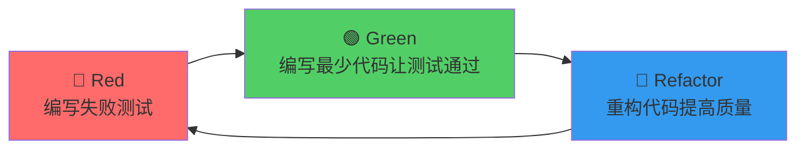

# 测试驱动开发（TDD）

## 📋 概述

测试驱动开发（Test-Driven Development, TDD）是一种软件开发实践，强调在编写功能代码之前先编写测试。通过"红-绿-重构"的循环，TDD确保代码质量、设计简洁性和需求完整性。

## 🎯 学习目标

- 理解TDD的核心原理和价值
- 掌握TDD的开发流程和实践技巧
- 学会在Node.js项目中应用TDD
- 了解TDD的优势和挑战

## 🔄 TDD核心流程

### 红-绿-重构循环



### TDD三法则

```javascript
const TDDLaws = {
  FIRST_LAW: '在编写任何生产代码之前，必须先编写一个失败的单元测试',
  SECOND_LAW: '只能编写刚好足够失败的单元测试，编译失败也算失败',
  THIRD_LAW: '只能编写刚好足够让当前失败测试通过的生产代码'
};
```

## 🛠 TDD实践示例

### 计算器功能开发

```javascript
// 第1步：🔴 Red - 编写第一个失败测试
// tests/unit/calculator.test.js
const Calculator = require('@/utils/calculator');

describe('Calculator', () => {
  let calculator;
  
  beforeEach(() => {
    calculator = new Calculator();
  });
  
  describe('add方法', () => {
    it('应该返回两个数的和', () => {
      // 这个测试会失败，因为Calculator类还不存在
      const result = calculator.add(2, 3);
      expect(result).toBe(5);
    });
  });
});

// 运行测试 - 应该失败（红色）
// ❌ Error: Cannot find module '@/utils/calculator'
```

```javascript
// 第2步：🟢 Green - 编写最少代码让测试通过
// src/utils/calculator.js
class Calculator {
  add(a, b) {
    return 5; // 硬编码让测试通过
  }
}

module.exports = Calculator;

// 运行测试 - 应该通过（绿色）
// ✅ Calculator add方法 应该返回两个数的和
```

```javascript
// 第3步：添加更多测试来驱动真正的实现
// tests/unit/calculator.test.js
describe('Calculator', () => {
  let calculator;
  
  beforeEach(() => {
    calculator = new Calculator();
  });
  
  describe('add方法', () => {
    it('应该返回两个数的和', () => {
      expect(calculator.add(2, 3)).toBe(5);
    });
    
    it('应该正确处理不同的数字', () => {
      expect(calculator.add(1, 4)).toBe(5); // 这会让硬编码失败
      expect(calculator.add(10, 15)).toBe(25);
    });
    
    it('应该处理负数', () => {
      expect(calculator.add(-2, 3)).toBe(1);
      expect(calculator.add(-5, -3)).toBe(-8);
    });
    
    it('应该处理零', () => {
      expect(calculator.add(0, 5)).toBe(5);
      expect(calculator.add(5, 0)).toBe(5);
      expect(calculator.add(0, 0)).toBe(0);
    });
  });
});
```

```javascript
// 第4步：🟢 实现真正的加法逻辑
// src/utils/calculator.js
class Calculator {
  add(a, b) {
    // 验证输入
    if (typeof a !== 'number' || typeof b !== 'number') {
      throw new Error('参数必须是数字');
    }
    
    return a + b;
  }
}

module.exports = Calculator;
```

```javascript
// 第5步：🔴 添加边界情况测试
it('应该在参数不是数字时抛出错误', () => {
  expect(() => calculator.add('2', 3)).toThrow('参数必须是数字');
  expect(() => calculator.add(2, null)).toThrow('参数必须是数字');
  expect(() => calculator.add(undefined, 3)).toThrow('参数必须是数字');
});

it('应该处理浮点数', () => {
  expect(calculator.add(0.1, 0.2)).toBeCloseTo(0.3);
  expect(calculator.add(1.5, 2.7)).toBeCloseTo(4.2);
});
```

### 用户服务TDD开发

```javascript
// 第1步：🔴 定义用户服务的需求和测试
// tests/unit/services/user-service.test.js
const UserService = require('@/services/user-service');
const UserRepository = require('@/repositories/user-repository');

// Mock依赖
jest.mock('@/repositories/user-repository');

describe('UserService', () => {
  let userService;
  let mockUserRepository;
  
  beforeEach(() => {
    mockUserRepository = new UserRepository();
    userService = new UserService(mockUserRepository);
    jest.clearAllMocks();
  });
  
  describe('createUser', () => {
    it('应该成功创建有效用户', async () => {
      // 准备测试数据
      const userData = {
        name: 'John Doe',
        email: 'john@example.com',
        password: 'securePassword123'
      };
      
      const expectedUser = {
        id: '123',
        name: userData.name,
        email: userData.email,
        createdAt: new Date()
      };
      
      // 配置mock
      mockUserRepository.findByEmail.mockResolvedValue(null);
      mockUserRepository.create.mockResolvedValue(expectedUser);
      
      // 执行测试
      const result = await userService.createUser(userData);
      
      // 验证结果
      expect(result).toEqual(expectedUser);
      expect(mockUserRepository.findByEmail).toHaveBeenCalledWith(userData.email);
      expect(mockUserRepository.create).toHaveBeenCalledWith(
        expect.objectContaining({
          name: userData.name,
          email: userData.email,
          password: expect.any(String) // 密码应该被哈希
        })
      );
    });
  });
});
```

```javascript
// 第2步：🟢 实现基本的UserService
// src/services/user-service.js
const bcrypt = require('bcrypt');

class UserService {
  constructor(userRepository) {
    this.userRepository = userRepository;
  }
  
  async createUser(userData) {
    // 检查邮箱是否已存在
    const existingUser = await this.userRepository.findByEmail(userData.email);
    if (existingUser) {
      throw new Error('邮箱已存在');
    }
    
    // 哈希密码
    const hashedPassword = await bcrypt.hash(userData.password, 10);
    
    // 创建用户
    const userToCreate = {
      name: userData.name,
      email: userData.email,
      password: hashedPassword
    };
    
    return await this.userRepository.create(userToCreate);
  }
}

module.exports = UserService;
```

```javascript
// 第3步：🔴 添加验证逻辑的测试
describe('createUser验证', () => {
  it('应该拒绝空邮箱', async () => {
    const userData = {
      name: 'John Doe',
      email: '',
      password: 'password123'
    };
    
    await expect(userService.createUser(userData))
      .rejects
      .toThrow('邮箱不能为空');
  });
  
  it('应该拒绝无效邮箱格式', async () => {
    const userData = {
      name: 'John Doe',
      email: 'invalid-email',
      password: 'password123'
    };
    
    await expect(userService.createUser(userData))
      .rejects
      .toThrow('邮箱格式无效');
  });
  
  it('应该拒绝弱密码', async () => {
    const userData = {
      name: 'John Doe',
      email: 'john@example.com',
      password: '123'
    };
    
    await expect(userService.createUser(userData))
      .rejects
      .toThrow('密码至少需要8个字符');
  });
  
  it('应该拒绝已存在的邮箱', async () => {
    const userData = {
      name: 'John Doe',
      email: 'existing@example.com',
      password: 'password123'
    };
    
    mockUserRepository.findByEmail.mockResolvedValue({ id: '456' });
    
    await expect(userService.createUser(userData))
      .rejects
      .toThrow('邮箱已存在');
  });
});
```

```javascript
// 第4步：🟢 实现验证逻辑
class UserService {
  constructor(userRepository) {
    this.userRepository = userRepository;
  }
  
  async createUser(userData) {
    // 验证输入
    this.validateUserData(userData);
    
    // 检查邮箱是否已存在
    const existingUser = await this.userRepository.findByEmail(userData.email);
    if (existingUser) {
      throw new Error('邮箱已存在');
    }
    
    // 哈希密码
    const hashedPassword = await bcrypt.hash(userData.password, 10);
    
    // 创建用户
    const userToCreate = {
      name: userData.name,
      email: userData.email,
      password: hashedPassword
    };
    
    return await this.userRepository.create(userToCreate);
  }
  
  validateUserData(userData) {
    if (!userData.email || userData.email.trim() === '') {
      throw new Error('邮箱不能为空');
    }
    
    const emailRegex = /^[^\s@]+@[^\s@]+\.[^\s@]+$/;
    if (!emailRegex.test(userData.email)) {
      throw new Error('邮箱格式无效');
    }
    
    if (!userData.password || userData.password.length < 8) {
      throw new Error('密码至少需要8个字符');
    }
    
    if (!userData.name || userData.name.trim() === '') {
      throw new Error('姓名不能为空');
    }
  }
}
```

```javascript
// 第5步：🔵 重构 - 提取验证器
// src/validators/user-validator.js
class UserValidator {
  static validateUserData(userData) {
    const errors = [];
    
    if (!userData.name || userData.name.trim() === '') {
      errors.push({ field: 'name', message: '姓名不能为空' });
    }
    
    if (!userData.email || userData.email.trim() === '') {
      errors.push({ field: 'email', message: '邮箱不能为空' });
    } else {
      const emailRegex = /^[^\s@]+@[^\s@]+\.[^\s@]+$/;
      if (!emailRegex.test(userData.email)) {
        errors.push({ field: 'email', message: '邮箱格式无效' });
      }
    }
    
    if (!userData.password) {
      errors.push({ field: 'password', message: '密码不能为空' });
    } else if (userData.password.length < 8) {
      errors.push({ field: 'password', message: '密码至少需要8个字符' });
    }
    
    return errors;
  }
}

module.exports = UserValidator;

// 重构UserService使用验证器
const UserValidator = require('@/validators/user-validator');

class UserService {
  async createUser(userData) {
    // 验证输入
    const validationErrors = UserValidator.validateUserData(userData);
    if (validationErrors.length > 0) {
      throw new Error(`验证失败: ${validationErrors.map(e => e.message).join(', ')}`);
    }
    
    // ... 其余逻辑保持不变
  }
}
```

## 🎯 TDD最佳实践

### 测试命名和组织

```javascript
// 好的测试命名和组织
describe('OrderService', () => {
  describe('calculateTotal', () => {
    describe('当订单包含商品时', () => {
      it('应该返回所有商品价格的总和', () => {});
      it('应该正确应用折扣', () => {});
      it('应该包含税费计算', () => {});
    });
    
    describe('当订单为空时', () => {
      it('应该返回0', () => {});
    });
    
    describe('当商品价格无效时', () => {
      it('应该抛出验证错误', () => {});
    });
  });
});
```

### 测试数据管理

```javascript
// 使用工厂函数创建测试数据
// tests/factories/user-factory.js
class UserFactory {
  static create(overrides = {}) {
    return {
      id: '123',
      name: 'Test User',
      email: 'test@example.com',
      password: 'securePassword123',
      createdAt: new Date(),
      ...overrides
    };
  }
  
  static createMany(count, overrides = {}) {
    return Array.from({ length: count }, (_, index) => 
      this.create({
        id: String(index + 1),
        email: `test${index + 1}@example.com`,
        ...overrides
      })
    );
  }
  
  static withoutEmail() {
    return this.create({ email: undefined });
  }
  
  static withInvalidEmail() {
    return this.create({ email: 'invalid-email' });
  }
}

module.exports = UserFactory;

// 在测试中使用
const UserFactory = require('@tests/factories/user-factory');

it('应该创建有效用户', async () => {
  const userData = UserFactory.create();
  const result = await userService.createUser(userData);
  expect(result.email).toBe(userData.email);
});

it('应该拒绝无效邮箱', async () => {
  const userData = UserFactory.withInvalidEmail();
  await expect(userService.createUser(userData))
    .rejects
    .toThrow('邮箱格式无效');
});
```

### 参数化测试

```javascript
// 使用test.each进行参数化测试
describe('密码验证', () => {
  test.each([
    ['', '密码不能为空'],
    ['123', '密码至少需要8个字符'],
    ['12345678', null], // 有效密码
    ['longValidPassword123', null]
  ])('密码 "%s" 应该 %s', (password, expectedError) => {
    const userData = UserFactory.create({ password });
    
    if (expectedError) {
      expect(() => UserValidator.validatePassword(password))
        .toThrow(expectedError);
    } else {
      expect(() => UserValidator.validatePassword(password))
        .not.toThrow();
    }
  });
});
```

## 🔧 TDD在不同场景中的应用

### API端点TDD开发

```javascript
// 1. 🔴 先写API测试
// tests/integration/api/users.test.js
const request = require('supertest');
const app = require('@/app');

describe('POST /api/users', () => {
  it('应该创建新用户并返回201状态', async () => {
    const userData = {
      name: 'John Doe',
      email: 'john@example.com',
      password: 'securePassword123'
    };
    
    const response = await request(app)
      .post('/api/users')
      .send(userData)
      .expect(201);
    
    expect(response.body).toEqual(
      expect.objectContaining({
        id: expect.any(String),
        name: userData.name,
        email: userData.email
      })
    );
    
    // 密码不应该在响应中
    expect(response.body.password).toBeUndefined();
  });
});
```

```javascript
// 2. 🟢 实现路由和控制器
// src/routes/users.js
const express = require('express');
const UserController = require('@/controllers/user-controller');

const router = express.Router();

router.post('/', UserController.createUser);

module.exports = router;

// src/controllers/user-controller.js
const UserService = require('@/services/user-service');

class UserController {
  static async createUser(req, res) {
    try {
      const user = await UserService.createUser(req.body);
      
      // 移除密码字段
      const { password, ...userResponse } = user;
      
      res.status(201).json(userResponse);
    } catch (error) {
      res.status(400).json({ error: error.message });
    }
  }
}

module.exports = UserController;
```

### 数据库模型TDD

```javascript
// 1. 🔴 先写模型测试
// tests/unit/models/user.test.js
const User = require('@/models/user');

describe('User模型', () => {
  it('应该创建有效用户', async () => {
    const userData = {
      name: 'John Doe',
      email: 'john@example.com',
      password: 'hashedPassword'
    };
    
    const user = new User(userData);
    await user.save();
    
    expect(user.id).toBeDefined();
    expect(user.email).toBe(userData.email);
    expect(user.createdAt).toBeInstanceOf(Date);
  });
  
  it('应该自动哈希密码', async () => {
    const user = new User({
      name: 'John Doe',
      email: 'john@example.com',
      password: 'plainPassword'
    });
    
    await user.save();
    
    expect(user.password).not.toBe('plainPassword');
    expect(user.password.length).toBeGreaterThan(50);
  });
  
  it('应该验证邮箱唯一性', async () => {
    const userData = {
      name: 'John Doe',
      email: 'duplicate@example.com',
      password: 'password123'
    };
    
    await User.create(userData);
    
    await expect(User.create(userData))
      .rejects
      .toThrow(/email.*unique/i);
  });
});
```

## 📊 TDD度量和改进

### TDD指标监控

```javascript
// TDD度量收集器
class TDDMetrics {
  constructor() {
    this.redPhaseTime = [];
    this.greenPhaseTime = [];
    this.refactorPhaseTime = [];
    this.cycleCount = 0;
  }
  
  startRedPhase() {
    this.currentPhaseStart = Date.now();
  }
  
  endRedPhase() {
    const duration = Date.now() - this.currentPhaseStart;
    this.redPhaseTime.push(duration);
  }
  
  startGreenPhase() {
    this.currentPhaseStart = Date.now();
  }
  
  endGreenPhase() {
    const duration = Date.now() - this.currentPhaseStart;
    this.greenPhaseTime.push(duration);
  }
  
  startRefactorPhase() {
    this.currentPhaseStart = Date.now();
  }
  
  endRefactorPhase() {
    const duration = Date.now() - this.currentPhaseStart;
    this.refactorPhaseTime.push(duration);
    this.cycleCount++;
  }
  
  getReport() {
    const avgRed = this.average(this.redPhaseTime);
    const avgGreen = this.average(this.greenPhaseTime);
    const avgRefactor = this.average(this.refactorPhaseTime);
    
    return {
      totalCycles: this.cycleCount,
      averageRedPhase: avgRed,
      averageGreenPhase: avgGreen,
      averageRefactorPhase: avgRefactor,
      totalTime: avgRed + avgGreen + avgRefactor,
      recommendations: this.generateRecommendations(avgRed, avgGreen, avgRefactor)
    };
  }
  
  average(array) {
    return array.length > 0 ? array.reduce((a, b) => a + b) / array.length : 0;
  }
  
  generateRecommendations(avgRed, avgGreen, avgRefactor) {
    const recommendations = [];
    
    if (avgRed > avgGreen * 3) {
      recommendations.push('红色阶段时间过长，考虑简化测试');
    }
    
    if (avgGreen > avgRed * 5) {
      recommendations.push('绿色阶段时间过长，可能过度实现');
    }
    
    if (avgRefactor < (avgRed + avgGreen) * 0.1) {
      recommendations.push('重构时间不足，可能积累技术债务');
    }
    
    return recommendations;
  }
}
```

### TDD质量评估

```javascript
// TDD质量检查器
class TDDQualityChecker {
  static analyzeTestSuite(testFiles) {
    const metrics = {
      testToCodeRatio: this.calculateTestToCodeRatio(testFiles),
      testCoverage: this.calculateCoverage(testFiles),
      testSmells: this.detectTestSmells(testFiles),
      tddCompliance: this.checkTDDCompliance(testFiles)
    };
    
    return {
      ...metrics,
      overallScore: this.calculateOverallScore(metrics),
      recommendations: this.generateRecommendations(metrics)
    };
  }
  
  static detectTestSmells(testFiles) {
    const smells = [];
    
    testFiles.forEach(file => {
      // 检测测试异味
      if (this.hasLongTests(file)) {
        smells.push({ type: 'LONG_TEST', file: file.path });
      }
      
      if (this.hasMultipleAssertions(file)) {
        smells.push({ type: 'MULTIPLE_ASSERTIONS', file: file.path });
      }
      
      if (this.hasMagicNumbers(file)) {
        smells.push({ type: 'MAGIC_NUMBERS', file: file.path });
      }
    });
    
    return smells;
  }
  
  static checkTDDCompliance(testFiles) {
    // 检查是否遵循TDD实践
    return {
      hasFailingTestsFirst: this.checkFailingTestsFirst(testFiles),
      hasMinimalImplementation: this.checkMinimalImplementation(testFiles),
      hasRefactoringEvidence: this.checkRefactoringEvidence(testFiles)
    };
  }
}
```

## 🚫 TDD常见误区和解决方案

### 常见误区

```javascript
const TDDMisconceptions = {
  WRITING_TOO_MANY_TESTS: {
    problem: '一次写太多测试',
    solution: '一次只写一个失败测试',
    example: '不要写整个类的所有测试，只写当前功能的一个测试'
  },
  
  OVER_ENGINEERING: {
    problem: '过度工程化',
    solution: '只写刚好让测试通过的代码',
    example: '如果测试只需要返回固定值，先硬编码，后续测试会驱动真正实现'
  },
  
  SKIPPING_REFACTOR: {
    problem: '跳过重构阶段',
    solution: '每个绿色阶段后都要考虑重构',
    example: '消除重复代码、提高可读性、优化设计'
  },
  
  TESTING_IMPLEMENTATION: {
    problem: '测试实现细节而非行为',
    solution: '专注于测试公共API和行为',
    example: '测试方法的输入输出，而不是内部变量'
  }
};
```

### 解决方案示例

```javascript
// ❌ 错误：测试实现细节
it('应该调用userRepository.findByEmail', async () => {
  await userService.createUser(userData);
  expect(mockUserRepository.findByEmail).toHaveBeenCalled();
});

// ✅ 正确：测试行为和结果
it('应该在邮箱已存在时抛出错误', async () => {
  mockUserRepository.findByEmail.mockResolvedValue({ id: '123' });
  
  await expect(userService.createUser(userData))
    .rejects
    .toThrow('邮箱已存在');
});

// ❌ 错误：一次写太多测试
describe('Calculator', () => {
  it('should add numbers', () => {});
  it('should subtract numbers', () => {});
  it('should multiply numbers', () => {});
  it('should divide numbers', () => {}); // 一次写了所有测试
});

// ✅ 正确：逐步添加测试
describe('Calculator', () => {
  it('should add two positive numbers', () => {
    // 先只写一个简单测试
  });
  
  // 测试通过后，再添加下一个测试
});
```

## 📝 总结

TDD为Node.js开发提供了系统化的质量保证方法：

- **核心流程**：红-绿-重构循环确保质量和设计
- **实践技巧**：从简单测试开始，逐步驱动复杂实现
- **质量保证**：测试先行确保需求理解和功能正确性
- **设计改进**：重构阶段持续优化代码结构
- **团队协作**：测试作为活文档促进团队理解

TDD需要练习和坚持，但能显著提高代码质量和开发效率。

## 🔗 相关资源

- [TDD经典教程](https://www.amazon.com/Test-Driven-Development-Kent-Beck/dp/0321146530)
- [现代TDD实践](https://martinfowler.com/articles/mocksArentStubs.html)
- [Node.js TDD指南](https://github.com/dwyl/learn-tdd)
- [TDD最佳实践](https://medium.com/@sairamkrish/tdd-best-practices-b40e78d7b9ef)
