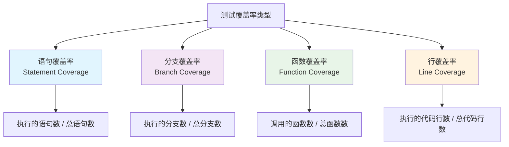

# 测试覆盖率

## 📋 概述

测试覆盖率是衡量测试完整性的重要指标，用于评估测试代码对源代码的覆盖程度。通过分析覆盖率数据，开发团队可以识别未测试的代码区域，提高测试质量，确保软件的可靠性和稳定性。

## 🎯 学习目标

- 理解测试覆盖率的概念和类型
- 掌握在Node.js项目中配置和使用覆盖率工具
- 学会分析覆盖率报告和优化测试策略
- 了解覆盖率的最佳实践和常见误区

## 📊 测试覆盖率类型

### 覆盖率指标分类



### 覆盖率类型详解

```javascript
// 示例代码用于演示不同覆盖率类型
function processUserData(user, options = {}) {
  // 语句1
  if (!user) {
    // 语句2 - 分支A
    throw new Error('User is required');
  }
  
  // 语句3
  let result = {
    id: user.id,
    name: user.name
  };
  
  // 语句4
  if (options.includeEmail && user.email) {
    // 语句5 - 分支B
    result.email = user.email;
  }
  
  // 语句6
  if (options.validateAge) {
    // 语句7 - 分支C
    if (user.age < 18) {
      // 语句8 - 分支D
      result.isMinor = true;
    } else {
      // 语句9 - 分支E
      result.isMinor = false;
    }
  }
  
  // 语句10
  return result;
}

// 辅助函数
function validateEmail(email) {
  return email && email.includes('@');
}

const CoverageTypes = {
  STATEMENT_COVERAGE: {
    description: '语句覆盖率',
    measurement: '执行的语句数量 / 总语句数量',
    example: '如果执行了8个语句，总共10个语句，则语句覆盖率为80%',
    weakness: '不能发现逻辑分支问题'
  },
  
  BRANCH_COVERAGE: {
    description: '分支覆盖率',
    measurement: '执行的分支数量 / 总分支数量',
    example: '上述代码有5个分支（A,B,C,D,E），如果执行了3个，则分支覆盖率为60%',
    strength: '能够发现条件判断的问题'
  },
  
  FUNCTION_COVERAGE: {
    description: '函数覆盖率',
    measurement: '调用的函数数量 / 总函数数量',
    example: '如果调用了processUserData但未调用validateEmail，则函数覆盖率为50%',
    useCase: '确保所有函数都被测试'
  },
  
  LINE_COVERAGE: {
    description: '行覆盖率',
    measurement: '执行的代码行数 / 总代码行数',
    example: '类似语句覆盖率，但以代码行为单位',
    note: '通常与语句覆盖率相近'
  }
};
```

## 🛠 Jest覆盖率配置

### 基础配置

```javascript
// jest.config.js
module.exports = {
  // 启用覆盖率收集
  collectCoverage: true,
  
  // 覆盖率输出目录
  coverageDirectory: 'coverage',
  
  // 覆盖率收集的文件模式
  collectCoverageFrom: [
    'src/**/*.{js,ts}',
    '!src/**/*.test.{js,ts}',
    '!src/**/*.spec.{js,ts}',
    '!src/**/index.{js,ts}',
    '!src/**/*.d.ts',
    '!src/test-utils/**',
    '!src/mocks/**'
  ],
  
  // 覆盖率报告格式
  coverageReporters: [
    'text',          // 控制台文本报告
    'text-summary',  // 简要文本报告
    'html',          // HTML报告
    'lcov',          // LCOV格式（用于CI/CD）
    'json',          // JSON格式
    'clover'         // Clover XML格式
  ],
  
  // 覆盖率阈值
  coverageThreshold: {
    global: {
      branches: 80,
      functions: 80,
      lines: 80,
      statements: 80
    },
    // 针对特定目录的阈值
    './src/services/': {
      branches: 90,
      functions: 90,
      lines: 90,
      statements: 90
    },
    // 针对特定文件的阈值
    './src/utils/critical.js': {
      branches: 95,
      functions: 100,
      lines: 95,
      statements: 95
    }
  },
  
  // 覆盖率提供者
  coverageProvider: 'v8', // 或 'babel'
  
  // 忽略覆盖率的路径模式
  coveragePathIgnorePatterns: [
    '/node_modules/',
    '/coverage/',
    '/dist/',
    '/build/',
    '.d.ts$'
  ]
};
```

### 高级覆盖率配置

```javascript
// jest.config.advanced.js
module.exports = {
  // 多项目配置
  projects: [
    {
      displayName: 'Unit Tests',
      testMatch: ['<rootDir>/src/**/*.test.js'],
      collectCoverage: true,
      coverageDirectory: 'coverage/unit',
      collectCoverageFrom: [
        'src/**/*.js',
        '!src/**/*.integration.test.js'
      ]
    },
    {
      displayName: 'Integration Tests',
      testMatch: ['<rootDir>/src/**/*.integration.test.js'],
      collectCoverage: true,
      coverageDirectory: 'coverage/integration',
      collectCoverageFrom: [
        'src/**/*.js',
        '!src/**/*.test.js'
      ]
    }
  ],
  
  // 合并覆盖率报告
  collectCoverage: true,
  coverageDirectory: 'coverage/combined',
  
  // 自定义覆盖率报告
  coverageReporters: [
    'text',
    'html',
    ['text', { file: 'coverage.txt' }],
    ['json', { file: 'coverage.json' }],
    ['html', { subdir: 'html-report' }],
    ['lcov', { file: 'lcov.info' }]
  ],
  
  // 覆盖率收集钩子
  setupFilesAfterEnv: ['<rootDir>/test/coverage-setup.js']
};
```

### 覆盖率收集脚本

```javascript
// test/coverage-setup.js
// 覆盖率收集的自定义设置

// 全局覆盖率跟踪
global.__coverage__ = global.__coverage__ || {};

// 覆盖率收集钩子
afterAll(() => {
  // 生成覆盖率摘要
  const coverage = global.__coverage__;
  
  if (coverage) {
    const summary = Object.keys(coverage).reduce((acc, file) => {
      const fileCoverage = coverage[file];
      acc[file] = {
        statements: fileCoverage.s,
        branches: fileCoverage.b,
        functions: fileCoverage.f,
        lines: fileCoverage.l
      };
      return acc;
    }, {});
    
    // 可以在这里添加自定义覆盖率处理逻辑
    console.log('Coverage Summary Generated');
  }
});

// 排除测试工具文件
const originalRequire = require;
require = function(id) {
  // 不收集测试工具文件的覆盖率
  if (id.includes('test-utils') || id.includes('__mocks__')) {
    return originalRequire(id);
  }
  return originalRequire(id);
};
```

## 📈 覆盖率分析

### 覆盖率报告解读

```javascript
// coverage-analyzer.js
const fs = require('fs');
const path = require('path');

class CoverageAnalyzer {
  constructor(coverageDir = './coverage') {
    this.coverageDir = coverageDir;
  }
  
  // 分析覆盖率JSON报告
  analyzeCoverage() {
    const coverageFile = path.join(this.coverageDir, 'coverage-final.json');
    
    if (!fs.existsSync(coverageFile)) {
      throw new Error('Coverage file not found');
    }
    
    const coverageData = JSON.parse(fs.readFileSync(coverageFile, 'utf8'));
    
    return this.processCoverageData(coverageData);
  }
  
  processCoverageData(coverageData) {
    const analysis = {
      summary: {
        totalFiles: 0,
        statements: { covered: 0, total: 0, pct: 0 },
        branches: { covered: 0, total: 0, pct: 0 },
        functions: { covered: 0, total: 0, pct: 0 },
        lines: { covered: 0, total: 0, pct: 0 }
      },
      fileDetails: [],
      uncoveredLines: [],
      criticalAreas: []
    };
    
    Object.keys(coverageData).forEach(filePath => {
      const fileCoverage = coverageData[filePath];
      analysis.totalFiles++;
      
      // 计算文件级覆盖率
      const fileAnalysis = this.analyzeFile(filePath, fileCoverage);
      analysis.fileDetails.push(fileAnalysis);
      
      // 累计统计
      analysis.summary.statements.covered += fileAnalysis.statements.covered;
      analysis.summary.statements.total += fileAnalysis.statements.total;
      analysis.summary.branches.covered += fileAnalysis.branches.covered;
      analysis.summary.branches.total += fileAnalysis.branches.total;
      analysis.summary.functions.covered += fileAnalysis.functions.covered;
      analysis.summary.functions.total += fileAnalysis.functions.total;
      analysis.summary.lines.covered += fileAnalysis.lines.covered;
      analysis.summary.lines.total += fileAnalysis.lines.total;
      
      // 收集未覆盖的行
      if (fileAnalysis.uncoveredLines.length > 0) {
        analysis.uncoveredLines.push({
          file: filePath,
          lines: fileAnalysis.uncoveredLines
        });
      }
    });
    
    // 计算总体覆盖率百分比
    analysis.summary.statements.pct = this.calculatePercentage(
      analysis.summary.statements.covered,
      analysis.summary.statements.total
    );
    analysis.summary.branches.pct = this.calculatePercentage(
      analysis.summary.branches.covered,
      analysis.summary.branches.total
    );
    analysis.summary.functions.pct = this.calculatePercentage(
      analysis.summary.functions.covered,
      analysis.summary.functions.total
    );
    analysis.summary.lines.pct = this.calculatePercentage(
      analysis.summary.lines.covered,
      analysis.summary.lines.total
    );
    
    // 识别关键区域
    analysis.criticalAreas = this.identifyCriticalAreas(analysis.fileDetails);
    
    return analysis;
  }
  
  analyzeFile(filePath, fileCoverage) {
    const statements = fileCoverage.s || {};
    const branches = fileCoverage.b || {};
    const functions = fileCoverage.f || {};
    const lines = fileCoverage.l || {};
    
    // 语句覆盖率分析
    const statementAnalysis = this.analyzeStatements(statements);
    
    // 分支覆盖率分析
    const branchAnalysis = this.analyzeBranches(branches);
    
    // 函数覆盖率分析
    const functionAnalysis = this.analyzeFunctions(functions);
    
    // 行覆盖率分析
    const lineAnalysis = this.analyzeLines(lines);
    
    // 查找未覆盖的行
    const uncoveredLines = this.findUncoveredLines(lines);
    
    return {
      file: filePath,
      statements: statementAnalysis,
      branches: branchAnalysis,
      functions: functionAnalysis,
      lines: lineAnalysis,
      uncoveredLines,
      overallScore: this.calculateOverallScore([
        statementAnalysis.pct,
        branchAnalysis.pct,
        functionAnalysis.pct,
        lineAnalysis.pct
      ])
    };
  }
  
  analyzeStatements(statements) {
    const total = Object.keys(statements).length;
    const covered = Object.values(statements).filter(count => count > 0).length;
    
    return {
      total,
      covered,
      pct: this.calculatePercentage(covered, total)
    };
  }
  
  analyzeBranches(branches) {
    let total = 0;
    let covered = 0;
    
    Object.values(branches).forEach(branchSet => {
      branchSet.forEach(count => {
        total++;
        if (count > 0) covered++;
      });
    });
    
    return {
      total,
      covered,
      pct: this.calculatePercentage(covered, total)
    };
  }
  
  analyzeFunctions(functions) {
    const total = Object.keys(functions).length;
    const covered = Object.values(functions).filter(count => count > 0).length;
    
    return {
      total,
      covered,
      pct: this.calculatePercentage(covered, total)
    };
  }
  
  analyzeLines(lines) {
    const total = Object.keys(lines).length;
    const covered = Object.values(lines).filter(count => count > 0).length;
    
    return {
      total,
      covered,
      pct: this.calculatePercentage(covered, total)
    };
  }
  
  findUncoveredLines(lines) {
    return Object.keys(lines)
      .filter(lineNum => lines[lineNum] === 0)
      .map(lineNum => parseInt(lineNum));
  }
  
  calculatePercentage(covered, total) {
    return total === 0 ? 100 : Math.round((covered / total) * 100 * 100) / 100;
  }
  
  calculateOverallScore(percentages) {
    const validPercentages = percentages.filter(p => !isNaN(p));
    return validPercentages.length === 0 
      ? 0 
      : validPercentages.reduce((sum, p) => sum + p, 0) / validPercentages.length;
  }
  
  identifyCriticalAreas(fileDetails) {
    return fileDetails
      .filter(file => file.overallScore < 80)
      .sort((a, b) => a.overallScore - b.overallScore)
      .slice(0, 10); // 前10个需要关注的文件
  }
  
  // 生成覆盖率改进建议
  generateRecommendations(analysis) {
    const recommendations = [];
    
    if (analysis.summary.statements.pct < 80) {
      recommendations.push({
        type: 'STATEMENT_COVERAGE',
        priority: 'HIGH',
        message: `语句覆盖率仅为${analysis.summary.statements.pct}%，建议增加测试用例覆盖未测试的代码路径`
      });
    }
    
    if (analysis.summary.branches.pct < 75) {
      recommendations.push({
        type: 'BRANCH_COVERAGE',
        priority: 'HIGH',
        message: `分支覆盖率仅为${analysis.summary.branches.pct}%，需要测试所有条件分支`
      });
    }
    
    if (analysis.summary.functions.pct < 90) {
      recommendations.push({
        type: 'FUNCTION_COVERAGE',
        priority: 'MEDIUM',
        message: `函数覆盖率为${analysis.summary.functions.pct}%，确保所有函数都有测试`
      });
    }
    
    if (analysis.criticalAreas.length > 0) {
      recommendations.push({
        type: 'CRITICAL_AREAS',
        priority: 'HIGH',
        message: `发现${analysis.criticalAreas.length}个覆盖率较低的文件，需要优先改进`,
        files: analysis.criticalAreas.slice(0, 5).map(f => f.file)
      });
    }
    
    return recommendations;
  }
}

module.exports = CoverageAnalyzer;
```

### 覆盖率使用示例

```javascript
// coverage-example.test.js
const CoverageAnalyzer = require('./coverage-analyzer');

describe('覆盖率分析示例', () => {
  test('分析项目覆盖率', () => {
    const analyzer = new CoverageAnalyzer('./coverage');
    
    // 需要先运行测试生成覆盖率数据
    // npm run test -- --coverage
    
    try {
      const analysis = analyzer.analyzeCoverage();
      
      console.log('覆盖率总览:');
      console.log(`语句覆盖率: ${analysis.summary.statements.pct}%`);
      console.log(`分支覆盖率: ${analysis.summary.branches.pct}%`);
      console.log(`函数覆盖率: ${analysis.summary.functions.pct}%`);
      console.log(`行覆盖率: ${analysis.summary.lines.pct}%`);
      
      // 生成改进建议
      const recommendations = analyzer.generateRecommendations(analysis);
      
      if (recommendations.length > 0) {
        console.log('\\n改进建议:');
        recommendations.forEach((rec, index) => {
          console.log(`${index + 1}. [${rec.priority}] ${rec.message}`);
        });
      }
      
      // 显示覆盖率最低的文件
      if (analysis.criticalAreas.length > 0) {
        console.log('\\n需要改进的文件:');
        analysis.criticalAreas.forEach(file => {
          console.log(`${file.file}: ${file.overallScore.toFixed(1)}%`);
        });
      }
      
    } catch (error) {
      console.log('请先运行测试生成覆盖率数据: npm run test -- --coverage');
    }
  });
});
```

## 🎯 覆盖率优化策略

### 提高覆盖率的方法

```javascript
// 示例：优化前的代码和测试
// user-service.js
class UserService {
  constructor(database, emailService) {
    this.database = database;
    this.emailService = emailService;
  }
  
  async createUser(userData) {
    // 分支1: 验证输入
    if (!userData.email) {
      throw new Error('Email is required');
    }
    
    // 分支2: 验证邮箱格式
    if (!this.isValidEmail(userData.email)) {
      throw new Error('Invalid email format');
    }
    
    // 分支3: 检查邮箱是否已存在
    const existingUser = await this.database.findByEmail(userData.email);
    if (existingUser) {
      throw new Error('Email already exists');
    }
    
    // 主流程
    const user = await this.database.create(userData);
    
    // 分支4: 可选的邮件发送
    if (userData.sendWelcomeEmail !== false) {
      try {
        await this.emailService.sendWelcome(user.email);
      } catch (error) {
        // 分支5: 邮件发送失败处理
        console.warn('Failed to send welcome email:', error.message);
      }
    }
    
    return user;
  }
  
  isValidEmail(email) {
    return /^[^\s@]+@[^\s@]+\.[^\s@]+$/.test(email);
  }
  
  async getUserStats(userId) {
    const user = await this.database.findById(userId);
    
    // 分支6: 用户不存在
    if (!user) {
      return null;
    }
    
    const stats = {
      loginCount: user.loginCount || 0,
      lastLogin: user.lastLogin
    };
    
    // 分支7: VIP用户额外统计
    if (user.isVip) {
      stats.vipSince = user.vipSince;
      stats.vipLevel = user.vipLevel || 1;
    }
    
    return stats;
  }
}

module.exports = UserService;
```

```javascript
// user-service.test.js - 优化前的测试（覆盖率不足）
const UserService = require('./user-service');

describe('UserService', () => {
  let userService;
  let mockDatabase;
  let mockEmailService;
  
  beforeEach(() => {
    mockDatabase = {
      findByEmail: jest.fn(),
      create: jest.fn(),
      findById: jest.fn()
    };
    
    mockEmailService = {
      sendWelcome: jest.fn()
    };
    
    userService = new UserService(mockDatabase, mockEmailService);
  });
  
  // 原始测试只覆盖了主要成功路径
  describe('createUser', () => {
    it('should create user successfully', async () => {
      const userData = {
        email: 'test@example.com',
        name: 'Test User'
      };
      
      const createdUser = { id: 1, ...userData };
      
      mockDatabase.findByEmail.mockResolvedValue(null);
      mockDatabase.create.mockResolvedValue(createdUser);
      mockEmailService.sendWelcome.mockResolvedValue(true);
      
      const result = await userService.createUser(userData);
      
      expect(result).toEqual(createdUser);
      expect(mockDatabase.create).toHaveBeenCalledWith(userData);
      expect(mockEmailService.sendWelcome).toHaveBeenCalledWith(userData.email);
    });
  });
});
```

```javascript
// user-service.test.js - 优化后的测试（完整覆盖率）
describe('UserService - 完整覆盖率测试', () => {
  let userService;
  let mockDatabase;
  let mockEmailService;
  
  beforeEach(() => {
    mockDatabase = {
      findByEmail: jest.fn(),
      create: jest.fn(),
      findById: jest.fn()
    };
    
    mockEmailService = {
      sendWelcome: jest.fn()
    };
    
    userService = new UserService(mockDatabase, mockEmailService);
    
    // Mock console.warn to avoid test output pollution
    jest.spyOn(console, 'warn').mockImplementation();
  });
  
  afterEach(() => {
    jest.restoreAllMocks();
  });
  
  describe('createUser', () => {
    const validUserData = {
      email: 'test@example.com',
      name: 'Test User'
    };
    
    // 测试成功路径
    it('should create user successfully', async () => {
      const createdUser = { id: 1, ...validUserData };
      
      mockDatabase.findByEmail.mockResolvedValue(null);
      mockDatabase.create.mockResolvedValue(createdUser);
      mockEmailService.sendWelcome.mockResolvedValue(true);
      
      const result = await userService.createUser(validUserData);
      
      expect(result).toEqual(createdUser);
    });
    
    // 测试分支1: 邮箱为空
    it('should throw error when email is missing', async () => {
      const invalidData = { name: 'Test User' };
      
      await expect(userService.createUser(invalidData))
        .rejects
        .toThrow('Email is required');
    });
    
    // 测试分支2: 邮箱格式无效
    it('should throw error when email format is invalid', async () => {
      const invalidData = { 
        email: 'invalid-email',
        name: 'Test User'
      };
      
      await expect(userService.createUser(invalidData))
        .rejects
        .toThrow('Invalid email format');
    });
    
    // 测试分支3: 邮箱已存在
    it('should throw error when email already exists', async () => {
      mockDatabase.findByEmail.mockResolvedValue({ id: 2 });
      
      await expect(userService.createUser(validUserData))
        .rejects
        .toThrow('Email already exists');
    });
    
    // 测试分支4: 不发送欢迎邮件
    it('should not send welcome email when disabled', async () => {
      const userData = { 
        ...validUserData, 
        sendWelcomeEmail: false 
      };
      const createdUser = { id: 1, ...userData };
      
      mockDatabase.findByEmail.mockResolvedValue(null);
      mockDatabase.create.mockResolvedValue(createdUser);
      
      await userService.createUser(userData);
      
      expect(mockEmailService.sendWelcome).not.toHaveBeenCalled();
    });
    
    // 测试分支5: 邮件发送失败
    it('should handle email sending failure gracefully', async () => {
      const createdUser = { id: 1, ...validUserData };
      
      mockDatabase.findByEmail.mockResolvedValue(null);
      mockDatabase.create.mockResolvedValue(createdUser);
      mockEmailService.sendWelcome.mockRejectedValue(new Error('Email service down'));
      
      const result = await userService.createUser(validUserData);
      
      expect(result).toEqual(createdUser);
      expect(console.warn).toHaveBeenCalledWith(
        'Failed to send welcome email:',
        'Email service down'
      );
    });
  });
  
  describe('isValidEmail', () => {
    it('should validate correct email formats', () => {
      expect(userService.isValidEmail('test@example.com')).toBe(true);
      expect(userService.isValidEmail('user.name@domain.co.uk')).toBe(true);
    });
    
    it('should reject invalid email formats', () => {
      expect(userService.isValidEmail('invalid-email')).toBe(false);
      expect(userService.isValidEmail('@example.com')).toBe(false);
      expect(userService.isValidEmail('test@')).toBe(false);
    });
  });
  
  describe('getUserStats', () => {
    // 测试分支6: 用户不存在
    it('should return null when user does not exist', async () => {
      mockDatabase.findById.mockResolvedValue(null);
      
      const result = await userService.getUserStats(999);
      
      expect(result).toBeNull();
    });
    
    // 测试普通用户
    it('should return basic stats for regular user', async () => {
      const user = {
        id: 1,
        loginCount: 5,
        lastLogin: '2023-01-01',
        isVip: false
      };
      
      mockDatabase.findById.mockResolvedValue(user);
      
      const result = await userService.getUserStats(1);
      
      expect(result).toEqual({
        loginCount: 5,
        lastLogin: '2023-01-01'
      });
    });
    
    // 测试分支7: VIP用户
    it('should return extended stats for VIP user', async () => {
      const vipUser = {
        id: 1,
        loginCount: 10,
        lastLogin: '2023-01-01',
        isVip: true,
        vipSince: '2022-01-01',
        vipLevel: 2
      };
      
      mockDatabase.findById.mockResolvedValue(vipUser);
      
      const result = await userService.getUserStats(1);
      
      expect(result).toEqual({
        loginCount: 10,
        lastLogin: '2023-01-01',
        vipSince: '2022-01-01',
        vipLevel: 2
      });
    });
    
    // 测试默认值
    it('should handle missing optional fields', async () => {
      const user = {
        id: 1,
        isVip: true
        // 缺少某些字段
      };
      
      mockDatabase.findById.mockResolvedValue(user);
      
      const result = await userService.getUserStats(1);
      
      expect(result).toEqual({
        loginCount: 0,
        lastLogin: undefined,
        vipSince: undefined,
        vipLevel: 1
      });
    });
  });
});
```

## 🔧 覆盖率工具和集成

### NYC (Istanbul) 配置

```json
// .nycrc.json
{
  "all": true,
  "check-coverage": true,
  "reporter": [
    "lcov",
    "text",
    "html"
  ],
  "include": [
    "src/**/*.js"
  ],
  "exclude": [
    "src/**/*.test.js",
    "src/**/*.spec.js",
    "src/test-utils/**",
    "src/mocks/**"
  ],
  "branches": 80,
  "lines": 80,
  "functions": 80,
  "statements": 80,
  "temp-dir": "./coverage/.nyc_output",
  "report-dir": "./coverage"
}
```

### CI/CD集成

```yaml
# .github/workflows/coverage.yml
name: Coverage Report

on:
  push:
    branches: [ main, develop ]
  pull_request:
    branches: [ main ]

jobs:
  coverage:
    runs-on: ubuntu-latest
    
    steps:
    - uses: actions/checkout@v3
    
    - name: Setup Node.js
      uses: actions/setup-node@v3
      with:
        node-version: '18'
        cache: 'npm'
    
    - name: Install dependencies
      run: npm ci
    
    - name: Run tests with coverage
      run: npm run test:coverage
    
    - name: Upload coverage to Codecov
      uses: codecov/codecov-action@v3
      with:
        file: ./coverage/lcov.info
        flags: unittests
        name: codecov-umbrella
    
    - name: Coverage Comment
      uses: 5monkeys/cobertura-action@master
      with:
        path: coverage/cobertura-coverage.xml
        repo_token: ${{ secrets.GITHUB_TOKEN }}
        minimum_coverage: 80
        fail_below_threshold: true
    
    - name: Archive coverage results
      uses: actions/upload-artifact@v3
      with:
        name: coverage-report
        path: coverage/
```

### 覆盖率徽章

```markdown
<!-- README.md 中添加覆盖率徽章 -->
# 项目名称

[](https://coveralls.io/github/username/repo?branch=main)
[](https://codecov.io/gh/username/repo)

## 代码覆盖率

| 类型 | 百分比 |
|------|--------|
| 语句 |  |
| 分支 |  |
| 函数 |  |
| 行数 |  |
```

## ⚠️ 覆盖率最佳实践和陷阱

### 最佳实践

```javascript
const CoverageBestPractices = {
  QUALITY_OVER_QUANTITY: {
    principle: '质量优于数量',
    guidelines: [
      '不要仅仅为了提高覆盖率而写测试',
      '专注于测试重要的业务逻辑',
      '优先测试复杂和关键的代码路径',
      '确保测试有意义且能发现bug'
    ]
  },
  
  REASONABLE_TARGETS: {
    principle: '设置合理的覆盖率目标',
    recommendations: {
      statements: '80-90%',
      branches: '75-85%',
      functions: '85-95%',
      lines: '80-90%'
    },
    notes: '100%覆盖率通常不现实且不必要'
  },
  
  GRADUAL_IMPROVEMENT: {
    principle: '渐进式改进',
    approach: [
      '新代码要求较高覆盖率',
      '逐步改进现有代码覆盖率',
      '专注于关键模块',
      '定期审查和调整目标'
    ]
  },
  
  EXCLUDE_APPROPRIATELY: {
    principle: '合理排除不需要测试的代码',
    shouldExclude: [
      '第三方库文件',
      '配置文件',
      '测试工具文件',
      '自动生成的代码',
      '简单的getter/setter'
    ],
    shouldNotExclude: [
      '业务逻辑代码',
      '错误处理代码',
      '数据验证代码',
      '算法实现'
    ]
  }
};
```

### 常见陷阱

```javascript
const CoverageAntiPatterns = {
  COVERAGE_GAMING: {
    problem: '为了覆盖率而测试',
    example: `
    // 坏例子：只为覆盖代码而不验证行为
    it('should call function', () => {
      someFunction(); // 只调用函数，不验证结果
    });
    `,
    solution: `
    // 好例子：验证函数行为
    it('should return correct result when called with valid input', () => {
      const result = someFunction(validInput);
      expect(result).toEqual(expectedOutput);
    });
    `
  },
  
  IGNORING_EDGE_CASES: {
    problem: '忽略边界条件',
    example: `
    // 坏例子：只测试正常情况
    it('should process user data', () => {
      const result = processUser({ name: 'John', age: 30 });
      expect(result.isValid).toBe(true);
    });
    `,
    solution: `
    // 好例子：测试各种情况
    describe('processUser', () => {
      it('should handle valid user data', () => {
        const result = processUser({ name: 'John', age: 30 });
        expect(result.isValid).toBe(true);
      });
      
      it('should handle missing name', () => {
        const result = processUser({ age: 30 });
        expect(result.isValid).toBe(false);
        expect(result.errors).toContain('Name is required');
      });
      
      it('should handle invalid age', () => {
        const result = processUser({ name: 'John', age: -5 });
        expect(result.isValid).toBe(false);
      });
    });
    `
  },
  
  MISLEADING_METRICS: {
    problem: '覆盖率指标误导',
    explanation: '高覆盖率不等于高质量测试',
    example: `
    // 覆盖率100%但测试质量低
    function calculateDiscount(price, userType) {
      if (userType === 'vip') {
        return price * 0.8; // 20% 折扣
      }
      return price * 0.9; // 10% 折扣
    }
    
    // 坏测试：覆盖率100%但没有验证计算逻辑
    it('covers all branches', () => {
      calculateDiscount(100, 'vip');   // 覆盖第一个分支
      calculateDiscount(100, 'regular'); // 覆盖第二个分支
      // 但没有验证返回值！
    });
    `,
    solution: `
    // 好测试：验证实际行为
    describe('calculateDiscount', () => {
      it('should give 20% discount for VIP users', () => {
        const result = calculateDiscount(100, 'vip');
        expect(result).toBe(80);
      });
      
      it('should give 10% discount for regular users', () => {
        const result = calculateDiscount(100, 'regular');
        expect(result).toBe(90);
      });
    });
    `
  }
};
```

## 📝 总结

测试覆盖率是评估测试完整性的重要工具：

- **多维度衡量**：语句、分支、函数、行覆盖率各有侧重
- **质量导向**：覆盖率是手段不是目的，重要的是测试质量
- **合理目标**：设置现实可达的覆盖率目标
- **持续改进**：将覆盖率作为持续改进的指标
- **工具集成**：与CI/CD流程集成自动化监控

正确使用覆盖率工具能够帮助团队识别测试盲点，提高软件质量。

## 🔗 相关资源

- [Istanbul/NYC官方文档](https://istanbul.js.org/)
- [Jest覆盖率配置](https://jestjs.io/docs/configuration#collectcoverage-boolean)
- [代码覆盖率最佳实践](https://testing.googleblog.com/2020/08/code-coverage-best-practices.html)
- [覆盖率工具对比](https://www.npmtrends.com/nyc-vs-jest-vs-c8)
