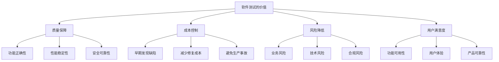

# 测试基础

## 📋 概述

软件测试是验证和确保软件质量的重要实践。在Node.js开发中，有效的测试策略能够保证代码质量、减少bug、提高可维护性，并为重构和新功能开发提供安全保障。

## 🎯 学习目标

- 理解软件测试的核心概念和重要性
- 掌握测试的基本分类和测试策略
- 学会设计有效的测试用例
- 了解测试驱动开发的实践方法
- 掌握Node.js测试环境的搭建和配置

## 📚 测试基础概念

### 什么是软件测试

```javascript
/**
 * 软件测试是一个系统性的过程，用于：
 * 1. 验证软件是否满足需求规格
 * 2. 发现软件中的错误和缺陷
 * 3. 评估软件的质量和可靠性
 * 4. 确保软件在不同条件下正常工作
 */
const TestingPurpose = {
  VERIFICATION: '验证功能是否正确实现',
  VALIDATION: '确认是否满足用户需求',
  DEFECT_DETECTION: '发现和定位软件缺陷',
  QUALITY_ASSURANCE: '保证软件质量标准',
  RISK_MITIGATION: '降低软件上线风险'
};
```

### 测试的重要性



## 🔍 测试分类

### 按测试层级分类

```javascript
// 测试金字塔层级
const TestingLevels = {
  UNIT_TESTS: {
    name: '单元测试',
    scope: '测试单个函数、类或组件',
    characteristics: ['快速执行', '独立性强', '数量最多'],
    tools: ['Jest', 'Mocha', 'Vitest'],
    coverage: '70-80%'
  },
  
  INTEGRATION_TESTS: {
    name: '集成测试',
    scope: '测试模块间的交互',
    characteristics: ['验证接口', '数据流测试', '适量执行'],
    tools: ['Supertest', 'Testcontainers', 'Docker'],
    coverage: '15-25%'
  },
  
  E2E_TESTS: {
    name: '端到端测试',
    scope: '测试完整的用户场景',
    characteristics: ['真实环境', '慢速执行', '数量最少'],
    tools: ['Cypress', 'Playwright', 'Puppeteer'],
    coverage: '5-15%'
  }
};
```

### 按测试目的分类

```javascript
const TestingTypes = {
  FUNCTIONAL: {
    name: '功能测试',
    purpose: '验证功能是否正确实现',
    types: ['正向测试', '负向测试', '边界测试']
  },
  
  NON_FUNCTIONAL: {
    name: '非功能测试',
    purpose: '验证系统质量属性',
    types: ['性能测试', '安全测试', '可用性测试', '兼容性测试']
  },
  
  STRUCTURAL: {
    name: '结构测试',
    purpose: '验证代码结构和覆盖率',
    types: ['白盒测试', '代码覆盖率测试', '静态分析']
  }
};
```

## 🛠 Node.js测试环境搭建

### 基础测试环境

```bash
# 创建新的Node.js项目
mkdir nodejs-testing-demo
cd nodejs-testing-demo
npm init -y

# 安装测试框架和工具
npm install --save-dev jest
npm install --save-dev @types/jest  # TypeScript支持

# 安装其他测试工具
npm install --save-dev supertest    # API测试
npm install --save-dev nock         # HTTP请求模拟
npm install --save-dev sinon        # Mock/Spy工具
npm install --save-dev nyc          # 代码覆盖率
```

### 项目结构设计

```
project/
├── src/
│   ├── controllers/
│   ├── services/
│   ├── models/
│   ├── utils/
│   └── app.js
├── tests/
│   ├── unit/
│   │   ├── controllers/
│   │   ├── services/
│   │   ├── models/
│   │   └── utils/
│   ├── integration/
│   │   ├── api/
│   │   └── database/
│   ├── e2e/
│   │   └── scenarios/
│   ├── fixtures/
│   │   ├── data/
│   │   └── mocks/
│   └── helpers/
│       ├── setup.js
│       └── teardown.js
├── jest.config.js
└── package.json
```

### Jest配置文件

```javascript
// jest.config.js
module.exports = {
  // 测试环境
  testEnvironment: 'node',
  
  // 测试文件匹配模式
  testMatch: [
    '**/tests/**/*.test.js',
    '**/tests/**/*.spec.js',
    '**/__tests__/**/*.js'
  ],
  
  // 覆盖率收集
  collectCoverage: true,
  collectCoverageFrom: [
    'src/**/*.js',
    '!src/**/*.test.js',
    '!src/**/index.js'
  ],
  
  // 覆盖率阈值
  coverageThreshold: {
    global: {
      branches: 80,
      functions: 80,
      lines: 80,
      statements: 80
    }
  },
  
  // 覆盖率报告
  coverageReporters: ['text', 'lcov', 'html'],
  
  // 设置和清理
  setupFilesAfterEnv: ['<rootDir>/tests/helpers/setup.js'],
  
  // 模块映射
  moduleNameMapping: {
    '^@/(.*)$': '<rootDir>/src/$1',
    '^@tests/(.*)$': '<rootDir>/tests/$1'
  },
  
  // 转换配置
  transform: {
    '^.+\\.js$': 'babel-jest'
  },
  
  // 清除模拟
  clearMocks: true,
  
  // 测试超时
  testTimeout: 10000,
  
  // 并行执行
  maxWorkers: '50%'
};
```

### 测试设置和清理

```javascript
// tests/helpers/setup.js
const { MongoMemoryServer } = require('mongodb-memory-server');
const mongoose = require('mongoose');

let mongoServer;

// 全局设置
beforeAll(async () => {
  // 启动内存数据库
  mongoServer = await MongoMemoryServer.create();
  const mongoUri = mongoServer.getUri();
  
  // 连接数据库
  await mongoose.connect(mongoUri, {
    useNewUrlParser: true,
    useUnifiedTopology: true
  });
  
  console.log('🚀 测试环境初始化完成');
});

// 全局清理
afterAll(async () => {
  // 断开数据库连接
  await mongoose.disconnect();
  
  // 停止内存数据库
  await mongoServer.stop();
  
  console.log('🛑 测试环境清理完成');
});

// 每个测试前清理
beforeEach(async () => {
  // 清空所有集合
  const collections = mongoose.connection.collections;
  
  for (const key in collections) {
    const collection = collections[key];
    await collection.deleteMany({});
  }
});

// 环境变量设置
process.env.NODE_ENV = 'test';
process.env.JWT_SECRET = 'test-secret';
process.env.LOG_LEVEL = 'error';
```

## 📝 第一个测试用例

### 简单函数测试

```javascript
// src/utils/calculator.js
class Calculator {
  add(a, b) {
    if (typeof a !== 'number' || typeof b !== 'number') {
      throw new Error('参数必须是数字');
    }
    return a + b;
  }
  
  subtract(a, b) {
    if (typeof a !== 'number' || typeof b !== 'number') {
      throw new Error('参数必须是数字');
    }
    return a - b;
  }
  
  multiply(a, b) {
    if (typeof a !== 'number' || typeof b !== 'number') {
      throw new Error('参数必须是数字');
    }
    return a * b;
  }
  
  divide(a, b) {
    if (typeof a !== 'number' || typeof b !== 'number') {
      throw new Error('参数必须是数字');
    }
    if (b === 0) {
      throw new Error('除数不能为零');
    }
    return a / b;
  }
}

module.exports = Calculator;
```

```javascript
// tests/unit/utils/calculator.test.js
const Calculator = require('@/utils/calculator');

describe('Calculator', () => {
  let calculator;
  
  beforeEach(() => {
    calculator = new Calculator();
  });
  
  describe('add方法', () => {
    it('应该正确计算两个正数的和', () => {
      // Arrange (准备)
      const a = 5;
      const b = 3;
      const expected = 8;
      
      // Act (执行)
      const result = calculator.add(a, b);
      
      // Assert (断言)
      expect(result).toBe(expected);
    });
    
    it('应该正确计算负数', () => {
      expect(calculator.add(-5, 3)).toBe(-2);
      expect(calculator.add(-5, -3)).toBe(-8);
    });
    
    it('应该正确处理小数', () => {
      expect(calculator.add(0.1, 0.2)).toBeCloseTo(0.3);
    });
    
    it('应该在参数不是数字时抛出错误', () => {
      expect(() => calculator.add('5', 3)).toThrow('参数必须是数字');
      expect(() => calculator.add(5, null)).toThrow('参数必须是数字');
      expect(() => calculator.add(undefined, 3)).toThrow('参数必须是数字');
    });
  });
  
  describe('divide方法', () => {
    it('应该正确计算除法', () => {
      expect(calculator.divide(10, 2)).toBe(5);
      expect(calculator.divide(7, 2)).toBe(3.5);
    });
    
    it('应该在除数为零时抛出错误', () => {
      expect(() => calculator.divide(5, 0)).toThrow('除数不能为零');
    });
  });
});
```

### 异步函数测试

```javascript
// src/services/user-service.js
const axios = require('axios');

class UserService {
  constructor(baseURL = 'https://api.example.com') {
    this.baseURL = baseURL;
  }
  
  async getUserById(id) {
    if (!id) {
      throw new Error('用户ID不能为空');
    }
    
    try {
      const response = await axios.get(`${this.baseURL}/users/${id}`);
      return response.data;
    } catch (error) {
      if (error.response && error.response.status === 404) {
        throw new Error('用户不存在');
      }
      throw new Error('获取用户信息失败');
    }
  }
  
  async createUser(userData) {
    if (!userData.email) {
      throw new Error('邮箱不能为空');
    }
    
    try {
      const response = await axios.post(`${this.baseURL}/users`, userData);
      return response.data;
    } catch (error) {
      if (error.response && error.response.status === 400) {
        throw new Error('用户数据无效');
      }
      throw new Error('创建用户失败');
    }
  }
  
  async delay(ms) {
    return new Promise(resolve => setTimeout(resolve, ms));
  }
}

module.exports = UserService;
```

```javascript
// tests/unit/services/user-service.test.js
const axios = require('axios');
const UserService = require('@/services/user-service');

// Mock axios
jest.mock('axios');
const mockedAxios = axios;

describe('UserService', () => {
  let userService;
  
  beforeEach(() => {
    userService = new UserService();
    jest.clearAllMocks();
  });
  
  describe('getUserById', () => {
    it('应该成功获取用户信息', async () => {
      // 准备测试数据
      const userId = '123';
      const mockUser = {
        id: userId,
        name: 'John Doe',
        email: 'john@example.com'
      };
      
      // Mock axios响应
      mockedAxios.get.mockResolvedValue({
        data: mockUser
      });
      
      // 执行测试
      const result = await userService.getUserById(userId);
      
      // 验证结果
      expect(result).toEqual(mockUser);
      expect(mockedAxios.get).toHaveBeenCalledWith(
        'https://api.example.com/users/123'
      );
    });
    
    it('应该在用户不存在时抛出错误', async () => {
      // Mock 404错误
      mockedAxios.get.mockRejectedValue({
        response: { status: 404 }
      });
      
      // 验证异常
      await expect(userService.getUserById('999'))
        .rejects
        .toThrow('用户不存在');
    });
    
    it('应该在ID为空时抛出错误', async () => {
      await expect(userService.getUserById(null))
        .rejects
        .toThrow('用户ID不能为空');
        
      await expect(userService.getUserById(''))
        .rejects
        .toThrow('用户ID不能为空');
    });
  });
  
  describe('createUser', () => {
    it('应该成功创建用户', async () => {
      const userData = {
        name: 'Jane Doe',
        email: 'jane@example.com'
      };
      
      const mockResponse = {
        id: '456',
        ...userData
      };
      
      mockedAxios.post.mockResolvedValue({
        data: mockResponse
      });
      
      const result = await userService.createUser(userData);
      
      expect(result).toEqual(mockResponse);
      expect(mockedAxios.post).toHaveBeenCalledWith(
        'https://api.example.com/users',
        userData
      );
    });
  });
  
  describe('delay', () => {
    it('应该在指定时间后完成', async () => {
      const startTime = Date.now();
      
      await userService.delay(100);
      
      const endTime = Date.now();
      const elapsed = endTime - startTime;
      
      expect(elapsed).toBeGreaterThanOrEqual(90);
      expect(elapsed).toBeLessThan(150);
    });
  });
});
```

## 🎭 测试断言和匹配器

### Jest常用断言

```javascript
describe('Jest断言示例', () => {
  // 基本值断言
  it('基本值匹配', () => {
    expect(2 + 2).toBe(4);                    // 严格相等
    expect({ name: 'John' }).toEqual({ name: 'John' }); // 深度相等
    expect('Hello World').toMatch(/World/);    // 正则匹配
    expect('Hello World').toContain('World');  // 包含字符串
  });
  
  // 数字断言
  it('数字匹配', () => {
    expect(2 + 2).toBeGreaterThan(3);
    expect(2 + 2).toBeGreaterThanOrEqual(4);
    expect(2 + 2).toBeLessThan(5);
    expect(2 + 2).toBeLessThanOrEqual(4);
    expect(0.1 + 0.2).toBeCloseTo(0.3);       // 浮点数比较
  });
  
  // 布尔值断言
  it('布尔值匹配', () => {
    expect(true).toBeTruthy();
    expect(false).toBeFalsy();
    expect(null).toBeNull();
    expect(undefined).toBeUndefined();
    expect('Hello').toBeDefined();
  });
  
  // 数组断言
  it('数组匹配', () => {
    const fruits = ['apple', 'banana', 'orange'];
    expect(fruits).toHaveLength(3);
    expect(fruits).toContain('banana');
    expect(fruits).toEqual(expect.arrayContaining(['apple', 'banana']));
  });
  
  // 对象断言
  it('对象匹配', () => {
    const user = {
      id: 1,
      name: 'John',
      email: 'john@example.com',
      profile: {
        age: 30,
        country: 'US'
      }
    };
    
    expect(user).toHaveProperty('name');
    expect(user).toHaveProperty('profile.age', 30);
    expect(user).toEqual(expect.objectContaining({
      name: 'John',
      email: expect.stringContaining('@')
    }));
  });
  
  // 异常断言
  it('异常匹配', () => {
    const throwError = () => {
      throw new Error('出错了');
    };
    
    expect(throwError).toThrow();
    expect(throwError).toThrow('出错了');
    expect(throwError).toThrow(/错了/);
    expect(throwError).toThrow(Error);
  });
  
  // 异步断言
  it('异步匹配', async () => {
    const asyncFunction = () => Promise.resolve('success');
    const asyncError = () => Promise.reject(new Error('failed'));
    
    await expect(asyncFunction()).resolves.toBe('success');
    await expect(asyncError()).rejects.toThrow('failed');
  });
});
```

### 自定义匹配器

```javascript
// tests/helpers/custom-matchers.js
expect.extend({
  toBeValidEmail(received) {
    const emailRegex = /^[^\s@]+@[^\s@]+\.[^\s@]+$/;
    const pass = emailRegex.test(received);
    
    return {
      message: () => 
        `expected ${received} ${pass ? 'not ' : ''}to be a valid email`,
      pass
    };
  },
  
  toBeWithinRange(received, floor, ceiling) {
    const pass = received >= floor && received <= ceiling;
    
    return {
      message: () =>
        `expected ${received} ${pass ? 'not ' : ''}to be within range ${floor} - ${ceiling}`,
      pass
    };
  },
  
  toHaveValidationError(received, field) {
    const hasError = received.errors && 
                    received.errors.some(error => error.field === field);
    
    return {
      message: () =>
        `expected validation result ${hasError ? 'not ' : ''}to have error for field ${field}`,
      pass: hasError
    };
  }
});

// 使用自定义匹配器
describe('自定义匹配器示例', () => {
  it('应该验证邮箱格式', () => {
    expect('test@example.com').toBeValidEmail();
    expect('invalid-email').not.toBeValidEmail();
  });
  
  it('应该检查数值范围', () => {
    expect(15).toBeWithinRange(10, 20);
    expect(25).not.toBeWithinRange(10, 20);
  });
  
  it('应该检查验证错误', () => {
    const validationResult = {
      valid: false,
      errors: [
        { field: 'email', message: '邮箱格式无效' },
        { field: 'password', message: '密码太短' }
      ]
    };
    
    expect(validationResult).toHaveValidationError('email');
    expect(validationResult).not.toHaveValidationError('username');
  });
});
```

## 📊 测试组织和结构

### 测试套件组织

```javascript
describe('用户管理系统', () => {
  // 嵌套测试套件
  describe('用户注册', () => {
    describe('有效数据', () => {
      it('应该成功注册新用户', () => {
        // 测试逻辑
      });
      
      it('应该返回用户信息', () => {
        // 测试逻辑
      });
    });
    
    describe('无效数据', () => {
      it('应该拒绝空邮箱', () => {
        // 测试逻辑
      });
      
      it('应该拒绝重复邮箱', () => {
        // 测试逻辑
      });
    });
  });
  
  describe('用户登录', () => {
    beforeEach(() => {
      // 每个登录测试前的设置
    });
    
    it('应该允许有效用户登录', () => {
      // 测试逻辑
    });
    
    it('应该拒绝无效凭据', () => {
      // 测试逻辑
    });
  });
});
```

### 测试数据管理

```javascript
// tests/fixtures/user-data.js
const userData = {
  validUser: {
    name: 'John Doe',
    email: 'john@example.com',
    password: 'password123',
    age: 30
  },
  
  invalidUsers: [
    {
      name: '',
      email: 'john@example.com',
      password: 'password123'
    },
    {
      name: 'John Doe',
      email: 'invalid-email',
      password: 'password123'
    },
    {
      name: 'John Doe',
      email: 'john@example.com',
      password: '123'  // 太短
    }
  ],
  
  adminUser: {
    name: 'Admin User',
    email: 'admin@example.com',
    password: 'admin123',
    role: 'admin'
  }
};

module.exports = userData;

// 在测试中使用
const userData = require('@tests/fixtures/user-data');

describe('用户验证', () => {
  it('应该接受有效用户数据', () => {
    const result = validateUser(userData.validUser);
    expect(result.isValid).toBe(true);
  });
  
  it.each(userData.invalidUsers)('应该拒绝无效用户数据', (invalidUser) => {
    const result = validateUser(invalidUser);
    expect(result.isValid).toBe(false);
  });
});
```

## 📝 测试最佳实践

### 测试命名规范

```javascript
// 好的测试命名
describe('UserService', () => {
  describe('createUser', () => {
    it('应该在提供有效数据时创建新用户', () => {});
    it('应该在邮箱已存在时抛出错误', () => {});
    it('应该在密码太短时抛出验证错误', () => {});
  });
});

// 避免的测试命名
describe('UserService', () => {
  it('测试用户创建', () => {}); // 太模糊
  it('test1', () => {});         // 没有意义
  it('创建用户功能', () => {});   // 不够具体
});
```

### AAA模式（Arrange-Act-Assert）

```javascript
it('应该计算商品总价', () => {
  // Arrange - 准备测试数据和环境
  const items = [
    { price: 10, quantity: 2 },
    { price: 15, quantity: 1 },
    { price: 8, quantity: 3 }
  ];
  const calculator = new PriceCalculator();
  
  // Act - 执行被测试的操作
  const total = calculator.calculateTotal(items);
  
  // Assert - 验证结果
  expect(total).toBe(59); // (10*2) + (15*1) + (8*3) = 59
});
```

### 测试隔离和独立性

```javascript
describe('用户服务测试', () => {
  let userService;
  let mockDatabase;
  
  beforeEach(() => {
    // 每个测试前重新创建实例
    mockDatabase = new MockDatabase();
    userService = new UserService(mockDatabase);
  });
  
  afterEach(() => {
    // 每个测试后清理
    mockDatabase.clear();
  });
  
  it('测试1不应该影响测试2', () => {
    // 这个测试的数据不会影响下一个测试
    userService.addUser({ name: 'Test User' });
    expect(userService.getUserCount()).toBe(1);
  });
  
  it('测试2从干净状态开始', () => {
    // 这个测试从0开始，不受上一个测试影响
    expect(userService.getUserCount()).toBe(0);
  });
});
```

## 📝 总结

软件测试是确保Node.js应用质量的重要实践：

- **基础概念**：理解测试的目的、分类和重要性
- **环境搭建**：配置完整的测试环境和工具链
- **测试编写**：掌握基本的测试用例编写技巧
- **断言使用**：熟练使用各种断言和匹配器
- **最佳实践**：遵循测试命名、组织和隔离的最佳实践

有效的测试不仅能发现bug，更能作为活文档帮助理解代码行为，并为重构提供安全保障。

## 🔗 相关资源

- [Jest官方文档](https://jestjs.io/docs/getting-started)
- [测试驱动开发指南](https://testdriven.io/)
- [Node.js测试最佳实践](https://github.com/goldbergyoni/javascript-testing-best-practices)
- [软件测试理论](https://www.guru99.com/software-testing.html)
