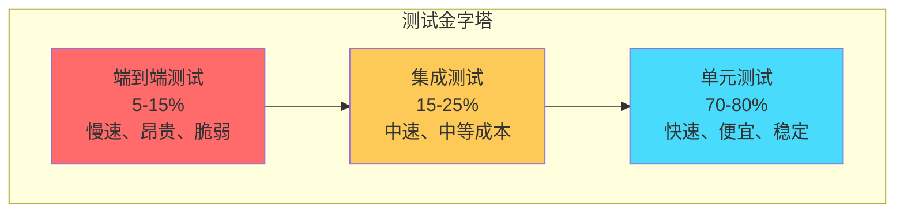
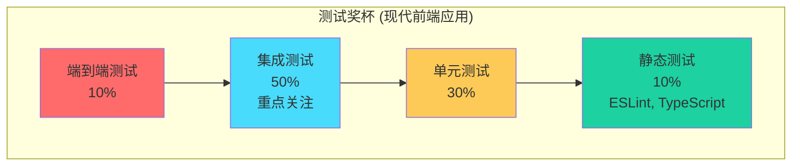

# 测试金字塔

## 📋 概述

测试金字塔是软件测试中的经典概念，它描述了不同层级测试的比例和策略。通过合理分配单元测试、集成测试和端到端测试的比重，可以构建高效、可靠且维护成本较低的测试套件。

## 🎯 学习目标

- 理解测试金字塔的核心概念和原理
- 掌握不同测试层级的特点和适用场景
- 学会设计平衡的测试策略
- 了解现代测试实践中的金字塔演进

## 🏗️ 测试金字塔结构

### 经典测试金字塔



### 各层级特征对比

```javascript
const TestingLayers = {
  UNIT_TESTS: {
    name: '单元测试',
    scope: '单个函数、类、模块',
    speed: '毫秒级',
    cost: '低',
    maintenance: '低',
    feedback: '即时',
    isolation: '完全隔离',
    confidence: '局部功能正确性',
    percentage: '70-80%',
    tools: ['Jest', 'Mocha', 'Vitest', 'Jasmine'],
    when_to_use: [
      '验证业务逻辑',
      '测试边界条件',
      '确保代码重构安全',
      '文档化代码行为'
    ]
  },
  
  INTEGRATION_TESTS: {
    name: '集成测试',
    scope: '模块间交互、API、数据库',
    speed: '秒级',
    cost: '中等',
    maintenance: '中等',
    feedback: '快速',
    isolation: '部分隔离',
    confidence: '组件协作正确性',
    percentage: '15-25%',
    tools: ['Supertest', 'Testcontainers', 'Docker', 'Postman'],
    when_to_use: [
      '验证API接口',
      '测试数据库交互',
      '验证第三方服务集成',
      '测试配置和环境'
    ]
  },
  
  E2E_TESTS: {
    name: '端到端测试',
    scope: '完整用户场景、业务流程',
    speed: '分钟级',
    cost: '高',
    maintenance: '高',
    feedback: '较慢',
    isolation: '真实环境',
    confidence: '用户体验正确性',
    percentage: '5-15%',
    tools: ['Cypress', 'Playwright', 'Selenium', 'Puppeteer'],
    when_to_use: [
      '验证关键用户路径',
      '测试完整业务流程',
      '回归测试',
      '发布前验证'
    ]
  }
};
```

## 🔍 单元测试层（金字塔底层）

### 单元测试特点

```javascript
// 理想的单元测试特征
const IdealUnitTest = {
  FAST: '执行速度快（< 10ms）',
  ISOLATED: '完全独立，不依赖外部资源',
  REPEATABLE: '可重复执行，结果一致',
  SELF_VALIDATING: '明确的成功/失败结果',
  TIMELY: '及时编写，不滞后于开发'
};
```

### 单元测试示例

```javascript
// src/services/price-calculator.js
class PriceCalculator {
  constructor(taxRate = 0.1) {
    this.taxRate = taxRate;
  }
  
  calculateItemTotal(price, quantity, discount = 0) {
    if (price < 0 || quantity < 0 || discount < 0 || discount > 1) {
      throw new Error('Invalid parameters');
    }
    
    const subtotal = price * quantity;
    const discountAmount = subtotal * discount;
    const discountedAmount = subtotal - discountAmount;
    const tax = discountedAmount * this.taxRate;
    
    return {
      subtotal,
      discountAmount,
      discountedAmount,
      tax,
      total: discountedAmount + tax
    };
  }
  
  calculateCartTotal(items) {
    if (!Array.isArray(items) || items.length === 0) {
      return { items: [], subtotal: 0, tax: 0, total: 0 };
    }
    
    const itemCalculations = items.map(item => ({
      ...item,
      calculation: this.calculateItemTotal(item.price, item.quantity, item.discount)
    }));
    
    const subtotal = itemCalculations.reduce(
      (sum, item) => sum + item.calculation.discountedAmount, 0
    );
    const tax = subtotal * this.taxRate;
    
    return {
      items: itemCalculations,
      subtotal,
      tax,
      total: subtotal + tax
    };
  }
}

module.exports = PriceCalculator;
```

```javascript
// tests/unit/services/price-calculator.test.js
const PriceCalculator = require('@/services/price-calculator');

describe('PriceCalculator', () => {
  let calculator;
  
  beforeEach(() => {
    calculator = new PriceCalculator(0.1); // 10% 税率
  });
  
  describe('calculateItemTotal', () => {
    it('应该正确计算无折扣商品总价', () => {
      const result = calculator.calculateItemTotal(100, 2, 0);
      
      expect(result).toEqual({
        subtotal: 200,
        discountAmount: 0,
        discountedAmount: 200,
        tax: 20,
        total: 220
      });
    });
    
    it('应该正确计算带折扣商品总价', () => {
      const result = calculator.calculateItemTotal(100, 2, 0.1); // 10% 折扣
      
      expect(result).toEqual({
        subtotal: 200,
        discountAmount: 20,
        discountedAmount: 180,
        tax: 18,
        total: 198
      });
    });
    
    it('应该在参数无效时抛出错误', () => {
      expect(() => calculator.calculateItemTotal(-100, 2)).toThrow('Invalid parameters');
      expect(() => calculator.calculateItemTotal(100, -2)).toThrow('Invalid parameters');
      expect(() => calculator.calculateItemTotal(100, 2, 1.5)).toThrow('Invalid parameters');
    });
    
    it('应该处理边界值', () => {
      // 零价格
      const result1 = calculator.calculateItemTotal(0, 5);
      expect(result1.total).toBe(0);
      
      // 零数量
      const result2 = calculator.calculateItemTotal(100, 0);
      expect(result2.total).toBe(0);
      
      // 100% 折扣
      const result3 = calculator.calculateItemTotal(100, 2, 1);
      expect(result3.total).toBe(0);
    });
  });
  
  describe('calculateCartTotal', () => {
    it('应该正确计算购物车总价', () => {
      const items = [
        { id: 1, name: 'Product A', price: 50, quantity: 2, discount: 0 },
        { id: 2, name: 'Product B', price: 30, quantity: 1, discount: 0.1 },
        { id: 3, name: 'Product C', price: 20, quantity: 3, discount: 0.2 }
      ];
      
      const result = calculator.calculateCartTotal(items);
      
      // Product A: 50 * 2 = 100
      // Product B: 30 * 1 * 0.9 = 27
      // Product C: 20 * 3 * 0.8 = 48
      // Subtotal: 100 + 27 + 48 = 175
      // Tax: 175 * 0.1 = 17.5
      // Total: 175 + 17.5 = 192.5
      
      expect(result.subtotal).toBe(175);
      expect(result.tax).toBe(17.5);
      expect(result.total).toBe(192.5);
      expect(result.items).toHaveLength(3);
    });
    
    it('应该处理空购物车', () => {
      const result = calculator.calculateCartTotal([]);
      
      expect(result).toEqual({
        items: [],
        subtotal: 0,
        tax: 0,
        total: 0
      });
    });
  });
});
```

## 🔗 集成测试层（金字塔中层）

### 集成测试类型

```javascript
const IntegrationTestTypes = {
  API_INTEGRATION: {
    name: 'API集成测试',
    description: '测试HTTP API端点的完整请求-响应周期',
    includes: ['路由', '中间件', '控制器', '验证'],
    example: 'POST /api/users 创建用户接口测试'
  },
  
  DATABASE_INTEGRATION: {
    name: '数据库集成测试',
    description: '测试应用与数据库的交互',
    includes: ['模型', 'ORM/ODM', '查询', '事务'],
    example: '用户CRUD操作的数据库测试'
  },
  
  SERVICE_INTEGRATION: {
    name: '服务集成测试',
    description: '测试不同服务模块间的交互',
    includes: ['服务边界', '数据流', '错误处理'],
    example: '订单服务与支付服务的集成测试'
  },
  
  EXTERNAL_INTEGRATION: {
    name: '外部服务集成测试',
    description: '测试与第三方服务的集成',
    includes: ['API调用', '认证', '错误处理', '重试机制'],
    example: '支付网关API集成测试'
  }
};
```

### API集成测试示例

```javascript
// tests/integration/api/users.test.js
const request = require('supertest');
const app = require('@/app');
const User = require('@/models/user');
const { generateTestUser, generateJWT } = require('@tests/helpers/test-utils');

describe('用户API集成测试', () => {
  beforeEach(async () => {
    // 清理数据库
    await User.deleteMany({});
  });
  
  describe('POST /api/users', () => {
    it('应该成功创建新用户', async () => {
      const userData = generateTestUser();
      
      const response = await request(app)
        .post('/api/users')
        .send(userData)
        .expect(201);
      
      // 验证响应结构
      expect(response.body).toMatchObject({
        id: expect.any(String),
        name: userData.name,
        email: userData.email,
        createdAt: expect.any(String)
      });
      
      // 验证密码不在响应中
      expect(response.body.password).toBeUndefined();
      
      // 验证数据库中的数据
      const userInDb = await User.findById(response.body.id);
      expect(userInDb).toBeTruthy();
      expect(userInDb.email).toBe(userData.email);
    });
    
    it('应该拒绝重复邮箱', async () => {
      const userData = generateTestUser();
      
      // 先创建一个用户
      await User.create(userData);
      
      // 尝试创建相同邮箱的用户
      const response = await request(app)
        .post('/api/users')
        .send(userData)
        .expect(400);
      
      expect(response.body.error).toContain('邮箱已存在');
    });
    
    it('应该验证必需字段', async () => {
      const response = await request(app)
        .post('/api/users')
        .send({})
        .expect(400);
      
      expect(response.body.errors).toEqual(
        expect.arrayContaining([
          expect.objectContaining({ field: 'email' }),
          expect.objectContaining({ field: 'password' }),
          expect.objectContaining({ field: 'name' })
        ])
      );
    });
  });
  
  describe('GET /api/users/:id', () => {
    it('应该返回存在的用户信息', async () => {
      const user = await User.create(generateTestUser());
      const token = generateJWT(user);
      
      const response = await request(app)
        .get(`/api/users/${user._id}`)
        .set('Authorization', `Bearer ${token}`)
        .expect(200);
      
      expect(response.body).toMatchObject({
        id: user._id.toString(),
        name: user.name,
        email: user.email
      });
    });
    
    it('应该在用户不存在时返回404', async () => {
      const nonExistentId = '507f1f77bcf86cd799439011';
      const token = generateJWT({ _id: nonExistentId });
      
      await request(app)
        .get(`/api/users/${nonExistentId}`)
        .set('Authorization', `Bearer ${token}`)
        .expect(404);
    });
    
    it('应该拒绝未认证的请求', async () => {
      const user = await User.create(generateTestUser());
      
      await request(app)
        .get(`/api/users/${user._id}`)
        .expect(401);
    });
  });
});
```

## 🎭 端到端测试层（金字塔顶层）

### E2E测试特点

```javascript
const E2ETestCharacteristics = {
  USER_PERSPECTIVE: '从用户角度验证完整流程',
  REAL_ENVIRONMENT: '在接近生产的环境中运行',
  BROWSER_AUTOMATION: '自动化浏览器交互',
  CROSS_SYSTEM: '涵盖前端、后端、数据库等所有组件',
  BUSINESS_CRITICAL: '专注于关键业务路径',
  REGRESSION_SAFETY: '确保新变更不破坏现有功能'
};
```

### E2E测试场景示例

```javascript
// tests/e2e/user-registration.spec.js
// 使用Cypress进行E2E测试

describe('用户注册流程', () => {
  beforeEach(() => {
    // 重置数据库状态
    cy.exec('npm run db:reset:test');
    
    // 访问注册页面
    cy.visit('/register');
  });
  
  it('应该允许新用户成功注册', () => {
    const userData = {
      name: 'John Doe',
      email: 'john@example.com',
      password: 'SecurePassword123!'
    };
    
    // 填写注册表单
    cy.get('[data-testid="name-input"]').type(userData.name);
    cy.get('[data-testid="email-input"]').type(userData.email);
    cy.get('[data-testid="password-input"]').type(userData.password);
    cy.get('[data-testid="confirm-password-input"]').type(userData.password);
    
    // 提交表单
    cy.get('[data-testid="register-button"]').click();
    
    // 验证成功注册
    cy.url().should('include', '/dashboard');
    cy.get('[data-testid="welcome-message"]')
      .should('contain', `欢迎, ${userData.name}`);
    
    // 验证导航栏显示已登录状态
    cy.get('[data-testid="user-menu"]').should('be.visible');
    cy.get('[data-testid="login-button"]').should('not.exist');
  });
  
  it('应该显示表单验证错误', () => {
    // 点击注册按钮而不填写任何信息
    cy.get('[data-testid="register-button"]').click();
    
    // 验证错误消息显示
    cy.get('[data-testid="name-error"]')
      .should('be.visible')
      .and('contain', '姓名不能为空');
    
    cy.get('[data-testid="email-error"]')
      .should('be.visible')
      .and('contain', '邮箱不能为空');
    
    cy.get('[data-testid="password-error"]')
      .should('be.visible')
      .and('contain', '密码不能为空');
  });
});
```

## ⚖️ 测试策略平衡

### 成本效益分析

```javascript
const TestingCostBenefit = {
  UNIT_TESTS: {
    writingCost: 'LOW',
    maintenanceCost: 'LOW',
    executionCost: 'VERY_LOW',
    confidenceGain: 'MEDIUM',
    bugDetectionSpeed: 'IMMEDIATE',
    refactoringSupport: 'HIGH',
    roi: 'VERY_HIGH'
  },
  
  INTEGRATION_TESTS: {
    writingCost: 'MEDIUM',
    maintenanceCost: 'MEDIUM',
    executionCost: 'MEDIUM',
    confidenceGain: 'HIGH',
    bugDetectionSpeed: 'FAST',
    refactoringSupport: 'MEDIUM',
    roi: 'HIGH'
  },
  
  E2E_TESTS: {
    writingCost: 'HIGH',
    maintenanceCost: 'HIGH',
    executionCost: 'HIGH',
    confidenceGain: 'VERY_HIGH',
    bugDetectionSpeed: 'SLOW',
    refactoringSupport: 'LOW',
    roi: 'MEDIUM'
  }
};
```

### 实际项目中的金字塔调整

```javascript
// 根据项目特点调整测试比例
const ProjectBasedPyramids = {
  API_SERVICE: {
    description: 'RESTful API服务',
    unitTests: '75%',
    integrationTests: '20%',
    e2eTests: '5%',
    focus: 'API端点和业务逻辑'
  },
  
  WEB_APPLICATION: {
    description: '传统Web应用',
    unitTests: '70%',
    integrationTests: '20%',
    e2eTests: '10%',
    focus: '用户交互和页面流程'
  },
  
  MICROSERVICES: {
    description: '微服务架构',
    unitTests: '60%',
    integrationTests: '30%',
    e2eTests: '10%',
    focus: '服务间通信和数据一致性'
  },
  
  CRITICAL_SYSTEM: {
    description: '关键业务系统',
    unitTests: '60%',
    integrationTests: '25%',
    e2eTests: '15%',
    focus: '业务流程和数据完整性'
  }
};
```

## 🔄 现代测试实践的演进

### 测试奖杯模型



### 测试指标和监控

```javascript
// 测试金字塔健康度分析
class TestPyramidAnalyzer {
  constructor(testResults) {
    this.testResults = testResults;
  }
  
  analyzeDistribution() {
    const total = this.testResults.unit + this.testResults.integration + this.testResults.e2e;
    
    const distribution = {
      unit: (this.testResults.unit / total * 100).toFixed(1),
      integration: (this.testResults.integration / total * 100).toFixed(1),
      e2e: (this.testResults.e2e / total * 100).toFixed(1)
    };
    
    return {
      distribution,
      assessment: this.assessPyramidHealth(distribution),
      recommendations: this.generateRecommendations(distribution)
    };
  }
  
  assessPyramidHealth(distribution) {
    const ideal = { unit: 70, integration: 20, e2e: 10 };
    const tolerance = 10;
    
    const health = {
      unit: Math.abs(distribution.unit - ideal.unit) <= tolerance,
      integration: Math.abs(distribution.integration - ideal.integration) <= tolerance,
      e2e: Math.abs(distribution.e2e - ideal.e2e) <= tolerance
    };
    
    const score = Object.values(health).filter(Boolean).length / 3;
    
    return {
      score: (score * 100).toFixed(1),
      status: score > 0.8 ? 'HEALTHY' : score > 0.5 ? 'NEEDS_ATTENTION' : 'POOR',
      details: health
    };
  }
  
  generateRecommendations(distribution) {
    const recommendations = [];
    
    if (distribution.unit < 60) {
      recommendations.push({
        type: 'INCREASE_UNIT_TESTS',
        message: '单元测试比例偏低，建议增加单元测试覆盖',
        priority: 'HIGH'
      });
    }
    
    if (distribution.e2e > 20) {
      recommendations.push({
        type: 'REDUCE_E2E_TESTS',
        message: 'E2E测试比例过高，考虑将部分转为集成测试',
        priority: 'MEDIUM'
      });
    }
    
    return recommendations;
  }
}
```

## 📝 总结

测试金字塔为Node.js应用提供了科学的测试策略指导：

- **分层原理**：不同层级测试各有特点和适用场景
- **比例平衡**：70-80%单元测试，15-25%集成测试，5-15%E2E测试
- **成本控制**：底层测试成本低、反馈快，顶层测试成本高但信心强
- **策略调整**：根据项目特点灵活调整测试比例
- **现代演进**：测试奖杯等新模型适应现代应用特点

合理的测试金字塔能够在保证质量的同时，控制测试成本，提高开发效率。

## 🔗 相关资源

- [测试金字塔原理](https://martinfowler.com/articles/practical-test-pyramid.html)
- [现代测试策略](https://kentcdodds.com/blog/the-testing-trophy-and-testing-classifications)
- [微服务测试策略](https://microservices.io/patterns/testing/)
- [前端测试最佳实践](https://github.com/goldbergyoni/javascript-testing-best-practices)
